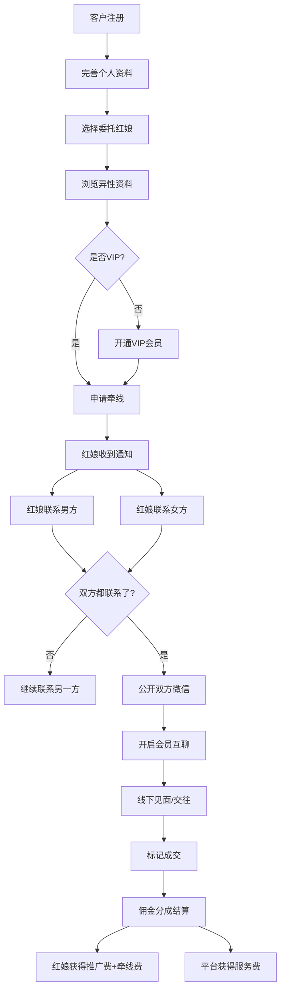
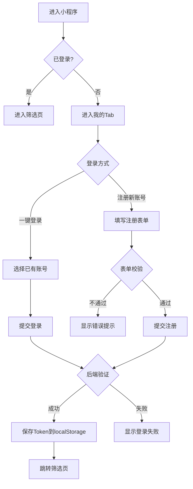
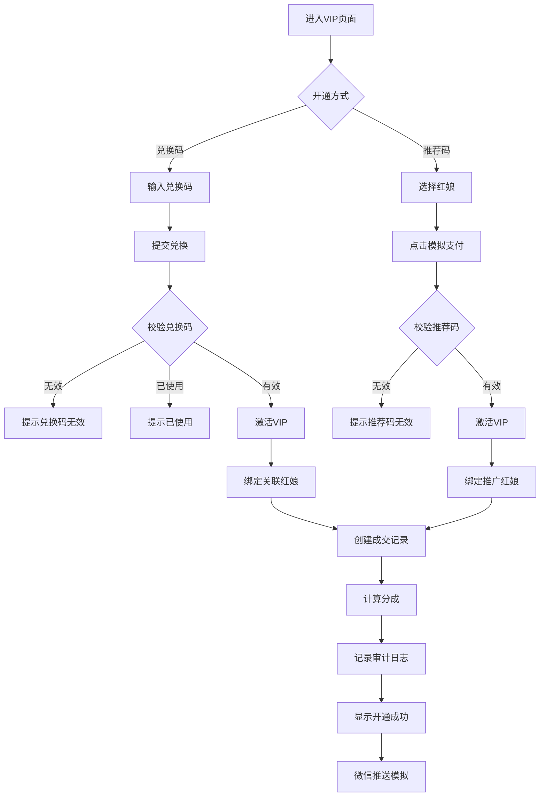
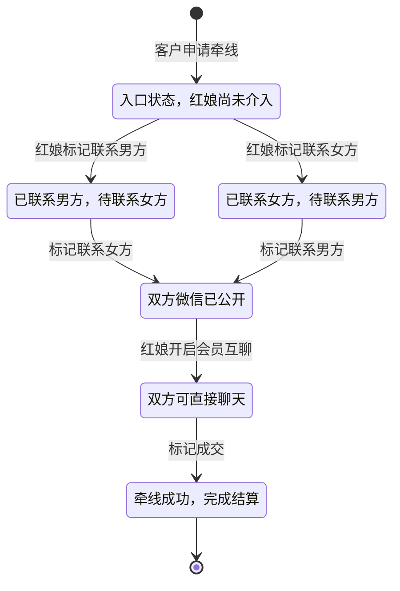

2026-06-25 | Claude Fable 5

# 缘定传媒人 — 项目概述

## 项目简介

"缘定传媒人"是一个面向传媒行业从业者的单身交友业务平台原型。项目涵盖完整的业务闭环：客户注册、资料展示、VIP 会员开通、红娘牵线、实时聊天、管理后台运营，以及佣金分成结算。

项目采用 **前后端分离 + Docker 容器化部署** 的架构，前端为纯静态 HTML/CSS/JS，后端为 Node.js Express API，数据库为 PostgreSQL。

## 核心业务流程

```
客户注册 → 浏览异性资料 → 开通 VIP → 申请牵线
    ↓
红娘收到通知 → 分别联系男女双方 → 双方确认
    ↓
公开双方微信 → 开启会员互聊 → 标记成交
    ↓
佣金结算（推广费 / 牵线费 / 平台服务费）
```

## 三端角色

| 角色 | 入口文件 | 功能 |
|------|----------|------|
| **客户（小程序端）** | `mini.html` | 注册登录、资料维护、筛选异性、VIP 兑换、申请牵线、实时聊天 |
| **红娘（工作台）** | `matchmaker.html` | 注册登录、查看牵线通知、联系双方、查看微信、一对一聊天 |
| **管理员（后台）** | `admin.html` | 登录、客户/红娘/机构管理、分成设置、兑换码管理、数据图表 |

另有 `index.html` 为综合预览端，可在同一页面切换三端视角。

## 访问入口

### HTTP

| 端口 | 用途 |
|------|------|
| 8095 | 综合预览端 |
| 8096 | 客户小程序端 |
| 8097 | 红娘工作台 |
| 8098 | 管理后台 |

### HTTPS

| 端口 | 用途 |
|------|------|
| 9445 | 综合预览端 |
| 9446 | 客户小程序端 |
| 9447 | 红娘工作台 |
| 9448 | 管理后台 |

域名：`uk.sbbz.tech`（服务器 443 端口被其他服务占用，故使用非标端口）

## 项目状态

当前为**开发测试版**，数据为演示数据。前端资源版本号 `app.js?v=1.0.32` / `styles.css?v=1.0.32`。

已实现功能：
- 客户端：注册/登录、资料维护、筛选异性资料、VIP 兑换、申请牵线、实名认证
- 红娘端：注册/登录、查看牵线通知、标记已联系、查看双方微信、一对一聊天
- 管理后台：登录、客户/红娘/机构/分成/兑换码/成交/图表管理
- 即时聊天：会员与红娘一对一沟通、会员间互聊
- 数据同步：多端 4 秒轮询自动同步

## 仓库信息

- **GitHub**：`https://github.com/pixian5/mediapeople`
- **服务器部署目录**：`/opt/mediapeople`
- **数据库容器**：`mediapeople-postgres`
- **API 容器**：`mediapeople-api`

---

## 业务角色详解

### 客户（会员）

客户是平台的核心用户，通过小程序端注册后可以浏览异性资料、申请牵线。

**注册条件**：
- 手机号或邮箱至少填一项（不可重复）
- 密码至少 6 位
- 必须选择委托红娘（可多选）

**VIP 会员体系**：
- 普通用户：只能看到异性基本资料，择偶要求被锁定（显示"开通会员后可查看"）
- VIP 会员：解锁择偶要求、可申请牵线、到期后降级
- VIP 有效期：开通后 365 天
- VIP 价格：¥399

**VIP 开通方式**：
1. **兑换码兑换**：输入后台生成的兑换码，可关联红娘分成
2. **推荐码支付**：输入红娘推荐码，模拟支付开通
3. **无限次兑换码**：`1` 是内置的无限次测试兑换码

**资料委托机制**：
- 客户可选择委托哪些红娘（`delegatedMatchmakerIds`）
- 委托后红娘可以在工作台看到该客户的资料
- 客户修改资料后，委托红娘会收到待审核的草稿（`profileByMatchmaker`）

**实名认证**：
- 填写真实姓名 + 18位身份证号
- 如果注册时只填了邮箱没填手机号，实名时需要补填手机号
- 认证后显示"已实名"标识，有助于提高配对成功率
- 已认证用户再次点击可查看脱敏后的认证信息

### 红娘

红娘是负责牵线搭桥的专业人员，隶属于某个机构。

**注册条件**：
- 手机号必填（不可重复）
- 推荐码必填（不可重复，用于客户绑定）
- 密码至少 6 位
- 必须选择所属机构

**推荐码机制**：
- 每个红娘有唯一推荐码（如 `HM-LILI`）
- 客户开通 VIP 时输入推荐码，即绑定该红娘为推广红娘
- 兑换码也可关联红娘，使用兑换码时自动绑定

**牵线流程状态机**：
```
待红娘联系 → 联系男方 → 来和双方对话
待红娘联系 → 联系女方 → 来和双方对话
待红娘联系 → 联系男方 → 联系女方 → 来和双方对话
```
- 红娘分别标记"联系男方"和"联系女方"
- 两方都标记后，状态变为"来和双方对话"
- 此时双方微信号互相公开

**聊天权限**：
- 红娘可与每个牵线请求的男女方分别一对一聊天（`member_matchmaker` 类型）
- 红娘可批准开启会员互聊（`member_member` 类型）
- 会员互聊开启后，双方可直接对话

### 管理员

管理员通过密码登录（默认 `admin`），管理平台运营。

**管理功能**：
- 概览：客户数、VIP 数、成交数、总金额
- 分成比例：推广费/牵线费/平台服务费（总和必须 100%）
- 机构管理：添加新机构
- 红娘管理：添加新红娘（选择机构、填写推荐码）
- 客户管理：查看客户列表（含实名认证状态、联系方式）
- 兑换码：查看兑换码列表、随机生成新兑换码、查看使用状态
- 模拟成交：生成一笔 ¥399 的成交记录

## 分成机制

VIP 开通金额为 ¥399，按以下比例分配：

| 项目 | 默认比例 | 说明 |
|------|----------|------|
| 介绍推广费 (promo) | 20% | 推荐码绑定的红娘获得 |
| 红娘牵线费 (matchmaker) | 35% | 负责牵线的红娘获得 |
| 平台服务费 (platform) | 45% | 平台获得 |

管理员可在后台修改比例，三者之和必须为 100%。

## 聊天系统

### 聊天线程类型

1. **member_matchmaker**：红娘与会员一对一沟通
   - 每个牵线请求会自动创建两条线程（红娘-男方、红娘-女方）
   - 红娘可在工作台查看所有与自己相关的聊天

2. **member_member**：会员间互聊
   - 需要红娘批准后才能开启
   - 开启后双方可直接对话
   - 红娘也可关闭互聊

### 消息发送规则

- 发送者必须是会话参与者（admin 除外）
- 会话状态必须为 `active`
- `member_member` 类型需要 `memberChatEnabled` 为 true
- 消息内容不能为空

## 数据同步机制

### 多端实时同步

- 前端每 4 秒轮询 `GET /api/state`
- 检测到远程状态与本地不同时，自动更新本地并重新渲染
- 本地操作先写 localStorage，再异步同步到远程
- 同步失败时回退到本地模式，显示提示

### 离线模式

- API 不可用时，前端自动切换到 localStorage 离线模式
- 所有操作在本地完成，数据保存在浏览器
- API 恢复后，下次操作会重新同步

## 演示数据

内置 10 个演示用户（5 男 5 女）、2 个红娘、2 个机构、4 个兑换码：

| 用户 | 性别 | 城市 | 职业 | VIP | 推荐红娘 |
|------|------|------|------|-----|----------|
| 林安 | 男 | 上海 | 内容策划 | ✗ | 无 |
| 周晴 | 女 | 上海 | 品牌经理 | ✓ | 李莉 |
| 许知夏 | 女 | 杭州 | 制片人 | ✗ | 无 |
| 陈亦舟 | 男 | 杭州 | 摄影导演 | ✓ | 娜娜 |
| 宋予白 | 男 | 南京 | 新媒体运营 | ✗ | 无 |
| 沈嘉仪 | 女 | 苏州 | 视觉设计师 | ✓ | 李莉 |
| 顾南星 | 男 | 上海 | 广告导演 | ✓ | 娜娜 |
| 唐一诺 | 女 | 成都 | 纪录片编导 | ✗ | 无 |
| 陆景然 | 男 | 深圳 | 产品经理 | ✗ | 无 |
| 孟晚棠 | 女 | 广州 | 公关顾问 | ✓ | 李莉 |

兑换码：`VIP666`（绑定红娘李莉）、`MEDIA888`（绑定红娘娜娜）、`LOVE999`（无绑定）、`1`（无限次使用）。

---

## 业务流程详解

### 完整业务闭环流程图



### 客户注册与登录流程



### VIP 开通全流程



### 牵线请求生命周期



---

## 功能清单矩阵

### 客户端功能

| 功能模块 | 子功能 | VIP权限 | 说明 |
|---------|--------|--------|------|
| **账号体系** | 手机号注册 | 普通 | 11位手机号，不可重复 |
| | 邮箱注册 | 普通 | 合法邮箱格式，不可重复 |
| | 微信注册 | 普通 | 微信号注册 |
| | 一键登录 | 普通 | 演示账号快速切换 |
| | 修改资料 | 普通 | 姓名、性别、年龄、城市、职业等 |
| | 实名认证 | 普通 | 真实姓名+身份证号 |
| | 退出登录 | 普通 | 清除会话 |
| **资料浏览** | 筛选异性 | 普通 | 按性别、城市、年龄筛选 |
| | 翻页浏览 | 普通 | 换一位按钮切换 |
| | 查看基本资料 | 普通 | 姓名、照片、职业、自我介绍 |
| | 查看择偶要求 | VIP | 普通用户显示锁定提示 |
| | 资料详情弹窗 | 普通 | 点击申请牵线前查看详情 |
| **VIP体系** | 兑换码开通 | - | 输入兑换码升级 |
| | 推荐码开通 | - | 选择红娘模拟支付开通 |
| | 多红娘VIP | VIP | 可为多个红娘分别开通 |
| | VIP到期提醒 | VIP | 显示到期日期 |
| **牵线服务** | 申请牵线 | VIP | 选择红娘发起牵线请求 |
| | 查看牵线进度 | VIP | 实时查看处理状态 |
| | 联系红娘 | VIP | 与红娘一对一聊天 |
| | 查看对方微信 | VIP | 红娘联系双方后公开 |
| | 会员互聊 | VIP | 红娘批准后双方直接聊天 |
| **消息系统** | 牵线消息 | VIP | 牵线请求状态更新通知 |
| | 聊天消息 | VIP | 实时对话消息 |
| | 系统通知 | 普通 | 重要事件推送 |

### 红娘端功能

| 功能模块 | 子功能 | 说明 |
|---------|--------|------|
| **账号体系** | 手机号注册 | 必填，不可重复 |
| | 推荐码注册 | 必填，唯一，大写存储 |
| | 机构选择 | 必须选择所属机构 |
| | 一键登录 | 演示账号快速切换 |
| | 退出登录 | 清除会话 |
| **牵线管理** | 牵线通知列表 | 按时间倒序显示所有请求 |
| | 待处理计数 | 实时显示未完成数量 |
| | 标记联系男方 | 更新状态，自动打开聊天 |
| | 标记联系女方 | 更新状态，自动打开聊天 |
| | 查看双方微信 | 仅红娘可见的联系方式面板 |
| **会员互聊** | 开启互聊 | 批准后双方可直接对话 |
| | 关闭互聊 | 随时关闭双方聊天权限 |
| **聊天沟通** | 与会员聊天 | 一对一文字消息 |
| | 消息历史 | 完整聊天记录 |
| | 多会话管理 | 同时处理多个会员 |
| **资料审核** | 待审核列表 | 客户修改资料后通知红娘 |
| | 审核通过 | 草稿变为正式发布 |
| | 退回修改 | 资料状态设为拒绝 |

### 管理后台功能

| 功能模块 | 子功能 | 说明 |
|---------|--------|------|
| **数据概览** | 客户数量 | 总注册客户数 |
| | VIP数量 | 当前VIP会员数 |
| | 成交数量 | 总成交单数 |
| | 总金额 | 累计营收 |
| | 数据图表 | 柱状图可视化展示 |
| **分成管理** | 分成比例设置 | 推广费/牵线费/平台费，总和100% |
| | 实时预览 | 条形图直观展示 |
| **机构管理** | 添加机构 | 机构名称+城市 |
| | 机构列表 | 全部机构展示 |
| **红娘管理** | 添加红娘 | 姓名+机构+推荐码 |
| | 红娘列表 | 全部红娘展示 |
| **客户管理** | 客户列表 | 含VIP状态、实名认证、联系方式 |
| | 客户详情 | 完整客户信息 |
| **兑换码管理** | 生成兑换码 | 随机8位码，可关联红娘 |
| | 兑换码列表 | 使用状态、使用者、关联红娘 |
| **运营工具** | 模拟成交 | 生成一笔399元成交记录 |
| | 数据重置 | 恢复到初始演示数据 |
| **系统管理** | 管理员登录 | 密码验证 |
| | 管理员退出 | 安全退出 |

---

## 业务术语表

| 术语 | 英文/缩写 | 定义 |
|------|----------|------|
| 客户 / 会员 | Client / Member | 注册并使用交友服务的终端用户 |
| 红娘 | Matchmaker | 负责牵线搭桥的专业人员，隶属于机构 |
| 机构 / 婚介公司 | Agency | 红娘所属的公司或组织 |
| 管理员 | Admin | 平台运营管理人员 |
| VIP会员 | VIP Member | 付费开通高级功能的客户 |
| 牵线请求 | Match Request | 客户发起的希望认识某人的请求 |
| 推荐码 | Referral Code | 红娘专属的推广码，客户绑定后计算推广费 |
| 兑换码 | Promo Code | 后台生成的VIP兑换码，可关联红娘 |
| 推广费 | Promo Commission | 推荐码绑定的红娘获得的分成（默认20%） |
| 牵线费 | Matchmaker Commission | 负责牵线的红娘获得的分成（默认35%） |
| 平台服务费 | Platform Fee | 平台获得的收入分成（默认45%） |
| 会员互聊 | Member Chat | 红娘批准后，双方会员直接聊天的功能 |
| 委托红娘 | Delegated Matchmaker | 客户授权可以查看自己资料的红娘 |
| 实名认证 | Real Name Verification | 客户提交真实姓名和身份证号的验证流程 |
| 资料审核 | Profile Review | 红娘对客户修改后的资料进行审核的流程 |
| 成交 | Deal | 牵线成功并完成结算的订单 |
| 分成结算 | Commission Split | VIP开通或成交后按比例分配收入 |
| 种子数据 | Seed Data | 系统初始化时自动插入的演示数据 |
| 整包读写 | State Sync | 当前的全量数据同步模式（PUT /api/state） |
| 精细化API | Fine-grained API | 直接操作单表的REST接口（重构方向） |

---

## 典型用户故事

### 故事1：新客户注册并开通VIP

**角色**：张小姐，28岁，上海，品牌公关

**流程**：
1. 张小姐通过朋友推荐进入小程序
2. 点击"我的"页面，选择注册新账号
3. 填写姓名、性别、年龄、城市、职业、微信、手机号、密码、个人介绍、择偶要求
4. 选择委托所有红娘
5. 点击注册，自动登录跳转到筛选页
6. 浏览几位男会员资料，发现择偶要求被锁定
7. 点击"会员服务"进入VIP页面
8. 朋友给了她一个兑换码`VIP666`
9. 输入兑换码，点击确定，成功开通VIP
10. 返回筛选页，现在可以查看择偶要求了
11. 看到一位心仪的男士，点击"申请牵线"
12. 选择红娘李莉，确认申请
13. 跳转到消息页，看到牵线请求状态为"待红娘联系"

---

### 故事2：红娘处理牵线请求

**角色**：李莉，32岁，优联婚恋传媒金牌红娘

**流程**：
1. 李莉登录红娘工作台
2. 看到通知面板有1条新的牵线请求（张小姐申请认识陈先生）
3. 先点击"联系女方"，标记已联系张小姐
4. 系统自动打开与张小姐的聊天窗口
5. 李莉给张小姐发消息："张小姐你好，我是红娘李莉，收到你的牵线申请了，我先联系一下男方，有消息及时告诉你~"
6. 返回通知列表，点击"联系男方"，标记已联系陈先生
7. 系统自动打开与陈先生的聊天窗口
8. 李莉给陈先生发消息："陈先生你好，有位张小姐对你印象很好，我把你的微信发给她了，你们可以先聊聊~"
9. 状态变为"来和双方对话"，双方微信已互相公开
10. 李莉点击"开通双方沟通"，开启会员互聊
11. 张小姐和陈先生可以直接聊天了

---

### 故事3：管理员日常运营

**角色**：王经理，平台运营负责人

**流程**：
1. 王经理登录管理后台
2. 查看数据概览：今日新增客户3人，VIP 2人，成交1单
3. 点击"分成比例"，根据市场情况调整：推广费25%，牵线费30%，平台费45%
4. 点击保存，系统校验总和为100%，保存成功
5. 点击"机构管理"，新增一家"幸福起点婚恋"机构（北京）
6. 点击"红娘管理"，为新机构添加红娘"王芳"，推荐码`WANGFANG888`
7. 点击"兑换码"，点击"随机生成兑换码"，生成10个新兑换码
8. 其中7个随机关联了红娘
9. 点击"模拟成交"，生成一笔测试成交记录
10. 查看图表更新，确认数据正确
11. 退出管理员账号

---

## 商业模式分析

### 收入来源

| 收入项 | 单价 | 说明 |
|--------|------|------|
| VIP会员费 | ¥399/年 | 核心收入，客户开通VIP |
| 牵线服务费 | 包含在VIP中 | 牵线成功后的服务费用 |

### 成本结构

| 成本项 | 占比 | 说明 |
|--------|------|------|
| 红娘推广费 | 20% | 推荐码绑定的红娘分成 |
| 红娘牵线费 | 35% | 负责牵线的红娘分成 |
| 平台运营成本 | 45% | 服务器、开发、运营、客服等 |

### 关键指标（KPI）

| 指标 | 说明 | 目标 |
|------|------|------|
| 注册转化率 | 访问者→注册用户 | - |
| VIP转化率 | 注册用户→VIP用户 | - |
| 牵线成功率 | 牵线请求→成交 | - |
| 客户留存率 | 月活跃用户 / 总用户 | - |
| 红娘活跃度 | 日均处理牵线数 / 红娘数 | - |
| 客单价 | 总收入 / VIP用户数 | ¥399 |

---

## 竞品对比与差异化

| 维度 | 传统婚恋平台 | 缘定传媒人 |
|------|-------------|-----------|
| 目标人群 | 泛人群 | 传媒行业从业者 |
| 匹配方式 | 算法推荐 | 人工红娘牵线 |
| 收费模式 | 会员费+虚拟礼物 | VIP年费+牵线服务 |
| 沟通方式 | 平台内消息 | 红娘牵线后加微信 |
| 信任背书 | 平台认证 | 红娘一对一服务 |
| 差异化优势 | 用户量大 | 垂直人群+人工服务+高匹配度 |
