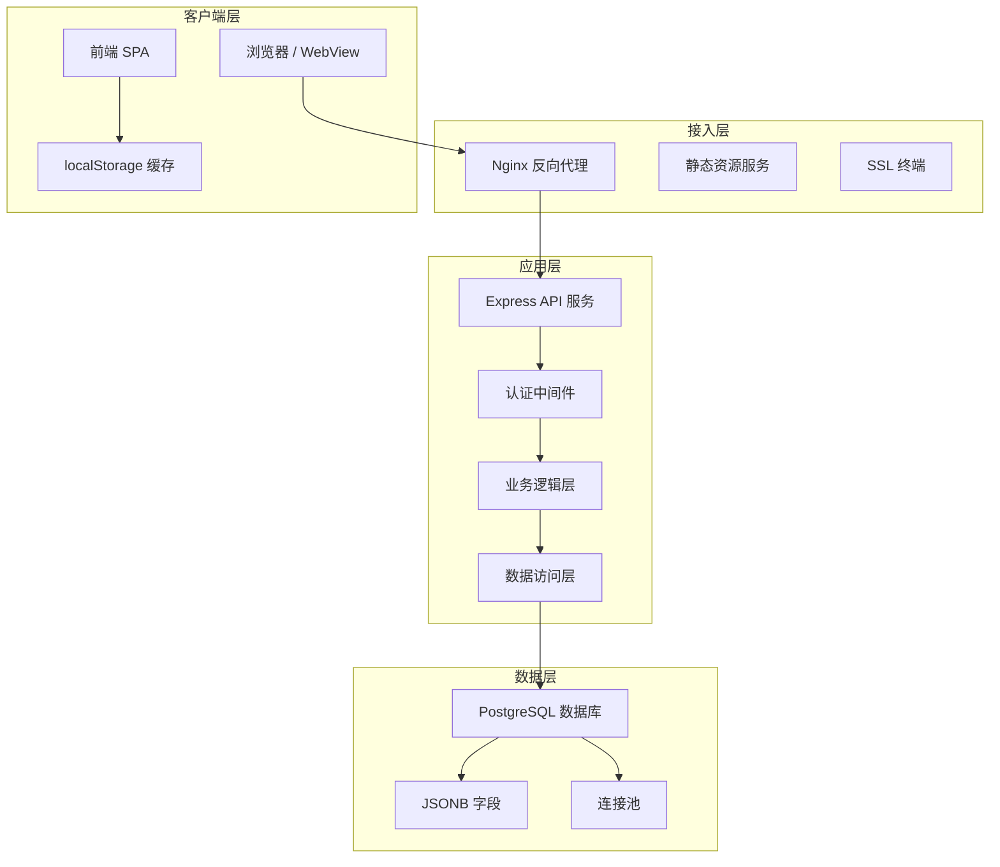
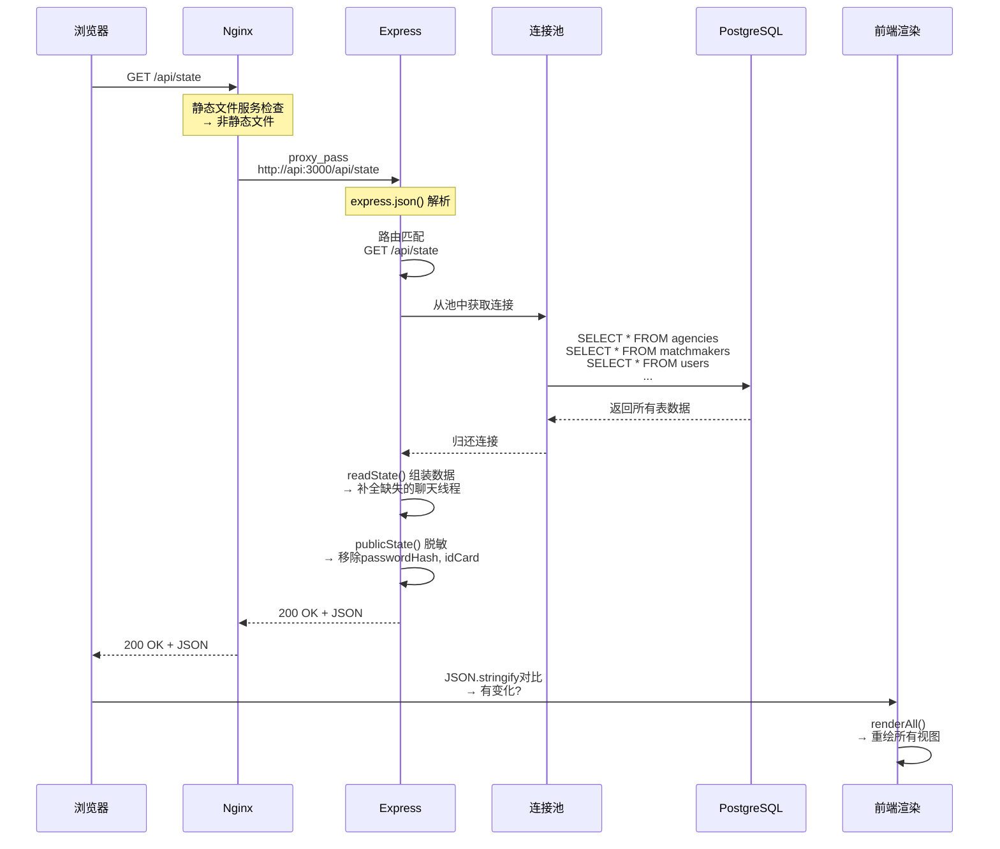
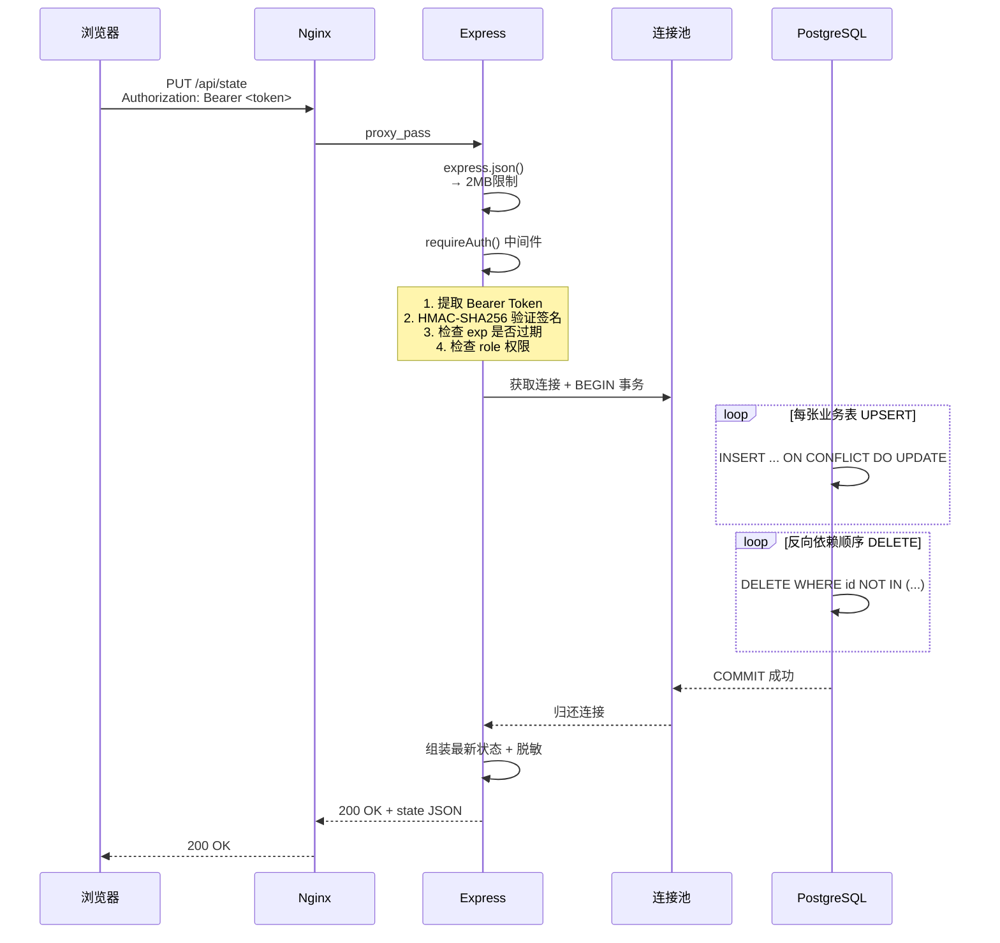
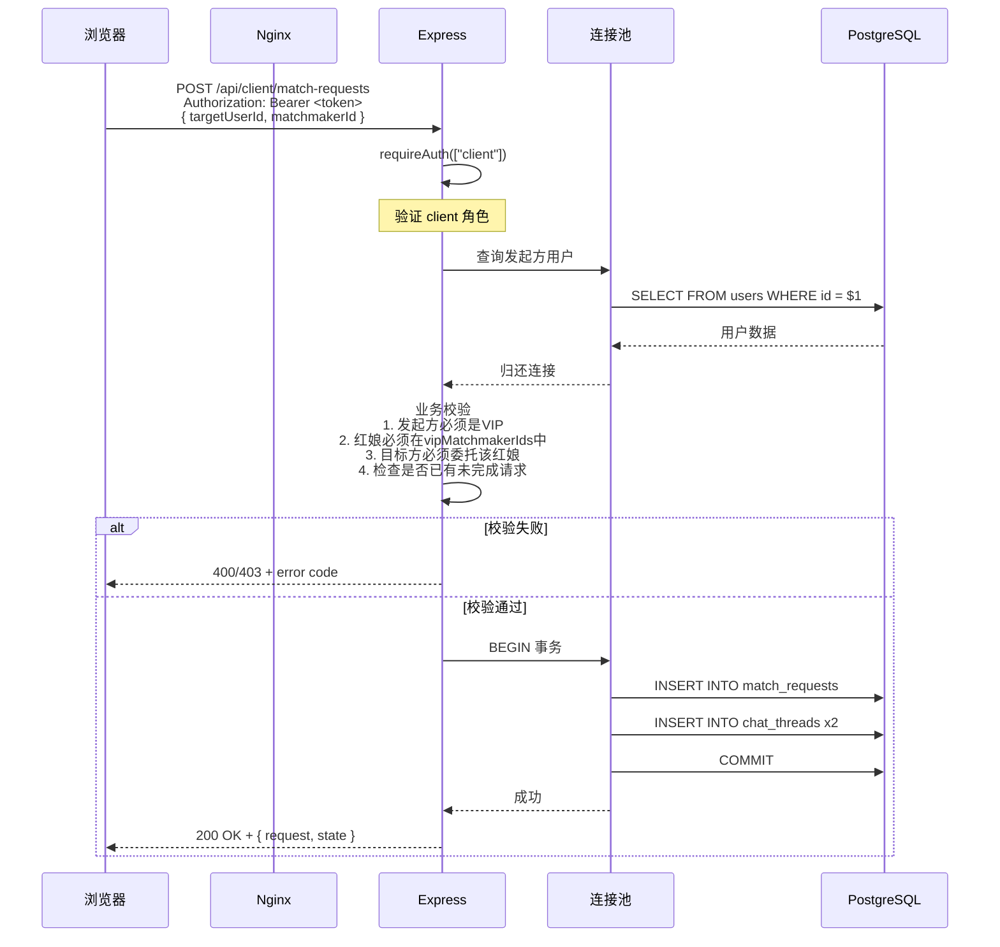
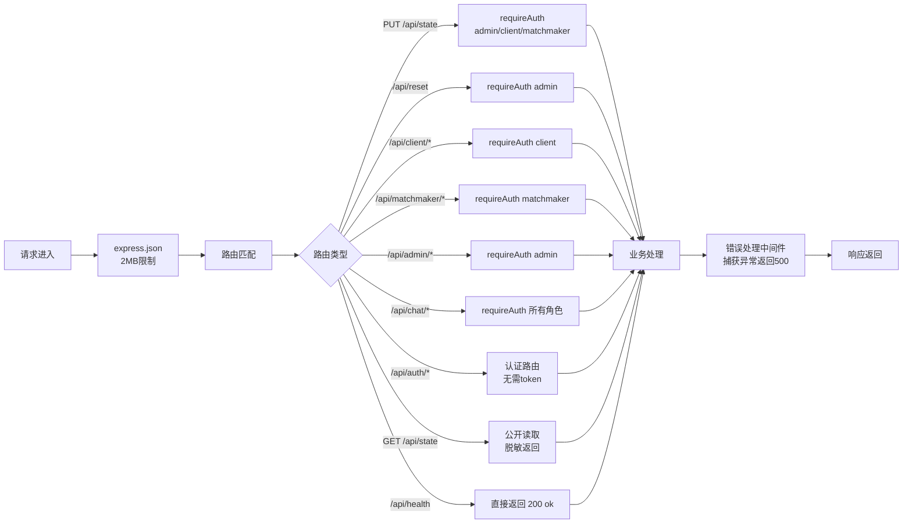
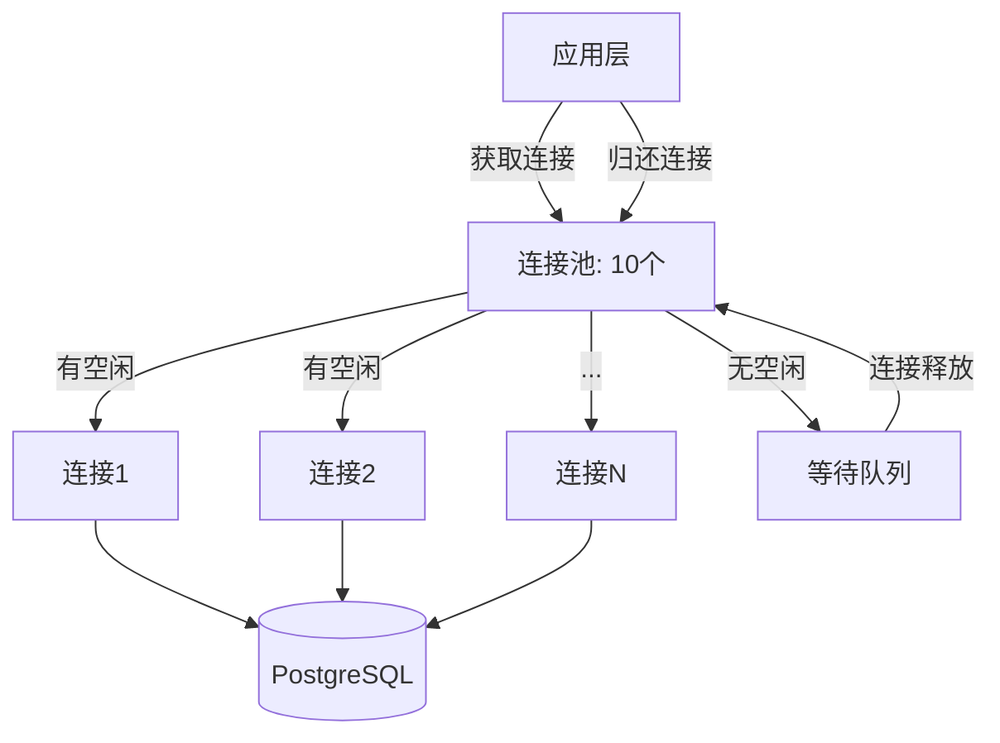
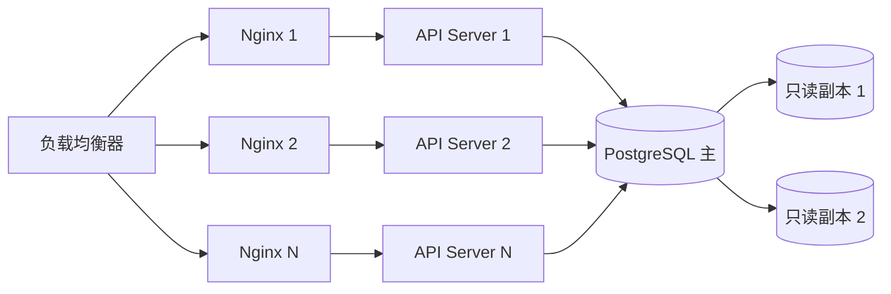

2026-06-25 | Claude Fable 5

# 缘定传媒人 — 技术架构

## 整体架构图

```
┌─────────────────────────────────────────────────────┐
│                    浏览器 / 客户端                    │
│  ┌──────────┐  ┌──────────┐  ┌──────────┐  ┌──────┐ │
│  │ 综合预览  │  │ 客户小程序│  │ 红娘工作台│  │管理后台│ │
│  │ 8095/9445│  │ 8096/9446│  │ 8097/9447│  │8098/ │ │
│  │          │  │          │  │          │  │9448  │ │
│  └────┬─────┘  └────┬─────┘  └────┬─────┘  └──┬───┘ │
│       └──────────────┴────────────┴────────────┘     │
│                      ▼ HTTP /api/*                    │
│              ┌───────────────┐                        │
│              │  Nginx 反向代理 │                        │
│              │  (各端独立容器) │                        │
│              └───────┬───────┘                        │
│                      ▼                                │
│              ┌───────────────┐                        │
│              │  Express API   │  ← Node.js 22         │
│              │  端口 3000     │                        │
│              └───────┬───────┘                        │
│                      ▼                                │
│              ┌───────────────┐                        │
│              │  PostgreSQL 16 │  ← 端口 5432 (仅本机)  │
│              │  数据库        │                        │
│              └───────────────┘                        │
└─────────────────────────────────────────────────────┘
```

## 技术栈

### 前端

| 技术 | 说明 |
|------|------|
| HTML5 | 四个入口页面，纯静态 |
| CSS3 | 自定义变量、Grid/Flex 布局、毛玻璃特效、响应式 |
| 原生 JavaScript | 无框架依赖，单文件 `app.js` 约 3900 行 |
| localStorage | 离线状态缓存与会话存储 |

### 后端

| 技术 | 说明 |
|------|------|
| Node.js 22 | Alpine 镜像 |
| Express 4.x | RESTful API |
| pg (node-postgres) | PostgreSQL 连接池 |
| crypto | HMAC Token 签发与验证、scrypt 密码哈希 |

### 数据库

| 技术 | 说明 |
|------|------|
| PostgreSQL 16 | Alpine 镜像，数据持久化到宿主机卷 |

### 部署

| 技术 | 说明 |
|------|------|
| Docker Compose | 多容器编排（HTTP + SSL 两套 compose 文件） |
| Nginx 1.27 | 静态文件服务 + API 反向代理 |
| Let's Encrypt | 通配证书 `*.sbbz.tech`（acme.sh 管理） |
| systemd / webhook | 自动部署触发 |

## 前后端通信

- 前端通过 `fetch()` 调用 `/api/*` 接口
- Nginx 将 `/api/` 反代到 `http://api:3000/api/`（容器内 DNS 解析）
- 认证通过 `Authorization: Bearer <token>` 头传递
- 状态同步：前端每 4 秒轮询 `GET /api/state`，检测到变化自动刷新

## 数据流模式

当前采用**整包读写**模式：

```
读：GET /api/state → 返回完整业务状态 JSON
写：PUT /api/state → 前端发送完整 state → 后端全量同步到数据库
```

同时已实现部分**精细化 REST API**（如 `/api/client/profile`、`/api/chat/threads/:id/messages`），新接口直接操作数据库单表。

## 鉴权流程

```
前端登录 → POST /api/auth/{role}/login
    ↓
后端验证密码 → 签发 HMAC Token（7 天有效期）
    ↓
前端存储 token → localStorage: mediapeople-dating-demo-v1:session
    ↓
后续请求 → Authorization: Bearer <token>
    ↓
后端中间件 verifyToken → 解析 role + sub → 注入 request.user
```

Token 结构为自实现的 HMAC-SHA256（非标准 JWT），payload 包含 `role`、`sub`、`exp`。

## 多端部署隔离

每个角色有独立的 Nginx 容器，通过端口区分：

| 容器 | HTTP 端口 | HTTPS 端口 | 挂载 HTML |
|------|-----------|------------|-----------|
| web | 8095 | 9445 | index.html |
| web-mini | 8096 | 9446 | mini.html |
| web-matchmaker | 8097 | 9447 | matchmaker.html |
| web-admin | 8098 | 9448 | admin.html |

所有容器共享同一个 API 容器和 PostgreSQL 容器。

---

## 前端状态管理详解

### 全局状态对象

前端维护一个完整的业务状态对象 `state`，结构如下：

```javascript
state = {
  currentUserId: "u1",           // 当前登录客户 ID
  selectedMatchmakerId: null,     // 当前登录红娘 ID
  adminLoggedIn: false,           // 管理员是否登录
  splits: { promo: 20, matchmaker: 35, platform: 45 },  // 分成比例
  agencies: [...],                // 机构列表
  matchmakers: [...],             // 红娘列表
  users: [...],                   // 客户列表
  requests: [...],                // 牵线请求列表
  chatThreads: [...],             // 聊天线程列表
  chatMessages: [...],            // 聊天消息列表
  deals: [...],                   // 成交记录列表
  promoCodes: [...]               // 兑换码列表
}
```

### 会话对象

```javascript
session = {
  currentUserId: "u1",           // 当前客户 ID
  selectedMatchmakerId: null,     // 当前红娘 ID
  adminLoggedIn: false,           // 管理员登录状态
  token: "xxx.xxx",              // HMAC Token
  role: "client"                 // 角色：client / matchmaker / admin
}
```

### 状态初始化流程

```
initApp()
  ├─ 尝试 loadRemoteState()  ← GET /api/state
  │   ├─ 成功 → apiAvailable = true，缓存到 localStorage
  │   └─ 失败 → apiAvailable = false，从 localStorage 加载
  ├─ ensureStateDefaults(state)  ← 补全缺失字段
  ├─ renderAll()                 ← 渲染所有视图
  ├─ handleRouting()             ← 根据 URL 路由到对应页面
  └─ 启动 4 秒轮询定时器
```

### 数据同步策略

**本地优先写入**：
```
用户操作 → 修改本地 state → saveState()
  ├─ localStorage.setItem(STORAGE_KEY, JSON.stringify(state))
  └─ if (apiAvailable) syncRemoteState()
       └─ PUT /api/state（带 token）
           ├─ 成功 → 保持 apiAvailable = true
           └─ 失败 → apiAvailable = false，显示提示
```

**远程轮询同步**：
```
每 4 秒 → loadRemoteState()
  ├─ 成功 → 比较 JSON.stringify(remote) !== JSON.stringify(local)
  │   ├─ 不同 → 更新本地 state + localStorage + renderAll()
  │   └─ 相同 → 无操作
  └─ 失败 → 跳过本次
```

**页面卸载同步**：
```
pagehide 事件 → syncRemoteState({ keepalive: true, notify: false })
  └─ 使用 keepalive 确保请求在页面关闭前完成
```

### 角色检测机制

```javascript
// 优先通过 HTML data-role 属性检测（独立端口部署时）
// 其次通过端口号检测（综合预览端时）
isMiniView()       → data-role="mini" || port === 8096
isMatchmakerView() → data-role="matchmaker" || port === 8097
isAdminView()      → data-role="admin" || port === 8098
```

### 路由系统

使用 `history.pushState` + `popstate` 事件实现 SPA 路由：

**综合预览端路由**（8095）：
```
/mini/discover    → 客户端-筛选页
/mini/profile     → 客户端-资料页
/mini/vip         → 客户端-VIP页
/mini/requests    → 客户端-消息页
/mini/my          → 客户端-我的页
/matchmaker/login → 红娘登录页
/matchmaker/workbench → 红娘工作台
/admin/login      → 管理员登录页
/admin/console    → 管理后台
```

**独立端口路由**（8096/8097/8098）：
```
/discover, /profile, /vip, /requests, /my  → 客户端各页面
/login, /workbench                          → 红娘各页面
/login, /console                            → 管理员各页面
```

**路由守卫**：
- 客户端：未登录时，除 `/my` 外所有页面重定向到 `/my`
- 红娘端：未登录时，`/workbench` 重定向到 `/login`
- 管理端：未登录时，`/console` 重定向到 `/login`

## 后端架构详解

### Express 中间件链

```
请求进入
  ↓
express.json({ limit: "2mb" })  ← 解析 JSON 请求体
  ↓
路由匹配
  ├─ /api/health → 直接响应
  ├─ /api/auth/* → 认证路由（无需 token）
  ├─ /api/state GET → 公开（脱敏返回）
  ├─ /api/state PUT → requireAuth(["admin","client","matchmaker"])
  ├─ /api/reset → requireAuth(["admin"])
  ├─ /api/client/* → requireAuth(["client"])
  ├─ /api/matchmaker/* → requireAuth(["matchmaker"])
  ├─ /api/admin/* → requireAuth(["admin"])
  └─ /api/chat/* → requireAuth(["client","matchmaker","admin"])
  ↓
错误处理中间件 → 500 + { error: "internal server error" }
```

### 数据库连接池

```javascript
const pool = new Pool({
  host: process.env.PGHOST || "localhost",
  port: Number(process.env.PGPORT || 5432),
  database: process.env.PGDATABASE || "mediapeople",
  user: process.env.PGUSER || "mediapeople",
  password: process.env.PGPASSWORD,
});
```

- 默认连接池大小：10
- 连接超时：30 秒
- 空闲连接超时：10 秒

### 数据库初始化流程

```
initDatabase()
  ├─ CREATE TABLE IF NOT EXISTS app_state
  ├─ CREATE TABLE IF NOT EXISTS agencies
  ├─ CREATE TABLE IF NOT EXISTS matchmakers
  ├─ CREATE TABLE IF NOT EXISTS users
  ├─ CREATE TABLE IF NOT EXISTS match_requests
  ├─ CREATE TABLE IF NOT EXISTS deals
  ├─ CREATE TABLE IF NOT EXISTS chat_threads
  ├─ CREATE TABLE IF NOT EXISTS chat_messages
  ├─ CREATE TABLE IF NOT EXISTS promo_codes
  ├─ CREATE TABLE IF NOT EXISTS app_settings
  └─ 检查 users 表是否为空
       └─ 为空 → syncNormalizedState(seedState) 插入种子数据
```

### syncNormalizedState() 全量同步流程

```
syncNormalizedState(data)
  ├─ BEGIN 事务
  ├─ UPSERT agencies（INSERT ... ON CONFLICT DO UPDATE）
  ├─ UPSERT matchmakers
  ├─ UPSERT users
  ├─ UPSERT match_requests
  ├─ UPSERT chat_threads
  ├─ UPSERT chat_messages
  ├─ UPSERT deals
  ├─ UPSERT promo_codes
  ├─ UPSERT app_settings
  ├─ DELETE 不在新数据中的行（反向依赖顺序）：
  │   ├─ DELETE FROM chat_messages WHERE id NOT IN (...)
  │   ├─ DELETE FROM chat_threads WHERE id NOT IN (...)
  │   ├─ DELETE FROM deals WHERE id NOT IN (...)
  │   ├─ DELETE FROM match_requests WHERE id NOT IN (...)
  │   ├─ DELETE FROM users WHERE id NOT IN (...)
  │   ├─ DELETE FROM matchmakers WHERE id NOT IN (...)
  │   ├─ DELETE FROM agencies WHERE id NOT IN (...)
  │   └─ DELETE FROM promo_codes WHERE code NOT IN (...)
  └─ COMMIT 事务
```

### readState() 读取流程

```
readState()
  ├─ SELECT raw FROM agencies ORDER BY id
  ├─ SELECT raw FROM matchmakers ORDER BY id
  ├─ SELECT raw FROM users ORDER BY id
  ├─ SELECT raw FROM match_requests ORDER BY createdAt DESC
  ├─ SELECT raw FROM chat_threads ORDER BY lastMessageAt DESC
  ├─ SELECT raw FROM chat_messages ORDER BY created_at ASC
  ├─ SELECT raw FROM deals ORDER BY createdAt DESC
  ├─ SELECT raw FROM promo_codes ORDER BY code
  ├─ SELECT data FROM app_settings WHERE id = 'runtime'
  ├─ 补全缺失的聊天线程（自动创建 member_matchmaker 和 member_member 线程）
  └─ 组装完整 state 对象返回
```

### 数据脱敏机制

`GET /api/state` 返回前调用 `publicState()`：

```javascript
function publicState(data) {
  return {
    ...data,
    users: data.users.map(({ passwordHash, idCard, ...user }) => user),
    matchmakers: data.matchmakers.map(({ passwordHash, ...mm }) => mm),
  };
}
```

- 移除 `passwordHash`（密码哈希）
- 移除 `idCard`（身份证号）

## Nginx 配置详解

### HTTP 配置（nginx.conf）

```nginx
# 静态文件服务
location / {
    try_files $uri $uri/ /index.html;
    add_header Cache-Control "no-store, no-cache, must-revalidate";
}

# 公网禁用重置接口
location = /api/reset {
    return 404;
}

# API 反向代理
location /api/ {
    proxy_pass http://api:3000/api/;
    proxy_set_header Host $host;
    proxy_set_header X-Real-IP $remote_addr;
}

# HTML 文件禁用缓存
location ~* \.html$ {
    expires -1;
    add_header Cache-Control "no-store";
}

# CSS/JS 文件长期缓存
location ~* \.(?:css|js)$ {
    expires 365d;
    add_header Cache-Control "public, immutable";
}
```

### HTTPS 配置（nginx-ssl.conf）

在 HTTP 配置基础上增加：

```nginx
listen 443 ssl;
ssl_certificate /etc/nginx/certs/fullchain.cer;
ssl_certificate_key /etc/nginx/certs/privkey.key;
ssl_protocols TLSv1.2 TLSv1.3;
ssl_prefer_server_ciphers off;
```

## Docker Compose 编排

### compose.yml（HTTP + API + 数据库）

```yaml
services:
  web:              # 综合预览端 8095
  web-mini:         # 客户小程序端 8096
  web-matchmaker:   # 红娘工作台 8097
  web-admin:        # 管理后台 8098
  api:              # Express API（不暴露端口）
  postgres:         # PostgreSQL 5432（仅绑定 127.0.0.1）
```

### compose.ssl.yml（HTTPS 前端）

```yaml
services:
  web-ssl:              # 9445
  web-mini-ssl:         # 9446
  web-matchmaker-ssl:   # 9447
  web-admin-ssl:        # 9448
```

每个 SSL 容器挂载：
- 对应的 HTML 文件
- CSS/JS 文件
- SSL 证书和私钥
- nginx-ssl.conf 配置

---

## 分层架构详解

### 四层架构模型



### 各层职责

| 层级 | 组件 | 核心职责 | 关键技术 |
|------|------|---------|---------|
| **客户端层** | 浏览器 / WebView | 用户交互、UI渲染、本地状态管理 | HTML5, CSS3, 原生JS, localStorage |
| **接入层** | Nginx | 静态文件服务、反向代理、SSL终端、缓存控制 | Nginx 1.27, HTTP/HTTPS, gzip |
| **应用层** | Express API | 路由分发、认证鉴权、业务逻辑、数据组装 | Node.js 22, Express 4.x, ES Modules |
| **数据层** | PostgreSQL | 数据持久化、事务保证、索引查询 | PostgreSQL 16, JSONB, 连接池 |

---

## 请求全链路追踪

### 读请求链路（GET /api/state）



### 写请求链路（PUT /api/state）



### 精细化API请求链路（以申请牵线为例）



---

## 前端渲染流水线

### 初始化渲染流程

```mermaid
flowchart TD
    Start[页面加载] --> ParseHTML[解析HTML DOM]
    ParseHTML --> LoadCSS[加载styles.css]
    LoadCSS --> LoadJS[加载app.js]
    LoadJS --> InitApp[initApp() 初始化]
    
    InitApp --> TryRemote[尝试 loadRemoteState]
    TryRemote -->|成功| ApiOk[apiAvailable = true]
    TryRemote -->|失败| ApiFail[apiAvailable = false]
    
    ApiOk --> CacheLocal[缓存到localStorage]
    ApiFail --> LoadLocal[从localStorage加载]
    LoadLocal --> HasData{有缓存数据?}
    HasData -->|有| UseCache[使用缓存数据]
    HasData -->|无| UseSeed[使用默认种子数据]
    
    CacheLocal --> EnsureDefaults[ensureStateDefaults]
    UseCache --> EnsureDefaults
    UseSeed --> EnsureDefaults
    
    EnsureDefaults --> RenderAll[renderAll() 全量渲染]
    RenderAll --> RenderMini[渲染客户端视图]
    RenderAll --> RenderMatchmaker[渲染红娘视图]
    RenderAll --> RenderAdmin[渲染管理后台视图]
    
    RenderMini --> Routing[handleRouting 路由处理]
    RenderMatchmaker --> Routing
    RenderAdmin --> Routing
    
    Routing --> StartPolling[启动4秒轮询定时器]
    StartPolling --> End[应用就绪]
```

### 局部状态变更渲染

```mermaid
flowchart TD
    UserAction[用户操作] --> ModifyState[修改本地state]
    ModifyState --> SaveState[saveState 写入localStorage]
    SaveState --> CheckApi{apiAvailable?}
    CheckApi -->|是| SyncRemote[syncRemoteState 异步同步]
    CheckApi -->|否| SkipSync[跳过同步]
    
    SyncRemote -->|成功| KeepAvailable[保持apiAvailable=true]
    SyncRemote -->|失败| SetOffline[apiAvailable=false<br/>显示离线提示]
    
    KeepAvailable --> RenderAll[renderAll 全量重渲染]
    SetOffline --> RenderAll
    SkipSync --> RenderAll
    
    RenderAll --> DiffRender[Diff: virtual? 没有]<br/>实际是全量重绘]
    DiffRender --> UpdateDOM[更新DOM内容]
    UpdateDOM --> End[渲染完成]
```

**注意**：当前前端没有虚拟DOM，每次状态变更都是全量重渲染（innerHTML 替换）。对于当前数据量（10个用户、几个请求）性能足够，但数据量大后需要优化。

---

## 后端请求处理流水线

### Express 中间件执行顺序



### 数据库连接池工作原理



**连接池配置**：
- 默认大小：10 个连接
- 连接超时：30 秒
- 空闲超时：10 秒
- 数据库端口：5432（容器内）

---

## 性能瓶颈分析

### 当前架构的性能瓶颈点

| 瓶颈点 | 位置 | 原因 | 影响 | 优先级 |
|--------|------|------|------|--------|
| **整包读写** | PUT /api/state | 每次写入都全量同步所有表 | 网络开销大、事务锁时间长 | ⭐⭐⭐⭐⭐ |
| **全量轮询** | GET /api/state | 4秒轮询返回全部数据 | 网络流量大、数据库压力大 | ⭐⭐⭐⭐⭐ |
| **全量重渲染** | 前端 renderAll() | 无虚拟DOM，每次全量重绘 | 数据量大后UI卡顿 | ⭐⭐⭐⭐ |
| **单线程Node** | API服务 | Node.js单线程模型 | CPU密集型操作阻塞 | ⭐⭐⭐ |
| **无索引** | 数据库 | JSONB字段无GIN索引 | 查询性能随数据量下降 | ⭐⭐⭐ |
| **无缓存** | Nginx层 | API响应无缓存 | 重复查询数据库 | ⭐⭐⭐ |

### 数据规模估算

| 数据项 | 当前规模 | 1万用户规模 | 10万用户规模 |
|--------|---------|------------|-------------|
| 用户数 | 10 | 10,000 | 100,000 |
| 牵线请求数 | ~5 | ~5,000 | ~50,000 |
| 聊天消息数 | ~20 | ~50,000 | ~500,000 |
| 单轮询数据量 | ~20KB | ~10MB | ~100MB |
| 日API调用（轮询） | ~2万次 | ~2000万次 | ~2亿次 |

**结论**：当前整包读写模式在100用户以内完全可行，但达到1万用户时必须重构。

---

## 可扩展性设计

### 水平扩展方案



### 扩展优先级

1. **数据库扩展**（最先遇到瓶颈）
   - 读写分离（主从复制）
   - 连接池调优
   - 增加索引（GIN索引JSONB字段）

2. **API扩展**（其次）
   - 多实例部署
   - 负载均衡
   - 引入Redis缓存

3. **前端扩展**（最后）
   - 引入虚拟DOM框架
   - 按需加载
   - 分页查询

---

## 技术选型决策记录

### 为什么用原生JS而不是框架？

| 考量因素 | 原生JS | Vue/React | 决策 |
|---------|--------|-----------|------|
| 项目规模 | 原型阶段，3900行 | 适合大型项目 | ✅ 原生足够 |
| 开发速度 | 无需构建，改完即生效 | 需要构建工具 | ✅ 原型更快 |
| 学习成本 | 低，任何人能改 | 需要框架知识 | ✅ 更低门槛 |
| 性能 | 数据量小时足够 | 大数据量更好 | ⚠️ 当前够用 |
| 可维护性 | 单文件，职责不清 | 组件化，清晰 | ❌ 长期需重构 |

**决策**：原型阶段用原生JS，快速验证业务。验证成功后迁移到Vue/React。

### 为什么用PostgreSQL而不是MySQL？

| 考量因素 | PostgreSQL | MySQL | 决策 |
|---------|-----------|-------|------|
| JSON支持 | JSONB，强类型，GIN索引 | JSON，弱支持 | ✅ PG更好 |
| 事务支持 | MVCC，成熟 | 也不错 | ✅ 都可以 |
| 整包读写模式 | JSONB适合存储state | 也能用 | ✅ PG更优 |
| 部署复杂度 | 差不多 | 差不多 | - |

**决策**：JSONB是核心需求，PostgreSQL更适合。

### 为什么用Docker Compose而不是K8s？

| 考量因素 | Docker Compose | Kubernetes | 决策 |
|---------|---------------|-----------|------|
| 规模 | 单服务器 | 多节点集群 | ✅ 当前够用 |
| 复杂度 | 低，一个yml文件 | 高，学习曲线陡 | ✅ 更简单 |
| 运维成本 | 几乎为零 | 需要专人运维 | ✅ 成本低 |
| 可扩展性 | 垂直扩展 | 水平扩展 | ⚠️ 未来可能需要 |

**决策**：原型和早期阶段用Docker Compose，业务增长后迁移到K8s。

---

## 高可用设计

### 当前可用性保障

| 组件 | 高可用机制 |  downtime风险 |
|------|-----------|---------------|
| Nginx | 单实例，无冗余 | 进程挂了服务不可用 |
| API服务 | 单实例，Docker自动重启 | 重启期间短暂不可用 |
| PostgreSQL | 单实例，数据卷持久化 | 挂了需要手动恢复 |
| 服务器 | 单台服务器 | 服务器挂了全挂 |

### 改进方向（按优先级）

1. **数据库备份**：每日自动备份 ✅ 已实现
2. **进程守护**：Docker restart: always ✅ 已实现
3. **健康检查**：Docker healthcheck ✅ 已部分实现
4. **多实例部署**：API服务多实例 ⏳ 待实施
5. **数据库主从**：PostgreSQL主从复制 ⏳ 待实施
6. **多可用区**：跨服务器部署 ⏳ 远期目标
