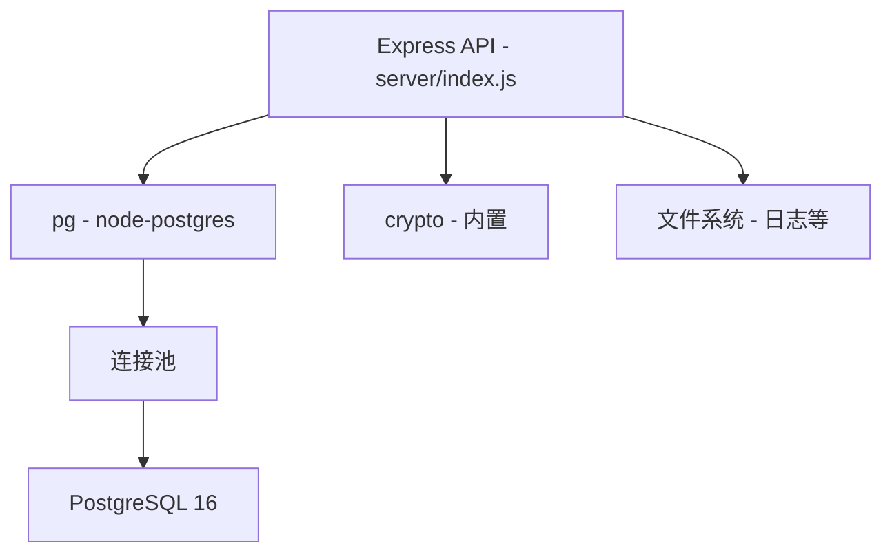
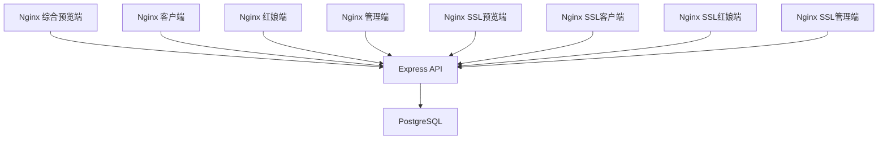
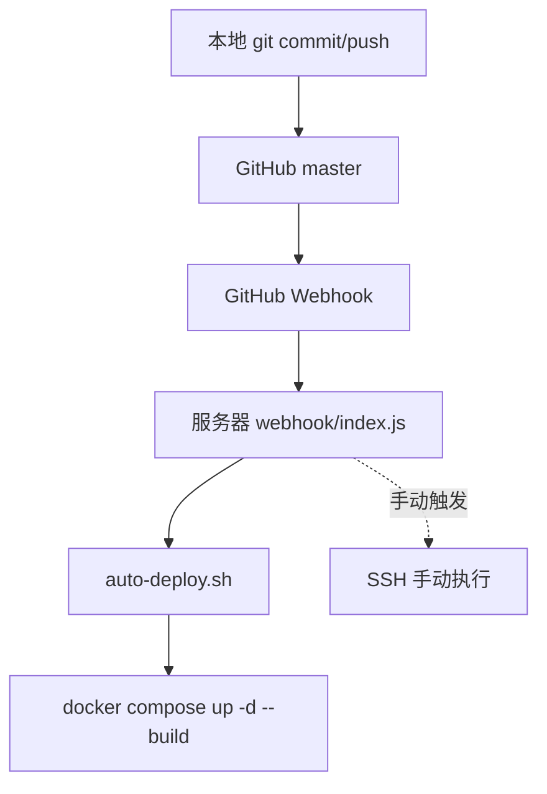

2026-06-27 | Codex 修订

# MatchMaker — 文件结构

## 2026-06-27 当前修订摘要

本文件已按当前文件结构修订：dist/ 是部署时生成物不提交；deploy/auto-deploy.sh 是当前服务器部署主脚本；说明/10-操作手册.md 是唯一权威操作手册。

如本文下方旧段落与本摘要或 `说明/10-操作手册.md` 冲突，以 `说明/10-操作手册.md` 和当前线上实测流程为准。


## 根目录文件

```
matchmaker/
├── index.html              综合预览端（8095/9445），可在页面内切换三端视角
├── uniapp/                 真实客户 H5/微信小程序（8096/9446）
├── matchmaker.html         红娘工作台端（8097/9447）
├── admin.html              管理后台端（8098/9448，使用 __ASSET_VERSION__ 占位符）
├── app.js                  前端业务逻辑（约 3900 行，所有角色共享）
├── styles.css              全局样式表（约 1680 行）
├── package.json            根项目配置（仅 puppeteer-core 依赖）
├── package-lock.json       依赖锁文件
├── readme.md               项目说明文档
├── 问题.md                 开发中遇到的问题记录
├── deploy.sh               旧本地一键脚本（当前不作为推荐入口）
├── compose.yml             Docker Compose：HTTP 前端 + API + PostgreSQL
├── compose.ssl.yml         Docker Compose：HTTPS 前端容器（9445-9448）
├── .env.example            环境变量示例
├── .gitignore              Git 忽略规则
└── .DS_Store               macOS 系统文件（已忽略）
```

---

## server/ — 后端 API

```
server/
├── index.js                Express API 主文件（约 1680 行）
├── package.json            后端依赖（express, pg）
├── Dockerfile              Node.js 22 Alpine 镜像构建
└── .dockerignore           Docker 构建忽略文件
```

### index.js 内部结构详解

**种子数据（seedState）**：
- 约 190 行，定义 10 个演示用户、2 个红娘、2 个机构、4 个兑换码
- 数据库为空时自动插入

**数据库连接（Pool）**：
- 支持 `DATABASE_URL` 连接字符串或分散的环境变量
- 默认连接池大小 10

**工具函数**：
- `signToken()` / `verifyToken()` — HMAC Token 签发与验证
- `hashPassword()` / `verifyPassword()` — scrypt 密码哈希
- `publicState()` — 数据脱敏（移除 passwordHash、idCard）
- `ensureRequestDefaults()` — 补全牵线请求默认字段
- `ensureUserDefaults()` — 补全客户默认字段（vipMatchmakerIds、delegatedMatchmakerIds）
- `getRequestContactStatus()` — 根据 maleContacted/femaleContacted 计算状态
- `buildMemberMatchmakerThreads()` — 为牵线请求创建红娘-会员聊天线程
- `buildMemberMemberThread()` — 为牵线请求创建会员互聊线程

**数据库操作**：
- `initDatabase()` — 建表 + 种子数据
- `readState()` — 从各业务表读取数据组装完整 state
- `writeState()` — 调用 syncNormalizedState() 全量写入
- `syncNormalizedState()` — UPSERT + DELETE 全量同步

**认证接口**：
- `POST /api/auth/admin/login` — 管理员登录
- `POST /api/auth/client/login` — 客户登录（支持 userId 或 account）
- `POST /api/auth/client/register` — 客户注册
- `POST /api/auth/matchmaker/login` — 红娘登录
- `POST /api/auth/matchmaker/register` — 红娘注册

**状态接口**：
- `GET /api/state` — 读取全局状态（脱敏）
- `PUT /api/state` — 写入全局状态（需认证）
- `POST /api/reset` — 重置为种子数据（需管理员）
- `GET /api/health` — 健康检查

**客户精细化接口**：
- `PATCH /api/client/profile` — 修改个人资料
- `POST /api/client/real-name` — 实名认证
- `POST /api/client/vip/redeem` — VIP 兑换
- `POST /api/client/match-requests` — 申请牵线

**红娘精细化接口**：
- `PATCH /api/matchmaker/requests/:id/contacted` — 标记已联系
- `PATCH /api/matchmaker/requests/:id/member-chat` — 开启会员互聊
- `PATCH /api/matchmaker/requests/:id/member-chat` — 开关会员互聊
- `PATCH /api/matchmaker/users/:id/profile-review` — 审核客户资料

**聊天接口**：
- `POST /api/chat/threads/:id/messages` — 发送消息

**管理员接口**：
- `POST /api/admin/agencies` — 添加机构
- `POST /api/admin/matchmakers` — 添加红娘
- `PATCH /api/admin/splits` — 修改分成
- `POST /api/admin/promo-codes` — 生成兑换码
- `POST /api/admin/deals/simulate` — 模拟成交

### Dockerfile

```dockerfile
FROM node:22-alpine
WORKDIR /app
COPY package.json ./
RUN npm install --omit=dev
COPY index.js ./
EXPOSE 3000
CMD ["npm", "start"]
```

- 基于 Node.js 22 Alpine 镜像（体积小）
- 仅安装生产依赖（--omit=dev）
- 暴露 3000 端口

### package.json

```json
{
  "name": "matchmaker-api",
  "version": "0.1.0",
  "private": true,
  "type": "module",
  "scripts": {
    "start": "node index.js"
  },
  "dependencies": {
    "express": "^4.19.2",
    "pg": "^8.13.1"
  }
}
```

- 使用 ES Module（`type: "module"`）
- 仅两个依赖：express 和 pg

---

## deploy/ — 部署配置

```
deploy/
├── nginx.conf              HTTP Nginx 配置（反代 + 静态文件）
├── nginx-ssl.conf          HTTPS Nginx 配置（SSL + 反代）
├── auto-deploy.sh          服务器自动部署脚本（由 webhook 或手动触发）
├── deploy-from-local.sh    从本地推送到服务器的部署脚本
└── remote-deploy.sh        远程服务器部署辅助脚本
```

### nginx.conf 详解

```nginx
server {
    listen 80;
    server_name _;

    # 静态文件：SPA 回退 + 禁用缓存
    location / {
        try_files $uri $uri/ /index.html;
        add_header Cache-Control "no-store, no-cache, must-revalidate";
    }

    # 公网禁用重置接口
    location = /api/reset {
        return 404;
    }

    # API 反向代理到容器内 API 服务
    location /api/ {
        proxy_pass http://api:3000/api/;
        proxy_http_version 1.1;
        proxy_set_header Host $host;
        proxy_set_header X-Real-IP $remote_addr;
        proxy_set_header X-Forwarded-For $proxy_add_x_forwarded_for;
        proxy_set_header X-Forwarded-Proto $scheme;
    }

    # HTML 文件：禁用缓存（确保更新即时生效）
    location ~* \.html$ {
        expires -1;
        add_header Cache-Control "no-store";
    }

    # CSS/JS 文件：长期缓存（配合版本号 cache busting）
    location ~* \.(?:css|js)$ {
        expires 365d;
        add_header Cache-Control "public, immutable";
    }
}
```

**关键设计**：
- `/api/reset` 公网直接返回 404，防止误操作
- HTML 禁用缓存，CSS/JS 长期缓存（通过 URL 参数 `?v=x.y.z` 刷新）
- `try_files` 支持 SPA 路由（所有路径回退到 index.html）

### nginx-ssl.conf 详解

在 nginx.conf 基础上增加 SSL 配置：

```nginx
listen 443 ssl;
ssl_certificate /etc/nginx/certs/fullchain.cer;
ssl_certificate_key /etc/nginx/certs/privkey.key;
ssl_protocols TLSv1.2 TLSv1.3;
ssl_prefer_server_ciphers off;
```

- 同时监听 80 和 443
- 证书由 acme.sh 管理，覆盖 `*.sbbz.tech`

### auto-deploy.sh 详解

服务器端自动部署脚本，流程：

```
1. cd /opt/matchmaker
2. git pull origin master
3. 检测 git diff 中是否有 server/ 目录变更
4. 如有变更：
   ├─ docker compose build api
   └─ docker compose up -d api
5. 重启所有 Nginx 容器
6. 记录日志到 /var/log/matchmaker-deploy.log
```

**智能重建**：
- 只改前端文件 → 只重启 Nginx 容器（volume 挂载已更新）
- 改了 server/ → 重建 API 容器 + 重启 Nginx

---

## scripts/ — 构建脚本

```
scripts/
└── render-static.mjs       静态资源版本号渲染脚本
```

### render-static.mjs 详解

功能：将 HTML 中的 `__ASSET_VERSION__` 占位符替换为 Git 短哈希，输出到 `dist/` 目录。

```javascript
// 输入：index.html 中的 __ASSET_VERSION__
// 输出：dist/index.html 中的实际版本号（如 d61c27d）

const version = process.argv[2] || execFileSync("git", ["rev-parse", "--short", "HEAD"]);
const htmlFiles = ["index.html", "matchmaker.html", "admin.html"];

for (const filename of htmlFiles) {
  const template = await readFile(filename, "utf8");
  const rendered = template.replaceAll("__ASSET_VERSION__", version);
  await writeFile(`dist/${filename}`, rendered);
}

// 同时生成 version.json
await writeFile("dist/version.json", JSON.stringify({ assetVersion: version }));
```

**使用场景**：
- Docker 容器挂载 `dist/` 目录而非源文件
- 版本号来自 Git commit hash 或命令行参数

---

## webhook/ — GitHub Webhook 服务

```
webhook/
├── index.js                Webhook HTTP 服务（接收 GitHub push 事件触发部署）
├── webhook_server.py       Python 版 Webhook 服务（备用）
├── package.json            Webhook 服务依赖
└── matchmaker-webhook.service  systemd 服务配置文件
```

### index.js 详解

**工作流程**：

```
GitHub push 事件
  ↓
POST /webhook
  ↓
验证 x-hub-signature-256（HMAC-SHA256）
  ├─ 验证失败 → 403 Forbidden
  └─ 验证通过 → 继续
  ↓
检查 ref 是否为 master/main
  ├─ 非主分支 → 200 Ignored
  └─ 主分支 → 继续
  ↓
检查是否正在部署
  ├─ 正在部署 → 202 Skipped
  └─ 空闲 → 开始部署
  ↓
执行 bash /opt/matchmaker/deploy/auto-deploy.sh
  ├─ 成功 → 记录日志
  └─ 失败 → 记录错误日志
```

**防重入机制**：
- 全局变量 `deploying` 标记部署状态
- 部署期间收到的新 push 直接跳过

**签名验证**：
```javascript
function verifySignature(body, signature) {
  if (!SECRET) return true;  // 未配置 secret 时跳过验证
  const expected = "sha256=" + crypto.createHmac("sha256", SECRET).update(body).digest("hex");
  return crypto.timingSafeEqual(Buffer.from(expected), Buffer.from(signature));
}
```

### webhook_server.py

Python 版本的备用 Webhook 服务，功能相同。

### matchmaker-webhook.service

systemd 服务配置文件，用于将 Webhook 服务注册为系统服务：

```ini
[Unit]
Description=MatchMaker GitHub Webhook
After=network.target

[Service]
ExecStart=/usr/bin/node /opt/matchmaker/webhook/index.js
Restart=always
Environment=WEBHOOK_SECRET=your_secret
Environment=DEPLOY_SCRIPT=/opt/matchmaker/deploy/auto-deploy.sh

[Install]
WantedBy=multi-user.target
```

---

## dist/ — 构建输出

```
dist/                       （已 gitignore）
├── index.html              渲染后的综合预览端
├── uniapp/dist/build/h5/   构建后的真实客户 H5
├── matchmaker.html         渲染后的红娘工作台
├── admin.html              渲染后的管理后台
└── version.json            版本信息
```

由 `scripts/render-static.mjs` 生成，Docker 容器挂载此目录。

---

## data/ — 数据持久化

```
data/                       （已 gitignore）
└── postgres/               PostgreSQL 数据目录
```

- 由 Docker volume 挂载
- 服务器路径：`/opt/matchmaker/data/postgres`
- 包含所有数据库文件

---

## .claude/ — Claude Code 配置

```
.claude/                    Claude Code 工具配置目录
```

---

## 关键文件依赖关系

```
HTML 入口页面
  ├─ 加载 styles.css（样式）
  └─ 加载 app.js（业务逻辑）
       ├─ 调用 /api/state（读取数据）
       ├─ 调用 /api/auth/*（认证）
       ├─ 调用 /api/client/*（客户操作）
       ├─ 调用 /api/matchmaker/*（红娘操作）
       ├─ 调用 /api/admin/*（管理员操作）
       └─ 调用 /api/chat/*（聊天）
            ↓
       Nginx 反向代理
            ↓
       server/index.js（Express API）
            ↓
       PostgreSQL 数据库
```

## 文件大小参考

| 文件 | 行数 | 说明 |
|------|------|------|
| app.js | ~3900 | 前端业务逻辑（最大文件） |
| server/index.js | ~1680 | 后端 API |
| styles.css | ~1680 | 全局样式 |
| index.html | ~770 | 综合预览端 |
| uniapp/src/ | - | 真实客户 H5/微信小程序 |
| matchmaker.html | - | 红娘工作台 |
| admin.html | - | 管理后台 |

---

## 命名规范

### 文件命名

| 类型 | 规则 | 示例 |
|------|------|------|
| HTML入口 | 小写，短横线分隔 | `index.html`, `matchmaker.html`, `admin.html` |
| JS文件 | 小写，短横线分隔（如有多个） | `app.js`, `render-static.mjs` |
| CSS文件 | 小写，短横线分隔 | `styles.css` |
| 配置文件 | 小写，点分隔 | `compose.yml`, `package.json`, `.env.example` |
| 脚本文件 | 小写，短横线分隔 | `deploy.sh`, `auto-deploy.sh` |
| 文档文件 | 数字前缀-中文标题 | `01-项目概述.md`, `02-技术架构.md` |

### 变量命名

| 类型 | 规则 | 示例 |
|------|------|------|
| JS常量 | 大写下划线分隔 | `STORAGE_KEY`, `VIP_PRICE`, `API_BASE` |
| JS变量 | 小驼峰 | `currentUserId`, `apiAvailable`, `activeChatThreadId` |
| JS函数 | 小驼峰，动词开头 | `initApp()`, `loadState()`, `renderAll()` |
| ID选择器 | 小驼峰或短横线 | `#profileForm`, `#miniTabBar` |
| CSS类名 | BEM混合自由命名 | `.modal-content`, `.btn-primary`, `.phone-frame` |

### 数据库命名

| 类型 | 规则 | 示例 |
|------|------|------|
| 表名 | 小写，下划线分隔，复数 | `users`, `match_requests`, `chat_threads` |
| 列名 | 小写，下划线分隔 | `real_name_verified`, `referral_matchmaker_id` |
| 主键 | `id` | `id` |
| 外键 | `表名_id` | `agency_id`, `matchmaker_id` |
| 时间戳 | `_at`后缀 | `created_at`, `updated_at`, `registered_at` |
| JSONB字段 | `raw` | 存储完整JSON副本 |

### ID生成规则

所有业务ID采用 **前缀 + 时间戳base36 + 随机hex** 格式：

| 实体 | 前缀 | 示例 |
|------|------|------|
| 机构 | `a` | `a1m2n3o4ab` |
| 红娘 | `m` | `m1m2n3o4cd` |
| 用户 | `u` | `u1m2n3o4ef` |
| 牵线请求 | `r` | `r1m2n3o4gh` |
| 聊天线程 | `ct` | `ct1m2n3o4ij` |
| 聊天消息 | `cm` | `cm1m2n3o4kl` |
| 成交记录 | `d` | `d1m2n3o4mn` |

生成逻辑：`前缀 + Date.now().toString(36) + Math.random().toString(36).slice(2, 6)`

---

## 代码组织约定

### 前端 app.js 模块划分（逻辑分区）

虽然 `app.js` 是单文件（约3900行），但按功能可划分为以下逻辑模块：

| 模块 | 大致行数 | 核心函数 | 职责 |
|------|---------|---------|------|
| **常量与配置** | 开头 ~50行 | `STORAGE_KEY`, `SESSION_KEY`, `VIP_PRICE`, `API_BASE` | 全局常量和配置 |
| **状态管理** | ~100行 | `loadState()`, `saveState()`, `loadRemoteState()`, `syncRemoteState()`, `ensureStateDefaults()` | 本地状态持久化与远程同步 |
| **工具函数** | ~150行 | `$()`, `showToast()`, `logEvent()`, `maskName()`, `maskPhone()`, `maskIdCard()` | DOM查询、提示、日志、脱敏 |
| **路由系统** | ~100行 | `handleRouting()`, `navigate()`, `switchView()`, `switchMiniTab()` | SPA路由与视图切换 |
| **角色检测** | ~50行 | `isMiniView()`, `isMatchmakerView()`, `isAdminView()` | 判断当前角色视图 |
| **认证模块** | ~200行 | `miniSwitchUser()`, `miniRegisterUser()`, `miniLogoutUser()`, `mmAuthLogin()`, `mmAuthRegister()`, `mmAuthLogout()`, `adminAuthLogin()`, `adminAuthLogout()` | 三端登录注册退出 |
| **客户端渲染** | ~800行 | `renderMiniApp()`, `renderProfiles()`, `renderRequests()`, `renderMineTabContent()`, `renderProfileForm()`, `renderFilters()`, `renderVipMatchmakers()` | 客户端UI渲染 |
| **红娘端渲染** | ~400行 | `renderMatchmakerDesk()`, `renderMatchmakerChats()`, `renderNotificationList()` | 红娘端UI渲染 |
| **管理后台渲染** | ~500行 | `renderAdmin()`, `renderMetrics()`, `renderChart()`, `renderPromoCodes()`, `renderAgencyList()`, `renderMatchmakerList()`, `renderCustomerTable()` | 管理后台UI渲染 |
| **聊天模块** | ~300行 | `sendMiniChatMessage()`, `sendMatchmakerChatMessage()`, `renderChatMessages()`, `openThreeWayChat()`, `toggleMemberChat()` | 聊天功能 |
| **业务操作** | ~400行 | `createRequest()`, `becomeVip()`, `redeemVip()`, `saveProfile()`, `contactRequestSide()`, `seedDeal()`, `generateRandomPromoCode()` | 核心业务操作 |
| **事件绑定** | ~300行 | `safeBind()` 各类事件委托 | 用户交互事件处理 |
| **初始化** | ~100行 | `initApp()` | 应用入口与初始化 |
| **种子数据** | ~200行 | `defaultState` 对象 | 初始演示数据 |

**建议重构方向**：将上述逻辑模块拆分为独立文件，通过ES Module或构建工具整合。

---

### 后端 server/index.js 模块划分

`server/index.js` 约1680行，按功能可划分为：

| 模块 | 大致行数 | 核心函数/变量 | 职责 |
|------|---------|--------------|------|
| **导入与配置** | 开头 ~30行 | `import` 语句, `pool`, `TOKEN_SECRET` | 依赖导入与全局配置 |
| **种子数据** | ~190行 | `seedState` 对象 | 数据库初始演示数据 |
| **工具函数** | ~150行 | `signToken()`, `verifyToken()`, `hashPassword()`, `verifyPassword()`, `publicState()`, `genId()` | 认证、加密、通用工具 |
| **业务辅助函数** | ~200行 | `ensureRequestDefaults()`, `ensureUserDefaults()`, `getRequestContactStatus()`, `buildMemberMatchmakerThreads()`, `buildMemberMemberThread()` | 业务逻辑辅助 |
| **数据库操作** | ~300行 | `initDatabase()`, `readState()`, `writeState()`, `syncNormalizedState()` | 建表、读写、全量同步 |
| **认证中间件** | ~50行 | `requireAuth()`, `getBearerToken()` | Token验证与权限检查 |
| **认证路由** | ~200行 | `POST /api/auth/admin/login`, `POST /api/auth/client/login`, `POST /api/auth/client/register`, `POST /api/auth/matchmaker/login`, `POST /api/auth/matchmaker/register` | 三端认证接口 |
| **状态路由** | ~80行 | `GET /api/state`, `PUT /api/state`, `POST /api/reset`, `GET /api/health` | 整包读写兼容接口 |
| **客户精细化接口** | ~150行 | `PATCH /api/client/profile`, `POST /api/client/real-name`, `POST /api/client/vip/redeem`, `POST /api/client/match-requests` | 客户业务接口 |
| **红娘精细化接口** | ~120行 | `PATCH /api/matchmaker/requests/:id/contacted`, `PATCH /api/matchmaker/requests/:id/member-chat`, `PATCH /api/matchmaker/users/:id/profile-review` | 红娘业务接口 |
| **聊天接口** | ~80行 | `POST /api/chat/threads/:id/messages` | 消息发送接口 |
| **管理员接口** | ~120行 | `POST /api/admin/agencies`, `POST /api/admin/matchmakers`, `PATCH /api/admin/splits`, `POST /api/admin/promo-codes`, `POST /api/admin/deals/simulate` | 管理后台接口 |
| **错误处理** | ~30行 | 末尾错误处理中间件 | 全局异常捕获 |
| **服务启动** | ~20行 | `app.listen(3000)` | HTTP服务启动 |

---

## CSS 架构约定

### 样式文件组织

`styles.css` 约1680行，按功能分区：

| 分区 | 内容 |
|------|------|
| CSS变量 | `:root` 定义主题色、间距、字体等 |
| 基础样式 | reset、body、通用元素样式 |
| 布局类 | 容器、栅格、Flex工具类 |
| 组件样式 | 按钮、卡片、表单、模态框等 |
| 页面样式 | 各页面专属样式（客户端、红娘端、管理后台） |
| 响应式 | 媒体查询断点 |

### 设计系统变量

```css
:root {
  --ink: #1e2633;        /* 主文字色 */
  --muted: #6d7785;      /* 次要文字色 */
  --line: #dfe5ec;       /* 边框线 */
  --paper: #fbfcfd;      /* 背景纸 */
  --panel: #ffffff;      /* 面板背景 */
  --teal: #0f766e;       /* 主题色（绿） */
  --teal-dark: #115e59;  /* 深绿色 */
  --coral: #dc6b5c;      /* 强调色（珊瑚） */
  --gold: #b7791f;       /* 金色 */
  --blue: #3867d6;       /* 蓝色 */
}
```

### 响应式断点

| 断点 | 宽度 | 适配设备 |
|------|------|---------|
| 桌面端 | > 980px | 双栏布局，侧边栏 |
| 平板端 | ≤ 980px | 单栏，顶部导航 |
| 手机端 | ≤ 520px | 紧凑布局，堆叠排列 |

---

## 目录职责详解

### 根目录

| 目录/文件 | 类型 | 职责 | 修改频率 |
|-----------|------|------|---------|
| `*.html` | 文件 | 四个入口页面 | 中（UI调整时） |
| `app.js` | 文件 | 全部前端业务逻辑 | 高（功能开发时） |
| `styles.css` | 文件 | 全部样式 | 中（UI调整时） |
| `compose.yml` | 文件 | Docker编排（HTTP） | 低 |
| `compose.ssl.yml` | 文件 | Docker编排（HTTPS） | 低 |
| `deploy.sh` | 文件 | 旧本地一键脚本，当前推荐 Git push + auto-deploy.sh | 低 |
| `package.json` | 文件 | 根项目依赖（puppeteer） | 极低 |
| `readme.md` | 文件 | 项目说明 | 中 |
| `说明/` | 目录 | 项目文档 | 中 |

### server/ 目录

| 目录/文件 | 类型 | 职责 | 修改频率 |
|-----------|------|------|---------|
| `index.js` | 文件 | Express API主文件 | 高（后端开发时） |
| `package.json` | 文件 | 后端依赖（express, pg） | 低 |
| `Dockerfile` | 文件 | API镜像构建 | 低 |
| `.dockerignore` | 文件 | 构建忽略规则 | 极低 |

### deploy/ 目录

| 目录/文件 | 类型 | 职责 | 修改频率 |
|-----------|------|------|---------|
| `nginx.conf` | 文件 | HTTP Nginx配置 | 低 |
| `nginx-ssl.conf` | 文件 | HTTPS Nginx配置 | 低 |
| `auto-deploy.sh` | 文件 | 服务器端自动部署 | 低 |
| `deploy-from-local.sh` | 文件 | 本地推送部署 | 低 |
| `remote-deploy.sh` | 文件 | 远程部署辅助 | 低 |

### scripts/ 目录

| 目录/文件 | 类型 | 职责 | 修改频率 |
|-----------|------|------|---------|
| `render-static.mjs` | 文件 | 静态资源版本号渲染 | 低 |

### webhook/ 目录

| 目录/文件 | 类型 | 职责 | 修改频率 |
|-----------|------|------|---------|
| `index.js` | 文件 | Node版Webhook服务 | 低 |
| `webhook_server.py` | 文件 | Python版Webhook服务 | 低 |
| `package.json` | 文件 | Webhook依赖 | 极低 |
| `*.service` | 文件 | systemd服务配置 | 低 |

### dist/ 目录（构建产物，已gitignore）

| 目录/文件 | 类型 | 职责 | 修改频率 |
|-----------|------|------|---------|
| `*.html` | 文件 | 渲染后的入口页面 | 每次部署更新 |
| `version.json` | 文件 | 版本信息 | 每次部署更新 |

### data/ 目录（数据，已gitignore）

| 目录/文件 | 类型 | 职责 | 修改频率 |
|-----------|------|------|---------|
| `postgres/` | 目录 | PostgreSQL数据目录 | 持续变更 |

---

## 依赖关系图

### 前端依赖

```mermaid
graph TD
    HTML[index.html / matchmaker.html / admin.html] --> CSS[styles.css]
    HTML --> JS[app.js]
    
    JS --> LS[localStorage]
    JS --> API[/api/* 接口]
    
    API --> Nginx[Nginx 反向代理]
    Nginx --> Express[Express API]
```

### 后端依赖



### Docker容器依赖



### 部署脚本依赖



---

## 代码风格约定

### JavaScript

| 规则 | 前端 (app.js) | 后端 (server/index.js) |
|------|--------------|----------------------|
| 模块系统 | 全局函数，无模块 | ES Module (`import/export`) |
| 变量声明 | `let` / `const` 混用 | `const` 优先 |
| 字符串引号 | 双引号 `"` | 单引号 `'` |
| 缩进 | 2 空格 | 2 空格 |
| 函数定义 | `function foo() {}` | 箭头函数 + 常规函数 |
| 异步 | async/await + .then() 混用 | async/await 为主 |
| 分号 | 省略（依赖ASI） | 省略（依赖ASI） |

### CSS

| 规则 | 约定 |
|------|------|
| 选择器 | 类选择器为主，ID选择器为辅 |
| 命名 | BEM + 自由命名混合 |
| 单位 | px 为主，少量 % |
| 颜色 | CSS变量 (`--teal`, `--coral` 等) |
| 布局 | Flex + Grid |
| 前缀 | 不写浏览器前缀（目标现代浏览器） |

### SQL

| 规则 | 约定 |
|------|------|
| 关键字 | 大写（`SELECT`, `INSERT`, `UPDATE`） |
| 标识符 | 小写 + 下划线 |
| 字符串 | 单引号 |
| 注释 | `--` 行注释 |
| 占位符 | `$1`, `$2` (node-postgres 风格) |
