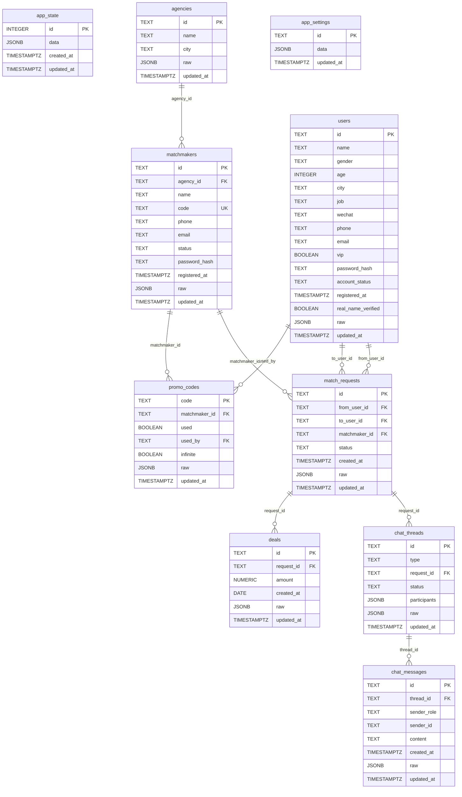

2026-06-27 | Codex 修订

# MatchMaker — 数据库设计

## 2026-06-27 当前修订摘要

本文件已按当前业务数据修订：用户支持 servicePlans、matchmakerIds、profileByMatchmaker；牵线请求包含男方/女方联系状态和 memberChatEnabled；聊天线程包含 member_matchmaker 与 member_member。

如本文下方旧段落与本摘要或 `说明/10-操作手册.md` 冲突，以 `说明/10-操作手册.md` 和当前线上实测流程为准。


## 概述

数据库使用 **PostgreSQL 16**（Alpine 镜像），通过 Docker 容器运行，数据持久化到宿主机 `/opt/matchmaker/data/postgres`。

连接方式：容器内通过环境变量 `PGHOST`/`PGPORT`/`PGDATABASE`/`PGUSER`/`PGPASSWORD` 配置，宿主机绑定 `127.0.0.1:5432`（仅本机可访问）。

## 数据表总览

| 表名 | 用途 | 主键 |
|------|------|------|
| `app_state` | 完整 JSON 状态兼容层 | `id` (integer) |
| `agencies` | 机构/婚介公司 | `id` (text) |
| `matchmakers` | 红娘账号 | `id` (text) |
| `users` | 客户账号 | `id` (text) |
| `match_requests` | 牵线请求 | `id` (text) |
| `chat_threads` | 聊天会话 | `id` (text) |
| `chat_messages` | 聊天消息 | `id` (text) |
| `deals` | 成交/订单记录 | `id` (text) |
| `promo_codes` | VIP 兑换码 | `code` (text) |
| `app_settings` | 运行时设置 | `id` (text) |
| `blocks` | 拉黑记录 | `id` (text) |
| `reports` | 举报记录 | `id` (text) |

## 表结构详情

### agencies — 机构

```sql
CREATE TABLE agencies (
    id          TEXT PRIMARY KEY,
    name        TEXT NOT NULL,
    city        TEXT,
    raw         JSONB NOT NULL,
    updated_at  TIMESTAMPTZ DEFAULT NOW()
);
```

**字段说明**：

- `id`：主键，格式为 `a` + 时间戳 base36 + 随机 hex，如 `a1m2n3o4ab`
- `name`：机构名称，如"优联婚恋"
- `city`：所在城市，如"上海"
- `raw`：完整的 JSON 副本，用于兼容整包读写模式
- `updated_at`：最后更新时间，每次 UPSERT 时自动更新

**业务约束**：
- 机构名称无唯一性约束（可重名）
- 删除机构时，关联红娘的 `agency_id` 置为 NULL（ON DELETE SET NULL）

### matchmakers — 红娘

```sql
CREATE TABLE matchmakers (
    id              TEXT PRIMARY KEY,
    agency_id       TEXT REFERENCES agencies(id) ON DELETE SET NULL,
    name            TEXT NOT NULL,
    code            TEXT NOT NULL UNIQUE,
    phone           TEXT,
    email           TEXT,
    status          TEXT,
    password_hash   TEXT,
    registered_at   TIMESTAMPTZ,
    raw             JSONB NOT NULL,
    updated_at      TIMESTAMPTZ DEFAULT NOW()
);
```

**字段说明**：

- `id`：主键，格式为 `m` + 时间戳 base36 + 随机 hex
- `agency_id`：所属机构 ID，外键关联 agencies 表
- `name`：红娘姓名
- `code`：唯一推荐码，用于客户绑定，如 `HM-LILI`，大写存储
- `phone`：手机号，注册时必填，不可重复
- `email`：邮箱，可选
- `status`：状态，如 `active`
- `password_hash`：scrypt 哈希后的密码，格式为 `scrypt$盐$哈希值`
- `registered_at`：注册时间
- `raw`：完整 JSON 副本

**业务约束**：
- `code` 有唯一性约束（UNIQUE），不允许重复推荐码
- `phone` 无数据库级唯一约束，但业务层检查重复
- 删除红娘时，关联牵线请求的 `matchmaker_id` 置为 NULL

### users — 客户

```sql
CREATE TABLE users (
    id                      TEXT PRIMARY KEY,
    name                    TEXT NOT NULL,
    gender                  TEXT,
    age                     INTEGER,
    city                    TEXT,
    job                     TEXT,
    wechat                  TEXT,
    phone                   TEXT,
    email                   TEXT,
    vip                     BOOLEAN NOT NULL DEFAULT FALSE,
    password_hash           TEXT,
    account_status          TEXT,
    registered_at           TIMESTAMPTZ,
    real_name_verified      BOOLEAN NOT NULL DEFAULT FALSE,
    raw                     JSONB NOT NULL,
    updated_at              TIMESTAMPTZ DEFAULT NOW()
);
```

**字段说明**：

- `id`：主键，格式为 `u` + 时间戳 base36 + 随机 hex
- `name`：客户姓名
- `gender`：性别，`男` 或 `女`
- `age`：年龄，18-70
- `city`：所在城市
- `job`：职业
- `wechat`：微信号
- `phone`：手机号，注册时与 email 二选一
- `email`：邮箱，注册时与 phone 二选一
- `vip`：是否 VIP 会员
- `password_hash`：scrypt 哈希后的密码
- `account_status`：账号状态，如 `active`
- `registered_at`：注册时间
- `real_name_verified`：是否已实名认证
- `raw`：完整 JSON 副本，包含额外字段：
  - `servicePlans`：服务包列表，每个服务包通过 `matchmakerId` 绑定红娘
  - `matchmakerIds`：会员绑定的红娘列表
  - `profileByMatchmaker`：按红娘分的资料审核状态
  - `vipExpiresAt`：VIP 到期日期
  - `realName`：真实姓名（仅实名后）
  - `idCard`：身份证号（仅实名后，不返回前端）
  - `idCardMasked`：脱敏身份证号（前6后4，中间8位用*）
  - `age`：从身份证解析出的实际年龄
  - `education`：学历认证信息（school/degree/major/graduationYear/verified/verifiedAt）
  - `videoVerified`：是否通过视频认证
  - `videoVerifiedAt`：视频认证通过时间

**业务约束**：
- `phone` 和 `email` 至少填一个
- `phone` 无数据库级唯一约束，但业务层检查重复
- `email` 无数据库级唯一约束，但业务层检查重复
- 删除客户时，关联牵线请求级联删除（ON DELETE CASCADE）
- 删除客户时，关联兑换码的 `used_by` 置为 NULL

### match_requests — 牵线请求

```sql
CREATE TABLE match_requests (
    id              TEXT PRIMARY KEY,
    from_user_id    TEXT REFERENCES users(id) ON DELETE CASCADE,
    to_user_id      TEXT REFERENCES users(id) ON DELETE CASCADE,
    matchmaker_id   TEXT REFERENCES matchmakers(id) ON DELETE SET NULL,
    status          TEXT NOT NULL,
    created_at      TIMESTAMPTZ,
    raw             JSONB NOT NULL,
    updated_at      TIMESTAMPTZ DEFAULT NOW()
);
```

**字段说明**：

- `id`：主键，格式为 `r` + 时间戳 base36 + 随机 hex
- `from_user_id`：发起方客户 ID
- `to_user_id`：目标方客户 ID
- `matchmaker_id`：负责红娘 ID
- `status`：状态，由 maleContacted/femaleContacted 计算得出
- `created_at`：创建时间
- `raw`：完整 JSON 副本，包含额外字段：
  - `maleContacted`：是否已联系男方
  - `femaleContacted`：是否已联系女方
  - `memberChatEnabled`：是否已开启会员互聊

**状态流转**：

```
待红娘联系
  ├─ 联系男方 → 联系女方 → 来和双方对话
  └─ 联系女方 → 联系男方 → 来和双方对话
```

状态由 `getRequestContactStatus()` 函数计算：
- `maleContacted && femaleContacted` → "来和双方对话"
- `maleContacted` → "联系男方"
- `femaleContacted` → "联系女方"
- 否则 → "待红娘联系"

**业务约束**：
- 同一对客户不允许重复申请（业务层检查）
- 发起方必须是 VIP
- 发起方必须存在该红娘的有效 `servicePlans[].matchmakerId`
- 目标方必须在红娘的 `matchmakerIds` 中

### chat_threads — 聊天会话

```sql
CREATE TABLE chat_threads (
    id              TEXT PRIMARY KEY,
    type            TEXT NOT NULL,
    request_id      TEXT REFERENCES match_requests(id) ON DELETE CASCADE,
    status          TEXT NOT NULL DEFAULT 'active',
    participants    JSONB NOT NULL,
    raw             JSONB NOT NULL,
    updated_at      TIMESTAMPTZ DEFAULT NOW()
);
```

**字段说明**：

- `id`：主键，格式为 `ct` + 时间戳 base36 + 随机 hex，或 `ct_gen_` + 请求 ID + 后缀
- `type`：会话类型
  - `member_matchmaker`：红娘与会员一对一
  - `member_member`：会员间互聊
- `request_id`：关联的牵线请求 ID
- `status`：会话状态，`active` 或其他
- `participants`：参与者数组，格式为 `[{role: "client", id: "u1"}, {role: "matchmaker", id: "m1"}]`
- `raw`：完整 JSON 副本，包含额外字段：
  - `createdAt`：创建时间
  - `lastMessageAt`：最后消息时间
  - `lastMessagePreview`：最后消息预览（前 80 字符）

**自动创建规则**：

每个牵线请求会自动创建聊天线程：
1. 红娘-男方聊天线程（`member_matchmaker` 类型）
2. 红娘-女方聊天线程（`member_matchmaker` 类型）
3. 会员互聊天线程（`member_member` 类型，需红娘批准后创建）

**业务约束**：
- 删除牵线请求时，关联聊天线程级联删除
- 发送消息时检查会话状态必须为 `active`
- `member_member` 类型需要 `memberChatEnabled` 为 true

### chat_messages — 聊天消息

```sql
CREATE TABLE chat_messages (
    id              TEXT PRIMARY KEY,
    thread_id       TEXT REFERENCES chat_threads(id) ON DELETE CASCADE,
    sender_role     TEXT NOT NULL,
    sender_id       TEXT NOT NULL,
    content         TEXT NOT NULL,
    created_at      TIMESTAMPTZ,
    raw             JSONB NOT NULL,
    updated_at      TIMESTAMPTZ DEFAULT NOW()
);
```

**字段说明**：

- `id`：主键，格式为 `cm` + 时间戳 base36 + 随机 hex
- `thread_id`：所属聊天线程 ID
- `sender_role`：发送者角色，`client` / `matchmaker` / `admin`
- `sender_id`：发送者 ID
- `content`：消息内容
- `created_at`：发送时间
- `raw`：完整 JSON 副本

**业务约束**：
- 删除聊天线程时，关联消息级联删除
- 发送者必须是会话参与者（admin 除外）
- 消息内容不能为空

### deals — 成交记录

```sql
CREATE TABLE deals (
    id              TEXT PRIMARY KEY,
    request_id      TEXT REFERENCES match_requests(id) ON DELETE SET NULL,
    amount          NUMERIC(12,2) NOT NULL DEFAULT 0,
    created_at      DATE,
    raw             JSONB NOT NULL,
    updated_at      TIMESTAMPTZ DEFAULT NOW()
);
```

**字段说明**：

- `id`：主键，格式为 `d` + 时间戳 base36 + 随机 hex
- `request_id`：关联的牵线请求 ID（可为 NULL，如 VIP 开通）
- `amount`：金额，当前固定 ¥399
- `created_at`：成交日期
- `raw`：完整 JSON 副本

**业务场景**：
- VIP 开通时自动创建一笔成交记录
- 管理员可手动模拟成交

### promo_codes — 兑换码

```sql
CREATE TABLE promo_codes (
    code            TEXT PRIMARY KEY,
    matchmaker_id   TEXT REFERENCES matchmakers(id) ON DELETE SET NULL,
    used            BOOLEAN NOT NULL DEFAULT FALSE,
    used_by         TEXT REFERENCES users(id) ON DELETE SET NULL,
    infinite        BOOLEAN NOT NULL DEFAULT FALSE,
    raw             JSONB NOT NULL,
    updated_at      TIMESTAMPTZ DEFAULT NOW()
);
```

**字段说明**：

- `code`：兑换码，主键，大写存储
- `matchmaker_id`：关联红娘 ID（使用兑换码时绑定该红娘）
- `used`：是否已使用
- `used_by`：使用者客户 ID
- `infinite`：是否可重复使用（测试用，如兑换码 `1`）
- `raw`：完整 JSON 副本

**业务约束**：
- 兑换码有唯一性约束（主键）
- 非无限次兑换码使用后标记为 `used = true`
- 无限次兑换码（`infinite = true`）可重复使用

### app_settings — 运行时设置

```sql
CREATE TABLE app_settings (
    id          TEXT PRIMARY KEY,
    data        JSONB NOT NULL,
    updated_at  TIMESTAMPTZ DEFAULT NOW()
);
```

**字段说明**：

- `id`：固定值 `runtime`
- `data`：运行时配置，包含：
  - `currentUserId`：当前默认客户 ID
  - `selectedMatchmakerId`：当前默认红娘 ID
  - `adminLoggedIn`：管理员登录状态
  - `splits`：分成比例 `{promo: 20, matchmaker: 35, platform: 45}`

### blocks — 拉黑记录

```sql
CREATE TABLE blocks (
    id           TEXT PRIMARY KEY,
    blocker_id   TEXT NOT NULL,
    blocked_id   TEXT NOT NULL,
    reason       TEXT,
    created_at   TIMESTAMPTZ NOT NULL DEFAULT NOW(),
    raw          JSONB NOT NULL,
    UNIQUE(blocker_id, blocked_id)
);
```

**字段说明**：

- `id`：主键，格式为 `blk` + 时间戳 + 随机 hex
- `blocker_id`：拉黑发起者用户 ID
- `blocked_id`：被拉黑用户 ID
- `reason`：拉黑原因（可选）
- `created_at`：拉黑时间
- `raw`：完整 JSON 副本

**业务约束**：
- `(blocker_id, blocked_id)` 联合唯一，同一用户不能重复拉黑同一人
- 双向拉黑时双方都不能给对方发消息
- 取消拉黑时删除对应记录

### reports — 举报记录

```sql
CREATE TABLE reports (
    id           TEXT PRIMARY KEY,
    reporter_id  TEXT NOT NULL,
    reported_id  TEXT NOT NULL,
    reason       TEXT NOT NULL,
    detail       TEXT,
    status       TEXT NOT NULL DEFAULT 'pending',
    created_at   TIMESTAMPTZ NOT NULL DEFAULT NOW(),
    raw          JSONB NOT NULL
);
```

**字段说明**：

- `id`：主键，格式为 `rpt` + 时间戳 + 随机 hex
- `reporter_id`：举报者用户 ID
- `reported_id`：被举报用户 ID
- `reason`：举报类型，枚举：`fraud`（诈骗）、`harassment`（骚扰）、`fake_profile`（虚假资料）、`spam`（垃圾信息）、`inappropriate_content`（不当内容）、`other`（其他）
- `detail`：举报详情描述（可选）
- `status`：处理状态，`pending`（待处理）、`processing`（处理中）、`resolved`（已处理）、`dismissed`（已驳回）
- `created_at`：举报时间
- `raw`：完整 JSON 副本，包含 `handledAt`（处理时间）等扩展字段

### app_state — 兼容层

```sql
CREATE TABLE app_state (
    id          INTEGER PRIMARY KEY,
    data        JSONB NOT NULL,
    created_at  TIMESTAMPTZ DEFAULT NOW(),
    updated_at  TIMESTAMPTZ DEFAULT NOW()
);
```

当前仍保留此表作为兼容层，`syncNormalizedState()` 会同时写入业务表和此表。

---

## 外键关系图

```
agencies ←── matchmakers.agency_id
users ──→ match_requests.from_user_id / to_user_id
matchmakers ←── match_requests.matchmaker_id
match_requests ←── chat_threads.request_id
chat_threads ←── chat_messages.thread_id
match_requests ←── deals.request_id
matchmakers ←── promo_codes.matchmaker_id
users ←── promo_codes.used_by
```

**级联删除规则**：

- 删除客户 → 关联牵线请求级联删除 → 关联聊天线程级联删除 → 关联消息级联删除
- 删除牵线请求 → 关联聊天线程级联删除 → 关联消息级联删除
- 删除聊天线程 → 关联消息级联删除
- 删除机构 → 关联红娘的 `agency_id` 置为 NULL
- 删除红娘 → 关联牵线请求的 `matchmaker_id` 置为 NULL
- 删除红娘 → 关联兑换码的 `matchmaker_id` 置为 NULL

---

## 数据同步机制

### 全量同步（syncNormalizedState）

`PUT /api/state` 调用 `syncNormalizedState()`，流程：

1. 开启事务
2. 对每张业务表执行 **UPSERT**（INSERT ... ON CONFLICT DO UPDATE）
3. 删除业务表中不在新数据里的行（反向依赖顺序）
4. 提交事务

**UPSERT 示例**（users 表）：

```sql
INSERT INTO users (id, name, gender, age, city, job, wechat, phone, email, vip,
                   password_hash, account_status, registered_at,
                   real_name_verified, raw)
VALUES ($1, $2, $3, $4, $5, $6, $7, $8, $9, $10, $11, $12, $13, $14, $15::jsonb)
ON CONFLICT (id) DO UPDATE SET
    name = EXCLUDED.name,
    gender = EXCLUDED.gender,
    age = EXCLUDED.age,
    city = EXCLUDED.city,
    job = EXCLUDED.job,
    wechat = EXCLUDED.wechat,
    phone = EXCLUDED.phone,
    email = EXCLUDED.email,
    vip = EXCLUDED.vip,
    password_hash = EXCLUDED.password_hash,
    account_status = EXCLUDED.account_status,
    registered_at = EXCLUDED.registered_at,
    real_name_verified = EXCLUDED.real_name_verified,
    raw = EXCLUDED.raw,
    updated_at = NOW()
```

**DELETE 示例**（users 表）：

```sql
DELETE FROM users WHERE id NOT IN (SELECT unnest($1::text[]))
```

**已知问题**：
- 数据量大后事务锁时间长
- DELETE 操作在外键约束下可能级联删除
- 高并发下数据不一致风险
- 是下一阶段重构重点

### 初始化种子数据

数据库为空时自动插入 `seedState`：

- 10 个演示用户（5 男 5 女）
- 2 个红娘（李莉、娜娜）
- 2 个机构（优联婚恋、星河红娘社）
- 4 个兑换码（VIP666、MEDIA888、LOVE999、1）
- 1 笔成交记录

---

## 数据完整性保障

### 应用层校验

由于大部分字段没有数据库级约束，数据完整性主要靠应用层保障：

**注册校验**：
- 客户：手机号或邮箱至少填一个，且不可重复
- 红娘：手机号必填且不可重复，推荐码必填且不可重复

**牵线请求校验**：
- 发起方必须是 VIP
- 发起方必须存在该红娘的有效 `servicePlans[].matchmakerId`
- 目标方必须在红娘的 `matchmakerIds` 中
- 同一对客户不允许重复申请

**聊天消息校验**：
- 发送者必须是会话参与者
- 会话状态必须为 `active`
- `member_member` 类型需要 `memberChatEnabled` 为 true

**分成比例校验**：
- 三者之和必须为 100

### 数据脱敏

`GET /api/state` 返回前调用 `publicState()` 脱敏：
- 移除 `passwordHash`（密码哈希）
- 移除 `idCard`（身份证号）

---

## 备份与恢复

### 创建备份

```bash
cd /opt/matchmaker
mkdir -p backup/postgres
docker exec matchmaker-postgres pg_dump -U matchmaker -d matchmaker \
  -Fc -f /backup/backup-$(date +%F_%H%M%S).dump
```

- `-Fc`：自定义格式，压缩存储
- 备份文件保存在 `/opt/matchmaker/backup/postgres/`

### 恢复备份

```bash
cd /opt/matchmaker
docker exec matchmaker-postgres pg_restore --clean --if-exists \
  -U matchmaker -d matchmaker /backup/文件名.dump
docker compose restart api
```

- `--clean`：恢复前清理已有对象
- `--if-exists`：清理时忽略不存在的对象
- 恢复后需要重启 API 容器

### 检查数据量

```bash
curl -sS http://uk.sbbz.tech:8098/api/state | \
  node -e "let d='';process.stdin.on('data',c=>d+=c).on('end',()=>{
    const s=JSON.parse(d);
    console.log({
      users:s.users.length,
      matchmakers:s.matchmakers.length,
      agencies:s.agencies.length,
      requests:s.requests.length,
      deals:s.deals.length,
      promoCodes:s.promoCodes.length
    })
  })"
```

### 直接查询数据库

```bash
ssh -i ~/.ssh/matchmaker_uk_ed25519 root@uk.sbbz.tech
docker exec -it matchmaker-postgres psql -U matchmaker -d matchmaker

# 常用查询
SELECT count(*) FROM users;
SELECT count(*) FROM match_requests;
SELECT count(*) FROM chat_messages;
SELECT code, used, used_by FROM promo_codes;
SELECT id, name, vip, real_name_verified FROM users;
```

---

## Mermaid ER图



---

## 索引设计

### 主键索引（自动创建）

| 表名 | 主键字段 | 索引类型 | 说明 |
|------|----------|----------|------|
| `app_state` | `id` | B-Tree | 整数主键，自动创建 |
| `agencies` | `id` | B-Tree | 文本主键，自动创建 |
| `matchmakers` | `id` | B-Tree | 文本主键，自动创建 |
| `users` | `id` | B-Tree | 文本主键，自动创建 |
| `match_requests` | `id` | B-Tree | 文本主键，自动创建 |
| `chat_threads` | `id` | B-Tree | 文本主键，自动创建 |
| `chat_messages` | `id` | B-Tree | 文本主键，自动创建 |
| `deals` | `id` | B-Tree | 文本主键，自动创建 |
| `promo_codes` | `code` | B-Tree | 文本主键，自动创建 |
| `app_settings` | `id` | B-Tree | 文本主键，自动创建 |

### 唯一索引

| 表名 | 字段 | 索引类型 | 说明 |
|------|------|----------|------|
| `matchmakers` | `code` | B-Tree | 推荐码唯一约束，自动创建 |

### 外键索引建议（需手动创建）

PostgreSQL 不会自动为外键创建索引，建议为以下外键字段创建索引以提升 JOIN 和 DELETE 性能：

```sql
-- matchmakers 表外键索引
CREATE INDEX idx_matchmakers_agency_id ON matchmakers(agency_id);

-- users 表外键索引

-- match_requests 表外键索引
CREATE INDEX idx_match_requests_from_user_id ON match_requests(from_user_id);
CREATE INDEX idx_match_requests_to_user_id ON match_requests(to_user_id);
CREATE INDEX idx_match_requests_matchmaker_id ON match_requests(matchmaker_id);

-- chat_threads 表外键索引
CREATE INDEX idx_chat_threads_request_id ON chat_threads(request_id);

-- chat_messages 表外键索引
CREATE INDEX idx_chat_messages_thread_id ON chat_messages(thread_id);

-- deals 表外键索引
CREATE INDEX idx_deals_request_id ON deals(request_id);

-- promo_codes 表外键索引
CREATE INDEX idx_promo_codes_matchmaker_id ON promo_codes(matchmaker_id);
CREATE INDEX idx_promo_codes_used_by ON promo_codes(used_by);
```

### 常用查询索引优化建议

#### 1. 业务查询索引

```sql
-- users 表：按 VIP 状态筛选
CREATE INDEX idx_users_vip ON users(vip);

-- users 表：按城市筛选
CREATE INDEX idx_users_city ON users(city);

-- users 表：按性别筛选
CREATE INDEX idx_users_gender ON users(gender);

-- users 表：按账号状态筛选
CREATE INDEX idx_users_account_status ON users(account_status);

-- match_requests 表：按状态筛选
CREATE INDEX idx_match_requests_status ON match_requests(status);

-- match_requests 表：按创建时间排序
CREATE INDEX idx_match_requests_created_at ON match_requests(created_at DESC);

-- chat_messages 表：按创建时间排序（聊天列表分页）
CREATE INDEX idx_chat_messages_created_at ON chat_messages(created_at DESC);

-- chat_threads 表：按更新时间排序（会话列表）
CREATE INDEX idx_chat_threads_updated_at ON chat_threads(updated_at DESC);

-- deals 表：按创建日期排序
CREATE INDEX idx_deals_created_at ON deals(created_at DESC);

-- promo_codes 表：按使用状态筛选
CREATE INDEX idx_promo_codes_used ON promo_codes(used);
```

#### 2. 复合索引建议

```sql
-- match_requests：红娘 + 状态（红娘查看自己的牵线请求）
CREATE INDEX idx_match_requests_matchmaker_status ON match_requests(matchmaker_id, status);

-- match_requests：用户 + 状态（用户查看自己的牵线请求）
CREATE INDEX idx_match_requests_from_user_status ON match_requests(from_user_id, status);

-- chat_messages：线程 + 时间（消息分页查询）
CREATE INDEX idx_chat_messages_thread_created ON chat_messages(thread_id, created_at DESC);

-- users：城市 + 性别 + VIP（推荐匹配查询）
CREATE INDEX idx_users_city_gender_vip ON users(city, gender, vip);

-- deals：创建日期 + 金额（财务统计）
CREATE INDEX idx_deals_date_amount ON deals(created_at DESC, amount);
```

#### 3. JSONB 字段 GIN 索引

```sql
-- agencies.raw：用于 JSON 字段内查询
CREATE INDEX idx_agencies_raw_gin ON agencies USING GIN (raw);

-- matchmakers.raw：用于 JSON 字段内查询
CREATE INDEX idx_matchmakers_raw_gin ON matchmakers USING GIN (raw);

-- users.raw：用于 servicePlans、matchmakerIds 等数组查询
CREATE INDEX idx_users_raw_gin ON users USING GIN (raw);

-- match_requests.raw：用于 maleContacted、femaleContacted 等查询
CREATE INDEX idx_match_requests_raw_gin ON match_requests USING GIN (raw);

-- chat_threads.raw：用于 JSON 字段内查询
CREATE INDEX idx_chat_threads_raw_gin ON chat_threads USING GIN (raw);

-- chat_threads.participants：参与者数组查询
CREATE INDEX idx_chat_threads_participants_gin ON chat_threads USING GIN (participants);

-- chat_messages.raw：用于 JSON 字段内查询
CREATE INDEX idx_chat_messages_raw_gin ON chat_messages USING GIN (raw);

-- deals.raw：用于 JSON 字段内查询
CREATE INDEX idx_deals_raw_gin ON deals USING GIN (raw);

-- promo_codes.raw：用于 JSON 字段内查询
CREATE INDEX idx_promo_codes_raw_gin ON promo_codes USING GIN (raw);

-- app_settings.data：用于配置查询
CREATE INDEX idx_app_settings_data_gin ON app_settings USING GIN (data);

-- app_state.data：用于状态查询
CREATE INDEX idx_app_state_data_gin ON app_state USING GIN (data);
```

#### 4. 部分索引（Partial Index）建议

```sql
-- 仅索引活跃用户（减少索引大小）
CREATE INDEX idx_users_active ON users(id) WHERE account_status = 'active';

-- 仅索引 VIP 用户
CREATE INDEX idx_users_vip_only ON users(id) WHERE vip = true;

-- 仅索引未使用的兑换码
CREATE INDEX idx_promo_codes_unused ON promo_codes(code) WHERE used = false;

-- 仅索引活跃会话
CREATE INDEX idx_chat_threads_active ON chat_threads(id) WHERE status = 'active';
```

---

## 查询模式分析

### 高频查询场景

| 场景编号 | 查询场景 | 涉及表 | 查询频率 | 性能预估 | 优化建议 |
|----------|----------|--------|----------|----------|----------|
| Q1 | 获取全量状态（GET /api/state） | 所有表 | 高（页面刷新） | 慢（全表扫描+序列化） | 增加缓存，改为增量同步 |
| Q2 | 用户登录查询（手机号/邮箱） | `users` | 中 | 中（无索引时全表扫描） | 为 phone/email 创建索引 |
| Q3 | 红娘登录查询（推荐码） | `matchmakers` | 中 | 快（唯一索引） | 已有 UNIQUE 索引 |
| Q4 | 获取红娘的客户列表 | `users.raw` | 高 | 中（按 `matchmakerIds` 过滤） | GIN 索引已建议 |
| Q5 | 获取用户的牵线请求列表 | `match_requests` | 高 | 中 | 复合索引 (from_user_id, status) |
| Q6 | 获取红娘的牵线请求列表 | `match_requests` | 高 | 中 | 复合索引 (matchmaker_id, status) |
| Q7 | 获取聊天线程列表 | `chat_threads` | 高 | 中 | 外键索引 + updated_at 排序索引 |
| Q8 | 获取聊天消息列表（分页） | `chat_messages` | 极高 | 快 | 复合索引 (thread_id, created_at DESC) |
| Q9 | 发送聊天消息 | `chat_messages` | 高 | 快（单条 INSERT） | 确保 thread_id 有索引 |
| Q10 | 兑换码验证 | `promo_codes` | 中 | 快（主键查询） | 主键索引已存在 |

### 中低频查询场景

| 场景编号 | 查询场景 | 涉及表 | 查询频率 | 性能预估 | 优化建议 |
|----------|----------|--------|----------|----------|----------|
| Q11 | 推荐匹配（按城市、性别、年龄） | `users` | 中 | 中 | 复合索引 (city, gender, vip) |
| Q12 | 成交记录统计（按月） | `deals` | 低 | 中 | created_at 索引 |
| Q13 | 机构下的红娘列表 | `matchmakers` | 低 | 中 | agency_id 索引 |
| Q14 | 搜索用户（按姓名/手机号） | `users` | 低 | 慢（无索引模糊查询） | 可考虑 pg_trgm 扩展 |
| Q15 | JSON 字段内查询（如 servicePlans） | `users` | 中 | 中 | GIN 索引 raw 字段 |
| Q16 | 检查重复牵线请求 | `match_requests` | 中 | 中 | 复合索引 (from_user_id, to_user_id) |

### 写入操作分析

| 操作 | 涉及表 | 频率 | 性能预估 | 注意事项 |
|------|--------|------|----------|----------|
| 全量同步（PUT /api/state） | 所有表 | 中 | 慢（大事务） | 锁时间长，并发风险高 |
| 用户注册 | `users` | 中 | 快 | 检查 phone/email 唯一性 |
| 红娘注册 | `matchmakers` | 低 | 快 | 检查 code 唯一性 |
| 创建牵线请求 | `match_requests` | 中 | 快 | 同时创建聊天线程 |
| 发送消息 | `chat_messages` | 高 | 快 | 更新线程 updated_at |
| 创建成交记录 | `deals` | 低 | 快 | 财务数据需事务保证 |
| 使用兑换码 | `promo_codes` | 低 | 快 | 原子更新 used 状态 |

### 性能瓶颈预估

1. **全量状态同步（Q1）**：当前架构最大瓶颈，数据量大后响应慢且锁表
2. **聊天消息分页（Q8）**：高频查询，依赖正确的复合索引
3. **JSONB 字段查询**：无 GIN 索引时全表扫描，性能差
4. **大事务全量写入**：`syncNormalizedState()` 单事务处理所有表，并发能力差

---

## 完整数据字典

### agencies — 机构表

| 字段名 | 类型 | 约束 | 默认值 | 说明 | 示例 |
|--------|------|------|--------|------|------|
| `id` | TEXT | PRIMARY KEY | - | 机构主键ID，格式 `a` + 时间戳base36 + 随机hex | `a1m2n3o4ab` |
| `name` | TEXT | NOT NULL | - | 机构名称 | `优联婚恋` |
| `city` | TEXT | - | NULL | 所在城市 | `上海` |
| `raw` | JSONB | NOT NULL | - | 完整JSON副本，兼容整包读写模式 | `{"id":"a1...","name":"优联..."}` |
| `updated_at` | TIMESTAMPTZ | - | `NOW()` | 最后更新时间，UPSERT时自动更新 | `2026-06-25 10:30:00+08` |

### matchmakers — 红娘表

| 字段名 | 类型 | 约束 | 默认值 | 说明 | 示例 |
|--------|------|------|--------|------|------|
| `id` | TEXT | PRIMARY KEY | - | 红娘主键ID，格式 `m` + 时间戳base36 + 随机hex | `m1m2n3o4cd` |
| `agency_id` | TEXT | REFERENCES agencies(id) ON DELETE SET NULL | NULL | 所属机构ID | `a1m2n3o4ab` |
| `name` | TEXT | NOT NULL | - | 红娘姓名 | `李莉` |
| `code` | TEXT | NOT NULL UNIQUE | - | 唯一推荐码，大写存储 | `HM-LILI` |
| `phone` | TEXT | - | NULL | 手机号（业务层唯一） | `13800138000` |
| `email` | TEXT | - | NULL | 邮箱地址 | `lili@example.com` |
| `status` | TEXT | - | NULL | 账号状态 | `active` |
| `password_hash` | TEXT | - | NULL | scrypt哈希密码，格式 `scrypt$盐$哈希值` | `scrypt$abc123$def456...` |
| `registered_at` | TIMESTAMPTZ | - | NULL | 注册时间 | `2026-01-15 09:00:00+08` |
| `raw` | JSONB | NOT NULL | - | 完整JSON副本 | `{"id":"m1...","name":"李莉",...}` |
| `updated_at` | TIMESTAMPTZ | - | `NOW()` | 最后更新时间 | `2026-06-25 10:30:00+08` |

### users — 客户表

| 字段名 | 类型 | 约束 | 默认值 | 说明 | 示例 |
|--------|------|------|--------|------|------|
| `id` | TEXT | PRIMARY KEY | - | 客户主键ID，格式 `u` + 时间戳base36 + 随机hex | `u1m2n3o4ef` |
| `name` | TEXT | NOT NULL | - | 客户姓名 | `张三` |
| `gender` | TEXT | - | NULL | 性别：`男` 或 `女` | `男` |
| `age` | INTEGER | - | NULL | 年龄，范围18-70 | `28` |
| `city` | TEXT | - | NULL | 所在城市 | `北京` |
| `job` | TEXT | - | NULL | 职业 | `软件工程师` |
| `wechat` | TEXT | - | NULL | 微信号 | `zhangsan_wx` |
| `phone` | TEXT | - | NULL | 手机号（业务层唯一，与email二选一） | `13900139000` |
| `email` | TEXT | - | NULL | 邮箱（业务层唯一，与phone二选一） | `zhangsan@example.com` |
| `vip` | BOOLEAN | NOT NULL | `FALSE` | 是否VIP会员 | `true` |
| `password_hash` | TEXT | - | NULL | scrypt哈希密码 | `scrypt$abc123$def456...` |
| `account_status` | TEXT | - | NULL | 账号状态 | `active` |
| `registered_at` | TIMESTAMPTZ | - | NULL | 注册时间 | `2026-03-20 14:00:00+08` |
| `real_name_verified` | BOOLEAN | NOT NULL | `FALSE` | 是否已实名认证 | `false` |
| `raw` | JSONB | NOT NULL | - | 完整JSON副本，含额外字段 | 见下方说明 |
| `updated_at` | TIMESTAMPTZ | - | `NOW()` | 最后更新时间 | `2026-06-25 10:30:00+08` |

**`raw` 字段额外字段**：
- `servicePlans`: 服务包列表，服务包通过 `matchmakerId` 绑定红娘
- `matchmakerIds`: 会员绑定的红娘ID列表（数组）
- `profileByMatchmaker`: 按红娘分的资料审核状态（对象）
- `vipExpiresAt`: VIP到期日期（ISO字符串）
- `realName`: 真实姓名（仅实名后）
- `idCard`: 身份证号（仅实名后，不返回前端）

### match_requests — 牵线请求表

| 字段名 | 类型 | 约束 | 默认值 | 说明 | 示例 |
|--------|------|------|--------|------|------|
| `id` | TEXT | PRIMARY KEY | - | 请求主键ID，格式 `r` + 时间戳base36 + 随机hex | `r1m2n3o4gh` |
| `from_user_id` | TEXT | REFERENCES users(id) ON DELETE CASCADE | - | 发起方客户ID | `u1m2n3o4ef` |
| `to_user_id` | TEXT | REFERENCES users(id) ON DELETE CASCADE | - | 目标方客户ID | `u2m3n4o5gh` |
| `matchmaker_id` | TEXT | REFERENCES matchmakers(id) ON DELETE SET NULL | NULL | 负责红娘ID | `m1m2n3o4cd` |
| `status` | TEXT | NOT NULL | - | 请求状态 | `待红娘联系` |
| `created_at` | TIMESTAMPTZ | - | NULL | 创建时间 | `2026-06-20 10:00:00+08` |
| `raw` | JSONB | NOT NULL | - | 完整JSON副本，含额外字段 | 见下方说明 |
| `updated_at` | TIMESTAMPTZ | - | `NOW()` | 最后更新时间 | `2026-06-25 10:30:00+08` |

**`raw` 字段额外字段**：
- `maleContacted`: 是否已联系男方（boolean）
- `femaleContacted`: 是否已联系女方（boolean）
- `memberChatEnabled`: 是否已开启会员互聊（boolean）

### chat_threads — 聊天会话表

| 字段名 | 类型 | 约束 | 默认值 | 说明 | 示例 |
|--------|------|------|--------|------|------|
| `id` | TEXT | PRIMARY KEY | - | 会话主键ID，格式 `ct` + 时间戳base36 + 随机hex 或 `ct_gen_` + 请求ID + 后缀 | `ct1m2n3o4ij` |
| `type` | TEXT | NOT NULL | - | 会话类型：`member_matchmaker` 或 `member_member` | `member_matchmaker` |
| `request_id` | TEXT | REFERENCES match_requests(id) ON DELETE CASCADE | NULL | 关联的牵线请求ID | `r1m2n3o4gh` |
| `status` | TEXT | NOT NULL | `'active'` | 会话状态 | `active` |
| `participants` | JSONB | NOT NULL | - | 参与者数组 | `[{"role":"client","id":"u1..."},{"role":"matchmaker","id":"m1..."}]` |
| `raw` | JSONB | NOT NULL | - | 完整JSON副本，含额外字段 | 见下方说明 |
| `updated_at` | TIMESTAMPTZ | - | `NOW()` | 最后更新时间 | `2026-06-25 10:30:00+08` |

**`raw` 字段额外字段**：
- `createdAt`: 创建时间（ISO字符串）
- `lastMessageAt`: 最后消息时间（ISO字符串）
- `lastMessagePreview`: 最后消息预览，前80字符

### chat_messages — 聊天消息表

| 字段名 | 类型 | 约束 | 默认值 | 说明 | 示例 |
|--------|------|------|--------|------|------|
| `id` | TEXT | PRIMARY KEY | - | 消息主键ID，格式 `cm` + 时间戳base36 + 随机hex | `cm1m2n3o4kl` |
| `thread_id` | TEXT | REFERENCES chat_threads(id) ON DELETE CASCADE | - | 所属聊天线程ID | `ct1m2n3o4ij` |
| `sender_role` | TEXT | NOT NULL | - | 发送者角色：`client` / `matchmaker` / `admin` | `client` |
| `sender_id` | TEXT | NOT NULL | - | 发送者ID | `u1m2n3o4ef` |
| `content` | TEXT | NOT NULL | - | 消息内容 | `你好，很高兴认识你` |
| `created_at` | TIMESTAMPTZ | - | NULL | 发送时间 | `2026-06-25 10:30:00+08` |
| `raw` | JSONB | NOT NULL | - | 完整JSON副本 | `{"id":"cm1...","content":"..."}` |
| `updated_at` | TIMESTAMPTZ | - | `NOW()` | 最后更新时间 | `2026-06-25 10:30:00+08` |

### deals — 成交记录表

| 字段名 | 类型 | 约束 | 默认值 | 说明 | 示例 |
|--------|------|------|--------|------|------|
| `id` | TEXT | PRIMARY KEY | - | 成交记录主键ID，格式 `d` + 时间戳base36 + 随机hex | `d1m2n3o4mn` |
| `request_id` | TEXT | REFERENCES match_requests(id) ON DELETE SET NULL | NULL | 关联的牵线请求ID（可为NULL，如VIP开通） | `r1m2n3o4gh` |
| `amount` | NUMERIC(12,2) | NOT NULL | `0` | 成交金额，单位元 | `399.00` |
| `created_at` | DATE | - | NULL | 成交日期 | `2026-06-25` |
| `raw` | JSONB | NOT NULL | - | 完整JSON副本 | `{"id":"d1...","amount":399,...}` |
| `updated_at` | TIMESTAMPTZ | - | `NOW()` | 最后更新时间 | `2026-06-25 10:30:00+08` |

### promo_codes — 兑换码表

| 字段名 | 类型 | 约束 | 默认值 | 说明 | 示例 |
|--------|------|------|--------|------|------|
| `code` | TEXT | PRIMARY KEY | - | 兑换码，主键，大写存储 | `VIP666` |
| `matchmaker_id` | TEXT | REFERENCES matchmakers(id) ON DELETE SET NULL | NULL | 关联红娘ID（使用时绑定该红娘） | `m1m2n3o4cd` |
| `used` | BOOLEAN | NOT NULL | `FALSE` | 是否已使用 | `false` |
| `used_by` | TEXT | REFERENCES users(id) ON DELETE SET NULL | NULL | 使用者客户ID | `u1m2n3o4ef` |
| `infinite` | BOOLEAN | NOT NULL | `FALSE` | 是否可重复使用（测试用） | `false` |
| `raw` | JSONB | NOT NULL | - | 完整JSON副本 | `{"code":"VIP666","used":false,...}` |
| `updated_at` | TIMESTAMPTZ | - | `NOW()` | 最后更新时间 | `2026-06-25 10:30:00+08` |

### app_settings — 运行时设置表

| 字段名 | 类型 | 约束 | 默认值 | 说明 | 示例 |
|--------|------|------|--------|------|------|
| `id` | TEXT | PRIMARY KEY | - | 设置ID，固定值 `runtime` | `runtime` |
| `data` | JSONB | NOT NULL | - | 运行时配置数据 | 见下方说明 |
| `updated_at` | TIMESTAMPTZ | - | `NOW()` | 最后更新时间 | `2026-06-25 10:30:00+08` |

**`data` 字段包含**：
- `currentUserId`: 当前默认客户ID
- `selectedMatchmakerId`: 当前默认红娘ID
- `adminLoggedIn`: 管理员登录状态（boolean）
- `splits`: 分成比例对象 `{promo: 20, matchmaker: 35, platform: 45}`

### app_state — 兼容层表

| 字段名 | 类型 | 约束 | 默认值 | 说明 | 示例 |
|--------|------|------|--------|------|------|
| `id` | INTEGER | PRIMARY KEY | - | 整数主键 | `1` |
| `data` | JSONB | NOT NULL | - | 完整应用状态JSON | `{"users":[...],"matchmakers":[...]}` |
| `created_at` | TIMESTAMPTZ | - | `NOW()` | 创建时间 | `2026-01-01 00:00:00+08` |
| `updated_at` | TIMESTAMPTZ | - | `NOW()` | 最后更新时间 | `2026-06-25 10:30:00+08` |

---

## 事务与并发控制

### 当前事务使用场景

#### 1. 全量状态同步（syncNormalizedState）

**场景**：`PUT /api/state` 调用，一次性写入所有业务表数据

**事务范围**：
```
BEGIN
  → UPSERT agencies
  → UPSERT matchmakers
  → UPSERT users
  → UPSERT match_requests
  → UPSERT chat_threads
  → UPSERT chat_messages
  → UPSERT deals
  → UPSERT promo_codes
  → UPSERT app_settings
  → UPSERT app_state
  → DELETE promo_codes （不在新数据中的行）
  → DELETE deals
  → DELETE chat_messages
  → DELETE chat_threads
  → DELETE match_requests
  → DELETE users
  → DELETE matchmakers
  → DELETE agencies
COMMIT
```

**特点**：
- 单一大事务，涉及所有表
- 既有写入也有删除
- 删除按依赖反向顺序执行（子表→父表）

#### 2. 单条记录操作

**场景**：用户注册、发送消息、创建牵线请求等

**事务范围**：单表单条记录 INSERT/UPDATE，通常隐式事务

**特点**：
- 短事务，锁时间短
- 并发性能好

### 隔离级别

**当前配置**：PostgreSQL 默认隔离级别 —— **READ COMMITTED**

**说明**：
- 语句级一致性
- 事务内只能看到已提交的数据
- 不可重复读、幻读可能发生
- 适合大多数业务场景

**建议评估**：
- 全量同步场景下，READ COMMITTED 已足够
- 如遇并发更新丢失问题，可考虑升级到 REPEATABLE READ
- 财务相关操作（deals表）可考虑使用 SERIALIZABLE 或显式加锁

### 锁机制说明

#### 1. 行级锁（Row Lock）

**触发场景**：
- `UPDATE` / `DELETE` 语句自动获取行级排他锁
- `SELECT ... FOR UPDATE` 显式加锁

**当前使用**：
- UPSERT 操作中，冲突行自动加行锁
- DELETE 操作自动加行锁

#### 2. 表级锁（Table Lock）

**触发场景**：
- `ALTER TABLE` / `DROP TABLE` 等 DDL 操作
- 大表全表 DELETE 可能升级为表锁

**风险点**：
- 全量同步中的 DELETE 操作，如果删除行数多，可能导致锁升级
- 外键约束检查可能导致父表单条记录被长时间锁定

#### 3. 死锁风险分析

**潜在死锁场景**：
1. 两个全量同步事务同时执行，按不同顺序更新表
2. 并发操作涉及外键依赖的父子表，加锁顺序不一致

**当前规避措施**：
- UPSERT 和 DELETE 都按固定顺序执行
- DELETE 按子表→父表的反向依赖顺序

**建议**：
- 全量同步操作加应用级分布式锁
- 避免长事务，尽量拆分

### 并发控制建议

1. **全量同步加锁**：
   ```sql
   -- 应用层实现，确保同一时间只有一个全量同步
   -- 可使用 PostgreSQL  Advisory Lock
   SELECT pg_try_advisory_xact_lock(12345);
   ```

2. **乐观并发控制**：
   - 使用 `updated_at` 字段实现乐观锁
   - 更新时检查 `updated_at` 是否匹配

3. **避免长事务**：
   - 全量同步拆分为多个小事务
   - 每张表一个事务，失败时记录进度
   - 减少锁持有时间

4. **连接池管理**：
   - 控制最大连接数，避免连接耗尽
   - 长查询使用独立连接池

---

## 数据迁移策略

### 从整包读写迁移到精细化操作

#### 当前架构问题

1. **全量同步性能差**：数据量大时 PUT /api/state 响应慢
2. **并发风险高**：大事务锁表时间长，容易冲突
3. **网络开销大**：每次都传输全量数据
4. **扩展性差**：无法支持多端实时同步

#### 迁移目标

1. 保留 `app_state` 兼容层，逐步过渡
2. 新增 RESTful API 支持单条记录 CRUD
3. 实现增量同步机制
4. 最终移除整包读写模式

#### 迁移步骤

**阶段一：新增精细化 API（兼容期）**

| 功能 | 新 API | 说明 |
|------|--------|------|
| 用户列表 | `GET /api/users?page=1&pageSize=20` | 分页查询 |
| 用户详情 | `GET /api/users/:id` | 单条查询 |
| 创建用户 | `POST /api/users` | 单条创建 |
| 更新用户 | `PUT /api/users/:id` | 单条更新 |
| 删除用户 | `DELETE /api/users/:id` | 单条删除 |
| 红娘列表 | `GET /api/matchmakers` | 同上模式 |
| 牵线请求列表 | `GET /api/match-requests` | 支持筛选 |
| 发送消息 | `POST /api/chat-threads/:id/messages` | 消息发送 |
| 消息列表 | `GET /api/chat-threads/:id/messages` | 分页消息 |

**阶段二：前端逐步切换**

1. 聊天模块先切换到精细化 API（高频操作）
2. 用户管理模块切换
3. 牵线请求模块切换
4. 最后切换设置等低频模块

**阶段三：移除整包读写**

1. 保留 GET /api/state 作为导出功能
2. 移除 PUT /api/state
3. 移除 app_state 表（或改为仅缓存用途）
4. 移除各表 raw 字段的冗余存储

### 版本化迁移方案

#### 迁移工具选型

**推荐方案**：使用 Node.js 编写迁移脚本，管理数据库 schema 版本

**目录结构**：
```
server/
  migrations/
    001_initial_schema.sql
    002_add_foreign_key_indexes.sql
    003_add_partial_indexes.sql
    004_normalize_raw_fields.sql
    ...
```

#### 版本化迁移流程

1. **创建迁移记录表**：
   ```sql
   CREATE TABLE IF NOT EXISTS schema_migrations (
       version TEXT PRIMARY KEY,
       applied_at TIMESTAMPTZ DEFAULT NOW()
   );
   ```

2. **迁移脚本命名规则**：
   - 前缀：3位数字版本号
   - 描述：简短说明
   - 示例：`001_initial_schema.sql`

3. **执行逻辑**：
   - 启动时检查 schema_migrations 表
   - 按版本号顺序执行未执行的迁移
   - 每个迁移在事务内执行
   - 执行成功后记录版本号

4. **回滚支持**：
   - 每个迁移配对应的 down 脚本
   - 或使用不可逆迁移，谨慎操作

#### 数据迁移步骤（raw 字段拆分）

当需要将 raw JSONB 中的字段提升为正式列时：

**示例：将 users.raw.vipExpiresAt 提升为正式列**

```sql
-- 迁移脚本：005_add_vip_expires_at.sql
BEGIN;

-- 1. 新增列
ALTER TABLE users ADD COLUMN vip_expires_at DATE;

-- 2. 从 raw 字段回填数据
UPDATE users 
SET vip_expires_at = (raw->>'vipExpiresAt')::DATE
WHERE raw ? 'vipExpiresAt';

-- 3. 创建索引
CREATE INDEX idx_users_vip_expires_at ON users(vip_expires_at);

-- 4. 记录迁移版本
INSERT INTO schema_migrations (version) VALUES ('005');

COMMIT;
```

#### 迁移注意事项

1. **向后兼容**：新增列必须有默认值或允许 NULL
2. **数据回填**：大表数据回填分批执行，避免锁表
3. **双写验证**：迁移期间同时读写新旧字段，验证一致性
4. **灰度发布**：先在测试环境验证，再生产环境执行
5. **备份先行**：执行迁移前必须做全量备份

---

## 备份策略详解

### 全量备份

#### 备份脚本

```bash
#!/bin/bash
# /opt/matchmaker/scripts/full-backup.sh

BACKUP_DIR="/opt/matchmaker/backup/postgres"
DATE=$(date +%F_%H%M%S)
BACKUP_FILE="$BACKUP_DIR/full-backup-$DATE.dump"

mkdir -p "$BACKUP_DIR"

docker exec matchmaker-postgres pg_dump \
  -U matchmaker \
  -d matchmaker \
  -Fc \
  -f "/backup/full-backup-$DATE.dump"

# 验证备份文件
docker exec matchmaker-postgres pg_restore -l "/backup/full-backup-$DATE.dump" > /dev/null 2>&1
if [ $? -eq 0 ]; then
  echo "备份成功: $BACKUP_FILE"
  
  # 清理 30 天前的备份
  find "$BACKUP_DIR" -name "full-backup-*.dump" -mtime +30 -delete
  
  # 记录备份大小
  ls -lh "$BACKUP_FILE"
else
  echo "备份失败，文件可能损坏"
  rm -f "$BACKUP_FILE"
  exit 1
fi
```

#### 备份策略

| 备份类型 | 频率 | 保留时间 | 存储位置 |
|----------|------|----------|----------|
| 每日全量 | 每天凌晨 2:00 | 30 天 | 本地磁盘 |
| 每周全量 | 每周日凌晨 3:00 | 90 天 | 本地磁盘 |
| 月度归档 | 每月1号凌晨 4:00 | 永久 | 离线存储 |

#### Cron 配置

```bash
# 编辑 crontab
crontab -e

# 添加以下内容
# 每日全量备份（凌晨2:00）
0 2 * * * /opt/matchmaker/scripts/full-backup.sh >> /opt/matchmaker/backup/postgres/backup.log 2>&1

# 每周全量备份（周日凌晨3:00，保留90天）
0 3 * * 0 /opt/matchmaker/scripts/full-backup.sh weekly >> /opt/matchmaker/backup/postgres/backup.log 2>&1
```

### 增量备份（WAL 归档）

#### 配置 PostgreSQL WAL 归档

```sql
-- 在 postgresql.conf 中配置
wal_level = replica
archive_mode = on
archive_command = 'test ! -f /backup/wal/%f && cp %p /backup/wal/%f'
max_wal_senders = 3
```

#### Docker 配置调整

```yaml
# docker-compose.yml 中添加
services:
  postgres:
    command:
      - -c
      - wal_level=replica
      - -c
      - archive_mode=on
      - -c
      - archive_command=test ! -f /backup/wal/%f && cp %p /backup/wal/%f
    volumes:
      - ./backup/wal:/backup/wal
```

#### 增量备份策略

| 项目 | 配置 | 说明 |
|------|------|------|
| WAL 归档 | 持续归档 | 每完成一个 WAL 文件就归档 |
| 基础备份 | 每周一次 | 作为增量恢复的起点 |
| 保留时间 | 7 天 WAL + 每周基础备份 | 可恢复到过去7天任意时间点 |

#### 基于时间点恢复（PITR）

```bash
# 1. 停止数据库
docker compose stop postgres

# 2. 恢复基础备份
docker exec matchmaker-postgres pg_basebackup ... 

# 3. 配置 recovery.conf
# 在数据目录创建 recovery.signal
# 设置恢复目标时间

# 4. 启动数据库，自动重放 WAL
docker compose start postgres
```

### 恢复演练流程

#### 演练计划

| 演练类型 | 频率 | 责任人 | 验证内容 |
|----------|------|--------|----------|
| 全量恢复测试 | 每月一次 | 开发 | 数据完整性、应用可用性 |
| 表级恢复测试 | 每季度一次 | 开发 | 单表恢复可行性 |
| PITR 恢复测试 | 每半年一次 | 开发 | 时间点恢复准确性 |

#### 全量恢复演练步骤

```bash
#!/bin/bash
# /opt/matchmaker/scripts/restore-test.sh

echo "=== 恢复演练开始 ==="
date

# 1. 准备测试环境
TEST_CONTAINER="matchmaker-postgres-test"
TEST_PORT=5433
BACKUP_FILE=$(ls -t /opt/matchmaker/backup/postgres/full-backup-*.dump | head -1)

echo "使用备份文件: $BACKUP_FILE"

# 2. 启动临时 PostgreSQL 容器
docker run -d --name "$TEST_CONTAINER" \
  -e POSTGRES_USER=matchmaker \
  -e POSTGRES_PASSWORD=matchmaker \
  -e POSTGRES_DB=matchmaker_test \
  -p "$TEST_PORT:5432" \
  -v /opt/matchmaker/backup/postgres:/backup \
  postgres:16-alpine

# 3. 等待数据库就绪
sleep 5

# 4. 执行恢复
docker exec "$TEST_CONTAINER" pg_restore \
  -U matchmaker \
  -d matchmaker_test \
  "/backup/$(basename $BACKUP_FILE)"

if [ $? -eq 0 ]; then
  echo "恢复成功"
  
  # 5. 数据验证
  docker exec "$TEST_CONTAINER" psql -U matchmaker -d matchmaker_test -c "
    SELECT 
      (SELECT count(*) FROM users) as users_count,
      (SELECT count(*) FROM matchmakers) as matchmakers_count,
      (SELECT count(*) FROM match_requests) as requests_count,
      (SELECT count(*) FROM chat_messages) as messages_count,
      (SELECT count(*) FROM deals) as deals_count
  "
else
  echo "恢复失败"
fi

# 6. 清理测试容器
docker rm -f "$TEST_CONTAINER"

echo "=== 恢复演练结束 ==="
```

#### 恢复验证清单

- [ ] 所有表结构正确
- [ ] 数据行数与备份时一致
- [ ] 外键约束完整
- [ ] 索引正常
- [ ] 应用可以正常连接
- [ ] 关键业务功能可用（登录、发消息等）

### 备份安全

1. **加密**：备份文件可使用 gpg 加密存储
2. **异地备份**：定期将备份同步到云存储（如 S3、OSS）
3. **权限控制**：备份目录权限设为 700，仅 root 可读写
4. **审计日志**：记录所有备份和恢复操作

---

## 性能调优建议

### 查询优化

#### 1. 慢查询分析

**开启慢查询日志**：
```sql
-- postgresql.conf
log_min_duration_statement = 1000  -- 记录超过1秒的查询
log_statement = 'all'              -- 生产环境建议设为 'ddl' 或 'none'
```

**分析慢查询**：
```sql
-- 查看当前运行中的慢查询
SELECT pid, now() - query_start as duration, query
FROM pg_stat_activity
WHERE state = 'active' AND now() - query_start > '5 seconds'
ORDER BY duration DESC;
```

#### 2. EXPLAIN ANALYZE 常用场景

**示例：优化牵线请求列表查询**
```sql
EXPLAIN ANALYZE
SELECT * FROM match_requests
WHERE matchmaker_id = 'm1...' AND status = '待红娘联系'
ORDER BY created_at DESC
LIMIT 20 OFFSET 0;
```

**优化手段**：
- 添加复合索引 `(matchmaker_id, status, created_at DESC)`
- 避免大偏移量分页，改用游标分页

#### 3. JSONB 查询优化

**避免全表扫描**：
```sql
-- 慢：没有 GIN 索引时
SELECT * FROM users WHERE raw @> '{"vip": true}';

-- 快：有 GIN 索引时
-- 确保创建了 GIN 索引
CREATE INDEX idx_users_raw_gin ON users USING GIN (raw);
```

**优先使用结构化字段**：
- 高频查询字段从 raw 中提升为正式列
- 利用 B-Tree 索引比 GIN 更快

### 连接池调优

#### 当前连接配置

**PostgreSQL 默认最大连接数**：100

**建议配置**：
```sql
-- postgresql.conf
max_connections = 200          -- 根据实际需求调整
superuser_reserved_connections = 3
```

#### 应用层连接池

**Node.js (pg 库) 连接池配置**：
```javascript
const { Pool } = require('pg');

const pool = new Pool({
  host: process.env.PGHOST,
  port: process.env.PGPORT,
  database: process.env.PGDATABASE,
  user: process.env.PGUSER,
  password: process.env.PGPASSWORD,
  max: 20,              // 最大连接数
  min: 5,               // 最小空闲连接
  idleTimeoutMillis: 30000,  // 空闲连接超时（30秒）
  connectionTimeoutMillis: 5000,  // 连接超时（5秒）
});
```

#### 连接数计算公式

```
最大连接数 = (核心数 * 2) + 磁盘有效 spindle 数

对于 SSD：通常核心数 * 2 即可
对于当前应用（低并发）：20-50 个连接足够
```

#### 连接池监控

```sql
-- 查看当前连接状态
SELECT 
  state,
  count(*) as count
FROM pg_stat_activity
GROUP BY state;

-- 查看各应用连接数
SELECT 
  application_name,
  state,
  count(*)
FROM pg_stat_activity
GROUP BY application_name, state
ORDER BY count DESC;
```

### VACUUM / ANALYZE

#### 为什么需要 VACUUM

- PostgreSQL MVCC 机制会产生死元组（dead tuples）
- VACUUM 回收死元组占用的空间
- ANALYZE 更新查询规划器统计信息

#### 自动 VACUUM 配置

```sql
-- 查看当前配置
SELECT name, setting FROM pg_settings WHERE name LIKE 'autovacuum%';

-- 建议配置（postgresql.conf）
autovacuum = on
autovacuum_max_workers = 3
autovacuum_naptime = 1min
autovacuum_vacuum_threshold = 50
autovacuum_analyze_threshold = 50
autovacuum_vacuum_scale_factor = 0.2    -- 表的20%元组变更后触发
autovacuum_analyze_scale_factor = 0.1   -- 表的10%元组变更后触发
```

#### 手动 VACUUM 场景

```sql
-- 全库 VACUUM ANALYZE（低峰期执行）
VACUUM ANALYZE;

-- 单表 VACUUM
VACUUM ANALYZE chat_messages;

-- 只回收空间（重量级，会锁表）
VACUUM FULL chat_messages;

-- 查看表的死元组情况
SELECT 
  relname,
  n_dead_tup,
  n_live_tup,
  round(n_dead_tup::numeric / NULLIF(n_live_tup, 0) * 100, 2) as dead_pct
FROM pg_stat_user_tables
ORDER BY n_dead_tup DESC;
```

#### ANALYZE 更新统计信息

```sql
-- 查看是否需要 ANALYZE
SELECT 
  relname,
  last_analyze,
  last_autoanalyze,
  analyze_count,
  autoanalyze_count
FROM pg_stat_user_tables
ORDER BY last_autoanalyze NULLS FIRST;
```

### 配置参数调优

#### 内存相关配置

| 参数 | 默认值 | 建议值 | 说明 |
|------|--------|--------|------|
| `shared_buffers` | 128MB | 系统内存的 25% | 共享缓冲区，PostgreSQL 最主要的缓存 |
| `work_mem` | 4MB | 16MB - 64MB | 每个排序/哈希操作的内存 |
| `maintenance_work_mem` | 64MB | 256MB | VACUUM、CREATE INDEX 等维护操作内存 |
| `effective_cache_size` | 4GB | 系统内存的 50% - 75% | 查询规划器估算可用缓存 |

#### 检查点相关配置

| 参数 | 默认值 | 建议值 | 说明 |
|------|--------|--------|------|
| `max_wal_size` | 1GB | 4GB - 16GB | WAL 最大大小，影响检查点频率 |
| `min_wal_size` | 80MB | 1GB | WAL 最小大小 |
| `checkpoint_completion_target` | 0.5 | 0.9 | 检查点完成目标比例 |
| `checkpoint_timeout` | 5min | 15min | 检查点间隔 |

#### WAL 配置

| 参数 | 默认值 | 建议值 | 说明 |
|------|--------|--------|------|
| `wal_buffers` | -1 (自动) | 16MB | WAL 缓冲区大小 |
| `wal_level` | replica | replica | WAL 级别 |
| `synchronous_commit` | on | on | 同步提交（数据安全优先） |

#### Docker 环境配置示例

```yaml
# docker-compose.yml
services:
  postgres:
    image: postgres:16-alpine
    command:
      - -c
      - shared_buffers=256MB
      - -c
      - work_mem=16MB
      - -c
      - maintenance_work_mem=256MB
      - -c
      - effective_cache_size=1GB
      - -c
      - max_wal_size=4GB
      - -c
      - checkpoint_completion_target=0.9
      - -c
      - wal_buffers=16MB
    # ... 其他配置
```

### 性能监控

#### 关键指标监控

```sql
-- 缓存命中率（应 > 99%）
SELECT 
  sum(heap_blks_read) as heap_read,
  sum(heap_blks_hit)  as heap_hit,
  sum(heap_blks_hit) / (sum(heap_blks_hit) + sum(heap_blks_read)) as ratio
FROM pg_statio_user_tables;

-- 索引使用率（应 > 90%）
SELECT 
  sum(idx_scan) as idx_scans,
  sum(seq_scan) as seq_scans,
  sum(idx_scan)::float / (sum(idx_scan) + sum(seq_scan)) as idx_usage_ratio
FROM pg_stat_user_tables;

-- 表大小排行
SELECT 
  relname,
  pg_size_pretty(pg_total_relation_size(relid)) as total_size,
  pg_size_pretty(pg_relation_size(relid)) as table_size,
  pg_size_pretty(pg_indexes_size(relid)) as index_size
FROM pg_stat_user_tables
ORDER BY pg_total_relation_size(relid) DESC
LIMIT 10;
```

### 性能调优优先级

1. **高优先级**：
   - 添加外键索引（大幅提升 JOIN 和 DELETE 性能）
   - 为高频查询添加复合索引
   - 配置合理的连接池

2. **中优先级**：
   - 添加 JSONB GIN 索引
   - 配置合适的内存参数
   - 监控慢查询并优化

3. **低优先级**：
   - 配置 WAL 归档和 PITR
   - VACUUM 调优
   - 部分索引优化
