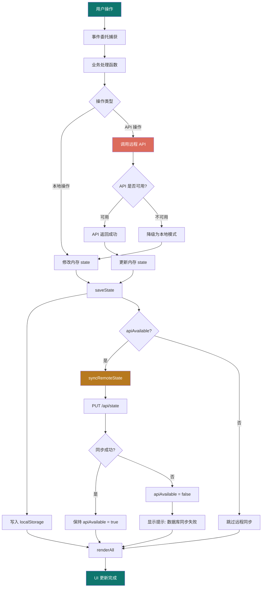
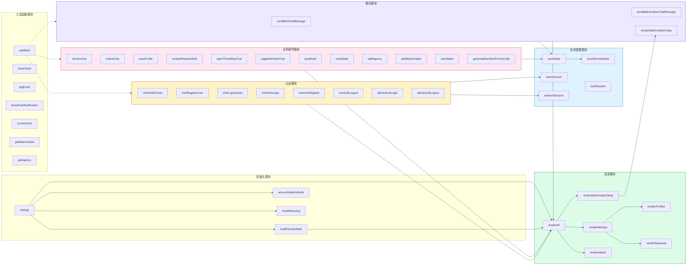
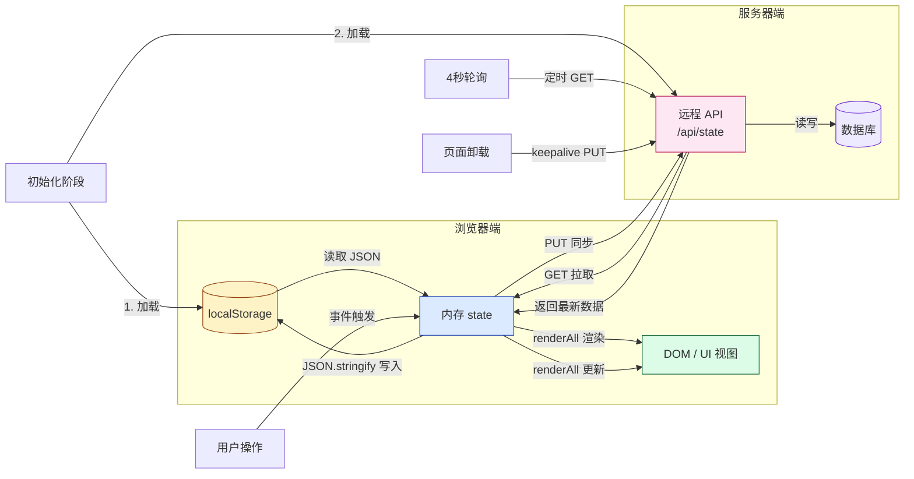

2026-06-25 | Claude Fable 5

# 缘定传媒人 — 前端说明

## 概述

前端为纯静态 HTML/CSS/JS 架构，无任何框架依赖。所有角色共享同一个 `app.js`（约 3900 行）和 `styles.css`（约 1680 行），通过端口/路由区分角色视图。

---

## 入口页面

### index.html — 综合预览端（8095/9445）

- 包含左侧导航栏，可在客户/红娘/管理员三个视图间切换
- 内嵌电话模拟器框架展示客户端 UI
- 右侧显示中台演示操作指南、微信消息推送模拟、业务审计日志
- 适合开发演示和全功能预览

**页面结构**：

```
┌─────────────────────────────────────────────────┐
│  侧边栏（280px）  │  主内容区                     │
│  ├─ 品牌标识      │  ├─ 小程序视图                │
│  ├─ 三端导航按钮  │  │  ├─ 电话模拟器（左侧）     │
│  └─ 当前演示信息  │  │  └─ 辅助面板（右侧）       │
│                   │  ├─ 红娘工作台视图            │
│                   │  └─ 管理后台视图              │
└─────────────────────────────────────────────────┘
```

### mini.html — 客户小程序端（8096/9446）

- 独立页面，无侧边栏
- 模拟微信小程序界面（手机框架样式）
- 功能：登录/注册、发现（筛选异性）、个人资料、VIP 开通、牵线请求、聊天

**页面结构**：

```
┌──────────────────────────────┐
│  手机框架（430px）            │
│  ├─ 头部（品牌 + VIP 标识）  │
│  ├─ Tab 栏（4个标签）        │
│  │  ├─ 筛选                 │
│  │  ├─ 资料                 │
│  │  ├─ 消息                 │
│  │  └─ 我的                 │
│  └─ 内容区                  │
└──────────────────────────────┘
```

### matchmaker.html — 红娘工作台（8097/9447）

- 独立页面，无侧边栏
- 功能：登录/注册、牵线通知列表、标记联系、查看双方微信、一对一聊天

**页面结构**：

```
┌──────────────────────────────────────┐
│  工具栏（标题 + 退出按钮）           │
│  ├─ 左侧面板：应用通知              │
│  └─ 右侧面板：双方隐藏联系信息      │
└──────────────────────────────────────┘
```

### admin.html — 管理后台（8098/9448）

- 独立页面，无侧边栏
- 左侧菜单导航：概览、分成设置、机构管理、红娘管理、客户管理、兑换码

**页面结构**：

```
┌──────────────────────────────────────┐
│  工具栏（标题 + 模拟成交 + 退出）    │
│  ├─ 左侧菜单（188px）              │
│  │  ├─ 概览                        │
│  │  ├─ 分成比例                    │
│  │  ├─ 机构管理                    │
│  │  ├─ 红娘管理                    │
│  │  ├─ 客户信息                    │
│  │  └─ 兑换码                      │
│  └─ 右侧内容区                     │
└──────────────────────────────────────┘
```

---

## JavaScript 架构（app.js）

### 核心状态管理

```javascript
const STORAGE_KEY = "mediapeople-dating-demo-v1";
const SESSION_KEY = `${STORAGE_KEY}:session`;
const VIP_PRICE = 399;
const API_BASE = "/api";

let state;      // 完整业务状态对象
let session;    // 当前会话信息
let apiAvailable = false;  // API 是否可用
let currentAdminSection = "overview";  // 当前管理后台栏目
```

### 初始化流程

```
initApp()
  ├─ loadRemoteState()           尝试从 API 加载状态
  │   ├─ 成功 → apiAvailable = true，缓存到 localStorage
  │   └─ 失败 → apiAvailable = false，从 localStorage 加载
  ├─ ensureStateDefaults(state)  补全缺失字段
  ├─ renderAll()                 渲染所有视图
  ├─ handleRouting()             根据 URL 路由到对应页面
  └─ 启动 4 秒轮询定时器
```

### 角色检测

```javascript
isMiniView()       // data-role="mini" 或端口 8096
isMatchmakerView() // data-role="matchmaker" 或端口 8097
isAdminView()      // data-role="admin" 或端口 8098
```

### 路由系统

使用 `history.pushState` + `popstate` 事件实现 SPA 路由：

**综合预览端路由**（8095）：

- `/mini/discover` → 客户端-筛选页
- `/mini/profile` → 客户端-资料页
- `/mini/vip` → 客户端-VIP页
- `/mini/requests` → 客户端-消息页
- `/mini/my` → 客户端-我的页
- `/matchmaker/login` → 红娘登录页
- `/matchmaker/workbench` → 红娘工作台
- `/admin/login` → 管理员登录页
- `/admin/console` → 管理后台

**独立端口路由**（8096/8097/8098）：

- `/discover`, `/profile`, `/vip`, `/requests`, `/my` → 客户端各页面
- `/login`, `/workbench` → 红娘各页面
- `/login`, `/console` → 管理员各页面

**路由守卫**：

- 客户端：未登录时，除 `/my` 外所有页面重定向到 `/my`
- 红娘端：未登录时，`/workbench` 重定向到 `/login`
- 管理端：未登录时，`/console` 重定向到 `/login`

---

## 数据同步策略

### 本地优先写入

```
用户操作 → 修改本地 state → saveState()
  ├─ localStorage.setItem(STORAGE_KEY, JSON.stringify(state))
  └─ if (apiAvailable) syncRemoteState()
       └─ PUT /api/state（带 token）
           ├─ 成功 → 保持 apiAvailable = true
           └─ 失败 → apiAvailable = false，显示提示"数据库同步失败，已临时保存到本机浏览器"
```

### 远程轮询同步

```
每 4 秒 → loadRemoteState()
  ├─ 成功 → 比较 JSON.stringify(remote) !== JSON.stringify(local)
  │   ├─ 不同 → 更新本地 state + localStorage + renderAll()
  │   └─ 相同 → 无操作
  └─ 失败 → 跳过本次
```

### 页面卸载同步

```
pagehide 事件 → syncRemoteState({ keepalive: true, notify: false })
  └─ 使用 keepalive 确保请求在页面关闭前完成
```

### 离线模式

- API 不可用时，前端自动切换到 localStorage 离线模式
- 所有操作在本地完成，数据保存在浏览器
- API 恢复后，下次操作会重新同步

---

## 关键渲染函数

| 函数 | 职责 |
|------|------|
| `renderAll()` | 调用所有子渲染函数 |
| `renderMiniApp()` | 客户端主页渲染（VIP 状态、Tab 锁定、个人中心） |
| `renderProfiles()` | 异性资料卡片渲染（筛选、翻页、申请牵线） |
| `renderRequests()` | 牵线请求列表 + 聊天线程列表 |
| `renderMineTabContent()` | "我的"选项卡内容（未登录/已登录状态） |
| `renderMatchmakerDesk()` | 红娘工作台渲染（通知、联系方式、聊天） |
| `renderMatchmakerChats()` | 红娘聊天面板 |
| `renderAdmin()` | 管理后台渲染 |
| `renderMetrics()` | 数据指标卡片 |
| `renderChart()` | 数据图表 |
| `renderPromoCodes()` | 兑换码列表 |
| `renderProfileForm()` | 个人资料表单 |
| `renderFilters()` | 筛选条件下拉框 |
| `renderVipMatchmakers()` | VIP 页面红娘选择列表 |

---

## 客户端复杂场景

### 未登录状态

- 除"我的"外，其他 Tab 置灰不可点击
- 点击置灰 Tab 时，手机框架抖动动画 + 提示"请先登录"
- 筛选页、资料页、消息页显示锁定遮罩

### VIP 开通流程

**方式一：推荐码支付**

```
1. 用户在 VIP 页面选择专属红娘（可搜索筛选）
2. 点击"模拟支付并开通"
3. 调用 POST /api/client/vip/redeem { referralCode }
4. 成功后：
   - VIP 标识更新
   - 显示到期日期
   - 记录分成日志
   - 显示微信推送模拟卡片
```

**方式二：兑换码兑换**

```
1. 用户输入兑换码
2. 点击"确定"
3. 调用 POST /api/client/vip/redeem { code }
4. 成功后：
   - 按钮变为绿色"有效"
   - VIP 标识更新
   - 记录分成日志
```

**已 VIP 用户为新红娘开通**：

```
1. 用户已是 VIP，但想为另一个红娘开通
2. 选择新的红娘
3. 按钮变为"为该红娘开通 VIP"
4. 点击后调用 ensureVipForMatchmaker() 自动开通
```

### 申请牵线流程

```
1. 在筛选页浏览异性资料
2. 点击"申请牵线"
3. 检查目标用户是否绑定了红娘→未绑定显示"该会员暂未绑定红娘，无法申请牵线"
4. 调用 ensureVipForMatchmaker(matchmakerId)：
   - 如果用户已是该红娘 VIP→继续
   - 如果用户不是该红娘 VIP→自动调用 API 开通 VIP（推荐码支付）
   - 开通失败→中止流程
5. 检查是否已有未完成请求（同一发起方、目标方、红娘）→有则提示"这条牵线请求已经在处理中"
6. 调用 POST /api/client/match-requests
7. 成功后：
   - 显示提示"已通知红娘为你和 XXX 牵线"
   - 显示微信推送模拟卡片
   - 关闭详情弹窗
```

### 聊天功能

**红娘-会员聊天**：

```
1. 在消息页查看牵线请求列表
2. 点击"联系红娘"按钮
3. 自动跳转到对应聊天线程
4. 发送消息 → POST /api/chat/threads/:id/messages
5. 消息实时显示
```

**会员互聊**：

```
1. 红娘批准互聊后，在消息页显示"与对方互聊"按钮
2. 点击进入互聊界面
3. 发送消息
```

### 实名认证流程

```
1. 在"我的"页面点击"实名认证"
2. 弹出认证弹窗
3. 如果未认证：
   - 显示认证表单（姓名、身份证号、手机号）
   - 提交后调用 POST /api/client/real-name
   - 成功后显示"已通过实名认证"
4. 如果已认证：
   - 显示脱敏后的认证信息
```

---

## 红娘端复杂场景

### 登录/注册

**登录**：

```
1. 选择已有红娘账号
2. 点击"一键登录"
3. 调用 POST /api/auth/matchmaker/login
4. 成功后跳转工作台
```

**注册**：

```
1. 切换到注册面板
2. 填写姓名、机构、手机号、邮箱、推荐码、密码
3. 提交注册表单
4. 调用 POST /api/auth/matchmaker/register
5. 成功后自动登录并跳转工作台
```

### 牵线通知处理

```
1. 工作台显示牵线请求列表
2. 每个请求显示：
   - 状态标签（待红娘联系/联系男方/联系女方/来和双方对话）
   - 发起方和目标方信息
   - 联系男方/女方按钮
3. 点击"联系男方" → 标记已联系男方
4. 点击"联系女方" → 标记已联系女方
5. 两方都联系后 → 显示"来和双方对话"按钮
6. 点击"来和双方对话" → 打开聊天窗口
```

### 聊天功能

```
1. 工作台显示聊天线程列表
2. 点击线程 → 打开聊天弹窗
3. 弹窗内显示：
   - 标题（会员姓名 + 一对一沟通）
   - 消息列表
   - 输入框 + 发送按钮
4. 发送消息 → POST /api/chat/threads/:id/messages
5. 点击关闭按钮 → 关闭弹窗
```

### 联系方式查看

```
1. 工作台右侧面板显示"双方隐藏联系信息"
2. 列出所有牵线请求的双方微信
3. 仅红娘可见
```

---

## 管理后台复杂场景

### 数据概览

- 4 个指标卡片：客户数量、VIP 数量、成交数量、总金额
- 柱状图：客户、牵线、成交、金额

### 分成比例设置

```
1. 显示当前分成比例（推广费/牵线费/平台服务费）
2. 修改三个输入框
3. 点击"保存分成"
4. 校验三者之和必须为 100
5. 调用 PATCH /api/admin/splits
6. 成功后更新预览条形图
```

### 机构/红娘管理

```
添加机构：
1. 填写机构名称和城市
2. 点击"添加机构"
3. 调用 POST /api/admin/agencies

添加红娘：
1. 填写红娘姓名、选择机构、填写推荐码
2. 点击"添加红娘"
3. 调用 POST /api/admin/matchmakers
```

### 兑换码管理

```
1. 查看兑换码列表（兑换码、关联红娘、使用状态、使用者）
2. 点击"+ 随机生成兑换码"
3. 自动生成 8 位随机码
4. 随机关联一个红娘（70% 概率）
5. 调用 POST /api/admin/promo-codes
```

### 模拟成交

```
1. 点击"模拟成交"
2. 自动生成一笔 ¥399 成交记录
3. 调用 POST /api/admin/deals/simulate
4. 更新数据指标和图表
5. 记录分成日志
6. 显示微信推送模拟卡片
```

---

## 事件委托机制

前端使用事件委托模式处理动态元素的点击事件：

```javascript
// 安全绑定函数
function safeBind(selector, event, handler) {
  const el = $(selector);
  if (el) el.addEventListener(event, handler);
}

// 事件委托示例
safeBind("#notificationList", "click", (event) => {
  const button = event.target.closest("[data-contact-request]");
  if (button) {
    contactRequestSide(button.dataset.contactRequest, button.dataset.contactSide);
    return;
  }
  const talkBothButton = event.target.closest("[data-talk-both]");
  if (talkBothButton) {
    openThreeWayChat(talkBothButton.dataset.talkBoth);
    return;
  }
});
```

**关键事件绑定**：

- Tab 切换：`[data-mini-tab]` 点击
- 筛选条件变更：`#genderFilter`, `#cityFilter`, `#ageFilter` change
- 牵线请求操作：`[data-contact-request]`, `[data-talk-both]` 点击
- 聊天线程选择：`[data-open-thread]`, `[data-open-mm-thread]` 点击
- 表单提交：`#profileForm`, `#splitForm`, `#agencyForm` 等 submit
- 模态框关闭：`.modal-close` 点击，`.modal-backdrop` 点击（点击背景关闭）

---

## CSS 架构（styles.css）

### 设计系统变量

```css
:root {
  --ink: #1e2633;      /* 主文字色 */
  --muted: #6d7785;    /* 次要文字色 */
  --line: #dfe5ec;     /* 边框线 */
  --paper: #fbfcfd;    /* 背景纸 */
  --panel: #ffffff;    /* 面板背景 */
  --teal: #0f766e;     /* 主题色（绿） */
  --teal-dark: #115e59;/* 深绿色 */
  --coral: #dc6b5c;    /* 强调色（珊瑚） */
  --gold: #b7791f;     /* 金色 */
  --blue: #3867d6;     /* 蓝色 */
}
```

### 响应式断点

| 断点 | 适配 |
|------|------|
| > 980px | 桌面端（双栏布局） |
| ≤ 980px | 平板端（单栏，侧边栏变为顶部导航） |
| ≤ 520px | 手机端（紧凑布局） |

### 特色样式

- **毛玻璃效果**（Glassmorphism）：登录弹窗、模态框
- **手机模拟器框架**：客户端 UI 展示
- **微信公众号推送卡片**：模拟微信模板消息
- **控制台日志面板**：深色终端风格
- **自定义滚动条**：细窄半透明
- **抖动动画**：Tab 锁定时的反馈动画

---

## 会话存储结构

### localStorage 键

| 键名 | 内容 |
|------|------|
| `mediapeople-dating-demo-v1` | 完整 state JSON |
| `mediapeople-dating-demo-v1:session` | 会话信息 `{currentUserId, selectedMatchmakerId, adminLoggedIn, token, role}` |

---

## 演示数据

内置 10 个演示用户（5 男 5 女）、2 个红娘、2 个机构、4 个兑换码：

| 用户 | 性别 | 城市 | 职业 | VIP | 推荐红娘 |
|------|------|------|------|-----|----------|
| 林安 | 男 | 上海 | 内容策划 | ✗ | 无 |
| 周晴 | 女 | 上海 | 品牌经理 | ✓ | 李莉 |
| 许知夏 | 女 | 杭州 | 制片人 | ✗ | 无 |
| 陈亦舟 | 男 | 杭州 | 摄影导演 | ✓ | 娜娜 |
| 宋予白 | 男 | 南京 | 新媒体运营 | ✗ | 无 |
| 沈嘉仪 | 女 | 苏州 | 视觉设计师 | ✓ | 李莉 |
| 顾南星 | 男 | 上海 | 广告导演 | ✓ | 娜娜 |
| 唐一诺 | 女 | 成都 | 纪录片编导 | ✗ | 无 |
| 陆景然 | 男 | 深圳 | 产品经理 | ✗ | 无 |
| 孟晚棠 | 女 | 广州 | 公关顾问 | ✓ | 李莉 |

兑换码：`VIP666`（绑定红娘李莉）、`MEDIA888`（绑定红娘娜娜）、`LOVE999`（无绑定）、`1`（无限次使用）。

---

## 渲染全流程图

`renderAll()` 是顶层渲染入口，负责在状态变更后刷新所有视图。以下是完整的调用链：

```mermaid
flowchart TD
    A[renderAll] --> B[renderFilters]
    A --> C[renderMiniApp]
    A --> D[renderMatchmakerDesk]
    A --> E[renderAdmin]
    A --> F[renderPromoCodes]
    
    C --> C1[renderVipMatchmakers]
    C --> C2[renderProfileForm]
    C --> C3[renderMineTabContent]
    C --> C4[renderProfiles]
    C --> C5[renderRequests]
    
    C5 --> C5a[牵线请求列表渲染]
    C5 --> C5b[聊天线程列表渲染]
    
    C4 --> C4a[筛选条件过滤]
    C4 --> C4b[资料卡片渲染]
    C4 --> C4c[翻页控制]
    
    D --> D1[牵线通知列表渲染]
    D --> D2[待审核资料列表渲染]
    D --> D3[联系方式面板渲染]
    D --> D4[renderMatchmakerChats]
    
    D4 --> D4a[聊天线程列表]
    D4 --> D4b[消息记录渲染]
    D4 --> D4c[输入框状态]
    
    E --> E1[renderMetrics]
    E --> E2[renderSplit]
    E --> E3[renderAgencies]
    E --> E4[renderMatchmakers]
    E --> E5[renderCustomers]
    E --> E6[renderChart]
    E --> E7[switchAdminSection]
    
    E1 --> E1a[客户数量卡片]
    E1 --> E1b[VIP数量卡片]
    E1 --> E1c[成交数量卡片]
    E1 --> E1d[总金额卡片]
    
    style A fill:#0f766e,color:#fff,stroke:#115e59
    style C fill:#3867d6,color:#fff,stroke:#2952b3
    style D fill:#dc6b5c,color:#fff,stroke:#c55a4d
    style E fill:#b7791f,color:#fff,stroke:#9a681a
```



**渲染流程说明**：

- **顶层入口**：`renderAll()` 在每次状态变更后被调用，一次性刷新所有端的视图
- **客户端渲染**：`renderMiniApp()` 负责小程序端的全部 UI，包括 VIP 状态、Tab 锁定、个人中心、资料列表、消息列表等
- **红娘端渲染**：`renderMatchmakerDesk()` 负责红娘工作台，包括通知列表、联系方式、聊天面板
- **管理端渲染**：`renderAdmin()` 负责管理后台的所有面板和数据展示
- **条件渲染**：每个渲染函数开头都有 `if (!$("#xxx")) return;` 守卫，DOM 不存在时直接跳过，避免跨端报错
- **性能特点**：采用全量重渲染模式，每次状态变更后整体刷新，逻辑简单但数据量大时可能有性能瓶颈

---

## 状态变更流

从用户操作到 UI 更新的完整状态变更流程：



**状态变更的三条路径**：

1. **纯本地操作**（如切换 Tab、展开面板）：直接修改 state → 保存 localStorage → 渲染
2. **本地优先 + 后台同步**（如修改资料、发送消息）：修改本地 state → 保存 localStorage → 异步同步到远程 → 失败时降级提示
3. **API 优先操作**（如开通 VIP、提交牵线）：先调 API → 成功后更新 state → 保存并渲染 → 失败时回滚并报错

**错误处理策略**：

- 网络失败：自动降级为本地模式，用户操作不受影响
- 数据冲突：以远程轮询数据为准，每 4 秒拉取一次覆盖本地
- 页面卸载：使用 `keepalive` 确保最后一次同步请求完成

---

## 函数调用关系图

核心模块之间的函数调用关系（按模块分类）：



---

## 组件树结构

虽然使用原生 JS 开发，但按 DOM 结构可以抽象出以下三端组件树：

### 客户端（mini.html）组件树

```
PhoneFrame（手机框架）
├── Header（头部导航）
│   ├── BrandLogo（品牌标识）
│   └── VipBadge（VIP 状态徽章）
├── TabBar（底部 Tab 栏）
│   ├── TabItem[筛选] - discover
│   ├── TabItem[资料] - profile
│   ├── TabItem[消息] - requests
│   └── TabItem[我的] - mine
└── ContentArea（内容区）
    ├── DiscoverTab（筛选页）
    │   ├── FilterBar（筛选条件栏）
    │   │   ├── GenderFilter（性别筛选）
    │   │   ├── CityFilter（城市筛选）
    │   │   └── AgeFilter（年龄筛选）
    │   ├── ProfileList（资料卡片列表）
    │   │   └── ProfileCard（资料卡片）
    │   │       ├── Avatar（头像）
    │   │       ├── NameAge（姓名年龄）
    │   │       ├── CityJob（城市职业）
    │   │       ├── VipTag（VIP 标签）
    │   │       └── MatchRequestBtn（申请牵线按钮）
    │   └── Pagination（翻页控件）
    ├── ProfileTab（资料页）
    │   ├── ProfileForm（资料表单）
    │   │   ├── AvatarUpload（头像上传）
    │   │   ├── BasicInfo（基本信息）
    │   │   ├── MatchmakerSelect（红娘选择）
    │   │   └── SaveBtn（保存按钮）
    │   ├── VipSection（VIP 专区）
    │   │   ├── VipInfo（VIP 状态信息）
    │   │   ├── MatchmakerList（红娘列表）
    │   │   ├── RedeemInput（兑换码输入）
    │   │   └── BecomeVipBtn（开通按钮）
    │   └── RealNameSection（实名认证）
    │       ├── RealNameStatus（认证状态）
    │       └── RealNameForm（认证表单）
    ├── RequestsTab（消息页）
    │   ├── RequestList（牵线请求列表）
    │   │   └── RequestItem（请求项）
    │   │       ├── StatusTag（状态标签）
    │   │       ├── UserInfo（双方信息）
    │   │       └── ContactBtn（联系红娘按钮）
    │   └── ChatThreadList（聊天线程列表）
    │       └── ChatThreadItem（聊天线程项）
    └── MineTab（我的页）
        ├── UnregisteredPanel（未登录面板）
        │   ├── UserSelect（用户选择下拉）
        │   ├── SwitchBtn（切换按钮）
        │   └── RegisterForm（注册表单）
        └── RegisteredPanel（已登录面板）
            ├── UserInfoCard（用户信息卡）
            ├── MenuList（功能菜单）
            │   ├── VipService（VIP 服务）
            │   ├── RealNameVerify（实名认证）
            │   └── LogoutBtn（退出登录）
            └── DelegatedMatchmakers（委托红娘列表）
```

### 红娘端（matchmaker.html）组件树

```
MatchmakerApp（红娘工作台）
├── Toolbar（顶部工具栏）
│   ├── Title（工作台标题）
│   ├── NotificationBadge（待处理徽章）
│   └── LogoutBtn（退出按钮）
├── AuthContainer（认证容器）
│   ├── LoginPanel（登录面板）
│   │   ├── MatchmakerSelect（红娘选择）
│   │   └── LoginBtn（登录按钮）
│   └── RegisterPanel（注册面板）
│       ├── RegisterForm（注册表单）
│       └── RegisterBtn（注册按钮）
├── Workbench（工作台主体）
│   ├── LeftPanel（左侧通知面板）
│   │   ├── NotificationList（牵线通知列表）
│   │   │   └── RequestCard（请求卡片）
│   │   │       ├── StatusPill（状态标签）
│   │   │       ├── UserNames（双方姓名）
│   │   │       ├── ContactStatus（联系状态）
│   │   │       ├── MaleContactBtn（联系男方）
│   │   │       ├── FemaleContactBtn（联系女方）
│   │   │       ├── TalkBothBtn（来和双方对话）
│   │   │       └── ToggleMemberChatBtn（开通/关闭互聊）
│   │   └── ProfileReviewList（资料审核列表）
│   │       └── ProfileReviewItem（待审核资料项）
│   └── RightPanel（右侧信息面板）
│       ├── ContactInfoSection（联系方式区）
│       │   └── ContactInfoList（隐藏联系信息列表）
│       └── ChatSection（聊天区）
│           ├── ChatThreadList（聊天线程列表）
│           ├── ChatPanel（聊天面板）
│           │   ├── ChatHeader（聊天标题）
│           │   ├── MessageList（消息列表）
│           │   │   └── MessageBubble（消息气泡）
│           │   └── ChatInput（输入框 + 发送按钮）
│           └── CloseBtn（关闭按钮）
```

### 管理端（admin.html）组件树

```
AdminApp（管理后台）
├── Toolbar（顶部工具栏）
│   ├── Title（后台标题）
│   ├── SeedDealBtn（模拟成交按钮）
│   └── LogoutBtn（退出按钮）
├── AuthContainer（认证容器）
│   └── LoginForm（登录表单）
└── Console（控制台主体）
    ├── SideMenu（左侧菜单）
    │   ├── MenuItem[概览] - overview
    │   ├── MenuItem[分成比例] - splits
    │   ├── MenuItem[机构管理] - agencies
    │   ├── MenuItem[红娘管理] - matchmakers
    │   ├── MenuItem[客户信息] - customers
    │   └── MenuItem[兑换码] - promoCodes
    └── ContentArea（右侧内容区）
        ├── OverviewPanel（概览面板）
        │   ├── MetricsGrid（指标卡片网格）
        │   │   ├── MetricCard[客户数量]
        │   │   ├── MetricCard[VIP 数量]
        │   │   ├── MetricCard[成交数量]
        │   │   └── MetricCard[总金额]
        │   └── Chart（柱状图）
        ├── SplitsPanel（分成面板）
        │   ├── SplitForm（分成表单）
        │   │   ├── PromoInput（推广费比例）
        │   │   ├── MatchmakerInput（牵线费比例）
        │   │   ├── PlatformInput（平台服务费比例）
        │   │   └── SaveBtn（保存按钮）
        │   └── SplitPreview（比例预览条形图）
        ├── AgenciesPanel（机构面板）
        │   ├── AgencyForm（添加机构表单）
        │   └── AgencyList（机构列表）
        ├── MatchmakersPanel（红娘面板）
        │   ├── MatchmakerForm（添加红娘表单）
        │   └── MatchmakerList（红娘列表）
        ├── CustomersPanel（客户面板）
        │   ├── QuickAddBtns（快速添加按钮）
        │   └── CustomerList（客户列表）
        └── PromoCodesPanel（兑换码面板）
            ├── GenerateBtn（生成兑换码按钮）
            └── PromoCodeList（兑换码列表）
```

---

## 事件系统详解

### 事件委托机制

项目采用**事件委托模式**处理动态生成的 DOM 元素，核心原理：

- 将事件监听器绑定到**父容器**上，而非每个子元素
- 利用**事件冒泡**机制，子元素的事件会冒泡到父容器
- 在父容器的回调中通过 `event.target.closest(selector)` 判断事件源
- 动态增删子元素无需重新绑定事件

**核心工具函数**（app.js:3340）：

```javascript
function safeBind(selector, event, handler) {
  const el = $(selector);
  if (el) el.addEventListener(event, handler);
}
```

### 事件冒泡与传播

事件冒泡路径示例（以"联系男方"按钮点击为例）：

```
button[data-contact-request]  ← 实际点击目标
  └─ div[按钮容器]
      └─ article.request-card  ← 请求卡片
          └─ #notificationList  ← 委托容器（事件绑定在此）
              └─ ... → document → window
```

**常用判断方法**：
- `event.target.closest(selector)` — 向上查找最近的匹配祖先元素
- `return` — 处理完后立即返回，避免继续匹配其他委托

### 事件绑定清单

#### 客户端事件

| 绑定位置 | 事件类型 | 选择器/触发源 | 处理函数 | 功能说明 |
|---------|---------|--------------|---------|---------|
| `#profileList` | click | - | 委托处理 | 资料卡片点击、申请牵线 |
| `#closeProfileDetailModalBtn` | click | - | - | 关闭资料详情弹窗 |
| `#profileDetailModal` | click | - | 背景点击检测 | 点击背景关闭弹窗 |
| `#requestsContent` | click | - | 委托处理 | 消息列表点击、打开聊天 |
| `#miniChatForm` | submit | - | `sendMiniChatMessage` | 客户端发送聊天消息 |
| `#becomeVipBtn` | click | - | `becomeVip` | 开通 VIP |
| `#redeemVipBtn` | click | - | `redeemVip` | 兑换码兑换 VIP |
| `#vipServiceMenuItem` | click | - | - | 切换 VIP 服务子面板 |
| `#vipSubpanelBackBtn` | click | - | - | 返回 VIP 上级面板 |
| `#profileForm` | submit | - | `saveProfile` | 保存个人资料 |
| `#miniSwitchUserBtn` | click | - | `miniSwitchUser` | 切换登录用户 |
| `#miniRegisterForm` | submit | - | `miniRegisterUser` | 注册新用户 |
| `#miniLogoutBtn` | click | - | `miniLogoutUser` | 退出登录 |
| `#realNameVerificationMenuItem` | click | - | - | 打开实名认证弹窗 |
| `#closeRealNameModalBtn` | click | - | - | 关闭实名认证弹窗 |
| `#realNameModal` | click | - | 背景点击检测 | 点击背景关闭弹窗 |
| `#realNameForm` | submit | - | - | 提交实名认证 |
| Tab 栏 | click | `[data-mini-tab]` | 路由切换 | 底部 Tab 切换 |
| 筛选栏 | change | `#genderFilter` 等 | 筛选逻辑 | 筛选条件变更 |

#### 红娘端事件

| 绑定位置 | 事件类型 | 选择器/触发源 | 处理函数 | 功能说明 |
|---------|---------|--------------|---------|---------|
| `#notificationList` | click | `[data-contact-request]` | `contactRequestSide` | 标记联系男方/女方 |
| `#notificationList` | click | `[data-talk-both]` | `openThreeWayChat` | 打开三方聊天 |
| `#notificationList` | click | `[data-toggle-member-chat]` | - | 开通/关闭会员互聊 |
| `#matchmakerChatThreadList` | click | `[data-open-mm-thread]` | - | 打开聊天线程 |
| `#matchmakerChatForm` | submit | - | `sendMatchmakerChatMessage` | 红娘发送消息 |
| `#matchmakerChatPanel` | click | `.modal-close` | - | 关闭聊天面板 |
| `#mmLoginSubmitBtn` | click | - | `mmAuthLogin` | 红娘登录 |
| `#mmRegisterForm` | submit | - | `mmAuthRegister` | 红娘注册 |
| `#mmLogoutBtn` | click | - | `mmAuthLogout` | 红娘退出 |

#### 管理端事件

| 绑定位置 | 事件类型 | 选择器/触发源 | 处理函数 | 功能说明 |
|---------|---------|--------------|---------|---------|
| `#splitForm` | submit | - | `saveSplits` | 保存分成比例 |
| `#agencyForm` | submit | - | `addAgency` | 添加机构 |
| `#matchmakerForm` | submit | - | `addMatchmaker` | 添加红娘 |
| `#seedDealBtn` | click | - | `seedDeal` | 模拟成交 |
| `#resetDataBtn` | click | - | `resetState` | 重置数据 |
| `#generatePromoCodeBtn` | click | - | `generateRandomPromoCode` | 生成兑换码 |
| `#quickAddMaleBtn` | click | - | `quickAddMember("男")` | 快速添加男会员 |
| `#quickAddFemaleBtn` | click | - | `quickAddMember("女")` | 快速添加女会员 |
| `#adminLoginForm` | submit | - | `adminAuthLogin` | 管理员登录 |
| `#adminLogoutBtn` | click | - | `adminAuthLogout` | 管理员退出 |
| 左侧菜单 | click | `[data-admin-section]` | `switchAdminSection` | 管理后台栏目切换 |

#### 全局/通用事件

| 绑定位置 | 事件类型 | 处理函数 | 功能说明 |
|---------|---------|---------|---------|
| window | popstate | 路由处理 | 浏览器前进/后退 |
| window | pagehide | 同步状态 | 页面卸载时同步远程 |
| `#clearConsoleLogsBtn` | click | 清空日志 | 清空控制台日志面板 |
| `.modal-close` | click | 关闭弹窗 | 通用模态框关闭按钮 |
| `.modal-backdrop` | click | 关闭弹窗 | 点击背景关闭模态框 |

---

## 性能优化点

### 当前实现的性能考虑

1. **事件委托减少监听器数量**
   - 动态列表使用事件委托，避免为每个列表项绑定事件
   - 尤其资料列表、通知列表、聊天列表等场景收益明显

2. **条件渲染守卫**
   - 每个渲染函数开头检查 DOM 是否存在：`if (!$("#xxx")) return;`
   - 避免在不相关的页面上执行无用的渲染逻辑

3. **轮询间隔合理设置**
   - 远程同步轮询间隔 4 秒，兼顾实时性和服务器压力
   - 仅在 API 可用时才进行轮询

4. **控制台日志限流**
   - `logEvent()` 中限制最多保留 80 条日志，超出自动移除最旧的
   - 避免日志面板 DOM 无限增长

### 数据量大时的潜在瓶颈

1. **全量重渲染模式**
   - 每次状态变更调用 `renderAll()` 刷新所有视图
   - 当用户数量达到 1000+、消息数量 10000+ 时，DOM 操作会显著变慢
   - `innerHTML` 全量替换会导致浏览器重排重绘

2. **序列化对比效率低**
   - 轮询同步时使用 `JSON.stringify(remote) !== JSON.stringify(local)` 比较
   - 状态对象越大，序列化耗时越长
   - 每次比较都要完整序列化整个 state 对象

3. **列表无虚拟滚动**
   - 资料列表、聊天记录、客户列表等全部渲染到 DOM
   - 数据量大会产生大量 DOM 节点，占用内存且滚动卡顿

4. **localStorage 同步写入**
   - 每次操作都同步写入 localStorage
   - `JSON.stringify` 大对象时会阻塞主线程

5. **无节流/防抖**
   - 筛选条件变更、输入框输入等高频操作没有防抖
   - 可能触发不必要的重复渲染

### 优化建议

| 优化点 | 方案 | 预期收益 |
|-------|------|---------|
| 渲染粒度 | 将 `renderAll()` 拆分为按模块的细粒度渲染，只更新变更区域 | 渲染性能提升 50%+ |
| 虚拟滚动 | 长列表使用虚拟滚动，只渲染可视区域内的条目 | DOM 节点减少 90% |
| 状态比较 | 使用深比较函数替代 `JSON.stringify`，或引入简单的脏检查机制 | 比较耗时减少 80% |
| 批量更新 | 短时间内多次状态变更合并为一次渲染 | 减少重复渲染次数 |
| 防抖节流 | 筛选输入、滚动等高频操作加防抖/节流 | 减少无效计算 |
| 异步存储 | localStorage 写入放到 `requestIdleCallback` 中异步执行 | 避免阻塞主线程 |
| DocumentFragment | 批量 DOM 插入使用 DocumentFragment | 减少重排次数 |
| 缓存计算结果 | getUserVipMatchmakerIds 等频繁调用的函数加缓存 | 减少重复计算 |

---

## 调试技巧

### console.log 调试

**核心变量查看**：

```javascript
// 查看完整状态
console.log(state);

// 查看当前会话
console.log(session);

// 查看当前登录用户
console.log(currentUser());

// 查看 API 可用性
console.log(apiAvailable);
```

**按模块查看**：

```javascript
// 用户列表
console.table(state.users);

// 红娘列表
console.table(state.matchmakers);

// 牵线请求
console.table(state.requests);

// 成交记录
console.table(state.deals);

// 兑换码
console.table(state.promoCodes);
```

**渲染函数追踪**：

```javascript
// 在 renderAll 开头加日志（可在控制台临时注入）
const _renderAll = renderAll;
renderAll = function() {
  console.time('renderAll');
  console.trace('renderAll 调用栈');
  _renderAll.apply(this, arguments);
  console.timeEnd('renderAll');
};
```

### localStorage 查看

**直接查看**：

- Chrome DevTools → Application → Storage → Local Storage → 当前域名
- 找到键 `mediapeople-dating-demo-v1`（完整 state）
- 找到键 `mediapeople-dating-demo-v1:session`（会话信息）

**控制台操作**：

```javascript
// 读取完整 state
const raw = localStorage.getItem('mediapeople-dating-demo-v1');
const data = JSON.parse(raw);
console.log(data);

// 读取会话
const sessionRaw = localStorage.getItem('mediapeople-dating-demo-v1:session');
console.log(JSON.parse(sessionRaw));

// 手动清空（重置数据）
localStorage.removeItem('mediapeople-dating-demo-v1');
localStorage.removeItem('mediapeople-dating-demo-v1:session');
location.reload();
```

**数据修改与回灌**：

```javascript
// 读取 → 修改 → 写回 → 刷新
const raw = localStorage.getItem('mediapeople-dating-demo-v1');
const data = JSON.parse(raw);
data.users[0].vip = true;  // 修改数据
data.users[0].vipExpiresAt = '2099-12-31';
localStorage.setItem('mediapeople-dating-demo-v1', JSON.stringify(data));
location.reload();
```

### 手动触发状态变更

**直接修改 state 并重新渲染**：

```javascript
// 修改状态
state.users.push({
  id: 'test-001',
  name: '测试用户',
  gender: '男',
  age: 28,
  city: '北京',
  job: '测试工程师',
  vip: false
});

// 保存并重新渲染
saveState();
renderAll();
```

**模拟 API 不可用**：

```javascript
apiAvailable = false;
console.log('已切换到离线模式');
```

**模拟数据同步**：

```javascript
// 强制同步到远程
syncRemoteState();

// 强制从远程加载
loadRemoteState();
```

### 断点调试方法

**Sources 面板断点**：

1. 打开 Chrome DevTools → Sources
2. 在左侧文件树找到 `app.js`
3. 点击行号设置断点
4. 触发对应操作，代码会在断点处暂停

**常用断点位置**：

| 函数名 | 行号（约） | 用途 |
|-------|-----------|------|
| `renderAll()` | 952 | 追踪渲染调用 |
| `saveState()` | 381 | 追踪状态保存 |
| `syncRemoteState()` | - | 追踪远程同步 |
| `safeBind()` | 3340 | 追踪事件绑定 |
| `handleRouting()` | - | 追踪路由变化 |

**条件断点**：

- 在断点行号上右键 → Add conditional breakpoint
- 输入条件表达式，如：`state.users.length > 50`
- 只有满足条件时才会暂停

**logpoint（日志断点）**：

- 右键行号 → Add logpoint
- 输入日志消息，如：`渲染触发, 用户数: {state.users.length}`
- 不会暂停执行，只输出日志，不污染代码

**调试事件委托**：

```javascript
// 在控制台中为事件委托加日志
const list = document.getElementById('notificationList');
const originalHandler = getEventListeners(list).click[0].listener;
list.removeEventListener('click', originalHandler);
list.addEventListener('click', function(e) {
  console.log('事件委托触发:', e.target, e.target.closest('[data-contact-request]'));
  return originalHandler.apply(this, arguments);
});
```

**性能分析**：

```javascript
// 测量渲染耗时
console.time('renderAll');
renderAll();
console.timeEnd('renderAll');

// 测量单个渲染函数
console.time('renderProfiles');
renderProfiles();
console.timeEnd('renderProfiles');

// 使用 Performance 面板
// DevTools → Performance → Record → 操作 → Stop → 查看函数耗时
```

---

## 数据流向图

数据在 localStorage、内存 state、远程 API 三者之间的流动方向：



### 详细流向说明

#### 1. 初始化流向（页面加载时）

```
页面加载 → initApp()
  ├─ 尝试 loadRemoteState()
  │   ├─ 成功 → 更新内存 state → 写入 localStorage → renderAll()
  │   └─ 失败 → 从 localStorage 读取 → 降级为离线模式
  └─ localStorage 无数据 → 使用默认演示数据初始化
```

#### 2. 用户操作流向（写路径）

```
用户点击/输入 → 事件处理函数
  └─ 修改内存 state
      ├─ saveState()
      │   ├─ 同步写入 localStorage
      │   └─ apiAvailable ? syncRemoteState() : 跳过
      │       ├─ 成功 → 保持 apiAvailable = true
      │       └─ 失败 → apiAvailable = false + 提示
      └─ renderAll() 更新 UI
```

#### 3. 轮询同步流向（读路径）

```
每 4 秒定时器 → loadRemoteState()
  └─ GET /api/state
      ├─ 成功
      │   ├─ JSON.stringify 对比本地 vs 远程
      │   ├─ 不同 → 更新内存 state → 写入 localStorage → renderAll()
      │   └─ 相同 → 无操作
      └─ 失败 → 跳过本次，apiAvailable 可能变 false
```

#### 4. 页面卸载流向

```
pagehide 事件 → syncRemoteState({ keepalive: true, notify: false })
  └─ PUT /api/state（带 keepalive 标志）
      └─ 浏览器确保请求在页面关闭前发出（不等待响应）
```

### 三者数据一致性规则

| 场景 | 优先级 | 说明 |
|-----|-------|------|
| 初始化加载 | 远程 > 本地 | API 可用时以远程为准，否则用本地 |
| 用户操作 | 本地优先 | 先改本地，再异步同步远程 |
| 轮询更新 | 远程覆盖本地 | 远程数据始终是真相源 |
| API 失败 | 本地兜底 | 自动降级，所有操作继续本地进行 |
| API 恢复 | 下次操作时恢复 | 第一次成功操作后重新建立同步 |

### 关键函数对应关系

| 函数 | 流向 | 操作 |
|-----|------|------|
| `loadRemoteState()` | API → 内存 | 从远程拉取状态 |
| `saveState()` | 内存 → localStorage → API | 保存状态（本地优先） |
| `syncRemoteState()` | 内存 → API | 同步到远程服务器 |
| `renderAll()` | 内存 → UI | 将状态渲染到 DOM |
| `loadSession()` | localStorage → 内存 | 读取会话信息 |
| `saveSession()` | 内存 → localStorage | 保存会话信息 |

