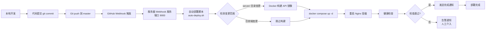

2026-06-25 | Claude Fable 5

# 缘定传媒人 — 部署指南

## 服务器信息

| 项目 | 值 |
|------|-----|
| 服务器 | uk.sbbz.tech |
| 部署目录 | `/opt/mediapeople` |
| SSH 密钥 | `~/.ssh/mediapeople_uk_ed25519` |
| 环境变量 | `/opt/mediapeople/.env` |
| 数据目录 | `/opt/mediapeople/data/postgres` |
| 备份目录 | `/opt/mediapeople/backup/postgres` |
| 部署日志 | `/var/log/mediapeople-deploy.log` |

---

## 环境变量配置

在服务器 `/opt/mediapeople/.env` 中配置：

```env
POSTGRES_DB=mediapeople
POSTGRES_USER=mediapeople
POSTGRES_PASSWORD=你的数据库密码
JWT_SECRET=你的随机长密钥
ADMIN_PASSWORD=管理员密码
```

> 仓库只提交 `.env.example`，绝不提交真实 `.env`。

**变量说明**：

| 变量 | 必填 | 默认值 | 说明 |
|------|------|--------|------|
| POSTGRES_DB | 否 | mediapeople | 数据库名 |
| POSTGRES_USER | 否 | mediapeople | 数据库用户 |
| POSTGRES_PASSWORD | 是 | - | 数据库密码 |
| JWT_SECRET | 否 | mediapeople-dev-secret-change-me | Token 签名密钥 |
| ADMIN_PASSWORD | 否 | admin | 管理员密码 |

---

## Docker 容器架构

```
compose.yml（HTTP）
├── web              nginx:1.27-alpine    8095:80   综合预览端
├── web-mini         nginx:1.27-alpine    8096:80   客户小程序端
├── web-matchmaker   nginx:1.27-alpine    8097:80   红娘工作台
├── web-admin        nginx:1.27-alpine    8098:80   管理后台
├── api              node:22-alpine       3000      Express API
└── postgres         postgres:16-alpine   5432      PostgreSQL

compose.ssl.yml（HTTPS）
├── web-ssl              nginx:1.27-alpine    9445:443
├── web-mini-ssl         nginx:1.27-alpine    9446:443
├── web-matchmaker-ssl   nginx:1.27-alpine    9447:443
└── web-admin-ssl        nginx:1.27-alpine    9448:443
```

**容器依赖关系**：

```
postgres (健康检查通过)
  ↓
api (depends_on: postgres)
  ↓
web / web-mini / web-matchmaker / web-admin (depends_on: api)
```

**数据持久化**：

- PostgreSQL 数据：`./data/postgres:/var/lib/postgresql/data`
- 备份目录：`./backup/postgres:/backup`

---

## SSL 证书

证书路径：

```
/root/.acme.sh/sbbz.tech_ecc/fullchain.cer
/root/.acme.sh/sbbz.tech_ecc/sbbz.tech.key
```

覆盖 `*.sbbz.tech` 和 `sbbz.tech`，由 acme.sh 管理自动续期。

---

## 一键部署（推荐）

在本地执行：

```bash
# 带自定义 commit 信息
./deploy.sh "你的提交说明"

# 或不带参数（自动使用时间戳）
./deploy.sh
```

### deploy.sh 流程详解

```
1. 更新前端资源版本号（cache busting）
   ├─ 读取当前版本号（如 1.0.32）
   ├─ 递增最后一位（1.0.33）
   └─ 替换所有 HTML 文件中的 app.js?v=X.Y.Z 和 styles.css?v=X.Y.Z

2. 本地语法检查
   ├─ node --check app.js
   ├─ node --check server/index.js
   └─ docker compose config 检查

3. Git 操作
   ├─ 检查是否有未提交的更改
   ├─ 如有 → git add -A && git commit
   └─ git push origin master

4. 服务器部署
   └─ SSH 到服务器执行 auto-deploy.sh

5. 健康检查
   ├─ 等待 3 秒
   ├─ 检查 HTTP 8095-8098
   └─ 检查 HTTPS 9445-9448
```

---

## 服务器自动部署

### 触发方式

**方式一：手动 SSH 执行**

```bash
ssh -i ~/.ssh/mediapeople_uk_ed25519 root@uk.sbbz.tech
cd /opt/mediapeople
bash deploy/auto-deploy.sh
```

**方式二：GitHub Webhook**

push 到 master 分支时自动触发（webhook 服务监听 9000 端口）。

### auto-deploy.sh 流程详解

```
1. cd /opt/mediapeople
2. git pull origin master
3. 检测 git diff 中是否有 server/ 目录变更
4. 如有变更：
   ├─ docker compose build api
   └─ docker compose up -d api
5. 重启所有 Nginx 容器
6. 记录日志到 /var/log/mediapeople-deploy.log
```

**智能重建**：

- 只改前端文件 → 只重启 Nginx 容器（volume 挂载已更新）
- 改了 server/ → 重建 API 容器 + 重启 Nginx

---

## 手动操作命令

### 重建全部服务

```bash
cd /opt/mediapeople
docker compose -f compose.yml -f compose.ssl.yml up -d --build
```

### 只重建 API

```bash
cd /opt/mediapeople
docker compose -f compose.yml -f compose.ssl.yml up -d --build api
```

### 只重启前端容器

```bash
cd /opt/mediapeople
docker compose -f compose.yml -f compose.ssl.yml up -d --force-recreate \
  web web-mini web-matchmaker web-admin \
  web-ssl web-mini-ssl web-matchmaker-ssl web-admin-ssl
```

### 查看状态

```bash
cd /opt/mediapeople
docker compose -f compose.yml -f compose.ssl.yml ps
docker logs --tail=100 mediapeople-api
```

### 查看 API 容器日志

```bash
docker logs --tail=100 mediapeople-api
docker logs -f mediapeople-api  # 实时跟踪
```

### 进入数据库

```bash
docker exec -it mediapeople-postgres psql -U mediapeople -d mediapeople
```

---

## 发布前必测清单

### 本地检查

```bash
# 语法检查
node --check app.js
node --check server/index.js

# Docker Compose 配置检查
POSTGRES_PASSWORD=dummy JWT_SECRET=dummy \
  docker compose -f compose.yml -f compose.ssl.yml config >/dev/null
```

### 线上健康检查

```bash
# HTTP
for port in 8095 8096 8097 8098; do
  printf "HTTP=%s " "$port"
  curl -fsS --max-time 12 http://uk.sbbz.tech:$port/api/health
  printf "\n"
done

# HTTPS
for port in 9445 9446 9447 9448; do
  printf "HTTPS=%s " "$port"
  curl -fsS --max-time 12 https://uk.sbbz.tech:$port/api/health
  printf "\n"
done
```

### 安全检查

```bash
# PUT /api/state 无 token 应返回 401
curl -w '%{http_code}\n' -X PUT http://uk.sbbz.tech:8098/api/state \
  -H 'Content-Type: application/json' -d '{}'

# POST /api/reset 公网应返回 404
curl -w '%{http_code}\n' -X POST http://uk.sbbz.tech:8098/api/reset

# GET /api/state 不应返回 passwordHash
curl -sS http://uk.sbbz.tech:8098/api/state | grep passwordHash
# 期望：无输出
```

---

## Webhook 服务

webhook 目录下有独立的 Node.js HTTP 服务，监听 GitHub push 事件：

```
端口：9000（127.0.0.1）
路径：POST /webhook
签名验证：HMAC-SHA256（x-hub-signature-256 头）
```

systemd 服务配置：`webhook/mediapeople-webhook.service`

**部署 Webhook 服务**：

```bash
# 复制服务文件
cp webhook/mediapeople-webhook.service /etc/systemd/system/

# 编辑环境变量
vi /etc/systemd/system/mediapeople-webhook.service

# 启动服务
systemctl daemon-reload
systemctl enable mediapeople-webhook
systemctl start mediapeople-webhook

# 查看状态
systemctl status mediapeople-webhook
journalctl -u mediapeople-webhook -f
```

---

## 数据库备份

### 创建备份

```bash
cd /opt/mediapeople
mkdir -p backup/postgres
docker exec mediapeople-postgres pg_dump -U mediapeople -d mediapeople \
  -Fc -f /backup/backup-$(date +%F_%H%M%S).dump
```

### 恢复备份

```bash
cd /opt/mediapeople
docker exec mediapeople-postgres pg_restore --clean --if-exists \
  -U mediapeople -d mediapeople /backup/文件名.dump
docker compose restart api
```

### 定期备份（cron）

```bash
# 编辑 crontab
crontab -e

# 添加每日凌晨 3 点备份
0 3 * * * cd /opt/mediapeople && docker exec mediapeople-postgres pg_dump -U mediapeople -d mediapeople -Fc -f /backup/backup-$(date +\%F_\%H\%M\%S).dump
```

---

## 前端静态资源版本管理

### 自动版本号递增

`deploy.sh` 自动递增版本号（如 `1.0.32` → `1.0.33`），同步更新所有 HTML 文件中的 `app.js?v=X.Y.Z` 和 `styles.css?v=X.Y.Z`。

### 静态资源渲染

`scripts/render-static.mjs` 将 `__ASSET_VERSION__` 替换为 Git 短哈希，输出到 `dist/` 目录（Docker 容器挂载此目录）。

```bash
# 手动执行
node scripts/render-static.mjs

# 或指定版本号
node scripts/render-static.mjs v1.0.33
```

---

## 故障排查

### API 容器无法启动

```bash
# 查看日志
docker logs mediapeople-api

# 常见原因：
# 1. 数据库连接失败 → 检查 .env 配置
# 2. 端口冲突 → 检查 3000 端口是否被占用
# 3. 依赖安装失败 → 重建容器
docker compose -f compose.yml -f compose.ssl.yml up -d --build api
```

### 前端显示旧版本

```bash
# 确认版本号已更新
grep 'app.js?v=' index.html

# 强制重启前端容器
docker compose -f compose.yml -f compose.ssl.yml up -d --force-recreate \
  web web-mini web-matchmaker web-admin
```

### 数据库数据丢失

```bash
# 检查数据卷
ls -la /opt/mediapeople/data/postgres/

# 从备份恢复
docker exec mediapeople-postgres pg_restore --clean --if-exists \
  -U mediapeople -d mediapeople /backup/最新备份文件.dump
docker compose restart api
```

### Nginx 502 Bad Gateway

```bash
# 检查 API 容器是否运行
docker ps | grep mediapeople-api

# 检查 API 容器日志
docker logs --tail=50 mediapeople-api

# 重建 API
cd /opt/mediapeople
docker compose -f compose.yml -f compose.ssl.yml up -d --build api
```

### 部署脚本失败

```bash
# 查看部署日志
cat /var/log/mediapeople-deploy.log

# 手动执行部署步骤
cd /opt/mediapeople
git pull origin master
docker compose -f compose.yml -f compose.ssl.yml up -d --build
```

### 数据库连接失败

```bash
# 检查 PostgreSQL 容器状态
docker ps | grep mediapeople-postgres

# 检查 PostgreSQL 日志
docker logs --tail=50 mediapeople-postgres

# 测试数据库连接
docker exec mediapeople-postgres pg_isready -U mediapeople -d mediapeople

# 检查环境变量
docker exec mediapeople-api env | grep PG
```

### SSL 证书问题

```bash
# 检查证书文件
ls -la /root/.acme.sh/sbbz.tech_ecc/

# 测试 SSL 连接
curl -vI https://uk.sbbz.tech:9445 2>&1 | grep -i "ssl\|certificate"

# 手动续期证书
acme.sh --renew -d sbbz.tech -d '*.sbbz.tech'
```

---

## CI/CD 完整流水线详解

### 流水线全景图



### 各阶段详细说明

**1. 本地提交阶段**

```
开发者本地
├── 编写代码
├── 本地语法检查 (node --check)
├── 本地单元测试（如适用）
├── git add -A
├── git commit -m "描述信息"
└── git push origin master
```

**2. GitHub Webhook 阶段**

| 项目 | 说明 |
|------|------|
| 触发事件 | push 事件（master 分支） |
| Payload URL | `https://uk.sbbz.tech:9000/webhook` |
| Content type | `application/json` |
| 签名方式 | HMAC-SHA256 |
| Secret | Webhook 服务配置的密钥 |

**3. 服务器 Webhook 服务阶段**

```
监听端口：9000（127.0.0.1）
验证签名：x-hub-signature-256 请求头
触发动作：执行 auto-deploy.sh
日志输出：journalctl -u mediapeople-webhook
```

**4. 自动部署脚本阶段**

```bash
auto-deploy.sh 执行流程：
├── 1. cd /opt/mediapeople
├── 2. git pull origin master
├── 3. 检测 git diff --name-only
│   ├── 含 server/ → 重建 API 容器
│   └── 仅前端 → 跳过构建
├── 4. docker compose up -d [--build api]
├── 5. 重启 Nginx 容器
├── 6. 记录部署日志
└── 7. 健康检查
```

**5. Docker 构建阶段**

```
API 镜像构建：
├── 基础镜像：node:22-alpine
├── 工作目录：/app
├── 复制 package.json → npm install --production
├── 复制 server/ 目录
├── 暴露端口：3000
└── 启动命令：node server/index.js

前端镜像：
├── 基础镜像：nginx:1.27-alpine
├── 静态资源：通过 volume 挂载
└── 配置文件：nginx.conf
```

**6. 健康检查阶段**

| 检查项 | 端点 | 超时 | 重试 |
|--------|------|------|------|
| API 健康 | `/api/health` | 12s | 3次 |
| 前端 HTTP | 8095-8098 端口 | 5s | 2次 |
| 前端 HTTPS | 9445-9448 端口 | 5s | 2次 |
| 数据库连接 | 容器内 pg_isready | 3s | 3次 |

**7. 完成通知阶段**

- 部署成功 → 记录成功日志
- 部署失败 → 记录错误日志 + 告警通知
- 通知方式：企业微信群机器人 / 邮件

---

## 部署策略详解

### 三种部署策略对比

| 维度 | 蓝绿部署 | 滚动部署 | 金丝雀发布 |
|------|----------|----------|------------|
| **部署速度** | 快（一次性切换） | 慢（逐批替换） | 慢（逐步放量） |
| **资源成本** | 高（2倍资源） | 低（仅需额外少量） | 中（需额外少量） |
| **回滚速度** | 极快（切换流量） | 慢（逐批回退） | 快（切回旧版） |
| **风险等级** | 低 | 中 | 最低 |
| **零停机** | 是 | 是 | 是 |
| **适用场景** | 重大版本、架构变更 | 常规迭代、小版本 | 新功能验证、灰度测试 |
| **用户感知** | 无感知 | 可能短暂不一致 | 部分用户先体验 |

### 蓝绿部署

**核心思路**：同时运行两个完全相同的环境（蓝/绿），一个对外服务，一个部署新版本，验证通过后切换流量。

```
┌─────────────┐      流量      ┌─────────────┐
│   蓝环境    │ ◄───────────── │   用户请求   │
│  (当前版本)  │                └─────────────┘
└─────────────┘
┌─────────────┐
│   绿环境    │ 部署新版本并测试
│  (新版本)   │
└─────────────┘

                    ↓ 切换流量

┌─────────────┐
│   蓝环境    │ 待命（可快速回滚）
│  (旧版本)   │
└─────────────┘
┌─────────────┐      流量      ┌─────────────┐
│   绿环境    │ ◄───────────── │   用户请求   │
│  (新版本)   │                └─────────────┘
└─────────────┘
```

**实现步骤**：
1. 部署绿环境（新版本）到独立端口
2. 对绿环境执行完整健康检查和功能测试
3. 修改 Nginx 配置，将流量切换到绿环境
4. 观察一段时间，确认无误
5. 蓝环境保留作为回滚备份，或更新为新版本

**适用场景**：
- 重大版本升级
- 数据库结构变更
- 核心功能重构
- 对可用性要求极高的场景

### 滚动部署

**核心思路**：逐步替换旧版本实例，每次只更新一部分，直到全部完成。

```
实例1 [旧]  实例2 [旧]  实例3 [旧]  实例4 [旧]
    ↓
实例1 [新]  实例2 [旧]  实例3 [旧]  实例4 [旧]
    ↓ 健康检查通过
实例1 [新]  实例2 [新]  实例3 [旧]  实例4 [旧]
    ↓ 健康检查通过
实例1 [新]  实例2 [新]  实例3 [新]  实例4 [旧]
    ↓ 健康检查通过
实例1 [新]  实例2 [新]  实例3 [新]  实例4 [新]
```

**实现步骤**：
1. 停止一个旧版本实例
2. 启动一个新版本实例
3. 健康检查通过后加入负载均衡
4. 重复上述步骤，直到所有实例更新完成

**适用场景**：
- 常规功能迭代
- 小版本补丁更新
- 资源有限，无法承担2倍资源
- 无数据库结构变更的更新

### 金丝雀发布

**核心思路**：让一小部分用户先使用新版本，验证无误后逐步扩大范围，最终全量发布。

```
                    ┌─────────────┐
                    │   95%流量   │ → 旧版本
┌─────────────┐    │             │
│   用户请求   │ ──►│   5%流量    │ → 新版本（金丝雀）
└─────────────┘    └─────────────┘

                    ↓ 验证通过，扩大比例

                    ┌─────────────┐
                    │   50%流量   │ → 旧版本
                    │             │
                    │   50%流量   │ → 新版本
                    └─────────────┘

                    ↓ 最终全量

                    ┌─────────────┐
                    │  100%流量   │ → 新版本
                    └─────────────┘
```

**分流策略**：

| 分流方式 | 说明 | 适用场景 |
|----------|------|----------|
| 按用户ID | 对用户ID取模，固定用户始终访问同一版本 | 用户登录系统，保证体验一致性 |
| 按IP地址 | 对客户端IP取模，同一IP始终访问同一版本 | 未登录用户，按地域测试 |
| 按比例 | 随机分配指定比例流量到新版本 | 纯流量灰度，快速验证 |
| 按Cookie | 设置特定Cookie的用户访问新版本 | 内部测试、白名单用户 |

**实现步骤**：
1. 部署新版本实例
2. 配置 Nginx，将 5% 流量导入新版本
3. 监控新版本指标（错误率、响应时间）
4. 逐步扩大比例：5% → 20% → 50% → 100%
5. 发现问题立即切回旧版本

**适用场景**：
- 新功能上线验证
- 重大功能灰度测试
- 性能优化效果验证
- 降低发布风险

---

## 监控告警方案

### 监控体系分层

```
┌─────────────────────────────────────────┐
│              业务监控层                  │
│  注册数 / VIP数 / 成交数 / 活跃用户数   │
├─────────────────────────────────────────┤
│              应用监控层                  │
│  API响应时间 / 错误率 / QPS / 并发数    │
├─────────────────────────────────────────┤
│              系统监控层                  │
│  CPU / 内存 / 磁盘 / 网络 / 进程数      │
└─────────────────────────────────────────┘
```

### 系统监控

**监控指标**：

| 指标 | 说明 | 正常范围 | 告警阈值 |
|------|------|----------|----------|
| CPU 使用率 | 整机 CPU 占用 | < 70% | > 80% 警告 / > 90% 严重 |
| 内存使用率 | 物理内存占用 | < 70% | > 80% 警告 / > 90% 严重 |
| 磁盘使用率 | 根分区 / 数据分区 | < 70% | > 80% 警告 / > 90% 严重 |
| 磁盘 I/O | 读写延迟 | < 100ms | > 200ms 警告 |
| 网络带宽 | 入站/出站流量 | < 70% 带宽 | > 80% 警告 |
| 网络连接数 | TCP 连接数 | < 1000 | > 2000 警告 |
| 进程存活 | 关键进程状态 | 全部运行 | 任一进程退出 |
| 系统负载 | 1/5/15分钟负载 | < CPU核数*2 | > CPU核数*3 |

**常用监控命令**：

```bash
# CPU 监控
top -bn1 | head -20
mpstat -P ALL 1 3

# 内存监控
free -h
vmstat 1 5

# 磁盘监控
df -h
iostat -x 1 3

# 网络监控
netstat -an | wc -l
ss -s
iftop -n  # 需安装
```

### 应用监控

**API 监控指标**：

| 指标 | 说明 | 正常范围 | 告警阈值 |
|------|------|----------|----------|
| QPS | 每秒请求数 | 根据容量规划 | 超过设计容量80% |
| 响应时间 | API 平均响应时间 | < 200ms | > 500ms 警告 / > 1s 严重 |
| P95 响应时间 | 95% 请求响应时间 | < 500ms | > 1s 警告 |
| P99 响应时间 | 99% 请求响应时间 | < 1s | > 2s 警告 |
| 错误率 | 5xx 错误占比 | < 0.1% | > 1% 警告 / > 5% 严重 |
| 4xx 率 | 4xx 错误占比 | < 5% | > 10% 警告 |
| 并发连接数 | 活跃连接数 | < 500 | > 1000 警告 |

**健康检查端点**：

```
GET /api/health
返回：
{
  "status": "ok",
  "timestamp": "2026-06-25T00:00:00.000Z",
  "database": "connected",
  "uptime": 86400
}
```

**Nginx 状态监控**：

```
启用 stub_status 模块：
location /nginx_status {
    stub_status on;
    access_log off;
    allow 127.0.0.1;
    deny all;
}

返回示例：
Active connections: 100
server accepts handled requests
 10000 10000 100000
Reading: 10 Writing: 20 Waiting: 70
```

### 业务监控

**核心业务指标**：

| 指标 | 说明 | 统计频率 | 告警方式 |
|------|------|----------|----------|
| 新增注册数 | 每日新增用户数 | 日统计 | 环比下降50%告警 |
| VIP 会员数 | 付费会员总数 | 日统计 | 异常波动告警 |
| 成交数 | 每日撮合成功数 | 日统计 | 环比下降50%告警 |
| 活跃用户数 | DAU / MAU | 日统计 | 环比下降30%告警 |
| 充值金额 | 每日充值总额 | 日统计 | 异常波动告警 |
| 红娘在线数 | 在线红娘数量 | 实时 | 低于阈值告警 |

**实现方式**：
- 数据库定时统计（cron + SQL）
- API 接口暴露业务指标
- 接入 BI 系统做可视化

### 告警方式

#### 邮件告警

**适用场景**：非紧急告警、日报周报

**配置示例**（使用 mailx）：

```bash
# 安装
apt-get install -y mailutils

# 配置 SMTP
echo "set smtp=smtp.example.com:587" >> /etc/mail.rc
echo "set from=alert@example.com" >> /etc/mail.rc
echo "set smtp-auth-user=alert@example.com" >> /etc/mail.rc
echo "set smtp-auth-password=密码" >> /etc/mail.rc
echo "set smtp-auth=login" >> /etc/mail.rc

# 发送测试邮件
echo "告警内容" | mail -s "【告警】CPU使用率过高" admin@example.com
```

#### 企业微信告警

**适用场景**：实时告警、团队协作

**Webhook 配置**：

```bash
# 企业微信群机器人 Webhook
WEBHOOK_URL="https://qyapi.weixin.qq.com/cgi-bin/webhook/send?key=XXX"

# 发送文本消息
curl "$WEBHOOK_URL" \
  -H 'Content-Type: application/json' \
  -d '{
    "msgtype": "text",
    "text": {
      "content": "【严重告警】CPU使用率超过90%\n服务器：uk.sbbz.tech\n时间：2026-06-25 10:00:00\n当前值：95%"
    }
  }'

# 发送 Markdown 消息
curl "$WEBHOOK_URL" \
  -H 'Content-Type: application/json' \
  -d '{
    "msgtype": "markdown",
    "markdown": {
      "content": "# 告警通知\n> **级别**：严重\n> **主机**：uk.sbbz.tech\n> **指标**：CPU使用率\n> **当前值**：95%\n> **时间**：2026-06-25 10:00:00"
    }
  }'
```

#### 短信告警

**适用场景**：紧急告警、需要立即处理的故障

**推荐服务商**：阿里云短信、腾讯云短信

**告警级别对应通知方式**：

| 级别 | 定义 | 邮件 | 企业微信 | 短信 | 响应时间 |
|------|------|------|----------|------|----------|
| P0 严重 | 服务不可用、数据丢失 | ✓ | ✓ | ✓ | 5分钟内 |
| P1 重要 | 性能严重下降、功能异常 | ✓ | ✓ | - | 30分钟内 |
| P2 警告 | 指标接近阈值、潜在风险 | ✓ | ✓ | - | 2小时内 |
| P3 提示 | 日常通知、统计报告 | ✓ | - | - | 当天处理 |

### 告警阈值建议

**系统指标阈值**：

| 指标 | 警告阈值 | 严重阈值 | 持续时间 |
|------|----------|----------|----------|
| CPU 使用率 | 80% | 90% | 5分钟 |
| 内存使用率 | 80% | 90% | 5分钟 |
| 磁盘使用率 | 80% | 90% | 1小时 |
| 磁盘 I/O 等待 | 200ms | 500ms | 5分钟 |
| 网络带宽 | 80% | 95% | 5分钟 |

**应用指标阈值**：

| 指标 | 警告阈值 | 严重阈值 | 持续时间 |
|------|----------|----------|----------|
| API 平均响应时间 | 500ms | 1s | 5分钟 |
| API 错误率 | 1% | 5% | 1分钟 |
| QPS 突增 | 环比+50% | 环比+100% | 5分钟 |
| 连接数 | 1000 | 2000 | 1分钟 |

**告警降噪策略**：
- 告警抑制：相同告警5分钟内只发一次
- 告警聚合：同类告警合并通知
- 工作时间外降级：非工作时间P2以下不发短信
- 告警自愈：自动恢复的告警发送恢复通知

---

## 日志管理方案

### 日志分类与位置

| 日志类型 | 位置 | 说明 |
|----------|------|------|
| API 应用日志 | `docker logs mediapeople-api` | Node.js 标准输出 |
| Nginx 访问日志 | 容器内 `/var/log/nginx/access.log` | HTTP 请求日志 |
| Nginx 错误日志 | 容器内 `/var/log/nginx/error.log` | Nginx 错误日志 |
| PostgreSQL 日志 | 容器内 `/var/lib/postgresql/data/log/` | 数据库日志 |
| 部署日志 | `/var/log/mediapeople-deploy.log` | 部署脚本日志 |
| Webhook 日志 | `journalctl -u mediapeople-webhook` | Webhook 服务日志 |
| 系统日志 | `/var/log/syslog` | 系统级日志 |

### 应用日志

**日志级别**：

| 级别 | 含义 | 使用场景 |
|------|------|----------|
| error | 错误 | 异常、错误导致功能不可用 |
| warn | 警告 | 潜在问题但不影响当前功能 |
| info | 信息 | 关键业务流程、重要操作 |
| debug | 调试 | 开发调试用的详细信息 |

**日志格式建议**：

```json
{
  "timestamp": "2026-06-25T10:00:00.000Z",
  "level": "info",
  "service": "mediapeople-api",
  "requestId": "req_abc123",
  "userId": "user_456",
  "method": "GET",
  "path": "/api/users",
  "status": 200,
  "duration": 45,
  "message": "用户列表查询成功"
}
```

**查看命令**：

```bash
# 查看最近 100 行
docker logs --tail=100 mediapeople-api

# 实时跟踪日志
docker logs -f mediapeople-api

# 查看最近 1 小时日志
docker logs --since 1h mediapeople-api

# 查看指定时间段日志
docker logs --since "2026-06-25T10:00:00" --until "2026-06-25T11:00:00" mediapeople-api

# 过滤错误日志
docker logs mediapeople-api 2>&1 | grep -i error

# 统计错误数量
docker logs mediapeople-api 2>&1 | grep -c "ERROR"
```

### Nginx 访问日志

**日志格式配置**：

```nginx
log_format main '$remote_addr - $remote_user [$time_local] "$request" '
                '$status $body_bytes_sent "$http_referer" '
                '"$http_user_agent" "$http_x_forwarded_for" '
                '$request_time $upstream_response_time';

access_log /var/log/nginx/access.log main;
```

**日志字段说明**：

| 字段 | 说明 | 示例 |
|------|------|------|
| $remote_addr | 客户端IP | 192.168.1.1 |
| $time_local | 请求时间 | 25/Jun/2026:10:00:00 +0000 |
| $request | 请求行 | "GET /api/health HTTP/1.1" |
| $status | 响应状态码 | 200 |
| $body_bytes_sent | 响应体大小 | 1234 |
| $http_user_agent | 用户代理 | "Mozilla/5.0..." |
| $request_time | 请求处理时间 | 0.045 |
| $upstream_response_time | 上游响应时间 | 0.040 |

**常用分析命令**：

```bash
# 进入容器查看
docker exec -it mediapeople-web /bin/sh
cat /var/log/nginx/access.log

# 或直接从宿主机查看（需挂载日志目录）
tail -f /opt/mediapeople/logs/nginx/access.log

# 统计访问量 TOP 10 IP
awk '{print $1}' access.log | sort | uniq -c | sort -rn | head -10

# 统计状态码分布
awk '{print $9}' access.log | sort | uniq -c | sort -rn

# 统计 QPS（按秒）
awk '{print $4}' access.log | cut -d: -f2-4 | sort | uniq -c | tail -20

# 统计响应时间超过 1s 的请求
awk '$NF > 1 {print $0}' access.log | tail -20

# 统计接口访问量 TOP 10
awk '{print $7}' access.log | sort | uniq -c | sort -rn | head -10

# 查看 5xx 错误请求
awk '$9 ~ /^5/ {print $0}' access.log | tail -20
```

### 数据库日志

**PostgreSQL 日志配置**：

```sql
-- 启用日志收集
logging_collector = on

-- 日志目录
log_directory = 'log'

-- 日志文件名格式
log_filename = 'postgresql-%Y-%m-%d_%H%M%S.log'

-- 记录慢查询（超过1秒）
log_min_duration_statement = 1000

-- 记录连接
log_connections = on

-- 记录断开连接
log_disconnections = on

-- 记录 DDL 语句
log_statement = 'ddl'
```

**查看数据库日志**：

```bash
# 进入容器
docker exec -it mediapeople-postgres /bin/sh

# 查看日志目录
ls -la /var/lib/postgresql/data/log/

# 查看最新日志
tail -f /var/lib/postgresql/data/log/postgresql-*.log

# 查看慢查询
grep "duration:" /var/lib/postgresql/data/log/postgresql-*.log | tail -20

# 查看错误
grep "ERROR:" /var/lib/postgresql/data/log/postgresql-*.log | tail -20
```

### 日志轮转策略

**Nginx 日志轮转**（logrotate）：

```conf
# /etc/logrotate.d/nginx
/var/log/nginx/*.log {
    daily
    missingok
    rotate 30
    compress
    delaycompress
    notifempty
    create 0640 www-data adm
    sharedscripts
    prerotate
        if [ -d /etc/logrotate.d/httpd-prerotate ]; then
            run-parts /etc/logrotate.d/httpd-prerotate
        fi
    endscript
    postrotate
        invoke-rc.d nginx rotate >/dev/null 2>&1
    endscript
}
```

**Docker 容器日志限制**：

```yaml
# compose.yml 中配置日志大小限制
services:
  api:
    logging:
      driver: json-file
      options:
        max-size: "100m"
        max-file: "5"
```

**策略说明**：

| 日志类型 | 轮转周期 | 保留数量 | 压缩 | 单文件上限 |
|----------|----------|----------|------|------------|
| Nginx 访问日志 | 每天 | 30天 | 是 | 100MB |
| Nginx 错误日志 | 每天 | 30天 | 是 | 100MB |
| API 应用日志 | 按大小 | 5个 | - | 100MB |
| 部署日志 | 每天 | 90天 | 是 | - |
| 数据库日志 | 每天 | 7天 | 是 | 100MB |

### 日志查看常用命令速查

```bash
# ====== 实时查看 ======
tail -f file.log                    # 实时跟踪
tail -F file.log                    # 跟踪文件（支持轮转）
less +F file.log                    # less 方式实时查看

# ====== 过滤查看 ======
grep "关键字" file.log              # 按关键字过滤
grep -i "关键字" file.log           # 不区分大小写
grep -v "关键字" file.log           # 反向过滤（排除）
grep -C 5 "关键字" file.log         # 显示前后5行上下文
grep -A 5 "关键字" file.log         # 显示后5行
grep -B 5 "关键字" file.log         # 显示前5行

# ====== 统计分析 ======
wc -l file.log                      # 统计行数
sort | uniq -c | sort -rn           # 统计出现次数
awk '{print $1}' | sort | uniq -c   # 按字段统计

# ====== 时间段过滤 ======
sed -n '/2026-06-25 10:00/,/2026-06-25 11:00/p' file.log

# ====== 组合使用 ======
grep "ERROR" file.log | tail -100          # 最近100条错误
grep "500" access.log | awk '{print $1}' | sort | uniq -c | sort -rn | head -10
```

### ELK 方案建议

**ELK 栈组成**：

```
Filebeat → Logstash → Elasticsearch → Kibana
   │           │            │           │
 日志采集    日志处理     日志存储    可视化查询
```

**适用场景**：
- 多服务器日志集中管理
- 复杂日志查询和分析
- 日志可视化仪表盘
- 日志告警

**轻量级替代方案**：

| 方案 | 特点 | 适用场景 |
|------|------|----------|
| ELK | 功能全面，但资源消耗大 | 中大型项目 |
| Loki + Grafana | 轻量级，资源消耗小 | 中小型项目 |
| 本地日志 + grep | 最简单，无需额外组件 | 单服务器小项目 |

**当前项目建议**：
- 初期：使用 Docker 日志 + 常用命令分析
- 中期：接入 Loki + Grafana 轻量级方案
- 后期：用户量起来后考虑 ELK

---

## 容量规划

### 服务器配置建议（按用户规模分档）

#### 入门级（100 用户以内）

| 配置项 | 规格 | 说明 |
|--------|------|------|
| CPU | 2 核 | 足够处理低并发 |
| 内存 | 4 GB | 系统 + 数据库 + API + Nginx |
| 磁盘 | 40 GB SSD | 系统 + 数据库 + 日志 |
| 带宽 | 5 Mbps | 满足少量用户访问 |
| 预估月成本 | ~$20 | 轻量云服务器 |

**适用场景**：
- 产品验证期
- 内测 / 公测阶段
- 日活 < 50 人

**部署方式**：所有服务单机部署

```
单机部署架构：
┌─────────────────────────────────┐
│         一台服务器               │
│  Nginx + API + PostgreSQL       │
│  2核4G / 40G SSD / 5Mbps        │
└─────────────────────────────────┘
```

#### 进阶级（100 ~ 1000 用户）

| 配置项 | 规格 | 说明 |
|--------|------|------|
| CPU | 4 核 | 可应对中等并发 |
| 内存 | 8 GB | 数据库缓存更充足 |
| 磁盘 | 80 GB SSD | 用户数据增长 |
| 带宽 | 10 Mbps | 更多并发访问 |
| 预估月成本 | ~$40 | 标准云服务器 |

**适用场景**：
- 正式运营初期
- 日活 100 ~ 500 人
- QPS 峰值 < 100

**部署方式**：数据库独立部署

```
双机部署架构：
┌─────────────┐    ┌─────────────┐
│  应用服务器   │    │  数据库服务器  │
│  Nginx + API │    │  PostgreSQL  │
│  4核8G       │    │  4核8G       │
│  10Mbps      │    │  内网通信    │
└─────────────┘    └─────────────┘
```

#### 规模级（1000 ~ 10000 用户）

| 配置项 | 规格 | 数量 | 说明 |
|--------|------|------|------|
| 应用服务器 CPU | 4 核 | 2台 | 负载均衡 |
| 应用服务器 内存 | 8 GB | 2台 | |
| 数据库 CPU | 8 核 | 1台（主）+ 1台（从） | 主从复制 |
| 数据库 内存 | 16 GB | 2台 | 充足缓存 |
| 磁盘 | 200 GB SSD | - | 用户数据 + 备份 |
| 带宽 | 50 Mbps | - | 高并发访问 |
| 负载均衡 | - | 1台 | Nginx / SLB |
| 预估月成本 | ~$150 | - | 多台云服务器 |

**适用场景**：
- 快速增长期
- 日活 1000 ~ 5000 人
- QPS 峰值 500 ~ 1000

**部署架构**：

```
集群部署架构：
          ┌─────────────┐
          │  负载均衡器   │
          │  Nginx/SLB   │
          └──────┬──────┘
                 │
        ┌────────┴────────┐
        ▼                 ▼
  ┌───────────┐     ┌───────────┐
  │ 应用服务器1 │     │ 应用服务器2 │
  │ Nginx+API  │     │ Nginx+API  │
  │ 4核8G      │     │ 4核8G      │
  └─────┬─────┘     └─────┬─────┘
        │                 │
        └────────┬────────┘
                 │
          ┌──────▼──────┐
          │  主数据库    │
          │  8核16G     │
          └──────┬──────┘
                 │ 主从复制
          ┌──────▼──────┐
          │  从数据库    │
          │  8核16G     │
          └─────────────┘
```

### 带宽估算

**计算公式**：

```
带宽需求 = 平均页面大小 × 并发用户数 × 8 / 1024
```

**估算依据**：

| 用户规模 | 日活 | 峰值并发 | 平均页面大小 | 所需带宽 |
|----------|------|----------|-------------|----------|
| 100 用户 | 50 | 10 | 500 KB | ~4 Mbps |
| 1000 用户 | 500 | 100 | 500 KB | ~40 Mbps |
| 10000 用户 | 5000 | 1000 | 500 KB | ~400 Mbps |

**优化建议**：
- 启用 Gzip 压缩（减少 60% ~ 80% 传输量）
- CDN 加速静态资源
- 图片懒加载 + WebP 格式
- 前端资源合并打包

### 存储估算

#### 数据库存储

| 用户规模 | 用户数据 | 业务数据 | 日志数据 | 总计 |
|----------|----------|----------|----------|------|
| 100 用户 | ~10 MB | ~50 MB | ~100 MB | < 1 GB |
| 1000 用户 | ~100 MB | ~500 MB | ~500 MB | ~2 GB |
| 10000 用户 | ~1 GB | ~5 GB | ~5 GB | ~15 GB |

**单用户数据估算**：
- 用户基本信息：~1 KB
- 用户头像：~50 KB（缩略图）
- 聊天记录：~100 KB/月
- 操作日志：~50 KB/月

#### 备份存储

```
备份总量 = 数据库大小 × 保留天数 × 1.2（压缩冗余）
```

| 数据库大小 | 日备份保留30天 | 日备份保留90天 |
|------------|----------------|-----------------|
| 1 GB | ~36 GB | ~108 GB |
| 5 GB | ~180 GB | ~540 GB |
| 15 GB | ~540 GB | ~1620 GB |

#### 日志存储

```
日志总量 = 日均日志量 × 保留天数
```

| 规模 | 日均日志量 | 保留30天 | 保留90天 |
|------|-----------|----------|----------|
| 100 用户 | ~100 MB | ~3 GB | ~9 GB |
| 1000 用户 | ~500 MB | ~15 GB | ~45 GB |
| 10000 用户 | ~2 GB | ~60 GB | ~180 GB |

### 成本估算

**云服务器成本（参考）**：

| 配置 | 规格 | 月成本（美元） | 年成本（美元） |
|------|------|---------------|---------------|
| 入门级 | 2核4G 40G 5Mbps | ~$20 | ~$240 |
| 进阶级 | 4核8G 80G 10Mbps | ~$40 | ~$480 |
| 规模级（应用×2） | 4核8G × 2 | ~$60 | ~$720 |
| 规模级（数据库×2） | 8核16G × 2 | ~$100 | ~$1200 |
| 负载均衡 | SLB | ~$10 | ~$120 |

**其他成本**：

| 项目 | 月成本（美元） | 说明 |
|------|---------------|------|
| 域名 | ~$1 | 按年付折算 |
| SSL证书 | ~$0 | Let's Encrypt 免费 |
| CDN | ~$5 ~ $50 | 按流量计费 |
| 对象存储 | ~$1 ~ $20 | 图片/文件存储 |
| 短信服务 | ~$5 ~ $50 | 验证码/通知 |
| 监控告警 | ~$0 ~ $10 | 云监控或自建 |

**总成本估算**：

| 用户规模 | 月成本（美元） | 年成本（美元） |
|----------|---------------|---------------|
| 100 用户 | ~$30 | ~$360 |
| 1000 用户 | ~$60 | ~$720 |
| 10000 用户 | ~$250 | ~$3000 |

> **注意**：以上为估算值，实际成本因云服务商、地域、折扣等因素而异。建议从低配开始，根据实际负载逐步升级。

---

## 灰度发布方案

### 基于 Nginx 的灰度发布实现

#### 方案架构

```
                    ┌─────────────┐
                    │   用户请求   │
                    └──────┬──────┘
                           │
                    ┌──────▼──────┐
                    │  Nginx 入口  │
                    │  分流逻辑    │
                    └──┬───────┬──┘
                       │       │
            95%流量    │       │   5%流量
                       │       │
              ┌────────▼─┐   ┌─▼────────┐
              │  稳定版本  │   │  灰度版本  │
              │  (旧版)   │   │  (新版)   │
              └───────────┘   └──────────┘
```

#### 按比例分流

**Nginx 配置示例**：

```nginx
upstream stable {
    server 127.0.0.1:3000;  # 旧版本 API
}

upstream canary {
    server 127.0.0.1:3001;  # 新版本 API
}

split_clients "${remote_addr}AAA" $canary_group {
    5% canary;
    *  stable;
}

server {
    listen 80;
    server_name uk.sbbz.tech;

    location /api/ {
        proxy_pass http://$canary_group;
        proxy_set_header Host $host;
        proxy_set_header X-Real-IP $remote_addr;
        proxy_set_header X-Forwarded-For $proxy_add_x_forwarded_for;
    }
}
```

**说明**：
- `split_clients` 基于客户端 IP 做一致性哈希
- 5% 的流量分到 `canary`（灰度版本）
- 其余分到 `stable`（稳定版本）
- 同一 IP 始终分到同一组，保证体验一致

#### 按用户 ID 分流

**Nginx 配置示例**：

```nginx
map $cookie_user_id $canary_group {
    default stable;
    ~*canary canary;  # user_id 包含 canary 的用户
}

# 或通过 Lua 实现更复杂的逻辑
location /api/ {
    access_by_lua_block {
        local user_id = ngx.var.cookie_user_id
        if user_id and tonumber(user_id) % 100 < 5 then
            ngx.var.canary_group = "canary"
        else
            ngx.var.canary_group = "stable"
        end
    }
    proxy_pass http://$canary_group;
}
```

#### 按 Cookie / Header 分流

**白名单方式（指定用户体验新版本）**：

```nginx
map $http_x_canary $canary_group {
    default stable;
    "true" canary;
}

map $cookie_canary $canary_group {
    default stable;
    "true" canary;
}

server {
    location /api/ {
        set $canary_group "stable";
        
        # 优先级：Header > Cookie > 默认
        if ($http_x_canary = "true") {
            set $canary_group "canary";
        }
        
        proxy_pass http://$canary_group;
    }
}
```

**使用方式**：

```bash
# 通过 Header 强制走灰度版本
curl -H "X-Canary: true" https://uk.sbbz.tech/api/health

# 通过 Cookie 走灰度版本
curl -b "canary=true" https://uk.sbbz.tech/api/health
```

### 灰度发布流程

**完整流程**：

```
1. 准备阶段
   ├── 开发完成并测试通过
   ├── 部署灰度版本到独立端口
   ├── 配置 Nginx 分流规则
   └── 准备回滚方案

2. 小流量阶段（5%）
   ├── 开启 5% 灰度流量
   ├── 监控新版本指标
   │   ├── 错误率
   │   ├── 响应时间
   │   └── 业务指标
   └── 观察 30 分钟 ~ 2 小时

3. 扩大流量阶段（20%）
   ├── 灰度比例调整到 20%
   ├── 持续监控
   └── 观察 2 ~ 4 小时

4. 半量阶段（50%）
   ├── 灰度比例调整到 50%
   ├── 持续监控
   └── 观察 24 小时

5. 全量发布（100%）
   ├── 所有流量切到新版本
   ├── 稳定运行 3 ~ 7 天
   └── 下线旧版本
```

**灰度比例调整命令**：

```bash
# 修改 Nginx 配置中的灰度比例
# 5% → 20%：
split_clients "${remote_addr}AAA" $canary_group {
    20% canary;
    *  stable;
}

# 重新加载 Nginx
docker exec mediapeople-web nginx -s reload
```

### 前端灰度发布

**方式一：多套静态资源 + Nginx 分流**

```
/var/www/
├── stable/        # 稳定版前端
│   ├── index.html
│   └── assets/
└── canary/        # 灰度版前端
    ├── index.html
    └── assets/
```

```nginx
location / {
    root /var/www/$canary_group/;
    try_files $uri $uri/ /index.html;
}
```

**方式二：特性开关（Feature Flag）**

```javascript
// 前端根据用户信息决定是否启用新功能
const isCanary = checkUserInCanary(userId);

if (isCanary) {
    // 渲染新功能组件
    renderNewFeature();
} else {
    // 渲染旧功能
    renderOldFeature();
}
```

### 回滚方案

#### 快速回滚（流量切回）

**Nginx 配置一键回滚**：

```nginx
# 将所有流量切回稳定版
split_clients "${remote_addr}AAA" $canary_group {
    0% canary;
    *  stable;
}

# 或直接注释分流逻辑，全部走 stable
location /api/ {
    proxy_pass http://stable;
}
```

**回滚命令**：

```bash
# 修改配置后重新加载 Nginx
docker exec mediapeople-web nginx -s reload

# 验证回滚成功
for i in {1..10}; do
    curl -s https://uk.sbbz.tech/api/health | grep version
done
```

#### 版本回退（代码回滚）

如果新版本有严重问题，需要回退代码：

```bash
# 1. 切换回旧版本代码
cd /opt/mediapeople
git log --oneline -5  # 查看最近提交
git revert <bad-commit-hash>  # 或 git reset --hard <good-commit>

# 2. 重新部署
docker compose build api
docker compose up -d api

# 3. 验证
curl https://uk.sbbz.tech/api/health
```

### 灰度发布检查清单

**发布前**：
- [ ] 代码已通过测试（单元测试 / 集成测试）
- [ ] 数据库变更已评估（兼容新旧版本）
- [ ] 灰度环境已部署并通过健康检查
- [ ] 监控告警已配置
- [ ] 回滚方案已准备
- [ ] 相关人员已通知

**灰度中**：
- [ ] 监控错误率是否上升
- [ ] 监控响应时间是否变慢
- [ ] 监控业务指标是否正常
- [ ] 收集用户反馈
- [ ] 记录灰度过程

**全量前**：
- [ ] 灰度运行 24 小时以上无异常
- [ ] 核心指标优于或持平旧版本
- [ ] 无用户投诉相关问题
- [ ] 技术团队确认无遗留问题

---

## 灾难恢复预案

### RTO / RPO 目标

**核心概念**：

| 指标 | 全称 | 说明 | 目标值 |
|------|------|------|--------|
| RTO | Recovery Time Objective | 恢复时间目标：故障后多久恢复服务 | ≤ 4 小时 |
| RPO | Recovery Point Objective | 恢复点目标：最多丢失多久的数据 | ≤ 24 小时 |

**不同故障等级的目标**：

| 故障等级 | 定义 | RTO | RPO |
|----------|------|-----|-----|
| P0 特级 | 整个服务不可用 | ≤ 30 分钟 | ≤ 1 小时 |
| P1 严重 | 核心功能不可用 | ≤ 2 小时 | ≤ 24 小时 |
| P2 一般 | 部分功能异常 | ≤ 4 小时 | ≤ 24 小时 |
| P3 轻微 | 体验问题，不影响使用 | ≤ 24 小时 | 无数据丢失 |

### 备份恢复流程

#### 备份策略

```
备份类型：
├── 全量备份：每天凌晨 3 点（保留 30 天）
├── 增量备份：每小时一次（保留 7 天）
└── WAL 归档：持续归档（保留 7 天）

备份位置：
├── 本地：/opt/mediapeople/backup/postgres/
└── 异地：对象存储（如阿里云 OSS / AWS S3）
```

**定时备份配置**：

```bash
# 每日全量备份
0 3 * * * cd /opt/mediapeople && \
  docker exec mediapeople-postgres pg_dump -U mediapeople -d mediapeople \
  -Fc -f /backup/backup-$(date +\%F_\%H\%M\%S).dump && \
  find /opt/mediapeople/backup/postgres/ -name "*.dump" -mtime +30 -delete

# 同步到异地存储（示例：使用 rclone）
30 3 * * * rclone sync /opt/mediapeople/backup/postgres/ oss:backup/mediapeople/
```

#### 恢复流程

**步骤一：确认故障情况**

```bash
# 检查数据库状态
docker ps | grep postgres
docker logs --tail=50 mediapeople-postgres

# 检查数据文件
ls -la /opt/mediapeople/data/postgres/

# 检查备份文件
ls -lat /opt/mediapeople/backup/postgres/ | head -10
```

**步骤二：选择恢复点**

```bash
# 列出可用备份
ls -lat /opt/mediapeople/backup/postgres/

# 确认备份文件可用
docker exec mediapeople-postgres pg_restore -l /backup/backup-2026-06-25_030000.dump | head -20
```

**步骤三：执行恢复**

```bash
# 1. 停止 API 服务
docker compose stop api

# 2. 备份当前状态（如果可能）
docker exec mediapeople-postgres pg_dump -U mediapeople -d mediapeople \
  -Fc -f /backup/before-recover-$(date +%F_%H%M%S).dump

# 3. 删除现有数据库
docker exec mediapeople-postgres dropdb -U mediapeople mediapeople

# 4. 创建新数据库
docker exec mediapeople-postgres createdb -U mediapeople mediapeople

# 5. 恢复备份
docker exec mediapeople-postgres pg_restore --clean --if-exists \
  -U mediapeople -d mediapeople /backup/backup-2026-06-25_030000.dump

# 6. 启动 API 服务
docker compose start api

# 7. 验证数据
docker exec mediapeople-postgres psql -U mediapeople -d mediapeople \
  -c "SELECT count(*) FROM users;"
curl https://uk.sbbz.tech:9445/api/health
```

**恢复后检查**：
- [ ] 数据库可正常连接
- [ ] 用户数据完整
- [ ] 业务功能正常
- [ ] API 响应正常
- [ ] 前端页面正常

### 数据中心故障切换

#### 多地域部署架构

```
┌─────────────────┐        ┌─────────────────┐
│   主数据中心     │        │   备数据中心     │
│   (伦敦)        │        │   (新加坡)      │
│                 │        │                 │
│  ┌───────────┐  │        │  ┌───────────┐  │
│  │  应用服务  │  │        │  │  应用服务  │  │
│  └─────┬─────┘  │        │  └───────────┘  │
│        │        │  数据库  │                 │
│  ┌─────▼─────┐  │  主从复制 │  ┌───────────┐  │
│  │  主数据库  │──┼──────────┼─►│  从数据库  │  │
│  └───────────┘  │        │  └───────────┘  │
└─────────────────┘        └─────────────────┘
          │                           │
          └───────────┬───────────────┘
                      │
                ┌─────▼─────┐
                │  DNS 解析  │
                │  流量调度  │
                └───────────┘
```

#### 故障切换流程

**检测故障**：
- 主动探测：从多地探测主站点可用性
- 被动检测：监控告警触发
- 用户反馈：用户报告无法访问

**切换步骤**：

```bash
# 1. 确认主数据中心不可用
# 2. 在备数据中心提升数据库为主库
docker exec mediapeople-postgres pg_ctl promote -D /var/lib/postgresql/data

# 3. 启动备数据中心的应用服务
docker compose -f compose.yml up -d

# 4. 修改 DNS 解析，将流量切到备数据中心
#    TTL 设置为 60 秒，加快切换速度

# 5. 验证服务恢复
curl https://uk.sbbz.tech/api/health

# 6. 通知用户和团队
```

**切换时间预估**：

| 步骤 | 预估时间 |
|------|----------|
| 故障检测 | 1 ~ 5 分钟 |
| 人工确认 | 5 ~ 10 分钟 |
| 数据库提升 | 1 ~ 2 分钟 |
| 应用启动 | 1 ~ 2 分钟 |
| DNS 生效 | 1 ~ 10 分钟（取决于 TTL） |
| **总计** | **10 ~ 30 分钟** |

### 业务降级方案

#### 降级策略分级

| 级别 | 策略 | 影响范围 | 触发条件 |
|------|------|----------|----------|
| L1 轻度 | 关闭非核心功能 | 体验下降，核心功能可用 | CPU > 80% 持续5分钟 |
| L2 中度 | 只读模式，限制写入 | 无法新增/修改数据 | 数据库负载过高 |
| L3 重度 | 仅保留核心页面 | 大部分功能不可用 | 严重故障，部分服务不可用 |
| L4 停机 | 维护页面 | 服务完全不可用 | 极端情况，数据有丢失风险 |

#### L1 轻度降级（关闭非核心功能）

**降级内容**：
- 关闭在线状态实时更新
- 关闭消息推送，改为手动刷新
- 关闭推荐算法，返回默认列表
- 降低日志记录级别

**实现方式**：

```javascript
// 配置开关（可通过环境变量或配置中心控制）
const DEGRADED_MODE = process.env.DEGRADED_MODE === 'true';

// 非核心功能降级
if (!DEGRADED_MODE) {
    // 执行实时推送、推荐计算等
    startRealTimeUpdates();
    calculateRecommendations();
}
```

#### L2 中度降级（只读模式）

**降级内容**：
- 禁止写入操作（注册、发布、消息发送等）
- 只允许查询和浏览
- 显示维护提示

**实现方式**：

```javascript
// 中间件：只读模式检查
const readOnlyMode = (req, res, next) => {
    if (READ_ONLY_MODE && req.method !== 'GET') {
        return res.status(503).json({
            error: '系统维护中，暂时无法进行写入操作，请稍后再试',
            code: 'READ_ONLY_MODE'
        });
    }
    next();
};
```

#### L3 重度降级（核心功能保底）

**保留功能**：
- 用户登录
- 基本信息浏览
- 简单搜索

**关闭功能**：
- 聊天消息
- 支付充值
- 个人设置修改
- 所有管理后台功能

#### L4 停机维护

**Nginx 维护页面配置**：

```nginx
server {
    listen 80;
    server_name uk.sbbz.tech;

    location / {
        return 503;
    }

    error_page 503 /maintenance.html;
    location = /maintenance.html {
        root /var/www/maintenance;
        internal;
    }
}
```

**维护页面内容**：

```html
<!DOCTYPE html>
<html>
<head>
    <title>系统维护中</title>
    <meta charset="UTF-8">
</head>
<body style="text-align:center; padding:50px;">
    <h1>系统维护中</h1>
    <p>我们正在进行系统升级，请稍后再试。</p>
    <p>预计恢复时间：XX:XX</p>
    <p>给您带来不便，敬请谅解。</p>
</body>
</html>
```

### 灾难恢复演练

**演练频率**：每季度一次

**演练内容**：
1. 数据库备份恢复演练
2. 故障切换演练
3. 降级方案验证
4. 应急响应流程验证

**演练习题**：

| 场景 | 目标 | 验收标准 |
|------|------|----------|
| 数据库误删 | 从备份恢复 | RTO < 1h，RPO < 24h |
| 服务器宕机 | 服务快速恢复 | RTO < 30min |
| 数据库主库故障 | 切换到从库 | RTO < 10min，RPO < 1min |
| 流量突增 3 倍 | 降级或扩容 | 核心功能可用 |

---

## 配置管理

### 环境变量清单

#### 完整环境变量列表

| 变量名 | 必填 | 默认值 | 说明 | 生产环境 |
|--------|------|--------|------|----------|
| **数据库配置** | | | | |
| POSTGRES_DB | 否 | mediapeople | 数据库名 | mediapeople |
| POSTGRES_USER | 否 | mediapeople | 数据库用户 | mediapeople |
| POSTGRES_PASSWORD | 是 | - | 数据库密码 | 强随机密码 |
| POSTGRES_HOST | 否 | postgres | 数据库主机 | postgres |
| POSTGRES_PORT | 否 | 5432 | 数据库端口 | 5432 |
| **JWT 配置** | | | | |
| JWT_SECRET | 是 | mediapeople-dev-secret | Token 签名密钥 | 32位以上随机字符串 |
| JWT_EXPIRES_IN | 否 | 7d | Token 过期时间 | 7d |
| **管理员配置** | | | | |
| ADMIN_PASSWORD | 否 | admin | 管理员密码 | 强密码 |
| **服务配置** | | | | |
| NODE_ENV | 否 | development | 运行环境 | production |
| PORT | 否 | 3000 | API 服务端口 | 3000 |
| **日志配置** | | | | |
| LOG_LEVEL | 否 | info | 日志级别 | info |
| **限流配置** | | | | |
| RATE_LIMIT_WINDOW | 否 | 900000 | 限流窗口（毫秒） | 900000 |
| RATE_LIMIT_MAX | 否 | 100 | 窗口内最大请求数 | 100 |
| **文件上传** | | | | |
| UPLOAD_MAX_SIZE | 否 | 10485760 | 最大上传大小（字节） | 10485760 |
| UPLOAD_DIR | 否 | ./uploads | 上传目录 | /data/uploads |

#### .env 文件模板

```env
# .env.example

# ====== 数据库配置 ======
POSTGRES_DB=mediapeople
POSTGRES_USER=mediapeople
POSTGRES_PASSWORD=change-me-to-strong-password
POSTGRES_HOST=postgres
POSTGRES_PORT=5432

# ====== JWT 配置 ======
JWT_SECRET=change-me-to-long-random-string
JWT_EXPIRES_IN=7d

# ====== 管理员配置 ======
ADMIN_PASSWORD=change-me-to-strong-password

# ====== 服务配置 ======
NODE_ENV=production
PORT=3000

# ====== 日志配置 ======
LOG_LEVEL=info

# ====== 限流配置 ======
RATE_LIMIT_WINDOW=900000
RATE_LIMIT_MAX=100

# ====== 文件上传 ======
UPLOAD_MAX_SIZE=10485760
UPLOAD_DIR=/data/uploads
```

### 配置文件管理

#### 配置文件结构

```
/opt/mediapeople/
├── .env                    # 生产环境变量（不提交到 Git）
├── .env.example            # 环境变量模板（提交到 Git）
├── compose.yml             # Docker Compose 主配置
├── compose.ssl.yml         # SSL 覆盖配置
├── nginx/
│   ├── nginx.conf          # Nginx 主配置
│   ├── conf.d/
│   │   ├── default.conf    # 默认站点配置
│   │   └── ssl.conf        # SSL 配置
│   └── includes/
│       ├── gzip.conf       # Gzip 压缩配置
│       └── security.conf   # 安全头配置
├── server/
│   ├── config/
│   │   ├── index.js        # 配置入口
│   │   ├── database.js     # 数据库配置
│   │   └── jwt.js          # JWT 配置
│   └── index.js
└── scripts/
    └── render-static.mjs   # 静态资源渲染脚本
```

#### 配置加载原则

**优先级（从高到低）**：
1. 环境变量（`.env` 文件）
2. 命令行参数
3. 配置文件
4. 默认值

**Node.js 配置加载示例**：

```javascript
// server/config/index.js
require('dotenv').config();

const config = {
    env: process.env.NODE_ENV || 'development',
    port: parseInt(process.env.PORT, 10) || 3000,
    logLevel: process.env.LOG_LEVEL || 'info',
    
    database: {
        host: process.env.POSTGRES_HOST || 'localhost',
        port: parseInt(process.env.POSTGRES_PORT, 10) || 5432,
        database: process.env.POSTGRES_DB || 'mediapeople',
        user: process.env.POSTGRES_USER || 'mediapeople',
        password: process.env.POSTGRES_PASSWORD,
    },
    
    jwt: {
        secret: process.env.JWT_SECRET || 'dev-secret',
        expiresIn: process.env.JWT_EXPIRES_IN || '7d',
    },
};

module.exports = config;
```

### 密钥管理方案

#### 密钥分类

| 密钥类型 | 示例 | 存储位置 | 轮换周期 |
|----------|------|----------|----------|
| 数据库密码 | POSTGRES_PASSWORD | .env 文件 + 密码管理器 | 6个月 |
| JWT 签名密钥 | JWT_SECRET | .env 文件 + 密码管理器 | 12个月 |
| 管理员密码 | ADMIN_PASSWORD | .env 文件 + 密码管理器 | 3个月 |
| Webhook Secret | WEBHOOK_SECRET | systemd 服务配置 | 12个月 |
| API 密钥 | 第三方服务密钥 | .env 文件 | 按服务商要求 |

#### 安全原则

1. **绝不提交到 Git**：`.env` 文件必须在 `.gitignore` 中
2. **最小权限**：密钥文件权限 600，只有 root 可读
3. **定期轮换**：按周期更换密钥
4. **分级管理**：不同环境使用不同密钥
5. **加密存储**：敏感密钥使用加密存储

**文件权限设置**：

```bash
# .env 文件权限
chmod 600 /opt/mediapeople/.env
chown root:root /opt/mediapeople/.env

# 备份目录权限
chmod 700 /opt/mediapeople/backup
chown -R root:root /opt/mediapeople/backup
```

#### 密钥生成方法

```bash
# 生成 32 位随机字符串（JWT_SECRET）
openssl rand -hex 32

# 生成 16 位强密码（数据库密码）
openssl rand -base64 16

# 生成 UUID
uuidgen

# 生成 Webhook Secret
openssl rand -hex 20
```

### 不同环境配置隔离

#### 环境划分

| 环境 | 用途 | 地址 | 数据 | 访问权限 |
|------|------|------|------|----------|
| 开发环境 | 本地开发 | localhost | 模拟数据 | 开发者 |
| 测试环境 | 功能测试 | test.sbbz.tech | 测试数据 | 测试人员、开发者 |
| 预发布环境 | 上线前验证 | staging.sbbz.tech | 生产数据脱敏 | 产品、测试 |
| 生产环境 | 正式对外 | uk.sbbz.tech | 真实用户数据 | 运维人员 |

#### 各环境配置差异

| 配置项 | 开发环境 | 测试环境 | 预发布环境 | 生产环境 |
|--------|----------|----------|------------|----------|
| NODE_ENV | development | test | production | production |
| LOG_LEVEL | debug | debug | info | warn |
| JWT_SECRET | dev-secret | test-secret | staging-secret | 强随机密钥 |
| 数据库 | 本地 / Docker | 独立测试库 | 生产从库 | 生产主库 |
| 数据库密码 | 简单 | 中等 | 强 | 最强 |
| 限流 | 关闭 | 宽松 | 严格 | 严格 |
| 调试模式 | 开启 | 开启 | 关闭 | 关闭 |
| 错误详情 | 完整堆栈 | 完整堆栈 | 简要信息 | 友好提示 |

#### 环境配置文件

```
# 多环境配置文件组织方式
config/
├── .env.development    # 开发环境
├── .env.test           # 测试环境
├── .env.staging        # 预发布环境
└── .env.production     # 生产环境
```

**根据环境加载配置**：

```javascript
// server/config/index.js
require('dotenv').config();

const env = process.env.NODE_ENV || 'development';

// 加载对应环境的配置
if (env !== 'production') {
    require('dotenv').config({
        path: `.env.${env}`,
        override: true
    });
}

// 生产环境优先使用系统环境变量
// （通过 Docker / K8s 注入，不依赖 .env 文件）
```

#### 配置变更流程

```
1. 变更申请
   ├── 变更内容说明
   ├── 影响范围评估
   └── 回滚方案

2. 开发环境验证
   ├── 修改配置
   ├── 本地测试通过
   └── 提交代码

3. 测试环境验证
   ├── 部署到测试环境
   ├── 测试人员验证
   └── 测试报告

4. 预发布验证
   ├── 部署到预发布环境
   ├── 生产环境模拟验证
   └── 产品确认

5. 生产发布
   ├── 变更窗口确认
   ├── 备份当前配置
   ├── 逐步发布
   ├── 监控观察
   └── 发布完成

6. 配置审计
   ├── 记录变更日志
   ├── 定期审计配置
   └── 密钥轮换
```

#### 配置变更审计

**变更日志模板**：

| 时间 | 变更人 | 环境 | 配置项 | 变更前 | 变更后 | 变更原因 |
|------|--------|------|--------|--------|--------|----------|
| 2026-06-25 10:00 | 张三 | 生产 | JWT_SECRET | xxx | yyy | 定期轮换 |
| 2026-06-20 14:00 | 李四 | 生产 | RATE_LIMIT_MAX | 100 | 200 | 业务增长需要 |

**最佳实践**：
- 所有配置变更必须有记录
- 生产配置变更必须两人复核
- 重大变更前先在测试环境验证
- 定期检查配置安全性
- 密钥定期轮换并更新密码管理器
