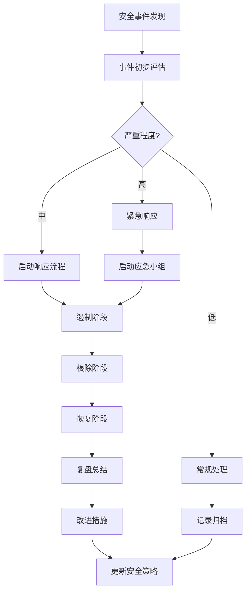

2026-06-25 | Claude Fable 5

# 缘定传媒人 — 安全机制

## 认证体系

### Token 机制

项目使用自实现的 HMAC-SHA256 Token（非标准 JWT）：

```javascript
// 签发
payload = { role, sub, exp: now + 7天 }
encoded = base64url(JSON.stringify(payload))
signature = HMAC-SHA256(encoded, TOKEN_SECRET)
token = `${encoded}.${signature}`

// 验证
[encoded, signature] = token.split(".")
expected = HMAC-SHA256(encoded, TOKEN_SECRET)
// timingSafeEqual 比对签名
// 检查 exp 是否过期
```

| 特性 | 值 |
|------|-----|
| 算法 | HMAC-SHA256 |
| 有效期 | 7 天 |
| 存储位置 | localStorage (`mediapeople-dating-demo-v1:session`) |
| 传输方式 | `Authorization: Bearer <token>` |
| 密钥来源 | 环境变量 `JWT_SECRET` |

### 密码哈希

使用 scrypt 算法：

```javascript
// 哈希
salt = randomBytes(16).toString("hex")
hash = scryptSync(password, salt, 64).toString("hex")
stored = `scrypt$${salt}$${hash}`

// 验证
[, salt, hash] = stored.split("$")
current = scryptSync(password, salt, 64)
timingSafeEqual(current, Buffer.from(hash, "hex"))
```

### 角色权限

| 角色 | 认证接口 | 可用接口 |
|------|----------|----------|
| admin | `POST /api/auth/admin/login` | 所有管理接口、PUT /api/state、POST /api/reset |
| client | `POST /api/auth/client/login` 或 `/register` | 客户资料、VIP 兑换、牵线请求、聊天 |
| matchmaker | `POST /api/auth/matchmaker/login` 或 `/register` | 红娘工作台、标记联系、聊天 |
| 无认证 | - | GET /api/state、GET /api/health |

---

## 接口安全

### 公网屏蔽

Nginx 配置中直接返回 404：

```nginx
location = /api/reset {
    return 404;
}
```

### 数据脱敏

`GET /api/state` 返回前剔除敏感字段：

```javascript
function publicState(data) {
  return {
    ...data,
    users: data.users.map(({ passwordHash, idCard, ...user }) => user),
    matchmakers: data.matchmakers.map(({ passwordHash, ...mm }) => mm),
  };
}
```

### 权限中间件

```javascript
function requireAuth(roles = []) {
  return (req, res, next) => {
    const payload = verifyToken(getBearerToken(req));
    if (!payload) return res.status(401).json({ error: "unauthorized" });
    if (roles.length && !roles.includes(payload.role))
      return res.status(403).json({ error: "forbidden" });
    req.user = payload;
    next();
  };
}
```

### 时序安全比较

Token 签名和密码哈希验证均使用 `crypto.timingSafeEqual` 防止时序攻击。

---

## 网络安全

### 数据库访问

PostgreSQL 仅绑定 `127.0.0.1:5432`，外部无法直接访问。

### API 访问

API 容器不直接暴露端口（`expose: 3000` 而非 `ports`），仅通过 Nginx 反代访问。

### CORS

当前无 CORS 配置，因为前端和 API 在同一域名/端口下。

---

## 已知安全限制

### 当前阶段的妥协

| 项目 | 现状 | 正式上线需改进 |
|------|------|---------------|
| 管理员账号 | `.env` 中的 `ADMIN_PASSWORD` | 改为独立 `admins` 表 |
| 演示登录 | 无密码用户可按 ID 一键登录 | 强制账号密码登录 |
| Token | 自实现 HMAC Token | 可迁移标准 JWT |
| 限流 | 无 | 增加登录限流和写接口限流 |
| 审计日志 | 无 | 增加 `audit_logs` 表 |
| HTTPS | 非标端口 9445-9448 | 标准 443 端口 |
| XSS 防护 | 未转义用户输入 | 增加 HTML 转义 |
| Token 存储 | localStorage | httpOnly Cookie |

### 安全验证清单

```bash
# 1. 未授权 PUT /api/state → 401
curl -w '%{http_code}\n' -X PUT http://uk.sbbz.tech:8098/api/state \
  -H 'Content-Type: application/json' -d '{}'

# 2. 公网 POST /api/reset → 404
curl -w '%{http_code}\n' -X POST http://uk.sbbz.tech:8098/api/reset

# 3. GET /api/state 不返回 passwordHash
curl -sS http://uk.sbbz.tech:8098/api/state | grep passwordHash
# 期望：无输出

# 4. GET /api/state 不返回 idCard
curl -sS http://uk.sbbz.tech:8098/api/state | grep idCard
# 期望：无输出
```

---

## 前端安全

### XSS 防护

前端使用 `textContent` 和模板字符串渲染，对用户输入未做额外转义。当前为演示原型，正式上线需增加 HTML 转义。

### 敏感数据

- `passwordHash` 不返回前端
- `idCard`（身份证号）不返回前端
- Token 存储在 localStorage（正式上线建议改用 httpOnly Cookie）

---

## 攻击面分析

### 当前暴露的攻击面

**1. 管理员密码暴力破解**

- 攻击点：`POST /api/auth/admin/login`
- 风险：无登录限流，可无限尝试
- 缓解：增加 rate limiting（如 express-rate-limit）

**2. 客户/红娘账号枚举**

- 攻击点：`POST /api/auth/client/login`
- 风险：通过错误信息可判断账号是否存在
- 缓解：统一返回"账号或密码错误"

**3. 演示账号一键登录**

- 攻击点：`POST /api/auth/client/login { userId: "u1" }`
- 风险：知道用户 ID 即可登录
- 缓解：正式上线前禁用此功能

**4. 整包状态读取**

- 攻击点：`GET /api/state`
- 风险：返回所有业务数据，包括其他用户的部分信息
- 缓解：按角色拆接口，只返回当前用户需要的数据

**5. 整包状态写入**

- 攻击点：`PUT /api/state`
- 风险：可修改任意数据
- 缓解：拆精细化接口，每个接口只允许修改特定数据

**6. 无审计日志**

- 风险：无法追溯操作历史
- 缓解：增加 `audit_logs` 表

### 已实施的安全措施

1. **Token 认证**：所有写接口都需要认证
2. **角色权限**：不同角色只能访问对应的接口
3. **数据脱敏**：GET /api/state 不返回密码和身份证
4. **公网屏蔽**：/api/reset 公网返回 404
5. **时序安全**：使用 timingSafeEqual 防止时序攻击
6. **密码哈希**：使用 scrypt 算法
7. **请求体限制**：2MB 大小限制
8. **数据库隔离**：PostgreSQL 仅绑定 127.0.0.1

---

## 安全加固建议

### 第一阶段：基础加固

1. 增加登录限流（express-rate-limit）
2. 增加写接口限流
3. 禁用演示账号一键登录
4. 增加 HTML 转义（防止 XSS）

### 第二阶段：架构加固

5. 管理员改为独立 `admins` 表
6. Token 迁移到 httpOnly Cookie
7. 增加 CORS 配置
8. 增加 HTTPS 强制跳转

### 第三阶段：审计与监控

9. 增加 `audit_logs` 表
10. 增加操作日志记录
11. 增加异常登录检测
12. 增加敏感操作二次验证

---

## STRIDE 威胁模型分析

### 概述

STRIDE 是微软提出的威胁模型分类方法，从六个维度系统分析系统面临的安全威胁。

### Spoofing（仿冒）

| 项目 | 内容 |
|------|------|
| **威胁描述** | 攻击者伪装成合法用户或系统组件，骗取信任获取权限 |
| **风险等级** | 高 |
| **典型场景** | 管理员账号暴力破解、Token 伪造、演示账号一键登录滥用、钓鱼攻击 |
| **影响范围** | 认证体系、用户身份、系统权限 |
| **缓解措施** | 1. 增加登录限流（IP + 账号双维度）<br>2. 使用 HMAC-SHA256 签名确保 Token 完整性<br>3. 禁用演示账号一键登录功能<br>4. 统一登录错误提示，避免账号枚举<br>5. 增加异常登录检测（异地/异设备）<br>6. 敏感操作增加二次验证 |

### Tampering（篡改）

| 项目 | 内容 |
|------|------|
| **威胁描述** | 攻击者恶意修改数据或代码，破坏数据完整性 |
| **风险等级** | 高 |
| **典型场景** | 修改他人资料、篡改聊天记录、越权修改系统状态、SQL 注入 |
| **影响范围** | 用户数据、业务数据、系统配置 |
| **缓解措施** | 1. 接口级权限校验，每个操作验证用户身份与资源归属<br>2. 使用参数化查询防止 SQL 注入<br>3. 关键操作记录审计日志<br>4. 数据库字段级完整性约束<br>5. 前端输入校验 + 后端输入校验双重保障<br>6. 文件上传类型白名单 + 内容校验 |

### Repudiation（抵赖）

| 项目 | 内容 |
|------|------|
| **威胁描述** | 用户否认已执行的操作，无法追溯和证明行为责任 |
| **风险等级** | 中 |
| **典型场景** | 用户否认发送消息、否认修改资料、管理员否认敏感操作 |
| **影响范围** | 审计追踪、纠纷处理、合规要求 |
| **缓解措施** | 1. 建立 `audit_logs` 表记录所有关键操作<br>2. 记录操作人、操作时间、IP 地址、操作内容<br>3. 日志不可篡改设计（追加式写入、定期归档）<br>4. 聊天消息带时间戳和发送者签名<br>5. 敏感操作双人复核机制 |

### Information Disclosure（信息泄露）

| 项目 | 内容 |
|------|------|
| **威胁描述** | 未授权的信息暴露，导致敏感数据泄露 |
| **风险等级** | 高 |
| **典型场景** | 身份证号泄露、密码哈希泄露、用户隐私数据泄露、错误信息泄露系统细节 |
| **影响范围** | 用户隐私、商业机密、系统安全 |
| **缓解措施** | 1. 接口返回数据脱敏处理（身份证、密码等）<br>2. 按角色拆接口，只返回必要数据<br>3. 错误信息统一处理，不暴露堆栈和系统细节<br>4. 敏感数据数据库加密存储<br>5. 日志中敏感字段脱敏<br>6. 前端 localStorage 不存储敏感信息<br>7. HTTPS 传输加密 |

### Denial of Service（拒绝服务）

| 项目 | 内容 |
|------|------|
| **威胁描述** | 攻击者耗尽系统资源，导致正常用户无法访问服务 |
| **风险等级** | 中 |
| **典型场景** | 登录接口暴力破解耗尽 CPU、大量请求占满连接池、大文件上传耗尽磁盘 |
| **影响范围** | 服务可用性、用户体验 |
| **缓解措施** | 1. 接口限流（登录接口、写接口）<br>2. 请求体大小限制（2MB）<br>3. 数据库连接池合理配置<br>4. Nginx 层限流和连接数限制<br>5. 异常流量检测与封禁<br>6. 资源隔离，防止单点影响全局 |

### Elevation of Privilege（权限提升）

| 项目 | 内容 |
|------|------|
| **威胁描述** | 低权限用户获取更高权限，越权访问或操作 |
| **风险等级** | 高 |
| **典型场景** | 普通用户越权访问管理接口、修改他人数据、水平越权（A 用户看 B 用户数据） |
| **影响范围** | 系统安全、数据安全、权限体系 |
| **缓解措施** | 1. RBAC 权限模型，接口级角色校验<br>2. 数据级权限校验，验证资源归属<br>3. 管理接口独立路径，严格鉴权<br>4. 最小权限原则，默认权限最小化<br>5. 敏感权限操作记录审计日志<br>6. 定期权限审计与清理 |

---

## 安全防护矩阵

| 攻击类型 | 防护措施 | 实施状态 | 责任模块 |
|----------|----------|----------|----------|
| **暴力破解（登录）** | 登录限流（IP + 账号）、密码强度校验、错误次数锁定 | 待实施 | auth 模块 |
| **SQL 注入** | 参数化查询、输入校验、ORM 使用 | 已实施 | 数据库层 |
| **XSS 跨站脚本** | 输出编码、CSP 策略、输入过滤 | 部分实施（需增强） | 前端 + 后端 |
| **CSRF 跨站请求伪造** | SameSite Cookie、Token 验证、Referer 校验 | 待实施 | 认证模块 |
| **越权访问（垂直）** | RBAC 角色校验、接口权限中间件 | 已实施 | 权限中间件 |
| **越权访问（水平）** | 数据归属校验、用户上下文验证 | 待实施 | 业务逻辑层 |
| **Token 伪造** | HMAC-SHA256 签名、时序安全比较 | 已实施 | Token 模块 |
| **Token 窃取** | httpOnly Cookie、HTTPS 传输、Token 过期机制 | 部分实施 | 认证模块 |
| **敏感数据泄露** | 数据脱敏、传输加密、存储加密 | 部分实施 | 全局 |
| **DDOS 攻击** | Nginx 限流、连接数限制、CDN 防护 | 部分实施 | 基础设施 |
| **文件上传漏洞** | 文件类型白名单、大小限制、内容校验、随机文件名 | 待实施 | 文件模块 |
| **目录遍历** | 路径规范化、白名单校验、权限控制 | 待实施 | 文件模块 |
| **账号枚举** | 统一错误提示、登录响应一致化 | 待实施 | auth 模块 |
| **时序攻击** | timingSafeEqual 常量时间比较 | 已实施 | 密码/Token 模块 |
| **点击劫持** | X-Frame-Options、CSP frame-ancestors | 待实施 | Nginx + 前端 |
| **MIME 嗅探** | X-Content-Type-Options: nosniff | 待实施 | Nginx |
| **信息泄露（错误页）** | 统一错误处理、生产环境禁用堆栈信息 | 待实施 | 全局错误处理 |
| **会话劫持** | 会话过期、异地登录检测、主动登出机制 | 待实施 | 会话管理 |

---

## 安全审计清单

### 代码审计清单

#### 输入验证

- [ ] 所有用户输入是否进行类型校验
- [ ] 字符串输入是否限制长度范围
- [ ] 数字输入是否进行范围校验
- [ ] 枚举值是否在白名单内
- [ ] 特殊字符是否正确处理
- [ ] 文件上传是否验证类型（MIME + 扩展名 + 文件头）
- [ ] 文件上传是否限制大小
- [ ] JSON 输入是否限制深度和大小
- [ ] URL 参数是否进行编码校验
- [ ] 正则表达式是否防止 ReDoS

#### 输出编码

- [ ] HTML 输出是否进行转义（&, <, >, ", ', /）
- [ ] JavaScript 输出是否进行编码
- [ ] CSS 输出是否进行编码
- [ ] URL 参数是否进行 URL 编码
- [ ] JSON 输出是否正确处理特殊字符
- [ ] 富文本内容是否使用白名单过滤
- [ ] 模板引擎是否自动转义
- [ ] 下载文件 Content-Type 和 Content-Disposition 是否正确设置

#### 密码存储

- [ ] 密码是否使用哈希存储（明文禁止）
- [ ] 哈希算法是否足够安全（scrypt/bcrypt/argon2）
- [ ] 是否使用随机盐值（每个用户独立 salt）
- [ ] 盐值长度是否足够（≥16 字节）
- [ ] 哈希迭代次数/成本参数是否合理
- [ ] 密码验证是否使用常量时间比较
- [ ] 密码重置令牌是否一次性且过期
- [ ] 旧密码是否不能从历史哈希还原

#### Token 安全

- [ ] Token 是否使用强签名（HMAC-SHA256 以上）
- [ ] Token 是否设置过期时间
- [ ] Token 签名验证是否使用时序安全比较
- [ ] Token payload 是否不包含敏感信息
- [ ] Token 传输是否使用 HTTPS
- [ ] Token 存储是否安全（httpOnly Cookie 优先）
- [ ] 是否支持 Token 主动失效/登出
- [ ] 是否有 Token 刷新机制
- [ ] 是否有 Token 泄露检测和应急机制

#### 认证与授权

- [ ] 敏感接口是否强制认证
- [ ] 权限校验是否在服务端执行
- [ ] 角色权限是否正确映射
- [ ] 数据级权限是否校验（水平越权）
- [ ] 管理接口是否有额外保护
- [ ] 是否有最小权限原则设计
- [ ] 权限变更是否记录审计日志

### 配置审计清单

#### HTTPS 配置

- [ ] 是否强制 HTTPS（HTTP 跳转 HTTPS）
- [ ] SSL/TLS 版本是否安全（TLS 1.2+，禁用 SSLv3）
- [ ] 密码套件是否安全（禁用弱套件）
- [ ] 证书是否有效且未过期
- [ ] 是否启用 HSTS
- [ ] 是否配置 OCSP Stapling
- [ ] 私钥权限是否正确（600）

#### CORS 配置

- [ ] Access-Control-Allow-Origin 是否限制具体域名
- [ ] 是否禁止 Access-Control-Allow-Credentials 与 * 同时使用
- [ ] Access-Control-Allow-Methods 是否限制必要方法
- [ ] Access-Control-Allow-Headers 是否限制必要头
- [ ] 预检请求缓存时间是否合理

#### 安全响应头

- [ ] X-Content-Type-Options: nosniff
- [ ] X-Frame-Options: DENY/SAMEORIGIN
- [ ] Content-Security-Policy 合理配置
- [ ] X-XSS-Protection（酌情，现代浏览器已废弃）
- [ ] Referrer-Policy 合理配置
- [ ] Strict-Transport-Security
- [ ] 移除服务器版本信息（Server 头）
- [ ] 移除技术栈标识（X-Powered-By 等）

#### 文件权限

- [ ] 配置文件权限是否正确（600/640）
- [ ] 环境变量文件（.env）权限是否为 600
- [ ] 日志文件权限是否合理（640）
- [ ] 上传目录是否禁止执行权限
- [ ] 静态资源目录权限是否只读
- [ ] 进程运行用户是否为非 root
- [ ] 数据库文件权限是否严格限制

#### Nginx 配置

- [ ] 是否隐藏 Nginx 版本号
- [ ] 是否配置请求大小限制（client_max_body_size）
- [ ] 是否配置超时时间（合理范围）
- [ ] 是否限制并发连接数
- [ ] 是否有访问日志和错误日志
- [ ] 敏感路径是否限制访问
- [ ] 是否启用 gzip 压缩（注意 BREACH 攻击风险）

### 数据库审计清单

#### 权限管理

- [ ] 数据库账号是否按应用最小权限分配
- [ ] 是否禁止使用超级账号运行应用
- [ ] 数据库账号密码是否强且定期更换
- [ ] 是否限制数据库连接来源 IP
- [ ] 开发/测试/生产环境是否账号隔离
- [ ] 废弃账号是否及时清理

#### 数据加密

- [ ] 敏感字段是否加密存储（身份证、手机号等）
- [ ] 加密密钥是否安全管理（KMS/环境变量）
- [ ] 加密算法是否安全（AES-256-GCM 等）
- [ ] 密钥是否定期轮换
- [ ] 数据库连接是否使用 SSL/TLS
- [ ] 备份数据是否加密

#### 备份与恢复

- [ ] 是否有定期备份策略
- [ ] 备份频率是否合理（全量+增量）
- [ ] 备份是否加密存储
- [ ] 备份是否离线/异地存储
- [ ] 是否定期测试恢复流程
- [ ] 备份访问权限是否严格控制
- [ ] 备份保留策略是否合规

#### 审计日志

- [ ] 是否启用数据库审计日志
- [ ] 是否记录登录失败事件
- [ ] 是否记录 DDL 操作
- [ ] 是否记录敏感数据访问
- [ ] 日志是否保留足够时长
- [ ] 日志是否防止篡改
- [ ] 是否有日志分析和告警机制

---

## 渗透测试指南

### 测试范围

#### 目标系统

- 缘定传媒人 Web 应用（前端 + 后端 API）
- PostgreSQL 数据库（间接）
- Nginx 反向代理

#### 测试边界

| 范围 | 包含内容 |
|------|----------|
| **认证体系** | 登录接口、Token 机制、密码重置、权限验证 |
| **用户管理** | 注册、资料修改、头像上传、用户信息查询 |
| **业务功能** | 牵线请求、聊天消息、VIP 兑换、红娘工作台 |
| **管理功能** | 管理员登录、系统状态管理、重置接口 |
| **基础设施** | Nginx 配置、响应头、错误页面 |

#### 排除范围

- 物理安全测试
- 社会工程学测试
- DDoS 攻击测试（需单独授权）
- 第三方服务（如云服务、CDN）的测试

### 测试方法

#### 黑盒测试

- 不了解系统内部实现，从攻击者视角进行测试
- 重点测试：认证绕过、输入验证、权限控制、信息泄露

#### 白盒测试

- 结合源代码进行深度测试
- 重点测试：业务逻辑漏洞、代码安全、配置安全

#### 灰盒测试

- 部分了解系统架构，结合内外视角
- 适合本项目：已知接口文档，结合代码进行测试

### 常见漏洞验证

#### SQL 注入

**测试点：**
- 所有用户输入参数（URL 参数、表单字段、JSON 字段）
- 搜索框、排序字段、筛选条件
- 登录接口用户名参数

**测试方法：**
```
# 基础测试
' OR '1'='1
' AND '1'='2
1' ORDER BY 1--
1' UNION SELECT 1,2,3--

# 盲注测试
1' AND SLEEP(5)--
1' AND 1=(SELECT COUNT(*) FROM tablename)--
```

**验证标准：**
- 参数化查询是否正确使用
- 输入是否经过校验和转义
- ORM 是否正确使用，避免拼接 SQL

#### XSS 跨站脚本

**测试点：**
- 所有用户输入展示点（用户昵称、个人简介、聊天消息、搜索结果）
- URL 参数回显处
- 富文本编辑器

**测试方法：**
```
# 反射型 XSS
<script>alert('XSS')</script>

"><script>alert('XSS')</script>

# 存储型 XSS
在昵称、简介等字段输入 XSS payload，查看展示页面

# DOM 型 XSS
查看 URL 参数是否直接用于 DOM 操作
```

**验证标准：**
- 输出是否进行 HTML 转义
- CSP 策略是否生效
- 富文本是否使用白名单过滤

#### CSRF 跨站请求伪造

**测试点：**
- 修改用户信息的 POST/PUT 接口
- 敏感操作接口（改密码、删账号、转账等）

**测试方法：**
1. 用户登录系统 A
2. 用户访问恶意网站 B
3. 网站 B 构造表单自动提交到系统 A 的敏感接口
4. 验证操作是否成功执行

**验证标准：**
- Token 是否放在请求头而非 Cookie（Bearer Token 天然免疫）
- Cookie 是否设置 SameSite 属性
- Referer/Origin 校验是否生效

#### 越权访问（水平越权）

**测试点：**
- 查看他人资料
- 修改他人信息
- 查看他人聊天记录
- 操作他人牵线请求

**测试方法：**
1. 以用户 A 登录，获取资源 ID
2. 以用户 B 登录，构造请求访问/修改用户 A 的资源
3. 验证是否成功

**验证标准：**
- 每个资源操作是否校验归属关系
- 用户 ID 是否从 Token 获取而非请求参数
- 是否有数据级权限控制

#### 越权访问（垂直越权）

**测试点：**
- 普通用户访问管理员接口
- 低权限角色访问高权限接口

**测试方法：**
1. 以普通用户登录获取 Token
2. 使用该 Token 请求管理员接口（如 PUT /api/state）
3. 验证是否返回 403 Forbidden

**验证标准：**
- 每个接口是否校验用户角色
- 权限中间件是否正确配置
- 管理接口是否有额外保护

#### 暴力破解

**测试点：**
- 登录接口
- 密码重置接口
- 验证码接口

**测试方法：**
1. 准备常用密码字典
2. 使用脚本批量尝试登录
3. 记录成功次数和响应时间

**验证标准：**
- 是否有登录次数限制
- 是否有 IP 限流
- 是否有账号锁定机制
- 错误提示是否统一

#### 敏感信息泄露

**测试点：**
- 错误页面是否泄露堆栈信息
- 接口是否返回多余字段
- 响应头是否泄露技术栈
- robots.txt 是否泄露敏感路径
- 注释中是否有敏感信息

**测试方法：**
- 触发错误查看响应内容
- 检查 GET /api/state 返回字段
- 查看 HTTP 响应头
- 访问 /robots.txt、/.env、/.git 等常见敏感路径

**验证标准：**
- 生产环境是否禁用详细错误
- 接口返回是否按需脱敏
- 版本信息是否隐藏

### 测试工具推荐

#### 自动化扫描工具

| 工具 | 用途 | 说明 |
|------|------|------|
| **Burp Suite** | 综合渗透测试 | 行业标准，社区版免费可用 |
| **OWASP ZAP** | Web 漏洞扫描 | 开源免费，适合自动化扫描 |
| **Nikto** | Web 服务器扫描 | 快速扫描配置漏洞和敏感文件 |
| **Nmap** | 端口扫描 | 发现开放端口和服务版本 |
| **SQLMap** | SQL 注入检测 | 自动化 SQL 注入探测和利用 |

#### 专项测试工具

| 工具 | 用途 | 说明 |
|------|------|------|
| **Hashcat** | 密码破解 | 测试密码哈希强度 |
| **Hydra** | 暴力破解 | 登录接口暴力测试 |
| **Dirbuster / Gobuster** | 目录爆破 | 发现隐藏路径和文件 |
| **Wfuzz** | Web 模糊测试 | 参数爆破和漏洞挖掘 |
| **Postman / curl** | 接口测试 | 手动构造请求测试 |

#### 浏览器插件

| 插件 | 用途 | 说明 |
|------|------|------|
| **Burp Suite CA** | HTTPS 抓包 | 配合 Burp 使用 |
| **Cookie-Editor** | Cookie 管理 | 测试 Cookie 安全 |
| **HackBar** | SQL/XSS 测试 | 快速构造 payload |
| **Wappalyzer** | 技术栈识别 | 识别网站使用的技术 |

---

## 数据分级与保护

### 数据分级定义

#### 公开级（Public）

| 属性 | 说明 |
|------|------|
| **定义** | 可向公众公开，不涉及任何敏感信息的数据 |
| **影响** | 泄露不会造成任何损失 |
| **示例** | 系统公告、公开活动信息、红娘公开简介 |

#### 内部级（Internal）

| 属性 | 说明 |
|------|------|
| **定义** | 仅限内部人员使用，不对外公开的数据 |
| **影响** | 泄露可能造成轻微损失，不涉及个人隐私 |
| **示例** | 内部统计数据、非敏感运营数据、系统状态概览 |

#### 敏感级（Sensitive）

| 属性 | 说明 |
|------|------|
| **定义** | 涉及个人隐私或商业秘密，泄露可能造成较大损失的数据 |
| **影响** | 泄露可能导致个人隐私侵害、商业利益受损 |
| **示例** | 用户手机号、用户照片、聊天记录、牵线请求详情 |

#### 机密级（Confidential）

| 属性 | 说明 |
|------|------|
| **定义** | 高度敏感，泄露可能造成严重后果的数据 |
| **影响** | 泄露可能导致法律风险、重大经济损失、严重隐私侵害 |
| **示例** | 密码哈希、身份证号、支付信息、系统密钥、管理员凭证 |

### 各级别数据清单

#### 公开级数据清单

| 数据项 | 存储位置 | 访问方式 |
|--------|----------|----------|
| 系统公告 | state.json / DB | 公开访问 |
| 红娘公开头像 | 文件存储 | 公开访问 |
| 红娘公开昵称 | state.json / DB | 公开访问 |
| 系统健康状态 | GET /api/health | 公开访问 |

#### 内部级数据清单

| 数据项 | 存储位置 | 访问角色 |
|--------|----------|----------|
| 用户数量统计 | state.json / DB | 管理员 |
| 牵线成功率统计 | state.json / DB | 管理员 |
| VIP 会员统计 | state.json / DB | 管理员 |
| 系统运行状态 | GET /api/state（部分） | 管理员 |

#### 敏感级数据清单

| 数据项 | 存储位置 | 访问角色 | 加密要求 |
|--------|----------|----------|----------|
| 用户手机号 | users 表 | 管理员、对应红娘 | 传输加密 |
| 用户头像 | 文件存储 | 认证用户 | - |
| 用户基本资料 | users 表 | 管理员、对应红娘、本人 | - |
| 聊天记录 | chat_messages 表 | 聊天双方、管理员（审计） | 传输加密 |
| 牵线请求详情 | match_requests 表 | 相关用户、管理员 | - |
| VIP 购买记录 | vip_orders 表 | 本人、管理员 | - |

#### 机密级数据清单

| 数据项 | 存储位置 | 访问角色 | 加密要求 |
|--------|----------|----------|----------|
| 密码哈希 | users / matchmakers / admins 表 | 系统内部（不对外） | 哈希存储（scrypt） |
| 身份证号 | users 表 | 仅管理员 | 数据库字段加密 |
| 支付信息 | 支付记录表 | 管理员、财务系统 | 字段加密 + 传输加密 |
| TOKEN_SECRET | 环境变量 | 系统运维人员 | 环境变量管理 |
| 数据库密码 | 环境变量 | 系统运维人员 | 环境变量管理 |
| 管理员账号密码 | 环境变量 / admins 表 | 管理员本人 | 哈希存储 |

### 保护措施

#### 加密措施

| 加密类型 | 适用级别 | 算法/方法 | 实施位置 |
|----------|----------|-----------|----------|
| **传输加密** | 敏感级及以上 | TLS 1.2+（HTTPS） | Nginx 层 |
| **密码哈希** | 机密级 | scrypt（16字节salt，64字节hash） | 应用层 |
| **字段加密** | 机密级（身份证等） | AES-256-GCM | 应用层 |
| **文件加密** | 机密级文件 | AES-256 | 存储层 |
| **备份加密** | 敏感级及以上 | AES-256 | 备份系统 |

#### 脱敏措施

| 脱敏类型 | 适用场景 | 脱敏规则 | 示例 |
|----------|----------|----------|------|
| **手机号脱敏** | 列表展示、非必要场景 | 保留前3后4，中间用*代替 | 138****1234 |
| **身份证脱敏** | 非必要场景 | 保留前6后4，中间用*代替 | 110101********1234 |
| **姓名脱敏** | 部分公开场景 | 保留姓，名用*代替 | 张*、李** |
| **邮箱脱敏** | 公开场景 | 保留前2字符和域名 | zh***@example.com |
| **地址脱敏** | 公开场景 | 仅保留城市 | 北京市 |

#### 访问控制措施

| 控制措施 | 适用级别 | 实现方式 |
|----------|----------|----------|
| **公开访问** | 公开级 | 无需认证 |
| **认证访问** | 内部级 | Token 认证 |
| **角色访问** | 敏感级 | RBAC 角色权限控制 |
| **数据归属校验** | 敏感级 | 验证资源归属用户 |
| **最小权限原则** | 全部级别 | 默认权限最小化 |
| **审计日志** | 敏感级及以上 | 记录访问和操作日志 |
| **定期权限审计** | 敏感级及以上 | 定期清理和审查权限 |

---

## 身份认证与访问控制详解

### 认证流程

#### 用户登录流程

```
用户输入账号密码
       ↓
前端校验（格式、非空）
       ↓
POST /api/auth/{role}/login
       ↓
后端参数校验
       ↓
根据账号查询用户
       ↓
提取存储的 salt 和 hash
       ↓
scryptSync(password, salt, 64) 计算当前哈希
       ↓
timingSafeEqual 比较哈希
       ↓
验证成功？──────否──────→ 统一返回"账号或密码错误"
       │
       是
       ↓
生成 Token payload
{ role, sub, exp: now + 7天 }
       ↓
base64url 编码 payload
       ↓
HMAC-SHA256 计算签名
       ↓
组装 Token: {encoded}.{signature}
       ↓
返回 Token 和用户信息
       ↓
前端存储 Token（localStorage）
```

#### Token 验证流程

```
HTTP 请求（携带 Authorization: Bearer <token>）
       ↓
权限中间件 requireAuth
       ↓
提取 Bearer Token
       ↓
拆分 encoded 和 signature
       ↓
HMAC-SHA256(encoded, TOKEN_SECRET) 计算期望签名
       ↓
timingSafeEqual 比较签名
       ↓
签名有效？──────否──────→ 401 Unauthorized
       │
       是
       ↓
base64url 解码 payload
       ↓
检查 exp 是否过期
       ↓
未过期？──────否──────→ 401 Unauthorized
       │
       是
       ↓
检查角色权限（如有指定 roles）
       ↓
角色通过？──────否──────→ 403 Forbidden
       │
       是
       ↓
req.user = payload
       ↓
执行业务逻辑
```

### Token 生命周期

#### Token 结构

```
Token = base64url(payload) + "." + base64url(signature)

Payload 结构：
{
  "role": "client",        // 用户角色：admin/client/matchmaker
  "sub": "u1",             // 用户标识
  "exp": 1719273600,       // 过期时间戳（秒）
  "iat": 1718668800        // 签发时间（可选）
}
```

#### Token 有效期

| 参数 | 值 | 说明 |
|------|-----|------|
| **有效期** | 7 天 | 从签发时间开始计算 |
| **存储方式** | localStorage | 当前演示版本，正式版建议 httpOnly Cookie |
| **传输方式** | Authorization: Bearer <token> | HTTP 请求头 |
| **签名算法** | HMAC-SHA256 | 对称加密签名 |
| **密钥长度** | ≥ 32 字节 | TOKEN_SECRET 环境变量 |

#### Token 状态

| 状态 | 说明 | 处理方式 |
|------|------|----------|
| **有效** | 签名正确且未过期 | 正常放行 |
| **过期** | exp 已过当前时间 | 返回 401，提示重新登录 |
| **无效签名** | 签名验证失败 | 返回 401 |
| **格式错误** | Token 格式不正确 | 返回 401 |
| **主动失效** | 用户登出/修改密码 | 前端清除 Token（服务端无状态） |

#### Token 安全建议

| 建议项 | 当前状态 | 目标状态 | 优先级 |
|--------|----------|----------|--------|
| 存储方式改为 httpOnly Cookie | localStorage | httpOnly Cookie | 高 |
| 增加 Token 刷新机制 | 无 | refresh_token + access_token | 中 |
| 支持 Token 主动黑名单 | 无（无状态） | Redis 黑名单 / 短有效期 | 中 |
| 缩短 Token 有效期 | 7 天 | 2 小时（配合刷新） | 中 |
| 增加 Token 绑定（IP/UA） | 无 | 可选绑定 | 低 |

### 权限模型（RBAC）

#### 角色定义

| 角色 | 标识 | 说明 | 典型用户 |
|------|------|------|----------|
| **管理员** | admin | 系统最高权限，管理所有功能 | 平台运营人员 |
| **红娘** | matchmaker | 红娘工作台，处理牵线业务 | 平台认证红娘 |
| **客户** | client | 普通用户，使用牵线服务 | 注册用户 |
| **访客** | anonymous | 未认证用户，仅可访问公开接口 | 未登录访问者 |

#### 权限矩阵

| 功能模块 | 操作 | admin | matchmaker | client | anonymous |
|----------|------|-------|------------|--------|-----------|
| **认证** | 管理员登录 | ✓ | - | - | ✓ |
| | 红娘登录/注册 | - | ✓ | - | ✓ |
| | 客户登录/注册 | - | - | ✓ | ✓ |
| **系统状态** | 读取状态 | ✓ | - | - | ✓（脱敏） |
| | 修改状态 | ✓ | - | - | - |
| **系统重置** | 重置数据 | ✓ | - | - | - |
| **用户管理** | 查看用户列表 | ✓ | - | - | - |
| | 查看用户详情 | ✓ | 部分 | 本人 | - |
| | 修改用户信息 | ✓ | - | 本人 | - |
| **牵线请求** | 创建请求 | - | - | ✓ | - |
| | 查看请求列表 | ✓ | 分配给自己的 | 本人的 | - |
| | 处理请求 | ✓ | ✓ | - | - |
| **聊天** | 发送消息 | - | ✓ | ✓ | - |
| | 查看聊天记录 | ✓ | 参与的会话 | 参与的会话 | - |
| **VIP 管理** | VIP 兑换 | - | - | ✓ | - |
| | VIP 配置 | ✓ | - | - | - |
| **工作台** | 红娘工作台 | - | ✓ | - | - |

#### 权限校验层次

1. **接口级权限**：路由中间件校验角色
   ```javascript
   // 示例：管理员接口
   app.put('/api/state', requireAuth(['admin']), (req, res) => { ... })
   ```

2. **数据级权限**：业务逻辑中校验资源归属
   ```javascript
   // 示例：只能查看自己的牵线请求
   const request = await db.getMatchRequest(req.params.id)
   if (request.clientId !== req.user.sub) {
     return res.status(403).json({ error: 'forbidden' })
   }
   ```

3. **字段级权限**：返回数据时按角色脱敏
   ```javascript
   // 示例：不同角色返回不同字段
   if (req.user.role === 'admin') {
     return user // 完整信息
   } else if (req.user.role === 'matchmaker') {
     return { id, name, phone, ... } // 部分信息
   } else {
     return { id, name, avatar, ... } // 公开信息
   }
   ```

### 会话管理

#### 当前会话机制

| 特性 | 当前实现 | 说明 |
|------|----------|------|
| **会话存储** | 无状态（Token） | 服务端不存储会话 |
| **会话标识** | Token | 包含用户信息和过期时间 |
| **过期方式** | 自动过期 | exp 字段控制 |
| **主动登出** | 前端清除 Token | 服务端无法主动失效 |
| **并发会话** | 不限制 | 同一账号可多端登录 |

#### 会话管理增强建议

| 增强项 | 方案 | 优先级 |
|--------|------|--------|
| **会话列表** | 数据库存储活跃会话，用户可查看和管理 | 中 |
| **异地登录检测** | 记录登录 IP/UA，异常时提醒用户 | 中 |
| **单设备登录** | 新登录时失效旧 Token | 低 |
| **会话超时** | 长时间无操作自动过期 | 低 |
| **登录日志** | 记录所有登录事件，供审计和用户查看 | 中 |

### 多因素认证方案建议

#### 适用场景

- 管理员账号登录
- 敏感操作二次验证（如修改密码、删除账号）
- 异常登录时的验证

#### 可选方案对比

| 方案 | 安全性 | 用户体验 | 实现成本 | 适用场景 |
|------|--------|----------|----------|----------|
| **短信验证码** | 中 | 好 | 中 | 客户/红娘登录 |
| **邮箱验证码** | 中 | 好 | 低 | 密码重置、验证邮箱 |
| **TOTP（谷歌验证器）** | 高 | 一般 | 中 | 管理员登录 |
| **邮件验证码** | 中 | 好 | 低 | 辅助验证 |
| **生物识别** | 高 | 好 | 高 | 移动端 App |

#### 推荐实施方案

**第一阶段（基础）：**
- 管理员登录增加邮箱验证码
- 密码重置使用邮箱验证码

**第二阶段（增强）：**
- 管理员支持 TOTP 动态令牌
- 异常登录触发邮箱验证
- 敏感操作（如数据导出）二次验证

**第三阶段（完整）：**
- 所有角色可选开启 MFA
- 支持多种验证方式
- 增加登录风险评估

---

## 安全事件响应流程

### 流程图



### 各阶段详细操作

#### 1. 发现阶段（Detection）

**触发来源：**
- 安全监控告警（异常登录、异常流量）
- 用户反馈（账号被盗、数据异常）
- 内部审计发现
- 第三方安全通告
- 渗透测试发现

**操作步骤：**
1. 记录事件基本信息
   - 发现时间
   - 发现人
   - 事件描述
   - 影响范围初步判断

2. 初步信息收集
   - 相关日志提取
   - 受影响系统确认
   - 涉及数据范围初步判断

**输出物：**
- 安全事件报告单
- 初步证据收集

#### 2. 评估阶段（Assessment）

**评估内容：**
- 事件类型判断（数据泄露？越权访问？系统入侵？）
- 影响范围评估
- 严重程度定级
- 业务影响分析

**严重程度分级：**

| 等级 | 定义 | 响应要求 | 示例 |
|------|------|----------|------|
| **高危** | 核心系统被入侵、大量敏感数据泄露、服务大面积中断 | 立即启动应急小组，1小时内响应 | 数据库被拖库、管理员账号泄露 |
| **中危** | 部分数据泄露、单系统受影响、有限服务中断 | 2小时内启动响应流程 | 个别用户账号被盗、部分接口越权 |
| **低危** | 影响有限，无实质损失 | 常规处理，记录归档 | 信息泄露风险、低危配置问题 |

**操作步骤：**
1. 组建临时评估小组
2. 收集更多证据
3. 评估影响范围和严重程度
4. 确定响应级别
5. 通知相关人员

**输出物：**
- 事件评估报告
- 响应级别确认
- 相关人员通知记录

#### 3. 遏制阶段（Containment）

**目标：** 防止事件扩大，将影响控制在最小范围

**常用遏制措施：**

| 措施类型 | 具体操作 | 适用场景 |
|----------|----------|----------|
| **账号封禁** | 禁用可疑账号、强制登出 | 账号被盗、暴力破解 |
| **IP 封禁** | Nginx/防火墙封禁攻击 IP | DDoS、扫描攻击 |
| **接口限流** | 临时加强接口限流 | 暴力破解、爬虫 |
| **系统隔离** | 将受影响系统从网络隔离 | 系统被入侵 |
| **服务降级** | 暂停非核心功能 | 服务压力过大 |
| **数据保护** | 备份关键数据，防止被篡改 | 勒索软件、数据破坏 |

**操作步骤：**
1. 根据事件类型选择遏制措施
2. 执行遏制操作
3. 监控遏制效果
4. 持续观察是否有新的攻击

**输出物：**
- 遏制措施执行记录
- 实时监控报告
- 影响范围确认

#### 4. 根除阶段（Eradication）

**目标：** 彻底清除威胁，修复漏洞

**操作内容：**
- 分析攻击入口和原因
- 修复安全漏洞
- 清除恶意代码/后门
- 清理被篡改的数据
- 加强相关防护措施

**操作步骤：**
1. 深入分析攻击路径和方法
2. 确认所有受影响的系统和数据
3. 制定修复方案
4. 实施修复（代码修复、配置修复等）
5. 验证修复效果
6. 检查是否有其他类似漏洞

**输出物：**
- 根因分析报告
- 修复方案
- 修复验证记录

#### 5. 恢复阶段（Recovery）

**目标：** 恢复系统正常运行，确保安全

**恢复优先级：**
1. 核心业务系统
2. 重要业务系统
3. 辅助系统
4. 非关键系统

**操作步骤：**
1. 确认安全漏洞已修复
2. 从备份恢复数据（如需要）
3. 逐步恢复系统服务
4. 监控系统运行状态
5. 确认业务正常
6. 通知用户恢复情况

**输出物：**
- 恢复计划
- 恢复执行记录
- 系统运行验证报告

#### 6. 复盘阶段（Lessons Learned）

**目标：** 总结经验教训，防止类似事件再次发生

**复盘内容：**
- 事件时间线梳理
- 响应过程评估
- 根本原因分析
- 防护措施改进建议
- 响应流程改进建议

**操作步骤：**
1. 召开复盘会议（相关人员参与）
2. 梳理事件完整时间线
3. 分析哪些做得好，哪些做得不好
4. 提出改进措施
5. 制定改进计划
6. 更新安全策略和响应流程

**输出物：**
- 事件复盘报告
- 改进措施清单
- 安全策略更新
- 响应流程优化

### 应急组织架构

| 角色 | 职责 | 人员 |
|------|------|------|
| **应急总指挥** | 决策、协调资源、对外沟通 | 技术负责人 / CTO |
| **技术响应组** | 技术分析、漏洞修复、系统恢复 | 开发工程师、运维工程师 |
| **安全分析组** | 事件分析、溯源、安全加固 | 安全工程师 |
| **业务协调组** | 业务影响评估、用户沟通 | 运营、产品 |
| **法务合规组** | 法律风险评估、合规处理 | 法务、合规 |

### 关键联系方式

| 角色/部门 | 联系方式 | 响应时间 |
|-----------|----------|----------|
| 技术负责人 | （待补充） | 7x24 小时 |
| 安全负责人 | （待补充） | 7x24 小时 |
| 运维团队 | （待补充） | 工作时间 30 分钟内 |
| 开发团队 | （待补充） | 工作时间 1 小时内 |

---

## 合规性考量

### 个人信息保护法（PIPL）要点

#### 法律依据

《中华人民共和国个人信息保护法》于 2021 年 11 月 1 日起施行，是我国个人信息保护领域的基础性法律。

#### 核心原则

| 原则 | 含义 | 本系统对应措施 |
|------|------|----------------|
| **合法、正当、必要** | 处理个人信息应有合法理由，不得过度处理 | 仅收集必要信息，明确告知用途 |
| **知情同意** | 个人有权知晓并同意其信息被处理 | 用户注册时同意隐私政策，敏感信息单独同意 |
| **目的明确** | 处理目的明确、合理，与目的直接相关 | 明确各数据项的使用目的 |
| **最小必要** | 只收集实现处理目的所必需的最少信息 | 仅收集牵线服务必需的信息 |
| **公开透明** | 处理规则应公开，信息处理应透明 | 隐私政策公开，处理规则可查询 |
| **质量保证** | 保证个人信息准确、完整 | 用户可自行修改个人信息 |
| **安全保障** | 采取必要措施保障个人信息安全 | 加密存储、访问控制、安全审计 |
| **责任承担** | 信息处理者对其处理活动负责 | 明确数据安全责任人 |

#### 个人信息处理规则

**告知义务：**
- 处理者的名称和联系方式
- 个人信息的处理目的、处理方式
- 处理的个人信息种类
- 个人行使权利的方式和程序
- 保存期限

**同意要求：**
- 应当在充分知情的前提下自愿、明确作出同意
- 敏感个人信息需取得单独同意
- 个人有权撤回同意
- 不得以个人不同意为由拒绝提供产品或服务（非必需功能）

### 数据最小化原则

#### 收集范围最小化

| 数据项 | 是否必需 | 用途 | 备注 |
|--------|----------|------|------|
| **手机号** | 是 | 账号登录、身份验证 | 核心标识 |
| **密码** | 是 | 账号安全 | 哈希存储 |
| **昵称** | 是 | 展示用名 | 可自定义 |
| **性别** | 是 | 牵线匹配 | 基础信息 |
| **年龄** | 是 | 牵线匹配 | 基础信息 |
| **头像** | 否 | 个人展示 | 可选上传 |
| **身高** | 否 | 牵线匹配 | 选填 |
| **学历** | 否 | 牵线匹配 | 选填 |
| **职业** | 否 | 牵线匹配 | 选填 |
| **收入** | 否 | 牵线匹配 | 选填 |
| **兴趣爱好** | 否 | 牵线匹配 | 选填 |
| **自我介绍** | 否 | 个人展示 | 选填 |
| **身份证号** | 否 | 实名认证 | 敏感信息，仅在需要时收集 |
| **真实姓名** | 否 | 实名认证 | 选填 |

#### 使用范围最小化

- 不将收集的个人信息用于告知以外的目的
- 数据分析使用匿名化或去标识化数据
- 内部访问按最小权限分配
- 第三方共享需用户明确同意

#### 存储期限最小化

| 数据类型 | 存储期限 | 到期处理 |
|----------|----------|----------|
| **账号信息** | 账号存续期间 | 注销后删除或匿名化 |
| **聊天记录** | （待确定） | 定期清理（建议 1-2 年） |
| **登录日志** | 6 个月 - 1 年 | 到期删除或归档 |
| **操作日志** | 1 - 3 年 | 到期删除或归档 |
| **审计日志** | 3 - 5 年 | 到期删除或归档 |
| **备份数据** | （根据备份策略） | 按备份周期覆盖 |

### 用户知情权

#### 隐私政策

**隐私政策应当包含：**
1. 我们是谁（处理者信息）
2. 我们收集哪些信息
3. 我们如何使用信息
4. 我们如何共享、转让、公开披露信息
5. 我们如何存储和保护信息
6. 用户的权利
7. 未成年人保护
8. Cookie 使用说明
9. 政策更新
10. 联系方式

**展示要求：**
- 注册时主动展示并要求同意
- 应用内可随时查看
- 重要变更需重新取得同意
- 清晰易懂，避免专业术语

#### 告知场景

| 场景 | 告知方式 |
|------|----------|
| **注册账号** | 隐私政策弹窗，需主动勾选同意 |
| **收集敏感信息** | 单独告知用途，取得单独同意 |
| **使用定位信息** | 系统权限申请 + 用途说明 |
| **第三方共享** | 提前告知并取得同意 |
| **政策变更** | 系统通知 + 弹窗告知 |

### 数据删除权

#### 用户删除权内容

《个人信息保护法》赋予个人以下权利：
- **删除权**：个人有权请求删除其个人信息
- **更正权**：个人有权更正不准确的个人信息
- **查阅权**：个人有权查阅其个人信息
- **复制权**：个人有权复制其个人信息
- **注销权**：个人有权注销账号

#### 删除触发条件

1. 用户主动申请删除
2. 用户注销账号
3. 处理目的已实现、无法实现或不再必要
4. 不再提供产品或服务
5. 保存期限已届满
6. 用户撤回同意
7. 处理行为违反法律法规

#### 删除流程

```
用户提交删除/注销申请
       ↓
验证用户身份
       ↓
告知删除后果
（账号不可恢复、数据删除等）
       ↓
用户确认
       ↓
执行删除操作
       ├─ 用户基本信息删除/匿名化
       ├─ 聊天记录处理（按法规要求）
       ├─ 操作日志处理（按法规要求）
       └─ 备份数据处理（定期清理时删除）
       ↓
删除完成
       ↓
通知用户删除结果
```

#### 例外情况

有下列情形之一的，不需删除：
- 法律、行政法规规定的保存期限未届满
- 删除个人信息从技术上难以实现
- 为公共利益实施的处理活动

（注：上述情形下应停止除存储和采取必要安全保护措施之外的处理）

### 隐私政策要点

#### 信息收集分类

**1. 基本信息**
- 手机号：用于账号注册、登录、身份验证
- 密码：用于账号安全（加密存储）
- 昵称、头像、性别、年龄：用于个人展示和牵线匹配

**2. 完善资料信息（选填）**
- 身高、学历、职业、收入、兴趣爱好、自我介绍
- 用于更精准的牵线匹配

**3. 实名认证信息（选填）**
- 真实姓名、身份证号
- 用于身份真实性验证
- 属于敏感个人信息，加密存储

**4. 使用信息**
- 登录日志、操作日志
- 用于安全审计和服务优化

**5. 设备信息**
- IP 地址、设备型号、操作系统
- 用于安全风控

#### 信息使用目的

1. **提供服务**：账号管理、牵线匹配、聊天沟通
2. **安全保障**：账号安全、反欺诈、风险控制
3. **服务优化**：产品改进、用户体验提升
4. **客户服务**：响应用户咨询和反馈

#### 信息共享

**不共享原则：** 未经用户同意，不向第三方共享个人信息

**例外情形：**
- 法律要求（司法机关依法定程序）
- 为保护用户或公众权益（紧急情况）
- 与关联公司共享（必要且遵循本政策）
- 用户明确同意

#### 安全保护措施

- 密码使用 scrypt 哈希存储
- 敏感数据加密存储
- HTTPS 传输加密
- 访问权限控制
- 安全审计日志
- 定期安全评估

#### 用户权利实现方式

| 权利 | 实现方式 |
|------|----------|
| **查阅个人信息** | 个人中心 - 我的资料 |
| **更正个人信息** | 个人中心 - 编辑资料 |
| **删除个人信息** | 联系客服申请 |
| **注销账号** | 设置 - 注销账号 |
| **撤回同意** | 设置 - 隐私设置 |
| **获取个人信息副本** | 联系客服申请 |

### 合规建议清单

- [ ] 制定并公开隐私政策
- [ ] 用户注册时要求同意隐私政策
- [ ] 敏感信息收集前取得单独同意
- [ ] 建立用户数据查询、更正、删除流程
- [ ] 建立账号注销机制
- [ ] 明确数据保存期限
- [ ] 定期进行数据安全评估
- [ ] 建立数据安全事件应急响应机制
- [ ] 员工数据安全培训
- [ ] 第三方数据处理合规审查
