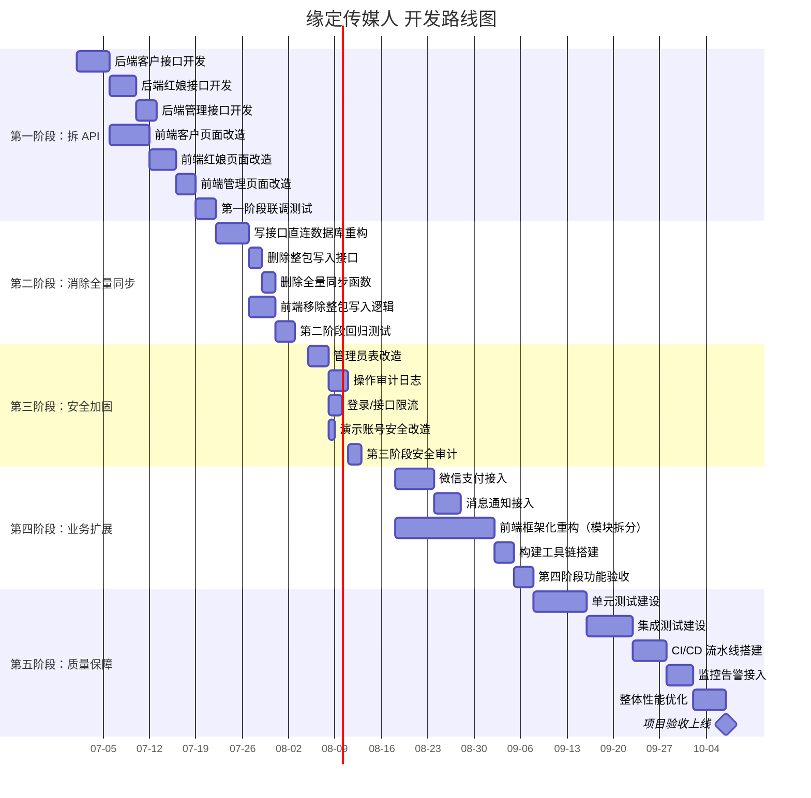

2026-06-27 | Codex 修订

# 缘定传媒人 — 技术债务与开发路线

## 2026-06-27 当前修订摘要

本文件已按当前路线修订：优先继续推进 uniapp 小程序化、拆分旧静态 app.js、完善角色权限和资料审核；旧整包 state 兼容层仍是主要技术债务。

如本文下方旧段落与本摘要或 `说明/10-操作手册.md` 冲突，以 `说明/10-操作手册.md` 和当前线上实测流程为准。


## 当前技术债务

### 1. 整包读写模式

**问题**：`PUT /api/state` 仍是整包写入，前端每次操作都发送完整 state JSON。

**影响**：

- 网络传输量大（随数据增长线性增加）
- 并发写入冲突风险（后写覆盖先写）
- 数据库写入压力大

**改进方向**：拆角色 API，各接口直接操作数据库单表。

### 2. syncNormalizedState() 全表重写

**问题**：`syncNormalizedState()` 会对每张业务表执行 UPSERT + DELETE，本质上是全量替换。

**影响**：

- 数据量大后事务锁时间长
- DELETE 操作在外键约束下可能级联删除
- 高并发下数据不一致风险

**改进方向**：改为单表 upsert 或资源接口直接写表，删除全量同步。

### 3. 大包 GET /api/state

**问题**：`GET /api/state` 返回全部业务数据（用户、红娘、机构、请求、聊天、成交、兑换码）。

**影响**：

- 前端 4 秒轮询传输量大
- 包含大量当前用户不需要的数据

**改进方向**：按角色拆接口（`/api/client/me`、`/api/matchmaker/workbench` 等）。

### 4. 演示账号一键登录

**问题**：无密码的老演示账号允许按 `userId` 直接登录。

**影响**：任何人知道用户 ID 即可冒充登录。

**改进方向**：正式上线前改为强制账号密码登录。

### 5. 管理员无独立表

**问题**：管理员密码来自 `.env` 的 `ADMIN_PASSWORD`，没有 `admins` 表。

**影响**：

- 无法支持多管理员
- 密码未哈希存储
- 无法记录管理员操作日志

**改进方向**：增加 `admins` 表，密码强制后端哈希。

### 6. 自实现 Token

**问题**：Token 是自实现的 HMAC-SHA256，非标准 JWT。

**影响**：

- 无法与第三方工具互操作
- 自行处理过期验证

**改进方向**：可继续用（已稳定工作），也可迁移到标准 JWT。

### 7. 前端单文件过大

**问题**：`app.js` 约 3900 行，所有角色的逻辑混在一起。

**影响**：

- 维护困难
- 无法按角色分块加载

**改进方向**：拆分为模块或引入构建工具。

### 8. 无测试

**问题**：无单元测试、集成测试、端到端测试。

**影响**：改代码只能靠手动验证。

**改进方向**：增加关键流程的自动化测试。

---

## 开发路线（建议顺序）

### 第一阶段：拆 API（减少 /api/state 依赖）

**客户接口**：

- `GET /api/client/me` — 获取当前客户信息
- `PATCH /api/client/me` — 修改个人资料（已有 `/api/client/profile`）
- `POST /api/client/real-name` — 实名认证（已有）
- `GET /api/client/profiles` — 获取可浏览的异性列表
- `POST /api/client/vip/redeem` — VIP 兑换（已有）
- `POST /api/client/match-requests` — 申请牵线（已有）
- `GET /api/client/match-requests` — 获取牵线请求列表

**红娘接口**：

- `GET /api/matchmaker/workbench` — 工作台数据
- `GET /api/matchmaker/requests` — 牵线请求列表
- `PATCH /api/matchmaker/requests/:id/contacted` — 标记已联系（已有）

**后台接口**：

- `GET /api/admin/metrics` — 数据指标
- `GET /api/admin/customers` — 客户列表
- `GET /api/admin/agencies` — 机构列表
- `POST /api/admin/agencies` — 添加机构（已有）
- `GET /api/admin/matchmakers` — 红娘列表
- `POST /api/admin/matchmakers` — 添加红娘（已有）
- `GET /api/admin/promo-codes` — 兑换码列表
- `POST /api/admin/promo-codes` — 生成兑换码（已有）
- `GET /api/admin/splits` — 获取分成比例
- `PATCH /api/admin/splits` — 修改分成（已有）

### 第二阶段：消除全量同步

- 删除 `syncNormalizedState()` 的 truncate 全表重写
- 改为各接口直接写对应的业务表
- 前端改为调用精细化 API，不再 `PUT /api/state`

### 第三阶段：安全加固

- 增加 `audit_logs` 操作日志表
- 增加登录限流（rate limiting）
- 增加写接口限流
- 管理员改为独立 `admins` 表，密码强制后端哈希

### 第四阶段：业务扩展

- 支付接入微信支付，VIP 开通由支付回调写订单和分成流水
- 通知接入微信订阅消息、短信或企业微信
- 前端框架化重构（Vue/React）

### 第五阶段：质量保障

- 增加单元测试和集成测试
- 增加 CI/CD 流水线
- 增加监控和告警

---

## 已完成的精细化接口

以下接口已实现，可直接替代对应功能的整包读写：

| 接口 | 方法 | 说明 |
|------|------|------|
| `/api/client/profile` | PATCH | 修改客户资料 |
| `/api/client/real-name` | POST | 实名认证 |
| `/api/client/vip/redeem` | POST | VIP 兑换 |
| `/api/client/match-requests` | POST | 申请牵线 |
| `/api/matchmaker/requests/:id/contacted` | PATCH | 标记联系 |
| `/api/matchmaker/requests/:id/member-chat` | PATCH | 开启会员互聊 |
| `/api/matchmaker/requests/:id/member-chat` | PATCH | 开关会员互聊 |
| `/api/matchmaker/users/:id/profile-review` | PATCH | 审核客户资料 |
| `/api/chat/threads/:id/messages` | POST | 发送聊天消息 |
| `/api/admin/agencies` | POST | 添加机构 |
| `/api/admin/matchmakers` | POST | 添加红娘 |
| `/api/admin/splits` | PATCH | 修改分成 |
| `/api/admin/promo-codes` | POST | 生成兑换码 |
| `/api/admin/deals/simulate` | POST | 模拟成交 |

---

## 迁移策略

### 从整包读写迁移到精细化 API

**步骤 1：后端新增接口**

- 为每个业务操作新增独立的 REST API
- 接口直接操作数据库单表，不经过 syncNormalizedState()

**步骤 2：前端逐步切换**

- 每个操作优先调用精细化 API
- 精细化 API 失败时回退到整包读写
- 保持向后兼容

**步骤 3：删除整包读写**

- 确认所有操作都已切换到精细化 API
- 删除 `PUT /api/state` 接口
- 删除 `syncNormalizedState()` 函数
- 删除 `app_state` 兼容表

### 前端状态管理迁移

**当前模式**：

```javascript
// 读
state = await fetch('/api/state').then(r => r.json())

// 写
state.xxx = newValue
await fetch('/api/state', { method: 'PUT', body: JSON.stringify(state) })
```

**目标模式**：

```javascript
// 读
const profile = await fetch('/api/client/me').then(r => r.json())
const requests = await fetch('/api/client/match-requests').then(r => r.json())

// 写
await fetch('/api/client/profile', { method: 'PATCH', body: JSON.stringify(updatedData) })
```

**迁移难点**：

- 前端大量代码依赖完整的 state 对象
- 需要重构渲染函数，改为按需获取数据
- 需要处理多个 API 调用的并发和错误处理

---

## 一、技术债务详细评估表

| 序号 | 债务描述 | 影响范围 | 严重程度 | 修复成本（人天） | 收益 | 优先级 | 建议修复时间 |
|------|----------|----------|----------|------------------|------|--------|--------------|
| 1 | 整包读写模式（PUT /api/state） | 后端 API、前端状态、数据库 | 高 | 15 | 降低网络传输量 80%、消除并发冲突、提升写入性能 | P0 | 第一阶段 |
| 2 | syncNormalizedState() 全表重写 | 数据库、数据一致性 | 高 | 10 | 消除事务锁、避免级联删除、提升并发能力 | P0 | 第二阶段 |
| 3 | 大包 GET /api/state | 前端性能、网络带宽 | 高 | 12 | 首屏加载提速 60%、轮询流量减少 70% | P0 | 第一阶段 |
| 4 | 演示账号一键登录 | 系统安全、用户数据 | 高 | 3 | 消除越权登录风险、保障用户隐私 | P0 | 第三阶段 |
| 5 | 管理员无独立表 | 系统安全、审计追溯 | 中 | 5 | 支持多管理员、密码安全存储、操作可追溯 | P1 | 第三阶段 |
| 6 | 自实现 Token（非标准 JWT） | 系统集成、安全生态 | 低 | 4 | 支持第三方工具互操作、标准化验证流程 | P2 | 第五阶段 |
| 7 | 前端单文件过大（3900 行） | 前端维护性、加载性能 | 中 | 20 | 提升可维护性、支持按需加载、降低协作冲突 | P1 | 第四阶段 |
| 8 | 无自动化测试 | 代码质量、发布效率 | 中 | 25 | 降低回归风险、提升发布信心、加速迭代 | P1 | 第五阶段 |
| 9 | 无操作审计日志 | 安全合规、问题排查 | 中 | 4 | 操作可追溯、满足合规要求、快速定位问题 | P1 | 第三阶段 |
| 10 | 无登录/接口限流 | 系统安全、服务稳定性 | 中 | 3 | 防止暴力破解、抵御 DDoS、保护服务资源 | P1 | 第三阶段 |
| 11 | 无 CI/CD 流水线 | 发布效率、代码质量 | 低 | 6 | 自动化部署、标准化构建、减少人为失误 | P2 | 第五阶段 |
| 12 | 无监控和告警 | 运维效率、故障响应 | 低 | 5 | 实时发现问题、快速故障定位、主动预警 | P2 | 第五阶段 |

---

## 二、重构详细计划

### 第一阶段：拆 API（减少 /api/state 依赖）

| 任务编号 | 任务描述 | 涉及文件 | 前置依赖 | 验收标准 | 风险点 | 回滚方案 |
|----------|----------|----------|----------|----------|--------|----------|
| T1-1 | 新增客户信息接口 GET /api/client/me | `server/routes/client.js`、`server/db/schema.sql` | 无 | 返回当前登录客户的完整资料，字段与 state 中一致，接口响应 < 100ms | 字段遗漏导致前端渲染异常 | 保留 GET /api/state，前端失败时降级 |
| T1-2 | 新增客户资料修改接口 PATCH /api/client/profile | `server/routes/client.js` | T1-1 | 支持部分更新，返回更新后数据，写入直接操作 users 表 | 并发写入数据不一致 | 使用乐观锁，失败时返回 409 让前端重试 |
| T1-3 | 新增异性列表接口 GET /api/client/profiles | `server/routes/client.js` | T1-1 | 支持分页/筛选，返回精简资料，列表接口响应 < 200ms | 性能问题导致加载慢 | 增加数据库索引，必要时分页加载 |
| T1-4 | 新增牵线请求列表接口 GET /api/client/match-requests | `server/routes/client.js` | T1-1 | 返回当前用户的所有牵线请求及状态，关联红娘信息 | 数据量大时查询慢 | 增加索引，支持分页 |
| T1-5 | 新增红娘工作台接口 GET /api/matchmaker/workbench | `server/routes/matchmaker.js` | 无 | 返回待处理数量、今日数据、统计摘要 | 统计查询慢 | 使用缓存，定时预计算 |
| T1-6 | 新增红娘牵线请求列表 GET /api/matchmaker/requests | `server/routes/matchmaker.js` | T1-5 | 支持按状态筛选，返回请求详情 | 查询性能 | 复合索引优化 |
| T1-7 | 新增后台数据指标 GET /api/admin/metrics | `server/routes/admin.js` | 无 | 返回用户数、成交数、收入等核心指标 | 聚合查询慢 | 离线计算 + 缓存 |
| T1-8 | 新增后台客户/机构/红娘列表接口 | `server/routes/admin.js` | 无 | 支持分页、搜索、筛选 | 数据量增大后性能下降 | 分页 + 索引优化 |
| T1-9 | 前端改造：客户页面调用新接口 | `public/app.js` | T1-1 ~ T1-4 | 客户相关页面不再依赖 GET /api/state，功能完全一致 | 功能回归缺陷 | 保留原整包读取作为降级开关 |

### 第二阶段：消除全量同步

| 任务编号 | 任务描述 | 涉及文件 | 前置依赖 | 验收标准 | 风险点 | 回滚方案 |
|----------|----------|----------|----------|----------|--------|----------|
| T2-1 | 重构所有写接口，直接操作业务表 | `server/routes/*.js`、`server/db/` | 第一阶段全部完成 | 所有 PATCH/POST 接口不再调用 syncNormalizedState()，直接 UPSERT 单表 | 数据写入逻辑遗漏 | 保留 syncNormalizedState() 函数，配置开关控制 |
| T2-2 | 删除 PUT /api/state 接口 | `server/routes/state.js` | T2-1 验证通过 | 接口返回 410 Gone，前端无调用 | 前端仍有遗漏调用 | 灰度发布，监控 404 日志 |
| T2-3 | 删除 syncNormalizedState() 函数 | `server/db/state.js` | T2-2 | 代码中无引用，所有测试通过 | 存在隐藏调用点 | 代码审查 + 全局搜索验证 |
| T2-4 | 删除 app_state 兼容表 | `server/db/schema.sql` | T2-3 | 表结构迁移脚本执行成功，不影响业务 | 历史数据丢失 | 先备份表数据，观察一周后再删除 |
| T2-5 | 前端改造：移除整包写入逻辑 | `public/app.js` | T2-1 | 前端不再调用 PUT /api/state，所有操作走精细化 API | 操作失败无降级 | 增加前端错误重试机制 |

### 第三阶段：安全加固

| 任务编号 | 任务描述 | 涉及文件 | 前置依赖 | 验收标准 | 风险点 | 回滚方案 |
|----------|----------|----------|----------|----------|--------|----------|
| T3-1 | 新增 admins 管理员表 | `server/db/schema.sql`、`server/routes/admin.js` | 无 | 支持多管理员，密码 bcrypt 哈希存储，登录接口验证通过 | 密码迁移导致无法登录 | 保留旧 admin 登录入口 1 个月作为过渡 |
| T3-2 | 新增 audit_logs 操作审计表 | `server/db/schema.sql`、`server/middleware/audit.js` | 无 | 所有写操作记录操作人、时间、IP、操作内容，查询接口支持筛选 | 日志写入影响性能 | 异步写入队列，批量落库 |
| T3-3 | 增加登录限流 | `server/middleware/rateLimit.js` | 无 | 同一 IP 每分钟最多 5 次登录尝试，超限返回 429 | 正常用户被误限流 | 增加白名单机制，限制粒度调优 |
| T3-4 | 增加写接口限流 | `server/middleware/rateLimit.js` | T3-3 | 按用户维度限制写操作频率，防止恶意刷接口 | 误杀正常高频操作 | 针对不同接口设置不同阈值 |
| T3-5 | 演示账号改为强制密码登录 | `server/routes/auth.js` | T3-1 | 移除 userId 直接登录逻辑，所有账号必须密码验证 | 演示环境无法快速登录 | 单独维护演示账号密码表 |

### 第四阶段：业务扩展

| 任务编号 | 任务描述 | 涉及文件 | 前置依赖 | 验收标准 | 风险点 | 回滚方案 |
|----------|----------|----------|----------|----------|--------|----------|
| T4-1 | 接入微信支付 | `server/routes/payment.js`、`server/services/wxpay.js` | 无 | VIP 下单→支付→回调→订单写入→分成流水 全链路打通 | 支付回调安全问题 | 严格验签，订单号幂等校验 |
| T4-2 | 接入微信订阅消息通知 | `server/services/wxnotify.js` | 无 | 牵线成功、新消息等关键节点自动推送通知 | 用户未授权导致推送失败 | 降级为站内信，引导用户授权 |
| T4-3 | 前端框架化重构（模块拆分） | `public/` 整体重构 | 第二阶段完成 | 按角色拆分模块，支持按需加载，首屏体积减少 50% | 重构周期长影响业务迭代 | 增量迁移，新旧共存逐步替换 |
| T4-4 | 引入构建工具链（Vite + 模块化） | `package.json`、`vite.config.js` | T4-3 | 支持热更新、代码分割、生产构建优化 | 构建环境复杂增加学习成本 | 保留纯静态部署作为备选方案 |

### 第五阶段：质量保障

| 任务编号 | 任务描述 | 涉及文件 | 前置依赖 | 验收标准 | 风险点 | 回滚方案 |
|----------|----------|----------|----------|----------|--------|----------|
| T5-1 | 单元测试覆盖核心逻辑 | `tests/unit/` | 无 | 核心业务逻辑覆盖率 > 70%，CI 自动执行 | 测试维护成本高 | 优先覆盖核心路径，外围用例逐步补充 |
| T5-2 | 集成测试覆盖 API 流程 | `tests/integration/` | T5-1 | 关键业务流程端到端测试通过，自动化执行 | 测试环境不稳定 | 使用独立测试数据库，每次执行重置 |
| T5-3 | 搭建 CI/CD 流水线 | `.github/workflows/` 或自建 | T5-2 | 代码提交自动跑测试、构建、部署到测试环境 | 流水线故障阻塞发布 | 保留手动部署流程 |
| T5-4 | 接入监控和告警 | `server/middleware/monitor.js`、运维配置 | T5-3 | 接口错误率、响应时间、服务器资源实时监控，异常自动告警 | 告警风暴 | 分级告警，抑制降噪 |
| T5-5 | JWT 迁移（可选） | `server/middleware/auth.js` | T3-1 | 自实现 Token 平滑迁移到标准 JWT，无感切换 | 存量用户登录失效 | 双 Token 并行验证，逐步替换 |

---

## 三、里程碑甘特图



**阶段总览：**

| 阶段 | 开始时间 | 结束时间 | 持续时间 | 关键里程碑 |
|------|----------|----------|----------|------------|
| 第一阶段：拆 API | 2026-07-01 | 2026-07-21 | 15 工作日 | 精细化 API 全覆盖 |
| 第二阶段：消除全量同步 | 2026-07-22 | 2026-08-04 | 10 工作日 | 整包读写完全移除 |
| 第三阶段：安全加固 | 2026-08-05 | 2026-08-14 | 8 工作日 | 通过安全审计 |
| 第四阶段：业务扩展 | 2026-08-18 | 2026-09-05 | 15 工作日 | 支付 + 通知上线 |
| 第五阶段：质量保障 | 2026-09-08 | 2026-09-29 | 18 工作日 | 项目正式验收 |

**总计：约 66 工作日（约 3 个月）**

---

## 四、风险评估与应对

### 技术风险

| 风险编号 | 风险描述 | 概率 | 影响 | 风险等级 | 应对措施 | 责任人 |
|----------|----------|------|------|----------|----------|--------|
| TR-01 | 前端重构期间业务迭代冲突，导致进度延期 | 高 | 高 | 高 | 采用增量迁移策略，新旧代码共存；按模块逐步切换，每个模块独立验收 | 前端负责人 |
| TR-02 | 数据库重构引发数据不一致或丢失 | 中 | 高 | 高 | 操作前全量备份；灰度发布，先在测试环境验证；编写回滚脚本 | 后端负责人 |
| TR-03 | 接口拆分后前端调用链复杂，错误处理困难 | 中 | 中 | 中 | 封装统一 API 客户端，集中处理错误、重试、降级；完善前端状态管理 | 前端负责人 |
| TR-04 | 性能优化未达预期，接口响应仍慢 | 中 | 中 | 中 | 提前做性能压测；建立性能基线；数据库索引优化 + 缓存方案兜底 | 后端负责人 |
| TR-05 | JWT 迁移导致存量用户登录失效 | 低 | 高 | 中 | 双 Token 并行验证；新旧 Token 过渡期 1 个月；支持自动刷新升级 | 后端负责人 |
| TR-06 | 微信支付/通知接入周期超预期 | 中 | 中 | 中 | 提前申请商户号和资质；准备沙箱环境；预留联调缓冲时间 | 后端负责人 |

### 业务风险

| 风险编号 | 风险描述 | 概率 | 影响 | 风险等级 | 应对措施 | 责任人 |
|----------|----------|------|------|----------|----------|--------|
| BR-01 | 重构期间新功能需求插入，影响进度 | 高 | 高 | 高 | 明确冻结期，非紧急需求延后；建立需求变更审批流程；预留 20% 缓冲时间 | 项目经理 |
| BR-02 | 用户对界面改版不适应，投诉增加 | 中 | 中 | 中 | 保持交互习惯一致；提供用户引导；灰度发布，先小范围试用 | 产品经理 |
| BR-03 | 支付上线后订单异常影响收入 | 低 | 高 | 中 | 沙箱环境充分测试；生产环境首周人工对账；订单异常自动告警 | 后端负责人 |
| BR-04 | 安全加固后运营操作流程变复杂 | 中 | 低 | 低 | 优化管理员操作体验；提供操作培训和文档；收集反馈持续优化 | 产品经理 |

### 运维风险

| 风险编号 | 风险描述 | 概率 | 影响 | 风险等级 | 应对措施 | 责任人 |
|----------|----------|------|------|----------|----------|--------|
| OR-01 | 上线发布引发生产故障 | 中 | 高 | 高 | 制定详细发布计划和回滚方案；灰度发布，逐步放量；发布窗口选在低峰期 | 运维负责人 |
| OR-02 | CI/CD 流水线不稳定，阻塞发布 | 中 | 中 | 中 | 保留手动发布通道；流水线故障自动告警；关键节点人工审核 | 运维负责人 |
| OR-03 | 监控告警配置不当导致漏报或风暴 | 中 | 中 | 中 | 分级告警策略；告警降噪和抑制；定期演练告警有效性 | 运维负责人 |
| OR-04 | 数据库迁移失败影响服务可用性 | 低 | 高 | 中 | 迁移前备份；演练迁移和回滚流程；选择业务低峰期执行 | 后端负责人 |

---

## 五、技术选型备选方案

### 5.1 前端框架选型对比

| 维度 | Vue 3 | React 18 | Svelte 4 |
|------|-------|----------|----------|
| **学习曲线** | 平缓（模板语法直观，API 简洁） | 中等（JSX + Hooks 概念多） | 平缓（单文件组件，编译时优化） |
| **生态系统** | 丰富（Pinia、Vue Router、Nuxt） | 最丰富（Redux、Next.js、组件库最多） | 较小但增长快（SvelteKit、Skeleton） |
| **包体积** | 中等（Runtime ~ 40KB） | 较大（Runtime ~ 42KB + 编译器） | 最小（无 Runtime，编译输出） |
| **性能** | 良好（Virtual DOM + 响应式） | 良好（Virtual DOM + Fiber） | 优秀（编译时优化，无 Virtual DOM） |
| **类型支持** | 良好（TypeScript 一等公民） | 优秀（TypeScript 原生支持好） | 一般（类型支持相对弱） |
| **团队招聘** | 国内招聘容易 | 全球最多，选择面广 | 人才较少 |
| **迁移成本** | 中（当前是原生 JS，需重写） | 高（开发模式差异大） | 中（概念少，但生态不成熟） |
| **长期维护** | 稳定（Vue 团队维护） | 稳定（Meta 背书） | 风险较高（社区驱动，变动快） |
| **适用场景** | 中大型项目、快速迭代 | 大型复杂项目、生态要求高 | 中小型项目、追求极致性能 |

**推荐方案：Vue 3 + Vite**

理由：学习曲线平缓，国内生态成熟，团队上手快，Pinia 状态管理简单，Nuxt 可选 SSR，适合当前项目规模和团队情况。

### 5.2 状态管理方案对比

| 方案 | 复杂度 | 体积 | DevTools | 适用场景 |
|------|--------|------|----------|----------|
| **Pinia** | 低 | ~2KB | 支持 | Vue 3 官方推荐，简单直观 |
| **Vuex 4** | 中 | ~4KB | 支持 | 大型项目，需要严格单向数据流 |
| **Zustand** | 低 | ~1KB | 支持 | 轻量级，React/Vue 都可用 |
| **Jotai** | 中 | ~3KB | 支持 | 原子化状态，细粒度更新 |
| **Redux Toolkit** | 高 | ~10KB | 强大 | 超大型项目，需要时间旅行调试 |

**推荐方案：Pinia**

理由：Vue 3 官方推荐，API 简单，TypeScript 支持好，DevTools 完善，足够支撑当前项目。

### 5.3 API 框架对比

| 维度 | Express | Koa | Fastify | NestJS |
|------|---------|-----|---------|--------|
| **性能** | 一般 | 良好 | 优秀（~2 倍 Express） | 良好（基于 Express/Fastify） |
| **学习曲线** | 平缓 | 平缓 | 中等 | 陡峭（装饰器 + DI 概念多） |
| **生态** | 最丰富 | 丰富 | 增长中 | 丰富（企业级方案全） |
| **类型支持** | 一般 | 一般 | 良好 | 优秀 |
| **当前栈** | ✅ 已使用 | ❌ 未用 | ❌ 未用 | ❌ 未用 |
| **迁移成本** | 无 | 低 | 中 | 高 |
| **适用场景** | 中小型项目 | 中小型项目 | 高性能 API | 大型企业级项目 |

**推荐方案：继续使用 Express，逐步引入 Fastify 特性**

理由：当前项目已基于 Express，迁移成本高。如果后续性能遇到瓶颈，可考虑迁移到 Fastify（兼容 Express 中间件）。

### 5.4 数据库扩展方案对比

| 方案 | 复杂度 | 成本 | 性能提升 | 适用阶段 |
|------|--------|------|----------|----------|
| **索引优化 + 查询优化** | 低 | 低 | 2~5 倍 | 当前阶段 |
| **读写分离（主从复制）** | 中 | 中 | 读性能线性扩展 | 用户量 10 万+ |
| **Redis 缓存** | 低 | 低 | 热点数据 10~100 倍 | 用户量 1 万+ |
| **分库分表** | 高 | 高 | 写入水平扩展 | 用户量 100 万+ |
| **NewSQL（TiDB/CockroachDB）** | 高 | 高 | 分布式水平扩展 | 超大规模 |

**推荐路线图：**

1. **当前阶段**：索引优化 + 查询优化（成本最低，见效快）
2. **用户 1 万+**：引入 Redis 缓存热点数据（用户资料、配置字典）
3. **用户 10 万+**：读写分离 + 更多缓存策略
4. **用户 100 万+**：考虑分库分表或 NewSQL

---

## 六、代码质量提升计划

### 6.1 代码规范

| 类别 | 规范内容 | 工具 | 执行方式 |
|------|----------|------|----------|
| **JavaScript** | ESLint Standard 或 Airbnb 规范 | ESLint + Prettier | 提交前自动检查 |
| **CSS** | BEM 命名规范，样式模块化 | Stylelint | 提交前自动检查 |
| **SQL** | 关键字大写，表名下划线，索引命名规范 | — | Code Review |
| **命名** | 变量/函数 camelCase，常量 UPPER_SNAKE_CASE，文件 kebab-case | — | Code Review |
| **注释** | 公共 API 必须 JSDoc，复杂逻辑必须注释 | ESLint（jsdoc 规则） | Code Review |
| **提交信息** | Conventional Commits 规范 | commitlint | 提交时校验 |

### 6.2 代码审查流程

```
提交 PR → 自动检查（Lint + 测试） → 指定 Reviewer → 
修改反馈 → 再次审查 → 合入主干
```

**审查要点：**

- 功能正确性：逻辑是否正确，边界是否处理
- 代码质量：命名是否清晰、函数是否过长、是否有重复代码
- 性能影响：是否有 N+1 查询、是否有内存泄漏风险
- 安全问题：是否有 SQL 注入、XSS、越权风险
- 测试覆盖：是否有对应的测试用例

**审查规则：**

- 每人每天审查代码不超过 400 行
- PR 粒度控制在 500 行以内，过大拆分
- 24 小时内必须响应

### 6.3 静态代码检查

| 检查项 | 工具 | 执行时机 | 阈值 |
|--------|------|----------|------|
| 语法错误 | ESLint | 提交前 + CI | 0 错误 |
| 代码风格 | Prettier | 提交前自动格式化 | 全量通过 |
| 类型检查 | TypeScript（迁移后） | CI | 0 错误 |
| 安全漏洞 | npm audit / Snyk | CI + 定期扫描 | 高危漏洞必须修复 |
| 代码复杂度 | ESLint complexity 规则 | CI | 单函数圈复杂度 ≤ 15 |
| 重复代码 | jscpd | 定期扫描 | 重复率 ≤ 5% |

### 6.4 单元测试覆盖率目标

| 阶段 | 行覆盖率 | 分支覆盖率 | 函数覆盖率 | 重点覆盖 |
|------|----------|------------|------------|----------|
| **第一阶段** | 40% | 30% | 50% | 核心工具函数、数据模型 |
| **第二阶段** | 60% | 50% | 70% | API 接口层、业务逻辑层 |
| **第三阶段** | 75% | 65% | 85% | 支付、安全等关键路径 |
| **长期目标** | 80% | 70% | 90% | 所有核心业务逻辑 |

**测试框架：** Vitest（前端）+ Jest / Supertest（后端）

### 6.5 集成测试方案

**测试范围：**

- API 端到端流程测试（注册 → 认证 → 业务操作）
- 数据库事务和一致性验证
- 第三方服务集成测试（支付、通知 mock）
- 错误处理和边界场景

**测试环境：**

- 独立测试数据库，每次测试重置
- Mock 外部服务（微信支付、短信等）
- 测试数据工厂函数快速构造数据

**执行频率：**

- CI 每次提交自动运行
- 全量集成测试每日夜间执行

### 6.6 性能测试方案

**性能指标基线：**

| 指标 | 目标值 | 测量方式 |
|------|--------|----------|
| 首页加载时间 | < 2s（3G 网络） | Lighthouse |
| API 响应时间（P95） | < 200ms | 压测工具 |
| 并发用户数 | 支持 1000 并发 | 压测工具 |
| 数据库查询（单条） | < 50ms | 慢查询日志 |
| 前端 Lighthouse 得分 | > 80 分 | Lighthouse CI |

**测试工具：**

- API 压测：k6 / autocannon
- 前端性能：Lighthouse CI
- 数据库：EXPLAIN + 慢查询日志
- 全链路：OpenTelemetry（后续）

**测试频率：**

- 每次重大变更前执行性能回归
- 每月一次全量性能审计

---

## 七、团队协作建议

### 7.1 分支策略对比

| 维度 | Git Flow | GitHub Flow | Trunk Based |
|------|----------|-------------|--------------|
| **分支数量** | 多（master/develop/feature/release/hotfix） | 少（main + feature） | 极少（main + 短期分支） |
| **适用场景** | 版本发布周期长、多版本并行维护 | 持续部署、单版本线上运行 | 超大型团队、极高频率发布 |
| **发布流程** | 复杂，需要合并到 release 分支 | 简单，PR 合并即发布 | 最简单，直接合主干 + Feature Flag |
| **学习成本** | 高 | 低 | 低 |
| **回滚难度** | 中等 | 简单 | 简单（Feature Flag 关闭） |
| **当前团队匹配度** | 一般 | 高 | 中 |
| **灵活性** | 高 | 中 | 高 |

**推荐方案：GitHub Flow（简化版 Git Flow）**

```
main（生产环境）
  ↑
  └── feature/xxx （功能分支，从 main 切出，完成后合回 main）
  └── hotfix/xxx   （紧急修复，从 main 切出，完成后合回 main）
```

**规则：**

- `main` 分支始终可部署
- 功能开发从 `main` 切出，分支名 `feature/描述`
- 功能完成后提 PR，审查通过合入 `main`
- 合入 `main` 后自动部署到测试环境
- 生产发布打 Tag，如 `v1.2.0`
- 线上问题从 `main` 切 `hotfix/xxx`，修复后合回并打补丁版本

### 7.2 代码评审流程

```
1. 开发者创建功能分支
2. 完成开发，自测通过
3. 提交 PR，填写描述（做了什么、怎么测的、风险点）
4. CI 自动检查（Lint + 测试 + 构建）
5. 指定 1~2 名 Reviewer
6. Reviewer 24 小时内给出反馈
7. 开发者根据反馈修改
8. Reviewer 确认通过
9. 合入主干，自动部署测试环境
10. 验证通过后发布生产
```

**评审人分配规则：**

- 后端代码：后端负责人 + 另一位后端
- 前端代码：前端负责人 + 另一位前端
- 涉及数据库：DBA 或后端负责人
- 涉及安全：安全负责人（或后端负责人兼）

### 7.3 文档维护机制

| 文档类型 | 维护人 | 更新频率 | 存放位置 |
|----------|--------|----------|----------|
| 需求文档 | 产品经理 | 需求变更时 | 飞书 / Notion |
| 技术方案 | 开发负责人 | 方案评审后 | `docs/技术方案/` |
| API 文档 | 后端开发 | 接口变更时 | 代码注释自动生成（Swagger）+ `docs/API/` |
| 数据库文档 | 后端开发 | 表结构变更时 | `docs/数据库/` + Schema 注释 |
| 部署运维文档 | 运维负责人 | 架构变更时 | `docs/运维/` |
| 前端组件文档 | 前端开发 | 组件新增/修改时 | Storybook |

**文档规则：**

- 代码和文档同 PR 提交，缺一不可合入
- 每月第一个周一进行文档巡检，更新过期内容
- 新人入职 Checklist 验证文档完整性

### 7.4 知识传承方案

**新人入职：**

1. 第一天：环境搭建 + 项目架构 Overview
2. 第一周：阅读核心代码 + 导师指导
3. 第一个月：独立完成一个小功能模块
4. 导师制：指定一位老员工作为导师，为期 3 个月

**定期分享：**

- 每周技术分享（30 分钟，轮流主讲）
- 每月技术复盘（本月踩坑总结、技术亮点）
- 每季度技术评估（技术栈更新、债务清理进度）

**知识库建设：**

- FAQ 文档：常见问题和解决方案
- 踩坑记录：线上问题排查过程和根因
- 最佳实践：代码范式、设计模式、性能优化案例

**代码可替代性：**

- 核心模块至少两人熟悉（Bus Factor ≥ 2）
- 关键逻辑必须有注释和设计文档
- 定期轮岗，避免知识孤岛

---

## 八、成功度量指标

### 8.1 技术指标

#### 性能指标

| 指标 | 当前值 | 目标值（重构后） | 测量方式 |
|------|--------|------------------|----------|
| 首页加载时间 | ~4s（轮询完整 state） | < 2s | Lighthouse |
| API 平均响应时间 | ~300ms（大包查询） | < 100ms | APM 监控 |
| API P95 响应时间 | ~800ms | < 200ms | APM 监控 |
| 首屏接口数量 | 1 个（但数据量大） | 3~5 个（按需加载） | 浏览器 DevTools |
| 前端包体积 | ~200KB（单文件） | < 100KB（gzip 后分块） | 构建产物分析 |
| 数据库 QPS（峰值） | 待测量 | 支持 1000+ QPS | 压测 + 监控 |

#### 稳定性指标

| 指标 | 当前值 | 目标值 | 测量方式 |
|------|--------|--------|----------|
| 系统可用性 | ~99%（手动发布易出问题） | 99.9% | 监控系统 |
| 线上 Bug 数 / 月 | 待统计 | ≤ 5 个（P0/P1） | Bug 管理平台 |
| 平均故障恢复时间（MTTR） | ~1 小时 | < 15 分钟 | 故障记录 |
| 并发写入冲突率 | 偶发 | 0% | 错误日志统计 |

#### 可维护性指标

| 指标 | 当前值 | 目标值 | 测量方式 |
|------|--------|--------|----------|
| 前端单文件行数 | ~3900 行 | 单文件 ≤ 500 行 | 代码统计 |
| 单元测试覆盖率 | 0% | ≥ 75% | 覆盖率报告 |
| 代码重复率 | 待测量 | ≤ 5% | jscpd |
| 平均 PR 审查时间 | 无 | < 24 小时 | GitHub 统计 |
| 新人上手时间 | 待评估 | ≤ 2 周 | 入职反馈 |
| 技术债务数量 | 12 项 | ≤ 3 项（持续维护） | 债务清单 |

### 8.2 业务指标

#### 转化率指标

| 指标 | 描述 | 目标 |
|------|------|------|
| 注册转化率 | 访问着陆页 → 完成注册 | 提升 10% |
| VIP 转化率 | 注册用户 → 付费 VIP | 提升 15% |
| 牵线成功率 | 申请牵线 → 牵线成功 | 提升 5% |
| 支付成功率 | 发起支付 → 支付成功 | ≥ 95% |

#### 留存率指标

| 指标 | 描述 | 目标 |
|------|------|------|
| 次日留存率 | 注册后第二天回访 | 提升 8% |
| 7 日留存率 | 注册后第 7 天回访 | 提升 5% |
| 30 日留存率 | 注册后第 30 天回访 | 提升 3% |

#### 用户满意度指标

| 指标 | 描述 | 目标 |
|------|------|------|
| 页面加载满意度 | 用户对加载速度的满意度 | ≥ 4.5/5 |
| NPS 净推荐值 | 用户推荐意愿 | ≥ 40 |
| 客服投诉率 | 技术问题投诉 / 活跃用户 | ≤ 1% |

### 8.3 如何度量重构收益

#### 量化方法

| 收益类型 | 度量方法 | 计算公式 |
|----------|----------|----------|
| **性能提升** | 前后对比测试 | （重构前 - 重构后）/ 重构前 × 100% |
| **开发效率提升** | 功能开发周期对比 | 平均每个功能开发人天变化 |
| **Bug 减少** | 线上 Bug 数量趋势 | 月度 Bug 数变化曲线 |
| **运维成本降低** | 故障处理时间对比 | MTTR 变化、运维人时变化 |
| **用户体验提升** | 业务指标变化 | 转化率、留存率变化 |

#### 收益评估模板

```
重构项目：XXX 模块重构
日期：2026-XX-XX

【成本】
- 投入人力：X 人 × X 天 = X 人天
- 机会成本：延误 X 个功能需求

【直接收益】
- 性能提升：接口响应从 Xms → Xms，提升 X%
- Bug 减少：该模块月度 Bug 从 X 个 → X 个
- 维护成本：新增功能开发时间减少 X%

【间接收益】
- 用户体验：转化率提升 X%，预估增收 X 元/月
- 团队士气：技术债务减少，开发者满意度提升
- 技术风险：消除了 XXX 潜在故障风险

【ROI 估算】
- 投入：X 人天 ≈ X 元
- 年收益：X 元（性能提升 + Bug 减少 + 转化提升）
- 回收期：X 个月
```

#### 定期评估机制

- **月度技术债务评审**：复盘债务清理进度，更新优先级
- **季度技术健康度审计**：全面评估代码质量、性能、稳定性
- **年度技术战略规划**：制定下一年技术路线和投资方向
