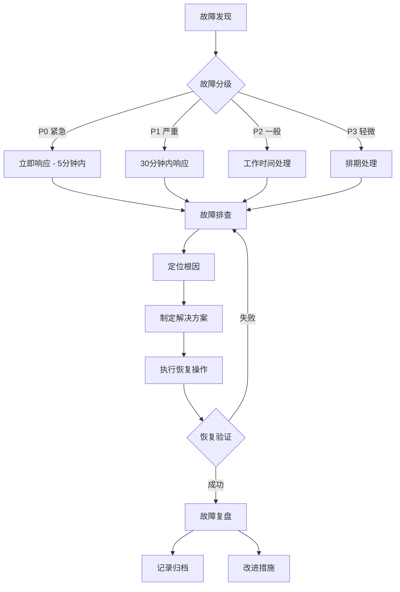

2026-06-25 | Claude Fable 5

# 缘定传媒人 — 操作手册

## 日常开发流程

### 1. 本地修改代码

```bash
cd /Users/x/code/mediapeople
# 编辑 HTML / CSS / JS / server/index.js
```

### 2. 本地验证

```bash
# 语法检查
node --check app.js
node --check server/index.js

# Docker Compose 配置检查
POSTGRES_PASSWORD=dummy JWT_SECRET=dummy \
  docker compose -f compose.yml -f compose.ssl.yml config >/dev/null
```

### 3. 一键部署

```bash
./deploy.sh "你的提交说明"
```

脚本自动完成：版本号递增 → 语法检查 → Git commit + push → 服务器部署 → 健康检查

---

## 浏览器主流程测试

### 客户端（8096 或 8095/mini）

**完整注册 + VIP + 牵线流程**：

1. 未登录页 → 显示锁定遮罩
2. 切换到"我的"Tab → 显示登录/注册面板
3. 点击"注册新客户账号" → 填写注册表单
4. 提交注册 → 自动登录，跳转到"筛选"页
5. 筛选资料 → 按性别/城市/年龄筛选
6. 查看资料 → 点击"换一位"翻页
7. 保存资料 → 切换到"资料"Tab，修改并保存
8. VIP 兑换 → 切换到"我的"Tab，点击"会员服务"
9. 输入兑换码 `1`（无限次） → 点击"确定" → 开通 VIP
10. 返回"筛选"页 → 选择异性资料，点击"申请牵线"
11. 选择红娘 → 确认申请
12. 切换到"消息"Tab → 查看牵线请求
13. 点击"联系红娘" → 进入聊天界面
14. 发送消息 → 红娘端可收到

**复杂场景测试**：

- 未登录时点击其他 Tab → 抖动提示
- 未 VIP 时申请牵线 → 跳转 VIP 页面
- 重复申请同一个人 → 提示"已在处理中"
- 输入无效兑换码 → 提示"兑换码无效"
- 输入已使用的兑换码 → 提示"该兑换码已被兑换使用"

### 红娘端（8097 或 8095/matchmaker）

**完整牵线处理流程**：

1. 登录/注册 → 进入工作台
2. 查看通知 → 显示牵线请求列表
3. 点击"联系男方" → 标记已联系男方
4. 点击"联系女方" → 标记已联系女方
5. 状态变为"来和双方对话"
6. 查看联系方式 → 右侧面板显示双方微信
7. 点击"来和双方对话" → 打开聊天窗口
8. 发送消息 → 客户端可收到

**复杂场景测试**：

- 只联系一方 → 状态显示"联系男方"或"联系女方"
- 两方都联系 → 状态变为"来和双方对话"
- 未登录时访问工作台 → 重定向到登录页
- 聊天弹窗关闭 → 点击关闭按钮或背景

### 管理后台（8098 或 8095/admin）

**完整管理流程**：

1. 管理员登录 → 密码来自 `.env` 的 `ADMIN_PASSWORD`（默认 admin）
2. 概览 → 数据指标卡片（客户数、VIP 数、成交数、总金额）
3. 分成设置 → 修改推广/牵线/平台分成比例（总和 100%）
4. 机构管理 → 添加新机构
5. 红娘管理 → 添加新红娘（选择机构、填写推荐码）
6. 客户管理 → 查看客户列表（含实名认证状态）
7. 兑换码 → 查看兑换码列表、随机生成新兑换码
8. 模拟成交 → 点击"模拟成交"按钮
9. 图表 → 数据可视化柱状图

**复杂场景测试**：

- 分成比例总和不为 100 → 提示错误
- 添加重复推荐码的红娘 → 提示"推荐码已存在"
- 生成兑换码 → 自动关联红娘

---

## 多端协同测试

### 客户 + 红娘协同

```
1. 客户端申请牵线
2. 红娘端查看通知
3. 红娘标记联系男方
4. 红娘标记联系女方
5. 红娘开启会员互聊
6. 客户端查看消息，点击"与对方互聊"
7. 客户发送消息
8. 另一客户端收到消息
```

### 管理员 + 客户协同

```
1. 管理员生成兑换码
2. 客户使用兑换码开通 VIP
3. 管理员查看客户列表，确认 VIP 状态
4. 管理员查看兑换码列表，确认使用状态
```

---

## 数据检查

### 查看数据量

```bash
curl -sS http://uk.sbbz.tech:8098/api/state | \
  node -e "let d='';process.stdin.on('data',c=>d+=c).on('end',()=>{
    const s=JSON.parse(d);
    console.log({
      users:s.users.length,
      matchmakers:s.matchmakers.length,
      agencies:s.agencies.length,
      requests:s.requests.length,
      deals:s.deals.length,
      promoCodes:s.promoCodes.length
    })
  })"
```

### 直接查询数据库

```bash
ssh -i ~/.ssh/mediapeople_uk_ed25519 root@uk.sbbz.tech
docker exec -it mediapeople-postgres psql -U mediapeople -d mediapeople

# 常用查询
SELECT count(*) FROM users;
SELECT count(*) FROM match_requests;
SELECT count(*) FROM chat_messages;
SELECT code, used, used_by FROM promo_codes;
SELECT id, name, vip, real_name_verified FROM users;
SELECT id, from_user_id, to_user_id, status FROM match_requests;
```

---

## 常见问题排查

### API 容器无法启动

```bash
docker logs mediapeople-api
# 常见原因：数据库连接失败、环境变量缺失
```

**排查步骤**：

1. 检查 PostgreSQL 容器是否运行：`docker ps | grep postgres`
2. 检查环境变量：`docker exec mediapeople-api env | grep PG`
3. 检查数据库连接：`docker exec mediapeople-postgres pg_isready -U mediapeople`
4. 重建容器：`docker compose up -d --build api`

### 前端显示旧版本

```bash
# 确认版本号已更新
grep 'app.js?v=' index.html

# 强制重启前端容器
docker compose -f compose.yml -f compose.ssl.yml up -d --force-recreate \
  web web-mini web-matchmaker web-admin
```

### 数据库数据丢失

```bash
# 检查数据卷
ls -la /opt/mediapeople/data/postgres/

# 从备份恢复
docker exec mediapeople-postgres pg_restore --clean --if-exists \
  -U mediapeople -d mediapeople /backup/最新备份文件.dump
docker compose restart api
```

### Nginx 502 Bad Gateway

```bash
# 检查 API 容器是否运行
docker ps | grep mediapeople-api

# 检查 API 容器日志
docker logs --tail=50 mediapeople-api

# 重建 API
cd /opt/mediapeople
docker compose -f compose.yml -f compose.ssl.yml up -d --build api
```

### 部署脚本失败

```bash
# 查看部署日志
cat /var/log/mediapeople-deploy.log

# 手动执行部署步骤
cd /opt/mediapeople
git pull origin master
docker compose -f compose.yml -f compose.ssl.yml up -d --build
```

### 数据库连接失败

```bash
# 检查 PostgreSQL 容器状态
docker ps | grep mediapeople-postgres

# 检查 PostgreSQL 日志
docker logs --tail=50 mediapeople-postgres

# 测试数据库连接
docker exec mediapeople-postgres pg_isready -U mediapeople -d mediapeople

# 检查环境变量
docker exec mediapeople-api env | grep PG
```

### SSL 证书问题

```bash
# 检查证书文件
ls -la /root/.acme.sh/sbbz.tech_ecc/

# 测试 SSL 连接
curl -vI https://uk.sbbz.tech:9445 2>&1 | grep -i "ssl\|certificate"

# 手动续期证书
acme.sh --renew -d sbbz.tech -d '*.sbbz.tech'
```

---

## 环境变量说明

| 变量 | 必填 | 默认值 | 说明 |
|------|------|--------|------|
| POSTGRES_DB | 否 | mediapeople | 数据库名 |
| POSTGRES_USER | 否 | mediapeople | 数据库用户 |
| POSTGRES_PASSWORD | 是 | - | 数据库密码 |
| JWT_SECRET | 否 | mediapeople-dev-secret-change-me | Token 签名密钥 |
| ADMIN_PASSWORD | 否 | admin | 管理员密码 |

---

## 代码风格约定

- 后端：ES Module（`import/export`），`const` 优先
- 前端：CommonJS 风格（全局函数），无模块系统
- CSS：BEM 命名混合自由命名，CSS 变量为主
- 缩进：2 空格
- 引号：双引号（前端）/ 单引号（后端）

---

## 日常运维巡检清单

### 每日巡检

| 检查项 | 检查方法 | 正常标准 | 异常处理 |
|--------|----------|----------|----------|
| 容器运行状态 | `docker ps --format "table {{.Names}}\t{{.Status}}"` | 所有 mediapeople-* 容器 Up 状态 | 重启异常容器：`docker compose up -d` |
| API 健康检查 | `curl -sS http://localhost:8096/api/health` | 返回 `{"status":"ok"}` | 查看日志重启 API 容器 |
| 数据库连接 | `docker exec mediapeople-postgres pg_isready -U mediapeople` | 返回 `accepting connections` | 检查 PostgreSQL 日志并重启 |
| 磁盘使用率 | `df -h /opt` | 使用率 < 80% | 清理日志、备份文件或扩容 |
| 内存使用率 | `free -h` | 使用率 < 80% | 排查内存泄漏，考虑扩容 |
| Nginx 状态 | `docker exec mediapeople-nginx nginx -t` | 返回 `test is successful` | 修复配置后 reload |
| SSL 证书有效期 | `openssl x509 -in /root/.acme.sh/sbbz.tech_ecc/fullchain.cer -noout -dates` | 有效期 > 30 天 | 手动续期：`acme.sh --renew -d sbbz.tech` |

### 每周巡检

| 检查项 | 检查方法 | 正常标准 | 异常处理 |
|--------|----------|----------|----------|
| 数据库备份 | `ls -lh /opt/mediapeople/backup/ | head -10` | 每日有备份文件生成 | 检查备份脚本 cron 任务 |
| 慢查询日志 | 查看 PostgreSQL 日志中慢查询 | 慢查询 < 10 条/天 | 优化 SQL，添加索引 |
| 错误日志统计 | `grep -c "ERROR" /var/log/mediapeople-*.log` | 错误数无异常增长 | 分析错误原因并修复 |
| 访问日志统计 | `awk '{print $1}' access.log \| sort \| uniq -c \| sort -rn \| head -20` | 无异常 IP 高频访问 | 封禁异常 IP |
| Git 仓库状态 | `git status && git log --oneline -5` | 工作区干净，最新提交正常 | 检查未提交的更改 |
| 安全更新 | `apt list --upgradable 2>/dev/null \| grep -c security` | 无紧急安全更新 | 评估后及时更新 |

### 每月巡检

| 检查项 | 检查方法 | 正常标准 | 异常处理 |
|--------|----------|----------|----------|
| 数据库 VACUUM | `docker exec mediapeople-postgres psql -U mediapeople -c "VACUUM ANALYZE VERBOSE;"` | 执行成功无错误 | 检查表膨胀情况 |
| 索引使用率 | 查询 pg_stat_user_indexes | 索引使用率 > 70% | 重建或删除低效索引 |
| 表空间占用 | `\dt+` 查看各表大小 | 无单表异常增长 | 清理历史数据，分区表 |
| 系统安全审计 | 查看 auth.log 登录记录 | 无异常登录尝试 | 封禁可疑 IP，加固 SSH |
| 备份恢复演练 | 从备份恢复到测试环境 | 恢复成功，数据完整 | 更新备份策略 |
| 容量规划评估 | 对比上月资源使用趋势 | 增长在预期范围内 | 制定扩容计划 |

---

## 性能调优指南

### 前端性能优化

#### 资源加载优化

```bash
# 1. 压缩静态资源
# Nginx gzip 配置（见 Nginx 调优章节）

# 2. 图片优化
# 使用 WebP 格式，设置合适尺寸
# CDN 加速静态资源

# 3. 代码分割
# 按需加载非关键 JS/CSS
```

**优化策略：**

- **首屏加载**：关键 CSS 内联，延迟加载非首屏图片
- **资源合并**：减少 HTTP 请求数，合理合并 JS/CSS
- **CDN 加速**：静态资源使用 CDN，降低源站压力
- **预加载**：对关键资源使用 `<link rel="preload">`

#### 渲染性能优化

```javascript
// 1. 避免强制同步布局
// 先读后写，批量 DOM 操作

// 2. 使用虚拟列表
// 长列表只渲染可视区域

// 3. 防抖节流
function debounce(fn, delay = 300) {
  let timer = null
  return function(...args) {
    clearTimeout(timer)
    timer = setTimeout(() => fn.apply(this, args), delay)
  }
}

function throttle(fn, delay = 300) {
  let last = 0
  return function(...args) {
    const now = Date.now()
    if (now - last > delay) {
      last = now
      fn.apply(this, args)
    }
  }
}
```

#### 缓存策略

| 资源类型 | 缓存策略 | Cache-Control |
|----------|----------|---------------|
| HTML | 协商缓存 | `no-cache` |
| CSS/JS | 强缓存 + 版本号 | `max-age=31536000` |
| 图片/字体 | 强缓存 | `max-age=31536000` |
| API 数据 | 按需缓存 | `private, max-age=60` |

### API 性能优化

#### 数据库查询优化

```sql
-- 1. 查看慢查询
SELECT query, calls, total_time, mean_time
FROM pg_stat_statements
ORDER BY mean_time DESC
LIMIT 20;

-- 2. EXPLAIN 分析执行计划
EXPLAIN ANALYZE SELECT * FROM users WHERE id = 1;

-- 3. 添加索引
CREATE INDEX IF NOT EXISTS idx_users_vip ON users(vip);
CREATE INDEX IF NOT EXISTS idx_match_requests_status ON match_requests(status);
CREATE INDEX IF NOT EXISTS idx_chat_messages_room ON chat_messages(room_id);

-- 4. 避免 SELECT *，只查询需要的字段
-- 5. 使用 LIMIT 限制返回行数
-- 6. 批量插入替代循环单条插入
```

#### 连接池优化

```javascript
// server/index.js 中数据库连接池配置
// 关键参数调整：
// - max: 最大连接数（通常设为 CPU 核心数 * 2 + 1）
// - idleTimeoutMillis: 空闲连接超时
// - connectionTimeoutMillis: 连接超时
```

**调优建议：**

- 根据实际并发量调整连接池大小
- 监控连接池使用率，避免连接耗尽
- 使用连接池监控指标：活跃连接数、等待队列长度

#### 响应时间优化

```javascript
// 1. API 响应缓存
// 对不常变的数据使用内存缓存
const cache = new Map()
const CACHE_TTL = 60000 // 60秒

function getCached(key, fetchFn) {
  const cached = cache.get(key)
  if (cached && Date.now() - cached.time < CACHE_TTL) {
    return cached.value
  }
  const value = fetchFn()
  cache.set(key, { value, time: Date.now() })
  return value
}

// 2. 分页查询
// 3. 异步处理非关键路径（如发送通知）
// 4. 并行执行独立的数据库查询
```

### Nginx 调优

#### Gzip 压缩

```nginx
# nginx.conf
gzip on;
gzip_vary on;
gzip_proxied any;
gzip_comp_level 6;
gzip_types
  text/plain
  text/css
  text/xml
  text/javascript
  application/json
  application/javascript
  application/xml+rss
  image/svg+xml;
gzip_min_length 1024;
gzip_buffers 16 8k;
```

#### 缓存配置

```nginx
# 静态资源缓存
location ~* \.(jpg|jpeg|png|gif|ico|svg|webp)$ {
    expires 30d;
    add_header Cache-Control "public, immutable";
}

location ~* \.(css|js)$ {
    expires 7d;
    add_header Cache-Control "public";
}

# API 反向代理缓存（可选）
proxy_cache_path /var/cache/nginx levels=1:2 keys_zone=api_cache:10m max_size=1g inactive=60m;
```

#### Keepalive 优化

```nginx
# nginx.conf
keepalive_timeout 65;
keepalive_requests 100;

# 上游服务 keepalive
upstream api_backend {
    server api:3000;
    keepalive 32;
}

# 启用 sendfile
sendfile on;
tcp_nopush on;
tcp_nodelay on;

# 增大文件描述符
worker_rlimit_nofile 65535;
events {
    worker_connections 4096;
}
```

### PostgreSQL 调优

#### 内存参数调整

```sql
-- 查看当前配置
SHOW shared_buffers;
SHOW work_mem;
SHOW maintenance_work_mem;
SHOW effective_cache_size;

-- 推荐配置（根据服务器内存调整）
-- shared_buffers: 总内存的 25%
-- work_mem: 每排序操作的内存（几 MB 到几十 MB）
-- maintenance_work_mem: 维护操作内存（几十 MB 到几百 MB）
-- effective_cache_size: 总内存的 50%-75%
```

```bash
# 修改 postgresql.conf
docker exec -it mediapeople-postgres bash
vi /var/lib/postgresql/data/postgresql.conf

# 示例配置（4GB 内存服务器）
shared_buffers = 1GB
work_mem = 16MB
maintenance_work_mem = 256MB
effective_cache_size = 3GB

# 重启生效
docker restart mediapeople-postgres
```

#### 查询优化

```sql
-- 1. 启用 pg_stat_statements 扩展
CREATE EXTENSION IF NOT EXISTS pg_stat_statements;

-- 2. 查看最耗时的查询
SELECT query, calls, total_time, mean_time, rows
FROM pg_stat_statements
ORDER BY total_time DESC
LIMIT 20;

-- 3. 查看索引使用情况
SELECT
  relname AS table_name,
  indexrelname AS index_name,
  idx_scan AS index_scans
FROM pg_stat_user_indexes
ORDER BY idx_scan ASC;

-- 4. 查看未使用的索引
SELECT
  relname AS table_name,
  indexrelname AS index_name
FROM pg_stat_user_indexes
WHERE idx_scan = 0
  AND schemaname = 'public';
```

#### VACUUM 与表膨胀

```sql
-- 1. 查看表膨胀情况
SELECT
  relname AS table_name,
  pg_size_pretty(pg_relation_size(relid)) AS table_size,
  n_live_tup AS live_rows,
  n_dead_tup AS dead_rows,
  ROUND(n_dead_tup::numeric / NULLIF(n_live_tup, 0) * 100, 2) AS dead_ratio
FROM pg_stat_user_tables
ORDER BY dead_ratio DESC;

-- 2. 手动 VACUUM
VACUUM ANALYZE;
VACUUM FULL VERBOSE tablename; -- 锁表，慎用！

-- 3. 查看自动 VACUUM 配置
SHOW autovacuum;
SHOW autovacuum_vacuum_threshold;
SHOW autovacuum_vacuum_scale_factor;
```

---

## 应急响应预案

### 故障处理总流程



### 常见故障处理步骤

#### 1. 服务不可用（502/503）

```bash
# 步骤 1: 确认故障范围
curl -I http://localhost:8096
curl -I http://localhost:8097
curl -I http://localhost:8098

# 步骤 2: 检查容器状态
docker ps | grep mediapeople

# 步骤 3: 查看 Nginx 日志
docker logs --tail=100 mediapeople-nginx

# 步骤 4: 查看 API 日志
docker logs --tail=100 mediapeople-api

# 步骤 5: 重启服务
cd /opt/mediapeople
docker compose -f compose.yml -f compose.ssl.yml restart api web
# 或强制重建
docker compose -f compose.yml -f compose.ssl.yml up -d --force-recreate api
```

#### 2. 数据库挂了

```bash
# 步骤 1: 检查 PostgreSQL 容器状态
docker ps | grep postgres
docker logs --tail=100 mediapeople-postgres

# 步骤 2: 尝试重启
docker restart mediapeople-postgres

# 步骤 3: 检查数据目录权限
ls -la /opt/mediapeople/data/postgres/

# 步骤 4: 如果无法启动，从备份恢复
# 先备份当前数据（如果还能访问）
docker exec mediapeople-postgres pg_dump -U mediapeople mediapeople > /opt/mediapeople/backup/emergency_$(date +%Y%m%d).sql

# 步骤 5: 从最近备份恢复
docker stop mediapeople-postgres
mv /opt/mediapeople/data/postgres /opt/mediapeople/data/postgres.old
mkdir -p /opt/mediapeople/data/postgres
chown 999:999 /opt/mediapeople/data/postgres
docker compose up -d postgres
# 等待数据库初始化完成后
docker exec -i mediapeople-postgres pg_restore -U mediapeople -d mediapeople < /opt/mediapeople/backup/latest.dump
```

#### 3. 磁盘满了

```bash
# 步骤 1: 定位大文件
df -h
du -sh /opt/mediapeople/*
du -sh /var/log/*

# 步骤 2: 清理 Docker 资源
docker system df
docker system prune -a --volumes  # 谨慎使用！

# 步骤 3: 清理日志
truncate -s 0 /var/log/mediapeople-*.log
docker logs --tail=0 mediapeople-api  # 仅保留最新

# 步骤 4: 清理旧备份
ls -lt /opt/mediapeople/backup/ | tail -n +10 | awk '{print $NF}' | xargs rm -f

# 步骤 5: 清理 PostgreSQL WAL 日志（如果是 WAL 占满）
docker exec mediapeople-postgres psql -U mediapeople -c "SELECT pg_switch_wal();"
docker exec mediapeople-postgres psql -U mediapeople -c "CHECKPOINT;"
```

#### 4. CPU 飙升

```bash
# 步骤 1: 定位高 CPU 进程
top
# 或
docker stats --no-stream

# 步骤 2: 如果是 Node.js API
# 查看 API 日志，是否有死循环
docker logs --tail=50 mediapeople-api

# 步骤 3: 如果是 PostgreSQL
# 查看当前运行的查询
docker exec mediapeople-postgres psql -U mediapeople -c "
  SELECT pid, query, state, now() - query_start AS duration
  FROM pg_stat_activity
  WHERE state = 'active'
  ORDER BY duration DESC
  LIMIT 10;
"

# 步骤 4: 终止慢查询
docker exec mediapeople-postgres psql -U mediapeople -c "
  SELECT pg_terminate_backend(pid)
  FROM pg_stat_activity
  WHERE pid = <PID>;
"

# 步骤 5: 临时扩容或限流
# 重启服务释放资源
docker compose restart api
```

#### 5. 内存溢出（OOM）

```bash
# 步骤 1: 检查系统日志
dmesg | grep -i oom
journalctl -k | grep -i oom

# 步骤 2: 检查各容器内存使用
docker stats --no-stream

# 步骤 3: 重启服务释放内存
docker compose restart api

# 步骤 4: 如果是 Node.js OOM
# 增加内存限制
# compose.yml 中调整:
# deploy:
#   resources:
#     limits:
#       memory: 1G

# 步骤 5: 排查内存泄漏
# 使用 node --inspect 调试
# 查看堆快照
```

#### 6. 网络故障

```bash
# 步骤 1: 检查本机网络
ping -c 3 8.8.8.8
ping -c 3 127.0.0.1

# 步骤 2: 检查 DNS
nslookup sbbz.tech

# 步骤 3: 检查端口监听
netstat -tlnp
ss -tlnp

# 步骤 4: 检查防火墙
ufw status
iptables -L -n

# 步骤 5: 检查 Docker 网络
docker network ls
docker network inspect mediapeople_default

# 步骤 6: 重启网络相关服务
systemctl restart docker
docker compose restart nginx
```

---

## 常用命令速查表

### Docker 常用命令

```bash
# 容器操作
docker ps                          # 查看运行中的容器
docker ps -a                       # 查看所有容器
docker start <容器名>               # 启动容器
docker stop <容器名>                # 停止容器
docker restart <容器名>             # 重启容器
docker rm <容器名>                  # 删除容器
docker rm -f <容器名>               # 强制删除容器

# 日志查看
docker logs <容器名>                # 查看日志
docker logs -f <容器名>             # 实时跟踪日志
docker logs --tail=100 <容器名>     # 查看最后100行
docker logs --since="1h" <容器名>   # 查看最近1小时

# 进入容器
docker exec -it <容器名> bash       # 进入容器 bash
docker exec -it <容器名> sh         # 进入容器 sh

# 镜像操作
docker images                       # 查看镜像列表
docker rmi <镜像名>                 # 删除镜像
docker pull <镜像名>                # 拉取镜像
docker build -t <镜像名> .          # 构建镜像

# 系统清理
docker system df                    # 查看资源使用
docker system prune                 # 清理未使用资源
docker system prune -a --volumes    # 深度清理（谨慎）

# 资源监控
docker stats                        # 实时资源监控
docker stats --no-stream            # 一次性查看
```

### Docker Compose 常用命令

```bash
cd /opt/mediapeople

# 启动/停止
docker compose up -d                # 后台启动所有服务
docker compose up -d api            # 启动单个服务
docker compose up -d --build        # 构建并启动
docker compose stop                 # 停止所有服务
docker compose restart              # 重启所有服务
docker compose restart api          # 重启单个服务

# 查看状态
docker compose ps                   # 查看服务状态
docker compose logs                 # 查看所有日志
docker compose logs -f api          # 跟踪 API 日志
docker compose top                  # 查看进程

# 配置
docker compose config               # 验证并查看配置
docker compose -f compose.yml -f compose.ssl.yml config  # 多文件配置

# 重建/删除
docker compose up -d --force-recreate api    # 强制重建
docker compose down                 # 停止并删除容器
docker compose down -v              # 删除数据卷（谨慎！）
```

### PostgreSQL 常用 SQL

```sql
-- 连接数据库
\c mediapeople

-- 查看表列表
\dt
\dt+

-- 查看表结构
\d users
\d+ users

-- 查看索引
\di
\d idx_users_vip

-- 查看数据库大小
SELECT pg_size_pretty(pg_database_size('mediapeople'));

-- 查看表大小
SELECT
  relname AS table_name,
  pg_size_pretty(pg_relation_size(relid)) AS size
FROM pg_stat_user_tables
ORDER BY pg_relation_size(relid) DESC;

-- 查看当前连接
SELECT count(*) FROM pg_stat_activity;
SELECT pid, usename, state, query FROM pg_stat_activity;

-- 终止会话
SELECT pg_terminate_backend(pid);
SELECT pg_cancel_backend(pid);

-- 备份与恢复
pg_dump -U mediapeople mediapeople > backup.sql
pg_dump -U mediapeople -Fc mediapeople > backup.dump
psql -U mediapeople -d mediapeople < backup.sql
pg_restore -U mediapeople -d mediapeople backup.dump

-- 查看慢查询（需启用 pg_stat_statements）
SELECT query, calls, mean_time, total_time
FROM pg_stat_statements
ORDER BY mean_time DESC
LIMIT 10;

-- EXPLAIN 分析
EXPLAIN SELECT * FROM users WHERE id = 1;
EXPLAIN ANALYZE SELECT * FROM users WHERE id = 1;
```

### Nginx 操作命令

```bash
# 配置测试
docker exec mediapeople-nginx nginx -t
docker exec mediapeople-nginx nginx -T  # 查看完整配置

# 重载配置（不重启）
docker exec mediapeople-nginx nginx -s reload

# 重启
docker restart mediapeople-nginx

# 查看日志
docker logs -f mediapeople-nginx
docker exec mediapeople-nginx ls -la /var/log/nginx/

# 查看连接状态
docker exec mediapeople-nginx nginx -s status  # 如果配置了 stub_status
curl http://localhost/nginx_status  # 如果配置了
```

### Linux 系统监控命令

```bash
# 系统整体状态
top                     # 实时系统监控
htop                    # 增强版 top（需安装）
uptime                  # 系统运行时间和负载
w                       # 在线用户和负载

# CPU 监控
vmstat 1                # 每秒统计
mpstat -P ALL 1         # 每 CPU 统计
sar -u 1 5              # CPU 使用历史

# 内存监控
free -h                 # 内存使用
vmstat -s               # 内存统计
cat /proc/meminfo       # 详细内存信息

# 磁盘监控
df -h                   # 磁盘使用
du -sh *                # 目录大小
du -ah --max-depth=1    # 一级目录大小
iostat -x 1             # 磁盘 IO 统计
iotop                   # 实时 IO 排行（需安装）

# 网络监控
netstat -tlnp           # 端口监听
ss -tlnp                # 端口监听（更高效）
netstat -an             # 所有连接
sar -n DEV 1            # 网卡流量
iftop                   # 实时流量（需安装）
tcpdump -i any port 80  # 抓包

# 日志查看
tail -f /var/log/syslog
tail -f /var/log/auth.log
dmesg                   # 内核日志
journalctl -f           # systemd 日志

# 进程管理
ps aux                  # 所有进程
ps aux | grep node
kill <PID>              # 终止进程
kill -9 <PID>           # 强制终止
pkill -f node           # 按名称终止
```

### Git 常用命令

```bash
# 基础操作
git status                                  # 查看状态
git add .                                   # 添加所有变更
git add <文件>                               # 添加指定文件
git commit -m "提交说明"                     # 提交
git commit -am "提交说明"                    # add + commit（仅已跟踪文件）

# 查看历史
git log                                     # 提交历史
git log --oneline                           # 简洁历史
git log --oneline --graph --all            # 图形化历史
git show <commit>                           # 查看某次提交详情
git diff                                    # 查看未暂存的变更
git diff --cached                           # 查看已暂存的变更

# 分支操作
git branch                                  # 查看分支
git branch -a                               # 查看所有分支
git checkout <分支名>                        # 切换分支
git checkout -b <新分支>                     # 创建并切换
git branch -d <分支名>                       # 删除分支
git merge <分支名>                           # 合并分支

# 远程操作
git pull origin master                      # 拉取并合并
git push origin master                      # 推送
git push origin <新分支>                     # 推送新分支
git remote -v                               # 查看远程仓库
git fetch origin                            # 获取远程更新

# 撤销操作
git checkout -- <文件>                       # 撤销工作区修改
git reset HEAD <文件>                        # 撤销暂存
git reset --soft HEAD~1                     # 撤销最近一次提交（保留变更）
git reset --hard HEAD~1                     # 回滚到上一提交（丢失变更）
git stash                                   # 暂存当前工作
git stash pop                               # 恢复暂存

# 标签操作
git tag                                     # 查看标签
git tag v1.0.0                              # 创建标签
git push origin v1.0.0                      # 推送标签
git tag -d v1.0.0                           # 删除本地标签
git push origin --delete tag v1.0.0         # 删除远程标签
```

---

## 数据库运维

### 数据备份与恢复

#### 备份策略

| 备份类型 | 频率 | 保留时间 | 用途 |
|----------|------|----------|------|
| 全量备份 | 每日 02:00 | 30 天 | 灾难恢复 |
| 增量备份 | 每小时 | 7 天 | 点时间恢复 |
| 手动备份 | 按需 | 永久 | 发布前/重大操作前 |

#### 备份命令

```bash
# 1. 逻辑备份（SQL 格式，可读性好，恢复慢）
docker exec mediapeople-postgres pg_dump -U mediapeople mediapeople > /opt/mediapeople/backup/backup_$(date +%Y%m%d_%H%M%S).sql

# 2. 自定义格式备份（压缩，恢复快，推荐）
docker exec mediapeople-postgres pg_dump -U mediapeople -Fc mediapeople > /opt/mediapeople/backup/backup_$(date +%Y%m%d_%H%M%S).dump

# 3. 单表备份
docker exec mediapeople-postgres pg_dump -U mediapeople -t users mediapeople > /opt/mediapeople/backup/users_backup.sql

# 4. 仅备份数据（不含 schema）
docker exec mediapeople-postgres pg_dump -U mediapeople -a mediapeople > /opt/mediapeople/backup/data_only.sql

# 5. 备份所有数据库（含全局对象）
docker exec mediapeople-postgres pg_dumpall -U mediapeople > /opt/mediapeople/backup/all_databases.sql
```

#### 恢复命令

```bash
# 1. SQL 格式恢复
docker exec -i mediapeople-postgres psql -U mediapeople -d mediapeople < backup_20260101.sql

# 2. 自定义格式恢复（推荐）
docker exec -i mediapeople-postgres pg_restore -U mediapeople -d mediapeople backup_20260101.dump

# 3. 先清理再恢复（谨慎！）
docker exec -i mediapeople-postgres pg_restore --clean --if-exists -U mediapeople -d mediapeople backup_20260101.dump

# 4. 恢复到新数据库
docker exec mediapeople-postgres psql -U mediapeople -c "CREATE DATABASE mediapeople_new;"
docker exec -i mediapeople-postgres pg_restore -U mediapeople -d mediapeople_new backup_20260101.dump
```

#### 自动备份脚本

```bash
# /opt/mediapeople/scripts/backup.sh
#!/bin/bash
BACKUP_DIR="/opt/mediapeople/backup"
DATE=$(date +%Y%m%d_%H%M%S)
KEEP_DAYS=30

mkdir -p "$BACKUP_DIR"

# 执行备份
docker exec mediapeople-postgres pg_dump -U mediapeople -Fc mediapeople > "$BACKUP_DIR/backup_$DATE.dump"

# 记录备份信息
echo "$DATE - Backup completed" >> "$BACKUP_DIR/backup.log"

# 清理旧备份
find "$BACKUP_DIR" -name "backup_*.dump" -mtime +$KEEP_DAYS -delete
find "$BACKUP_DIR" -name "backup_*.sql" -mtime +$KEEP_DAYS -delete
```

```bash
# crontab 设置（每天凌晨2点备份）
crontab -e
# 添加：
0 2 * * * /opt/mediapeople/scripts/backup.sh >> /var/log/mediapeople-backup.log 2>&1
```

### 数据迁移

#### 导出迁移

```bash
# 1. 在源服务器导出
docker exec mediapeople-postgres pg_dump -U mediapeople -Fc mediapeople > migration_export.dump

# 2. 传输到目标服务器
scp migration_export.dump user@target-server:/tmp/

# 3. 在目标服务器导入
docker exec -i mediapeople-postgres pg_restore -U mediapeople -d mediapeople < migration_export.dump

# 4. 验证数据一致性
# 源端
docker exec mediapeople-postgres psql -U mediapeople -c "SELECT count(*) FROM users;"
# 目标端
docker exec mediapeople-postgres psql -U mediapeople -c "SELECT count(*) FROM users;"
```

### 数据清理

#### 清理历史数据

```sql
-- 1. 清理过期的消息（保留30天）
DELETE FROM chat_messages
WHERE created_at < NOW() - INTERVAL '30 days';

-- 2. 清理已完成的牵线请求（保留90天）
DELETE FROM match_requests
WHERE status = 'completed'
  AND updated_at < NOW() - INTERVAL '90 days';

-- 3. 清理未验证的过期用户（保留7天）
DELETE FROM users
WHERE real_name_verified = false
  AND created_at < NOW() - INTERVAL '7 days';

-- 4. 清理已使用的兑换码（保留180天）
DELETE FROM promo_codes
WHERE used = true
  AND used_at < NOW() - INTERVAL '180 days';

-- 5. 清理后执行 VACUUM 释放空间
VACUUM ANALYZE chat_messages;
VACUUM ANALYZE match_requests;
```

### 表空间管理

```sql
-- 1. 查看各表大小
SELECT
  relname AS table_name,
  pg_size_pretty(pg_relation_size(relid)) AS table_size,
  pg_size_pretty(pg_total_relation_size(relid)) AS total_size
FROM pg_stat_user_tables
ORDER BY pg_total_relation_size(relid) DESC;

-- 2. 查看索引大小
SELECT
  relname AS table_name,
  indexrelname AS index_name,
  pg_size_pretty(pg_relation_size(indexrelid)) AS index_size
FROM pg_stat_user_indexes
ORDER BY pg_relation_size(indexrelid) DESC;

-- 3. 查看数据库总大小
SELECT pg_size_pretty(pg_database_size('mediapeople'));

-- 4. 重建索引（减少索引膨胀）
REINDEX INDEX idx_users_vip;
REINDEX TABLE users;

-- 5. 表收缩（需要锁表，谨慎使用）
VACUUM FULL chat_messages;
```

### 慢查询分析

```sql
-- 1. 启用 pg_stat_statements（如果未启用）
-- postgresql.conf 中添加：
-- shared_preload_libraries = 'pg_stat_statements'
-- pg_stat_statements.track = all

-- 2. 创建扩展
CREATE EXTENSION IF NOT EXISTS pg_stat_statements;

-- 3. 查看最耗时的查询（按平均耗时排序）
SELECT
  query,
  calls,
  total_time,
  mean_time,
  stddev_time,
  rows
FROM pg_stat_statements
ORDER BY mean_time DESC
LIMIT 20;

-- 4. 查看调用次数最多的查询
SELECT
  query,
  calls,
  total_time,
  mean_time
FROM pg_stat_statements
ORDER BY calls DESC
LIMIT 20;

-- 5. 查看总耗时最长的查询
SELECT
  query,
  calls,
  total_time,
  mean_time
FROM pg_stat_statements
ORDER BY total_time DESC
LIMIT 20;

-- 6. 重置统计
SELECT pg_stat_statements_reset();
```

### 锁等待排查

```sql
-- 1. 查看当前所有锁
SELECT
  pid,
  usename,
  pg_blocking_pids(pid) AS blocked_by,
  mode,
  granted,
  query
FROM pg_locks
JOIN pg_stat_activity USING (pid)
WHERE NOT granted OR pg_blocking_pids(pid) != '{}'
ORDER BY pid;

-- 2. 查看被阻塞的查询
SELECT
  waiting.pid AS waiting_pid,
  waiting.query AS waiting_query,
  waiting.now() - waiting.query_start AS waiting_duration,
  blocking.pid AS blocking_pid,
  blocking.query AS blocking_query
FROM pg_stat_activity waiting
JOIN pg_locks l ON waiting.pid = l.pid AND NOT l.granted
JOIN pg_locks bl ON l.relation = bl.relation AND bl.granted
JOIN pg_stat_activity blocking ON bl.pid = blocking.pid
WHERE waiting.state = 'active';

-- 3. 查看等待事件
SELECT
  pid,
  usename,
  state,
  wait_event_type,
  wait_event,
  query
FROM pg_stat_activity
WHERE wait_event IS NOT NULL;

-- 4. 终止阻塞进程
SELECT pg_terminate_backend(<pid>);

-- 5. 死锁检测（PostgreSQL 自动检测，超时时间）
SHOW deadlock_timeout;
```

---

## 日志分析指南

### 各类日志位置

```bash
# 应用日志
/opt/mediapeople/logs/                 # 应用日志目录（如果配置了）
docker logs mediapeople-api            # API 服务日志
docker logs mediapeople-nginx          # Nginx 访问/错误日志

# Nginx 日志（容器内）
/var/log/nginx/access.log
/var/log/nginx/error.log

# PostgreSQL 日志（容器内）
/var/lib/postgresql/data/log/
docker logs mediapeople-postgres

# 系统日志
/var/log/syslog                        # 系统日志（Debian/Ubuntu）
/var/log/auth.log                      # 认证日志
/var/log/kern.log                      # 内核日志
journalctl -u docker.service           # Docker 服务日志

# 部署日志
/var/log/mediapeople-deploy.log        # 部署脚本日志
```

### 常用分析命令

#### grep 命令

```bash
# 基础搜索
grep "ERROR" /var/log/syslog           # 搜索 ERROR
grep -i "error" app.log               # 不区分大小写
grep -r "502" /var/log/nginx/         # 递归搜索目录

# 显示上下文
grep -C 5 "ERROR" app.log              # 显示前后5行
grep -B 5 "ERROR" app.log              # 显示前5行
grep -A 5 "ERROR" app.log              # 显示后5行

# 统计匹配数
grep -c "ERROR" app.log                # 统计错误行数
grep -c "502" access.log               # 统计 502 次数

# 反向匹配
grep -v "200" access.log               # 排除 200 状态码
grep -v "health" app.log              # 排除健康检查日志

# 多条件匹配
grep "ERROR\|WARN" app.log             # 匹配 ERROR 或 WARN
grep -E "ERROR|WARN" app.log           # 同上（扩展正则）
```

#### awk 命令

```bash
# 基础字段提取
awk '{print $1}' access.log            # 第一列（IP）
awk '{print $1, $9}' access.log       # IP 和状态码

# 条件过滤
awk '$9 == 502 {print}' access.log    # 状态码为 502 的行
awk '$9 >= 500 {print}' access.log    # 5xx 错误
awk '$NF > 1' access.log              # 响应时间超过1秒

# 字段分隔符
awk -F '"' '{print $2}' access.log    # 按双引号分割，取请求行

# 提取请求路径
awk -F'"' '{print $2}' access.log | awk '{print $2}'

# 统计
awk '{count[$1]++} END {for (ip in count) print count[ip], ip}' access.log
awk '{sum+=$NF} END {print "Total:", sum, "Avg:", sum/NR}' access.log
```

#### sort 与 uniq 命令

```bash
# 排序
sort access.log                       # 字典序排序
sort -n numbers.txt                   # 数字排序
sort -rn numbers.txt                  # 数字倒序
sort -k2 -rn access.log              # 按第二列倒序

# 去重
sort access.log | uniq                # 排序后去重
sort access.log | uniq -c             # 统计出现次数
sort access.log | uniq -d             # 只显示重复行
sort access.log | uniq -u             # 只显示唯一行

# 组合使用：统计 IP 访问次数
awk '{print $1}' access.log | sort | uniq -c | sort -rn | head -20

# 统计状态码分布
awk '{print $9}' access.log | sort | uniq -c | sort -rn

# 统计访问最多的 URL
awk -F'"' '{print $2}' access.log | awk '{print $2}' | sort | uniq -c | sort -rn | head -20
```

### 错误模式识别

```bash
# 1. 5xx 错误分析
grep '" 5[0-9][0-9] ' access.log | tail -50

# 2. 4xx 错误分析（可能是攻击）
grep '" 4[0-9][0-9] ' access.log | tail -50

# 3. 慢请求（响应时间 > 3秒）
awk '$NF > 3' access.log | head -20

# 4. API 错误日志
docker logs mediapeople-api 2>&1 | grep -i "error" | tail -50
docker logs mediapeople-api 2>&1 | grep -i "exception" | tail -50

# 5. 数据库错误
docker logs mediapeople-postgres 2>&1 | grep -i "error" | tail -50
docker logs mediapeople-postgres 2>&1 | grep -i "deadlock" | tail -50

# 6. Nginx 错误
docker exec mediapeople-nginx cat /var/log/nginx/error.log | tail -50
grep "upstream prematurely closed" /var/log/nginx/error.log
grep "connect() failed" /var/log/nginx/error.log

# 7. 内存溢出
dmesg | grep -i oom
journalctl -k | grep -i "out of memory"

# 8. 磁盘满相关错误
grep "No space left" /var/log/syslog
grep "ENOSPC" app.log
```

### 访问日志统计

```bash
# 1. 总请求数
wc -l access.log
tail -n +1 access.log | wc -l

# 2. 独立 IP 数
awk '{print $1}' access.log | sort -u | wc -l

# 3. 今日访问量
grep "$(date +%d/%b/%Y)" access.log | wc -l

# 4. 访问量最高的页面 Top 20
awk -F'"' '{print $2}' access.log | awk '{print $2}' | sort | uniq -c | sort -rn | head -20

# 5. IP 访问量 Top 20
awk '{print $1}' access.log | sort | uniq -c | sort -rn | head -20

# 6. 状态码分布
awk '{print $9}' access.log | sort | uniq -c | sort -rn

# 7. 带宽统计
awk '{sum+=$10} END {print "Total:", sum/1024/1024, "MB"}' access.log

# 8. 按小时统计访问量
awk '{print $4}' access.log | cut -d: -f2 | sort | uniq -c

# 9. 爬虫识别
grep -i "bot\|crawler\|spider" access.log | wc -l

# 10. 实时监控访问
tail -f access.log | awk '{print $1, $9, $7}'
```

---

## 版本发布检查清单

### 发布前检查

- [ ] **代码审查**
  - [ ] 所有代码已通过 PR/MR 审查
  - [ ] 无遗留的 TODO/FIXME 标记（除非明确允许）
  - [ ] 无调试代码和 console.log（生产环境）

- [ ] **本地测试**
  - [ ] 本地运行正常，无报错
  - [ ] 主流程测试通过（注册、VIP、牵线、聊天）
  - [ ] 语法检查通过：`node --check server/index.js`

- [ ] **版本号确认**
  - [ ] 版本号已按语义化版本更新
  - [ ] index.html 中静态资源版本号已更新
  - [ ] CHANGELOG 已更新（如有）

- [ ] **配置检查**
  - [ ] 环境变量配置完整
  - [ ] 无硬编码的敏感信息
  - [ ] 新功能开关已配置

- [ ] **数据库迁移**
  - [ ] 迁移脚本已编写并测试
  - [ ] 回滚脚本已准备
  - [ ] 已确认无破坏性变更

- [ ] **备份准备**
  - [ ] 发布前已执行数据库备份
  - [ ] 备份文件已验证可用

### 发布中操作

- [ ] **通知相关人员**
  - [ ] 发布通知已发送
  - [ ] 确认相关人员知晓发布时间

- [ ] **执行发布**
  - [ ] 切换到项目目录：`cd /opt/mediapeople`
  - [ ] 拉取最新代码：`git pull origin master`
  - [ ] 验证代码版本：`git log --oneline -5`
  - [ ] 检查环境变量：`.env` 文件完整
  - [ ] 构建并启动：`docker compose -f compose.yml -f compose.ssl.yml up -d --build`

- [ ] **监控启动过程**
  - [ ] 容器全部启动成功：`docker compose ps`
  - [ ] 无启动错误：`docker compose logs`
  - [ ] 数据库迁移执行成功（如有）

### 发布后验证

- [ ] **基础健康检查**
  - [ ] API 健康检查正常：`curl http://localhost:8096/api/health`
  - [ ] 各前端页面可正常访问
  - [ ] 管理后台可正常登录

- [ ] **功能验证**
  - [ ] 客户端注册/登录正常
  - [ ] VIP 兑换功能正常
  - [ ] 牵线申请功能正常
  - [ ] 聊天功能正常
  - [ ] 管理后台数据统计正常

- [ ] **性能监控**
  - [ ] 页面加载速度正常
  - [ ] API 响应时间正常
  - [ ] CPU/内存使用率正常
  - [ ] 无异常错误日志

- [ ] **日志检查**
  - [ ] 无新增 ERROR 级别日志
  - [ ] 无异常的警告信息
  - [ ] 访问日志流量正常

### 回滚操作步骤

```bash
# 步骤 1: 确认需要回滚
# 出现严重问题且短时间内无法修复

# 步骤 2: 找到上一个稳定版本的 commit hash
git log --oneline -10

# 步骤 3: 回滚到上一个版本
git reset --hard <上一个稳定版本的 commit hash>

# 步骤 4: 重建服务
docker compose -f compose.yml -f compose.ssl.yml up -d --build --force-recreate

# 步骤 5: 如果数据库有变更需要回滚
# 执行回滚迁移脚本
# 或从发布前的备份恢复
docker exec -i mediapeople-postgres pg_restore --clean --if-exists -U mediapeople -d mediapeople < /opt/mediapeople/backup/pre_release_backup.dump

# 步骤 6: 验证回滚结果
docker compose ps
curl http://localhost:8096/api/health

# 步骤 7: 通知相关人员回滚完成
# 记录回滚原因，后续分析问题
```

**回滚检查清单：**

- [ ] 确认回滚目标版本
- [ ] 备份当前数据（如果可能）
- [ ] 执行代码回滚
- [ ] 执行数据库回滚（如需要）
- [ ] 重启服务
- [ ] 验证服务恢复正常
- [ ] 通知相关人员
- [ ] 记录回滚原因和过程

---

## 新环境搭建指南

### 服务器准备

#### 系统要求

| 项目 | 最低配置 | 推荐配置 |
|------|----------|----------|
| CPU | 2 核 | 4 核以上 |
| 内存 | 2 GB | 4 GB 以上 |
| 磁盘 | 20 GB | 50 GB 以上 SSD |
| 系统 | Ubuntu 20.04+ / Debian 11+ | Ubuntu 22.04 LTS |
| 网络 | 公网 IP，开放 80/443 端口 | 带宽 5Mbps+ |

#### 初始化服务器

```bash
# 1. 更新系统
apt update && apt upgrade -y

# 2. 安装基础工具
apt install -y curl wget vim git htop net-tools unzip

# 3. 设置时区
timedatectl set-timezone Asia/Shanghai

# 4. 配置防火墙（如使用 ufw）
ufw allow 22/tcp    # SSH
ufw allow 80/tcp    # HTTP
ufw allow 443/tcp   # HTTPS
ufw enable

# 5. 创建普通用户（可选，推荐）
# useradd -m -s /bin/bash deploy
# usermod -aG sudo deploy
# su - deploy

# 6. 设置 SSH 密钥登录（推荐，禁用密码登录）
# mkdir -p ~/.ssh
# echo "你的公钥" >> ~/.ssh/authorized_keys
# chmod 600 ~/.ssh/authorized_keys
```

### 安装 Docker

```bash
# 1. 安装 Docker（官方脚本）
curl -fsSL https://get.docker.com -o get-docker.sh
sh get-docker.sh

# 2. 安装 Docker Compose 插件
apt install -y docker-compose-plugin

# 3. 验证安装
docker --version
docker compose version

# 4. 设置 Docker 开机自启
systemctl enable docker
systemctl start docker

# 5. 配置 Docker 镜像加速（可选，国内服务器推荐）
mkdir -p /etc/docker
cat > /etc/docker/daemon.json << 'EOF'
{
  "registry-mirrors": [
    "https://docker.mirrors.ustc.edu.cn",
    "https://hub-mirror.c.163.com"
  ],
  "log-driver": "json-file",
  "log-opts": {
    "max-size": "100m",
    "max-file": "3"
  }
}
EOF

# 6. 重启 Docker 使配置生效
systemctl restart docker
```

### 拉取代码

```bash
# 1. 创建项目目录
mkdir -p /opt/mediapeople
cd /opt/mediapeople

# 2. 克隆代码仓库
git clone <仓库地址> .
# 或使用 SSH
# git clone git@github.com:username/mediapeople.git .

# 3. 切换到生产分支
git checkout master

# 4. 查看当前版本
git log --oneline -5
```

### 配置环境变量

```bash
# 1. 复制环境变量模板
cp .env.example .env

# 2. 编辑环境变量
vim .env
```

```dotenv
# .env 关键配置

# 数据库配置
POSTGRES_DB=mediapeople
POSTGRES_USER=mediapeople
POSTGRES_PASSWORD=请修改为强密码

# JWT 配置
JWT_SECRET=请修改为随机字符串

# 管理员密码
ADMIN_PASSWORD=请修改为管理员密码

# 域名配置（如使用 SSL）
DOMAIN=yourdomain.com
```

```bash
# 3. 设置文件权限
chmod 600 .env

# 4. 创建必要目录
mkdir -p /opt/mediapeople/data/postgres
mkdir -p /opt/mediapeople/backup
mkdir -p /opt/mediapeople/logs
```

### 初始化数据库

```bash
# 1. 先启动 PostgreSQL
docker compose up -d postgres

# 2. 等待数据库启动
sleep 10

# 3. 检查数据库状态
docker exec mediapeople-postgres pg_isready -U mediapeople

# 4. 如果有初始化脚本，执行
# docker exec -i mediapeople-postgres psql -U mediapeople -d mediapeople < init.sql

# 5. 从现有环境迁移数据（可选）
# scp backup.dump user@new-server:/opt/mediapeople/backup/
# docker exec -i mediapeople-postgres pg_restore -U mediapeople -d mediapeople < /opt/mediapeople/backup/backup.dump
```

### 启动服务

```bash
# 1. 启动所有服务
docker compose -f compose.yml up -d --build

# 如果需要 SSL，使用：
# docker compose -f compose.yml -f compose.ssl.yml up -d --build

# 2. 查看服务状态
docker compose ps

# 3. 查看启动日志
docker compose logs -f
# 或单个服务
docker logs -f mediapeople-api
```

### 验证

#### 基础验证

```bash
# 1. 容器状态检查
docker ps --format "table {{.Names}}\t{{.Status}}\t{{.Ports}}"

# 2. API 健康检查
curl http://localhost:8096/api/health
# 预期输出: {"status":"ok"}

# 3. 管理后台健康检查
curl -I http://localhost:8098/
# 预期输出: HTTP/1.1 200 OK

# 4. 红娘端健康检查
curl -I http://localhost:8097/
# 预期输出: HTTP/1.1 200 OK

# 5. 数据库连接验证
docker exec mediapeople-postgres psql -U mediapeople -c "SELECT version();"
```

#### 功能验证

```bash
# 1. 测试 API 接口
curl -sS http://localhost:8096/api/state | head -100

# 2. 测试数据库查询
docker exec mediapeople-postgres psql -U mediapeople -c "SELECT count(*) FROM users;"

# 3. 浏览器访问测试
# 客户端: http://服务器IP:8096
# 红娘端: http://服务器IP:8097
# 管理后台: http://服务器IP:8098

# 4. Nginx 配置测试（如使用）
docker exec mediapeople-nginx nginx -t
```

#### 安全验证

```bash
# 1. 检查敏感信息是否暴露
# - 确认 .env 文件权限正确
# - 确认环境变量不会通过 API 泄露

# 2. 检查防火墙状态
ufw status

# 3. 检查是否有不必要的端口暴露
netstat -tlnp
```

### 后续配置

```bash
# 1. 配置自动备份
# 参见 "数据库运维" 章节的自动备份脚本

# 2. 配置 SSL 证书（如需要）
# 参见 "常见问题排查" 的 SSL 证书部分

# 3. 配置日志轮转
# Docker 日志已在 daemon.json 中配置大小限制

# 4. 配置监控告警（可选）

# 5. 加入部署密钥，实现一键部署
# ssh-keygen -t ed25519 -C "deploy@server"
# 将公钥添加到代码仓库的部署密钥中
```

### 环境搭建完成检查清单

- [ ] 服务器初始化完成（系统更新、防火墙、时区）
- [ ] Docker 和 Docker Compose 安装完成
- [ ] 代码已拉取到指定目录
- [ ] 环境变量配置完成（密码已修改）
- [ ] 数据库初始化完成
- [ ] 所有服务启动成功
- [ ] API 健康检查通过
- [ ] 前端页面可正常访问
- [ ] 管理后台可登录
- [ ] 数据库连接正常
- [ ] 自动备份已配置
- [ ] SSL 证书已配置（如需要）
- [ ] 日志轮转已配置
- [ ] 安全加固完成
