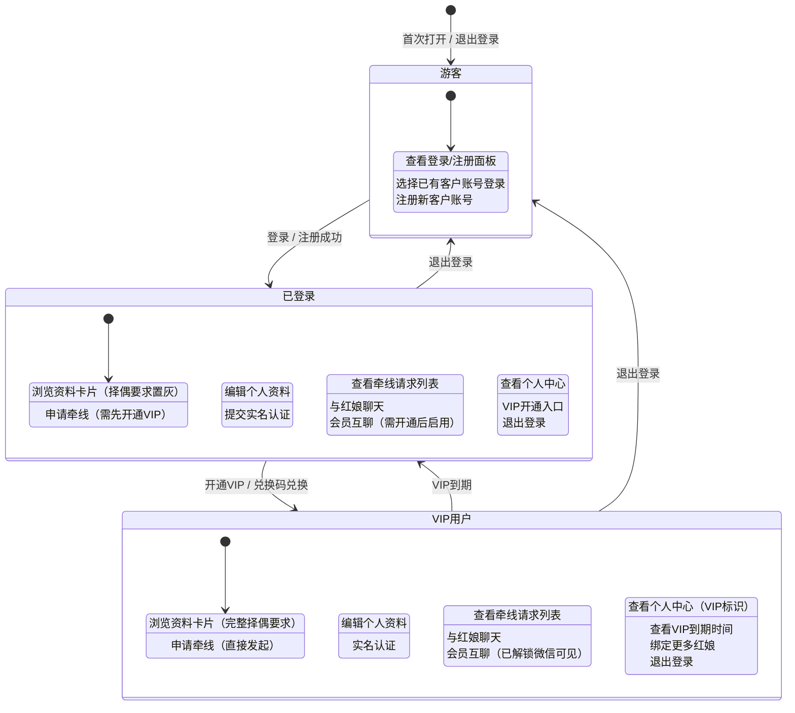

2026-06-27 | Codex 修订

# 客户端界面交互说明

## 2026-06-27 当前修订摘要

本文件已按当前客户端交互修订：底部 Tab 为“筛选 / 消息 / 我的”，资料表单位于“我的”中；会员互聊必须由红娘开通后出现。

如本文下方旧段落与本摘要或 `说明/10-操作手册.md` 冲突，以 `说明/10-操作手册.md` 和当前线上实测流程为准。


本文档详细列出客户端小程序（mini.html / 8096）的每个按钮、表单、Tab、链接等交互元素，以及点击后的行为逻辑。

---

## 未登录状态

### Tab 栏

| Tab | 状态 | 点击后行为 |
|-----|------|------------|
| 筛选 | 置灰（disabled） | 手机框架抖动动画 + 提示"请先在'我的'页面登录或注册客户账号" |
| 消息 | 置灰（disabled） | 同上 |
| 我的 | 正常 | 切换到"我的"Tab，显示登录/注册面板 |

### 锁定遮罩（筛选页、消息页）

| 元素 | 类型 | 点击后行为 |
|------|------|------------|
| 去注册/登录 | 按钮 | 跳转到"我的"Tab |

---

## "我的"Tab — 未登录状态

### 已有客户账号区域

| 元素 | 类型 | 操作后行为 |
|------|------|------------|
| 客户选择下拉框 | select | 列出所有已有客户（姓名 + 性别 + 年龄 + 城市） |
| 登录 | 按钮 | 调用 `miniSwitchUser()`，POST /api/auth/client/login，成功后跳转"筛选"Tab |

### 注册新客户账号表单

| 字段 | 类型 | 必填 | 校验规则 |
|------|------|------|----------|
| 姓名 | input | 是 | 非空 |
| 性别 | select | 是 | 男/女 |
| 年龄 | input[type=number] | 是 | 18-70 |
| 城市 | input | 是 | 非空 |
| 职业 | input | 是 | 非空 |
| 微信 | input | 是 | 非空 |
| 手机号 | input[tel] | 条件 | 11位数字，与邮箱至少填一个 |
| 电子邮箱 | input[email] | 条件 | 合法邮箱格式，与手机号至少填一个 |
| 登录密码 | input[password] | 是 | 至少6位 |
| 确认密码 | input[password] | 是 | 必须与密码一致 |
| 个人介绍 | textarea | 是 | 非空 |
| 择偶要求 | textarea | 是 | 非空 |
| 选择委托红娘 | checkbox组 | 否 | 可多选，默认全选 |
| 立即注册并登录 | 提交按钮 | - | 校验通过后调用 POST /api/auth/client/register |

**注册提交流程**：

```
1. 校验手机号/邮箱至少填一个
2. 校验手机号格式（11位数字）
3. 校验邮箱格式
4. 校验密码至少6位
5. 校验两次密码一致
6. 校验手机号/邮箱是否已存在（本地 state 检查）
7. 随机分配头像（根据性别选择）
8. 调用 POST /api/auth/client/register
9. 成功→自动登录，跳转"筛选"Tab，显示提示"注册成功"
10. 失败→显示"客户注册失败，请检查手机号或邮箱是否重复"
```

---

## "我的"Tab — 已登录状态

### 个人中心主面板

| 元素 | 显示内容 |
|------|----------|
| 头像背景 | 用户 photo URL |
| 姓名 | 用户 name |
| VIP 标识 | "VIP 会员"（绿色）或"普通用户"（黄色） |
| 详情 | "男 · 31 岁 · 上海" |

### 数据看板

| 指标 | 数据来源 |
|------|----------|
| 牵线申请 | `state.requests.filter(r => r.fromUserId === user.id).length` |
| 会员身份 | "VIP" 或"普通" |
| 已解锁微信 | 牵线请求中 `memberChatEnabled` 为 true 的数量 |

### 功能选项菜单

| 菜单项 | 显示内容 | 点击后行为 |
|--------|----------|------------|
| 👑 会员服务 | "已开通 VIP 会员" 或"未开通 VIP" | 切换到 VIP 子面板 |
| 🤝 专属红娘 | 红娘姓名+推荐码 或"待分配" | 无点击事件 |
| 🛡️ 实名认证 | "已实名"（绿色）或"未认证"（橙色） | 弹出实名认证模态框 |
| 📞 专属客服 | "hqlak47@gmail.com" | 无点击事件 |

| 元素 | 类型 | 点击后行为 |
|------|------|------------|
| 退出当前登录 | 按钮 | 调用 `miniLogoutUser()`，清除 session，跳转"我的"Tab，显示游客模式 |

---

## "我的"Tab — VIP 子面板

| 元素 | 类型 | 点击后行为 |
|------|------|------------|
| ← 返回个人中心 | 按钮 | 切换回个人中心主面板 |

### VIP 开通区域

| 元素 | 类型 | 操作后行为 |
|------|------|------------|
| 兑换码输入框 | input | 输入兑换码（如 VIP666、1） |
| 确定 | 按钮 | 调用 `redeemVip()`，POST /api/client/vip/redeem { code } |
| 专属红娘选择框 | 可搜索下拉框 | 输入关键词筛选红娘（按姓名、推荐码、机构名） |
| 红娘下拉选项列表 | li | 点击选中红娘，更新隐藏输入框的推荐码值 |
| 模拟支付并开通 | 按钮 | 未 VIP 时显示，调用 `becomeVip()`，POST /api/client/vip/redeem { referralCode } |
| 为该红娘开通 VIP | 按钮 | 已 VIP 但未绑定当前选择的红娘时显示，调用 `ensureVipForMatchmaker()` |
| 已是该红娘 VIP | 按钮（禁用） | 已 VIP 且已绑定当前选择的红娘时显示，不可点击 |
| 已是会员 | 按钮（禁用） | 已 VIP 且未选择红娘时显示，不可点击 |

### 兑换码兑换流程

```
1. 用户输入兑换码
2. 点击"确定"
3. 检查兑换码是否存在于本地 state
4. 检查兑换码是否已使用（非无限次）
5. API 可用→调用 POST /api/client/vip/redeem { code }
6. 成功→按钮变绿显示"有效"，更新 VIP 状态，清空输入框
7. 失败→显示错误提示
```

### 推荐码支付流程

```
1. 用户在下拉框选择红娘
2. 点击"模拟支付并开通"
3. 检查推荐码是否有效
4. API 可用→调用 POST /api/client/vip/redeem { referralCode }
5. 成功→VIP 标识更新，显示到期日期，记录分成日志
6. 失败→显示错误提示
```

### 红娘下拉框交互

```
1. 点击/聚焦输入框 → 展开下拉列表，显示所有红娘
2. 输入关键词 → 实时筛选红娘（按姓名、推荐码、机构名模糊匹配）
3. 点击选项 → 选中该红娘，更新隐藏输入框，关闭下拉列表
4. 点击其他区域 → 关闭下拉列表，恢复已选红娘的显示文本
```

---

## "筛选"Tab

### 筛选条件

| 元素 | 类型 | 操作后行为 |
|------|------|------------|
| 性别 | select | 切换"看女生"/"看男生"，重新渲染资料卡片 |
| 城市 | select | 选择城市或"全部"，重新渲染资料卡片 |
| 年龄 | select | 选择年龄范围或"不限"，重新渲染资料卡片 |

### 资料卡片

| 元素 | 类型 | 显示内容 |
|------|------|----------|
| 照片 | 背景图 | 用户 photo URL |
| 姓名 | h3 | 用户 name |
| 详情 | p | "性别 · 年龄 岁 · 城市" |
| 职业身份 | 文本 | 用户 job |
| 自我介绍 | 文本 | 用户 bio |
| 择偶要求 | 文本 | VIP 用户显示 requirements，非 VIP 显示"开通会员后可查看" |
| 选择联系的红娘 | select | 列出目标用户委托的红娘 |

| 元素 | 类型 | 点击后行为 |
|------|------|------------|
| 申请牵线 | 按钮 | 调用 `createRequest(profileId, matchmakerId)` |
| 换一位 ➔ | 按钮 | `currentDiscoverIndex++`，渲染下一张资料卡片 |

### 申请牵线流程

```
1. 点击"申请牵线"
2. 检查是否已登录→未登录跳转"我的"Tab
3. 检查目标用户是否绑定了红娘→未绑定显示"该会员暂未绑定红娘，无法申请牵线"
4. 调用 ensureVipForMatchmaker(matchmakerId)：
   - 如果用户已是该红娘 VIP→继续
   - 如果用户不是该红娘 VIP→自动调用 API 开通 VIP（推荐码支付）
   - 开通失败→中止流程
5. 检查是否已有未完成请求（同一发起方、目标方、红娘）→有则提示"这条牵线请求已经在处理中"
6. API 可用→调用 POST /api/client/match-requests { targetUserId, matchmakerId }
7. 成功→关闭弹窗，显示提示"已通知红娘为你和 XXX 牵线"，显示微信推送模拟卡片
8. 失败→显示错误提示
```

---

## "我的"Tab — 资料区

### 个人资料表单

| 字段 | 类型 | 说明 |
|------|------|------|
| 姓名 | input | 用户 name |
| 性别 | select | 男/女 |
| 年龄 | input[type=number] | 18-70 |
| 城市 | input | 用户 city |
| 职业 | input | 用户 job |
| 微信 | input | 用户 wechat |
| 自我介绍 | textarea | 用户 bio |
| 对另一半的要求 | textarea | 用户 requirements |
| 选择委托红娘 | checkbox组 | 可多选 |
| 保存资料并提交审核 | 提交按钮 | 调用 `saveProfile()`，保存到各红娘资料草稿并等待审核 |

### 保存资料流程

```
1. 收集表单数据
2. 收集选中的委托红娘 ID 列表
3. API 可用→调用 PATCH /api/client/profile
4. 成功→显示保存成功，并等待绑定红娘审核发布
5. 失败→显示"操作失败：xxx"
```

---

## "消息"Tab

### 牵线请求列表

每个请求卡片显示：

| 元素 | 显示内容 |
|------|----------|
| 状态标签 | "待红娘联系"/"联系男方"/"联系女方"/"来和双方对话" |
| 标题 | "发起方 与 目标方" |
| 负责红娘 | 红娘姓名或"待分配" |
| 对方微信 | 仅"来和双方对话"状态时显示 |
| 会员互聊状态 | "会员互聊：已开启" |

| 元素 | 类型 | 点击后行为 |
|------|------|------------|
| 💬 联系红娘 | 按钮 | 查找该请求的 member_matchmaker 线程，设置为活跃线程，滚动到聊天面板 |
| 💬 与对方互聊 | 按钮 | 查找该请求的 member_member 线程，设置为活跃线程，滚动到聊天面板 |

### 和红娘聊天区域

- 列出所有 member_matchmaker 类型的聊天线程
- 每个线程卡片显示：红娘名称、会话描述、最后消息预览

| 元素 | 类型 | 点击后行为 |
|------|------|------------|
| 聊天线程卡片 | 按钮 | 设置该线程为 `activeMiniChatThreadId`，渲染聊天面板 |

### 会员互聊区域

- 列出所有 member_member 类型的聊天线程
- 每个线程卡片显示：对方名称、会话描述、最后消息预览

| 元素 | 类型 | 点击后行为 |
|------|------|------------|
| 聊天线程卡片 | 按钮 | 设置该线程为 `activeMiniChatThreadId`，渲染聊天面板 |

### 聊天面板

| 元素 | 类型 | 显示/操作 |
|------|------|----------|
| 标题 | h3 | 会话名称（如"红娘 李莉"或"周晴"） |
| 描述 | span | 会话描述（如"一对一沟通 · 与红娘的聊天"） |
| 空消息提示 | div | "还没有聊天消息，先发第一句吧。" |
| 消息列表 | div | 每条消息显示：发送者名称、内容、时间 |
| 消息输入框 | input | placeholder 根据会话类型变化："把你的想法发给红娘"或"和对方打个招呼吧" |
| 发送 | 按钮 | 调用 `sendMiniChatMessage()` |

### 发送消息流程

```
1. 获取当前活跃线程
2. 获取输入框内容
3. 内容为空→不处理
4. API 可用→调用 POST /api/chat/threads/:id/messages { content }
5. 成功→清空输入框，更新 state，重新渲染
6. 失败→显示错误提示
7. API 不可用→本地追加消息，保存 state
```

---

## 客户端状态机详解

客户端存在三种用户身份状态，各状态对应不同的功能权限和界面表现。

### 状态机图



### 各状态权限对比

| 功能模块 | 游客 | 已登录（普通用户） | VIP用户 |
|---------|------|-------------------|---------|
| 筛选Tab浏览 | ❌ 锁定遮罩 | ✅ 可浏览（择偶要求置灰） | ✅ 完整浏览 |
| 申请牵线 | ❌ | ⚠️ 需先开通VIP | ✅ 直接申请 |
| 我的Tab资料区编辑 | ❌ 锁定遮罩 | ✅ 可编辑 | ✅ 可编辑 |
| 实名认证 | ❌ 锁定遮罩 | ✅ 可提交 | ✅ 可提交 |
| 消息Tab | ❌ 锁定遮罩 | ✅ 可查看请求、聊红娘 | ✅ 全部功能 + 会员互聊 |
| 查看对方微信 | ❌ | ❌ | ✅ 牵线成功后可见 |
| VIP兑换/开通 | ❌ | ✅ 可开通 | ✅ 可绑定更多红娘 |
| 退出登录 | ❌（未登录） | ✅ | ✅ |

---

## 错误与异常流程

### 网络错误

**触发场景**：用户网络断开、DNS解析失败、请求超时（>10s）

**处理流程**：
```
1. 发起请求
2. 捕获 network error / timeout
3. 显示全局 Toast 提示："网络连接失败，请检查网络后重试"
4. 按钮恢复可点击状态
5. 聊天消息等本地可存储的数据，先保存到本地 state
6. 提供"点击重试"入口（适用于列表页）
```

**用户提示**：
- 顶部红色 Toast，持续 3 秒
- 图标：⚠️ 网络图标
- 文案："网络连接失败，请检查网络设置"

### API 不可用（服务端 5xx）

**触发场景**：服务器宕机、接口报错、数据库异常

**处理流程**：
```
1. 请求返回 500 / 502 / 503 / 504
2. 记录错误信息到 console
3. 显示提示："服务器开小差了，请稍后再试"
4. 关键操作提供重试按钮
5. 非关键操作静默降级（如聊天消息本地追加）
```

**用户提示**：
- 模态框或 Toast
- 文案："服务暂时不可用，请稍后重试"
- 按钮："知道了" / "重试"

### 兑换码无效

**触发场景**：用户输入错误的兑换码、兑换码已过期、兑换码已用完

**处理流程**：
```
1. 用户输入兑换码，点击"确定"
2. 调用 POST /api/client/vip/redeem
3. 接口返回错误
4. 输入框边框变红
5. 下方显示错误提示文字
6. 按钮文字恢复为"确定"
```

**错误类型与提示**：

| 错误类型 | 提示文案 | 表现形式 |
|---------|---------|---------|
| 兑换码不存在 | "兑换码无效，请检查后重新输入" | 输入框下方红色文字 |
| 兑换码已过期 | "该兑换码已过期" | 输入框下方红色文字 |
| 兑换码次数用完 | "该兑换码已被使用完毕" | 输入框下方红色文字 |
| 已使用过该码 | "您已使用过此兑换码" | 输入框下方红色文字 |

### 密码错误

**触发场景**：登录时密码不正确

**处理流程**：
```
1. 用户选择客户，触发登录
2. 接口返回 401 密码错误
3. 密码输入框抖动动画
4. 下方显示"密码错误，请重新输入"
5. 密码框内容清空并自动聚焦
```

**用户提示**：
- 输入框边框红色
- 下方提示文字："密码错误，请重新输入（提示：默认密码见说明文档）"
- 连续错误 3 次后增加："多次输入错误，请确认客户账号是否正确"

### 重复申请牵线

**触发场景**：对同一用户、同一红娘重复发起牵线请求

**处理流程**：
```
1. 用户点击"申请牵线"
2. 前端先检查本地 state 是否存在同状态请求
3. 若存在→直接提示，不发请求
4. 若不存在→发请求
5. 后端返回重复→提示用户
```

**用户提示**：
- 中间弹出 Toast
- 文案："这条牵线请求已经在处理中，请耐心等待红娘联系"
- 持续 2.5 秒

### 手机号/邮箱已注册

**触发场景**：注册时使用了已存在的手机号或邮箱

**处理流程**：
```
1. 用户填写注册表单，点击提交
2. 前端先本地检查 state 中是否已存在
3. 存在→即时提示
4. 不存在→提交到后端
5. 后端返回冲突→高亮对应字段
```

**用户提示**：
- 对应输入框边框变红
- 下方文字："该手机号已被注册" 或 "该邮箱已被注册"
- 提供"去登录"快捷链接

### 实名认证失败

**触发场景**：身份证号格式错误、姓名与身份证不匹配、照片不清晰

**处理流程**：
```
1. 提交实名认证
2. 接口返回失败
3. 弹窗显示失败原因
4. 用户可重新提交
```

**用户提示**：
- 模态框形式
- 标题："认证失败"
- 内容：具体失败原因（如"身份证号格式不正确"）
- 按钮："重新认证"

---

## 边界场景处理

### 空数据状态

**场景**：筛选结果为空、消息列表为空、聊天记录为空

**处理规范**：

| 页面 | 空状态表现 |
|------|-----------|
| 筛选Tab | 显示插画 + "暂无符合条件的用户，试试调整筛选条件" |
| 消息Tab - 请求列表 | 显示 "还没有牵线请求，去筛选页看看吧" + 跳转按钮 |
| 消息Tab - 聊天列表 | 显示 "还没有聊天，发起牵线后即可与红娘沟通" |
| 聊天面板 | 显示 "还没有聊天消息，先发第一句吧。" |
| 红娘下拉（无结果） | 下拉列表中显示 "未找到匹配的红娘" |

**视觉规范**：
- 居中显示
- 图标/插画 + 文字说明
- 可选操作按钮（如有）
- 文字颜色：#999
- 字号：14px

### 加载中状态

**场景**：页面初次加载、下拉刷新、点击加载更多

**处理规范**：

| 加载类型 | 表现形式 |
|---------|---------|
| 初始加载（白屏） | 页面骨架屏 + 加载动画 |
| 局部刷新 | 对应区域显示 Spinner 加载圈 |
| 按钮点击加载 | 按钮内显示 loading 圈，文字变为"加载中"，按钮禁用 |
| 下拉刷新 | 顶部显示刷新动画，"正在刷新..." |
| 列表加载更多 | 底部显示 "加载中..." + 小菊花 |

**时长处理**：
- 加载时间 < 300ms：不显示 loading，避免闪烁
- 加载时间 > 3s：显示"加载较慢，请检查网络"提示
- 加载时间 > 10s：超时处理，显示失败状态

### 数据量很大（100+ 用户）

**场景**：筛选结果很多、聊天消息很多、红娘列表很长

**处理策略**：

1. **虚拟滚动 / 分页加载**
   - 资料卡片：每次只渲染当前 + 前后各 1 张，滑动时切换
   - 聊天消息：向上滚动加载历史消息，每次 20 条
   - 红娘下拉：最多显示 50 条，输入关键词进一步筛选

2. **性能优化**
   - 图片懒加载
   - 列表项使用 `will-change: transform`
   - 避免频繁重排重绘

3. **用户体验**
   - 快速滑动时图片占位
   - 底部显示"共 N 条"统计
   - 提供"回到顶部"按钮（滚动超过 20 条后显示）

### Tab 快速切换

**场景**：用户快速连续点击底部 Tab 栏

**处理策略**：
```
1. Tab 切换立即响应（视觉上）
2. 数据请求加入防抖 / 取消机制
   - 使用 AbortController 取消上一个请求
   - 切换间隔 < 200ms 时，跳过中间 Tab 的数据加载
3. 保留上一次的数据展示，避免白屏闪烁
4. 切换到目标 Tab 后再发起数据请求
```

### 重复点击（防抖动）

**场景**：用户快速多次点击按钮（提交、发送、申请牵线等）

**处理策略**：

| 操作类型 | 防重复策略 |
|---------|-----------|
| 表单提交（注册、保存资料） | 点击后按钮立即禁用，显示 loading，请求返回后恢复 |
| 发送消息 | 点击后禁用 500ms，且内容为空时不触发 |
| 申请牵线 | 点击后按钮禁用，成功/失败后恢复 |
| VIP兑换 | 点击后按钮变 loading，结果返回后恢复 |
| Tab切换 | 允许快速切换，但数据请求防抖 |

**通用规则**：
- 所有可能触发 API 请求的按钮，点击后立即进入 loading/disabled 状态
- 防止同一操作短时间内重复提交
- 失败后必须恢复按钮可点击状态，避免用户无法重试

### 网络超时

**场景**：请求发出后 10 秒内没有响应

**处理流程**：
```
1. 设置请求超时时间：10 秒
2. 超时后中止请求
3. 显示超时提示："请求超时，请检查网络后重试"
4. 提供重试按钮
5. 按钮恢复可点击状态
```

**超时分级**：
- 普通查询：10s 超时
- 文件上传：30s 超时
- 聊天消息发送：15s 超时（超时后本地存储，标记为发送失败）

---

## 表单验证规则详解

### 注册表单

| 字段 | 验证规则 | 错误提示 | 触发时机 |
|------|---------|---------|---------|
| 姓名 | 非空，2-20个字符，支持中文/英文/数字 | "请输入姓名" / "姓名长度为2-20个字符" | blur + submit |
| 性别 | 必须选择男或女 | "请选择性别" | submit |
| 年龄 | 数字，18-70 之间 | "请输入年龄" / "年龄须在18-70岁之间" | blur + submit |
| 城市 | 非空，2-30个字符 | "请输入所在城市" | blur + submit |
| 职业 | 非空，2-30个字符 | "请输入您的职业" | blur + submit |
| 微信 | 非空，6-30个字符 | "请输入微信号" | blur + submit |
| 手机号 | 11位数字，以1开头 | "请输入正确的手机号" | blur + submit |
| 电子邮箱 | 合法邮箱格式 | "请输入正确的邮箱地址" | blur + submit |
| 手机号+邮箱 | 至少填写一个 | "手机号和邮箱至少填写一个" | submit |
| 登录密码 | 至少6位，包含字母或数字 | "请设置登录密码" / "密码至少6位" | blur + submit |
| 确认密码 | 必须与密码一致 | "两次输入的密码不一致" | blur + submit |
| 个人介绍 | 非空，10-500字 | "请填写个人介绍" / "介绍长度10-500字" | blur + submit |
| 择偶要求 | 非空，10-500字 | "请填写择偶要求" / "要求长度10-500字" | blur + submit |

**验证触发说明**：
- **blur**：输入框失去焦点时验证
- **submit**：点击提交按钮时统一验证所有字段
- **实时修正**：密码框在输入时，如果确认密码已有内容，实时比对

### 资料编辑表单

| 字段 | 验证规则 | 错误提示 | 触发时机 |
|------|---------|---------|---------|
| 姓名 | 非空，2-20个字符 | "请输入姓名" | blur + submit |
| 性别 | 男/女 | "请选择性别" | submit |
| 年龄 | 18-70 | "年龄须在18-70岁之间" | blur + submit |
| 城市 | 非空 | "请输入城市" | blur + submit |
| 职业 | 非空 | "请输入职业" | blur + submit |
| 微信 | 非空 | "请输入微信号" | blur + submit |
| 自我介绍 | 非空，10-500字 | "请填写自我介绍" | blur + submit |
| 择偶要求 | 非空，10-500字 | "请填写择偶要求" | blur + submit |

### 实名认证表单

| 字段 | 验证规则 | 错误提示 | 触发时机 |
|------|---------|---------|---------|
| 真实姓名 | 非空，2-20个中文字符 | "请输入真实姓名" / "姓名须为中文" | blur + submit |
| 身份证号 | 18位，符合身份证校验规则 | "请输入身份证号" / "身份证号格式不正确" | blur + submit |
| 身份证正面照 | 必须上传 | "请上传身份证正面照片" | submit |
| 身份证反面照 | 必须上传 | "请上传身份证反面照片" | submit |
| 手持身份证照 | 必须上传 | "请上传手持身份证照片" | submit |

**身份证号校验规则**：
1. 长度为 18 位
2. 前 17 位为数字，第 18 位为数字或 X/x
3. 校验码验证（ISO 7064:1983.MOD 11-2）
4. 出生日期合法（月份 1-12，日期符合当月天数）

### VIP 兑换表单

| 字段 | 验证规则 | 错误提示 | 触发时机 |
|------|---------|---------|---------|
| 兑换码 | 非空，3-30个字符 | "请输入兑换码" | submit + input（实时清除错误状态） |

### 聊天消息输入

| 字段 | 验证规则 | 错误提示 | 触发时机 |
|------|---------|---------|---------|
| 消息内容 | 非空（去除首尾空格后），不超过 500 字 | -（空内容按钮置灰/不发送） | 点击发送 + 回车 |

### 验证视觉反馈

- **正常状态**：灰色边框 #ddd
- **聚焦状态**：蓝色边框 #4A90D9
- **错误状态**：红色边框 #F56C6C，下方红色 12px 提示文字
- **成功状态**：绿色边框 #67C23A（仅部分字段，如邮箱唯一性校验通过）

---

## 数据加载状态

### 初始加载

**场景**：首次进入页面、Tab 切换后首次加载

**UI 表现**：
```
┌─────────────────────┐
│  ▓▓▓▓▓▓  骨架屏     │
│  ▓▓▓▓▓▓▓▓▓▓        │
│  ▓▓▓▓▓▓▓▓          │
│                     │
│  ▓▓▓  ▓▓▓  ▓▓▓     │
│  ▓▓▓  ▓▓▓  ▓▓▓     │
└─────────────────────┘
```

- 展示骨架屏（Skeleton），灰色渐变动画
- 不显示空状态提示
- 加载时间超过 3s 显示"加载中..."文字提示

### 刷新中

**场景**：下拉刷新、点击刷新按钮

**UI 表现**：
- 列表顶部显示刷新动画（旋转圈 + "正在刷新..."）
- 原有数据保留展示，不清除
- 刷新成功后更新列表，显示"刷新成功"短暂提示
- 刷新失败显示"刷新失败，请检查网络"

### 加载失败

**场景**：网络错误、服务器错误、超时

**UI 表现**：
```
┌─────────────────────┐
│                     │
│       ⚠️            │
│   加载失败           │
│  请检查网络后重试     │
│                     │
│    [ 点击重试 ]      │
│                     │
└─────────────────────┘
```

- 居中显示失败图标 + 文字
- 提供"点击重试"按钮
- 点击重试后恢复加载状态
- 按钮样式：主色按钮，圆角

### 空状态

**场景**：数据加载成功，但列表为空

**UI 表现**：
```
┌─────────────────────┐
│                     │
│       📭            │
│   暂无数据           │
│  快去发现更多吧~      │
│                     │
│    [ 去看看 ]        │  ← 可选操作按钮
│                     │
└─────────────────────┘
```

- 居中显示
- 图标：对应场景的空状态插画
- 主文案："暂无 xxx"（14px，#666）
- 副文案：引导性文字（12px，#999）
- 可选操作按钮（如有）

### 加载更多

**场景**：列表滚动到底部，加载下一页

**UI 表现**：
- 列表底部显示加载动画 + "加载中..."
- 加载成功：追加数据，移除加载提示
- 加载失败：底部显示"加载失败，点击重试"
- 全部加载完：底部显示"— 没有更多了 —"

---

## 用户操作反馈

### 点击反馈

**按钮点击效果**：
- **普通按钮**：点击时透明度变为 0.8，有轻微缩放效果（scale 0.98）
- **主按钮**：点击时背景色加深 10%
- **文字链接**：点击时颜色变深
- **卡片/列表项**：点击时背景色变为 #f5f5f5（0.2s 过渡）

**响应时间要求**：
- 点击后 100ms 内必须有视觉反馈
- 过渡动画时长：150ms - 200ms
- 缓动函数：ease-out

### 加载状态反馈

**按钮内加载**：
```
[  加载中...  ]    ← 按钮内显示旋转小圈 + 文字
```
- 按钮禁用，不可点击
- 左侧显示 16px 旋转 loading 圈
- 文字变为对应操作的进行时态（如"提交中..."、"发送中..."）

**页面级加载**：
- 顶部进度条（适用于页面跳转）
- 居中 loading 遮罩（适用于阻塞式操作）

### 成功提示

**Toast 形式**（轻量操作成功）：
- 位置：页面顶部往下 20% 处居中
- 图标：✅ 绿色对勾
- 文字：操作成功描述（如"注册成功"、"资料已保存"、"消息已发送"）
- 时长：2 秒后自动消失
- 背景：白色圆角卡片，轻量阴影

**示例文案**：
| 操作 | 成功提示 |
|------|---------|
| 注册 | "注册成功，欢迎加入！" |
| 登录 | "登录成功" |
| 保存资料 | "资料已保存" |
| 申请牵线 | "已通知红娘为你牵线" |
| VIP开通 | "恭喜，VIP开通成功！" |
| 发送消息 | -（消息直接出现在列表中，无需额外提示） |
| 实名认证提交 | "认证资料已提交，等待审核" |

### 失败提示

**Toast 形式**（普通错误）：
- 图标：❌ 或 ⚠️
- 文字：错误描述
- 时长：3 秒
- 背景：白色圆角卡片

**模态框形式**（重要错误）：
- 标题："操作失败" / "提示"
- 内容：详细错误说明
- 按钮："知道了" / "重试"
- 必须用户点击确认才关闭

**错误文案规范**：
- 不说技术性术语（如不说"404"、"500"）
- 用用户能理解的语言描述
- 给出解决建议
- 语气友好，不指责

### 确认弹窗

**使用场景**：
- 退出登录
- 取消正在进行的操作
- 删除数据
- 涉及付费/重要操作的二次确认

**弹窗结构**：
```
┌─────────────────────┐
│      确认退出？      │  ← 标题
│                     │
│  退出后需要重新登录   │  ← 内容说明
│                     │
│ [ 取消 ]  [ 确定 ]   │  ← 按钮
└─────────────────────┘
```

**按钮规范**：
- 左侧：取消按钮（灰色边框，点击关闭弹窗）
- 右侧：确定按钮（主色或红色，点击执行操作）
- 危险操作（如删除、退出）的确定按钮用红色

**常见确认场景**：
| 操作 | 标题 | 内容 | 确定按钮文案 |
|------|------|------|------------|
| 退出登录 | "确认退出？" | "退出后需要重新登录才能使用全部功能" | "退出登录" |
| 取消牵线 | "取消牵线申请？" | "取消后需要重新发起申请" | "确认取消" |

---

## 键盘操作与无障碍

### 回车提交

**支持回车提交的表单**：
- 登录表单（密码框回车 → 登录）
- 注册表单（最后一个输入框回车 → 提交）
- 聊天输入框（回车 → 发送消息）
- VIP 兑换码输入框（回车 → 兑换）
- 搜索框（红娘搜索等，回车 → 确认搜索）

**规则**：
- 单输入框表单：回车直接提交
- 多输入框表单：在最后一个输入框按回车提交
- 表单有验证错误时，回车不提交，聚焦到第一个错误字段
- textarea 中回车为换行，Ctrl+Enter 或 Cmd+Enter 提交

### Tab 键导航

**导航顺序**：
按照页面视觉从上到下、从左到右的顺序依次聚焦：
```
顶部导航 → 内容区（表单字段按顺序） → 底部按钮 → Tab 栏
```

**Tab 键行为**：
- Tab：移到下一个可聚焦元素
- Shift + Tab：移到上一个可聚焦元素
- 聚焦时显示清晰的焦点样式（蓝色外框）

**可聚焦元素**：
- 所有 input / select / textarea
- 所有 button
- 所有链接（a 标签）
- 有点击事件的卡片/列表项（添加 tabindex）

### 焦点管理

**页面切换时**：
- 进入新页面，焦点自动放到第一个可交互元素或页面标题
- 返回上一页，焦点回到触发跳转的元素

**弹窗打开/关闭**：
- 打开弹窗：焦点移入弹窗内，聚焦到第一个输入框或确认按钮
- 弹窗内 Tab 只在弹窗内循环，不跳出
- 关闭弹窗：焦点回到触发弹窗的按钮

**表单验证失败**：
- 自动聚焦到第一个验证失败的字段
- 选中输入框内容（方便直接修改）

### 屏幕阅读器支持

**ARIA 属性**：

| 组件 | ARIA 标签 | 说明 |
|------|----------|------|
| 按钮 | aria-label | 图标按钮需提供文字说明 |
| 输入框 | aria-describedby | 关联错误提示文字 |
| 弹窗 | role="dialog" aria-modal="true" | 标识模态对话框 |
| 加载中 | aria-live="polite" | 状态变化时语音播报 |
| Tab栏 | role="tablist" role="tab" | 标识标签页导航 |
| 状态标签 | aria-label | 如"VIP会员"、"已认证"等 |

**图片替代文字**：
- 所有用户头像添加 alt 文本（如"张三的头像"）
- 装饰性图片添加 alt="" 或 role="presentation"
- 功能图标添加 aria-label

### 快捷键支持

| 快捷键 | 功能 | 作用范围 |
|-------|------|---------|
| Enter | 提交表单 / 发送消息 | 表单、聊天输入框 |
| Escape | 关闭弹窗 / 取消操作 | 全局 |
| Tab | 下一个元素 | 全局 |
| Shift + Tab | 上一个元素 | 全局 |
| Ctrl + Enter | 发送消息 | 聊天输入框（textarea） |
| Cmd + Enter | 发送消息 | macOS 聊天输入框 |
| ← → | 切换资料卡片 | 筛选Tab（卡片聚焦时） |
| ↑ ↓ | 列表项上下选择 | 下拉列表、菜单 |

### 无障碍色彩规范

- 文字与背景的对比度 ≥ 4.5:1（普通文字）
- 大号文字对比度 ≥ 3:1
- 不仅用颜色传达信息（如错误状态同时用图标 + 文字 + 颜色）
- 焦点状态有明显的视觉指示（不限于颜色变化）
