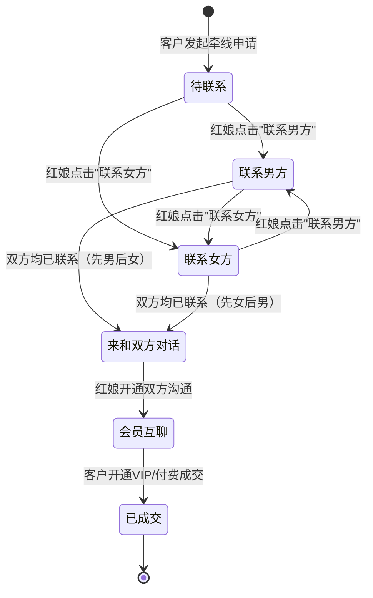

2026-06-25 | Claude Fable 5

# 红娘端界面交互说明

本文档详细列出红娘工作台（matchmaker.html / 8097）的每个按钮、表单、Tab、链接等交互元素，以及点击后的行为逻辑。

---

## 登录/注册页面

### Tab 切换

| Tab | 点击后行为 |
|-----|------------|
| 已有红娘登录 | 显示登录面板，隐藏注册面板，Tab 高亮 |
| 注册新红娘 | 显示注册面板，隐藏登录面板，Tab 高亮 |

### 登录面板

| 元素 | 类型 | 操作后行为 |
|------|------|------------|
| 红娘选择下拉框 | select | 列出所有红娘（姓名 + 推荐码 + 机构名） |
| 一键登录 | 按钮 | 调用 `mmAuthLogin()`，POST /api/auth/matchmaker/login |

**登录流程**：

```
1. 获取选中的红娘 ID
2. API 可用→调用 POST /api/auth/matchmaker/login { matchmakerId }
3. 成功→保存 session（token + role + matchmakerId），跳转工作台
4. 失败→显示"红娘登录失败，请稍后重试"
```

**登录后行为**：

- 记录审计日志：`红娘 '李莉' 成功登录红娘工作台`
- 显示 Toast：`已登录为红娘：李莉`
- 跳转到 `/workbench`（独立端口）或 `/matchmaker/workbench`（综合预览端）

### 注册面板

**注册表单**：

| 字段 | 类型 | 必填 | 校验规则 |
|------|------|------|----------|
| 红娘姓名 | input | 是 | 非空 |
| 所属机构 | select | 是 | 从已有机构中选择 |
| 手机号 | input[tel] | 是 | 11位数字，不可重复 |
| 电子邮箱 | input[email] | 否 | 合法邮箱格式，不可重复 |
| 唯一推荐码 | input | 是 | 非空，不可重复，自动转大写 |
| 登录密码 | input[password] | 是 | 至少6位 |
| 确认密码 | input[password] | 是 | 必须与密码一致 |
| 立即注册并登录 | 提交按钮 | - | 校验通过后调用 POST /api/auth/matchmaker/register |

**注册提交流程**：

```
1. 校验手机号格式（11位数字）→ 不合法显示"请输入合法的11位手机号"
2. 校验邮箱格式（如有）→ 不合法显示"请输入合法的邮箱地址"
3. 校验密码至少6位 → 不足显示"登录密码至少 6 位"
4. 校验两次密码一致 → 不一致显示"两次输入的密码不一致"
5. 校验推荐码是否已存在（本地 state 检查）→ 已存在显示"推荐码已存在，请更换！"
6. 校验手机号是否已存在（本地 state 检查）→ 已存在显示"该手机号已注册红娘账号"
7. 校验邮箱是否已存在（如有）→ 已存在显示"该邮箱已注册红娘账号"
8. 调用 POST /api/auth/matchmaker/register
9. 成功→自动登录，跳转工作台，记录审计日志
10. 失败→显示"红娘注册失败，请检查手机号、邮箱或推荐码是否重复"
```

---

## 工作台主页面

### 工具栏

| 元素 | 显示内容 |
|------|----------|
| 红娘工作台 | eyebrow 标签 |
| 标题 | "红娘工作台 - 当前红娘：李莉" |
| 退出登录 | 按钮（珊瑚色边框） |

| 元素 | 类型 | 点击后行为 |
|------|------|------------|
| 退出登录 | 按钮 | 调用 `mmAuthLogout()`，清除 session，跳转登录页，记录审计日志 |

**退出后行为**：

- 记录审计日志：`红娘 '李莉' 已退出工作台登录`
- 显示 Toast：`红娘已安全退出登录`
- 跳转到 `/login`（独立端口）或 `/matchmaker/login`（综合预览端）

---

### 左侧面板：应用通知

**面板头部**：

| 元素 | 显示内容 |
|------|----------|
| 标题 | "应用通知" |
| 计数 | "X 条待处理"（非"来和双方对话"状态的请求数量） |

**牵线请求卡片**（每个请求显示）：

| 元素 | 显示内容 |
|------|----------|
| 状态标签 | "待红娘联系"（绿色）/ "联系男方" / "联系女方" / "来和双方对话" |
| 标题 | "发起方 申请认识 目标方" |
| 时间 | 创建时间（本地化格式） |
| 联系状态 | "男方：已联系/待联系 ｜ 女方：已联系/待联系" |
| 会员互聊状态 | "会员互聊：已开启" |

**操作按钮**：

| 按钮 | 显示条件 | 点击后行为 |
|------|----------|------------|
| 联系男方 | 男方未联系时显示 | 调用 `contactRequestSide(requestId, "male")` |
| ✓ 联系男方 | 男方已联系时显示（绿色） | 无操作（已标记） |
| 联系女方 | 女方未联系时显示 | 调用 `contactRequestSide(requestId, "female")` |
| ✓ 联系女方 | 女方已联系时显示（绿色） | 无操作（已标记） |
| 来和双方对话 | 两方都联系后显示 | 调用 `openThreeWayChat(requestId)` |
| 开通双方沟通 | memberChatEnabled 为 false 时显示 | 调用 `toggleMemberChat(requestId, true)`，PATCH /api/matchmaker/requests/:id/member-chat { enabled: true } |
| 关闭双方沟通 | memberChatEnabled 为 true 时显示 | 调用 `toggleMemberChat(requestId, false)`，PATCH /api/matchmaker/requests/:id/member-chat { enabled: false } |

**标记联系男方流程**：

```
1. 点击"联系男方"
2. API 可用→调用 PATCH /api/matchmaker/requests/:id/contacted { side: "male" }
3. 成功→更新 state，自动跳转到男方的聊天窗口
4. 显示 Toast：`已标记联系男方，正在打开聊天…`
5. 记录审计日志：`红娘 '李莉' 联系男方：林安，当前进度 联系男方`
```

**标记联系女方流程**：

```
1. 点击"联系女方"
2. API 可用→调用 PATCH /api/matchmaker/requests/:id/contacted { side: "female" }
3. 成功→更新 state，自动跳转到女方的聊天窗口
4. 显示 Toast：`已标记联系女方，正在打开聊天…`
5. 记录审计日志：`红娘 '李莉' 联系女方：周晴，当前进度 联系女方`
```

**两方都联系后**：

```
1. 状态变为"来和双方对话"
2. 显示"来和双方对话"按钮
3. 显示微信推送模拟卡片：
   - 标题：【牵线成功进度通知】
   - 牵线红娘：李莉
   - 心仪嘉宾：周晴
   - 微信号码：qing_brand
   - 温馨提示：红娘已确认双方信息，请复制微信号添加好友并备注"缘定传媒人"。
```

**点击"来和双方对话"**：

```
1. 调用 openThreeWayChat(requestId)
2. 查找该请求对应的 member_matchmaker 聊天线程
3. 设置 activeMatchmakerChatThreadId
4. 设置 matchmakerChatModalOpen = true
5. 显示 Toast：`已打开双方会话`
6. 渲染聊天弹窗
```

**点击"开通双方沟通"**：

```
1. 调用 toggleMemberChat(requestId, true)
2. API 可用→调用 PATCH /api/matchmaker/requests/:id/member-chat { enabled: true }
3. 成功→更新 state，重新渲染
4. 显示 Toast：`已开通双方沟通`
5. 客户端消息页显示"与对方互聊"按钮
```

**点击"关闭双方沟通"**：

```
1. 调用 toggleMemberChat(requestId, false)
2. API 可用→调用 PATCH /api/matchmaker/requests/:id/member-chat { enabled: false }
3. 成功→更新 state，重新渲染
4. 显示 Toast：`已关闭双方沟通`
5. 客户端消息页隐藏"与对方互聊"按钮
```

---

### 资料审核通知

当客户修改个人资料后，委托红娘会在通知面板看到"资料待审核"的卡片。

**资料审核卡片**：

| 元素 | 显示内容 |
|------|----------|
| 状态标签 | "资料待审核" |
| 标题 | "XXX 的资料更新" |
| 详情 | 性别 · 年龄 岁 · 城市 |
| 职业 | 客户修改后的职业 |
| 自我介绍 | 客户修改后的自我介绍 |
| 择偶要求 | 审户修改后的择偶要求 |

**操作按钮**：

| 按钮 | 点击后行为 |
|------|------------|
| 审核通过 | 调用 `reviewMatchmakerProfile(userId, "approve")`，PATCH /api/matchmaker/users/:id/profile-review { action: "approve" } |
| 退回修改 | 调用 `reviewMatchmakerProfile(userId, "reject")`，PATCH /api/matchmaker/users/:id/profile-review { action: "reject" } |

**审核通过流程**：

```
1. 点击"审核通过"
2. API 可用→调用 PATCH /api/matchmaker/users/:id/profile-review { action: "approve" }
3. 成功→草稿变为 published，其他红娘可以看到更新后的资料
4. 显示 Toast：`资料已审核通过`
```

**退回修改流程**：

```
1. 点击"退回修改"
2. API 可用→调用 PATCH /api/matchmaker/users/:id/profile-review { action: "reject" }
3. 成功→资料状态变为 rejected
4. 显示 Toast：`资料已退回修改`
```

**资料审核计数**：

通知面板的"X 条待处理"计数包含：
- 非"来和双方对话"状态的牵线请求数量
- 待审核的资料更新数量

---

### 右侧面板：双方隐藏联系信息

**面板头部**：

| 元素 | 显示内容 |
|------|----------|
| 标题 | "双方隐藏联系信息" |
| 标签 | "仅红娘可见" |

**联系信息卡片**（每个请求显示）：

| 元素 | 显示内容 |
|------|----------|
| 标题 | "发起方 与 目标方" |
| 发起方微信 | "发起方 微信：xxx" |
| 目标方微信 | "目标方 微信：xxx" |

**显示逻辑**：

- 列出当前红娘负责的所有牵线请求
- 显示双方的微信号（仅红娘可见）
- 无请求时显示"接到牵线请求后会显示双方微信。"

---

### 聊天线程列表

**位置**：工作台下方

**线程卡片**（每个 member_matchmaker 线程显示）：

| 元素 | 显示内容 |
|------|----------|
| 标题 | 会员名称（如"林安 (一对一沟通)"） |
| 描述 | 会话描述（如"一对一沟通 · 与红娘的聊天 (林安)"） |
| 预览 | 最后消息预览 或"这里可以和会员直接沟通牵线进度。" |

| 元素 | 类型 | 点击后行为 |
|------|------|------------|
| 聊天线程卡片 | 按钮 | 设置 `activeMatchmakerChatThreadId`，设置 `matchmakerChatModalOpen = true`，渲染聊天弹窗 |

**选中状态**：

- 选中的卡片有绿色边框、阴影、上移效果

---

### 聊天弹窗（模态框）

**触发条件**：点击聊天线程卡片 或 点击"来和双方对话"

**弹窗结构**：

| 元素 | 类型 | 显示/操作 |
|------|------|----------|
| 标题 | h2 | 会话名称（如"林安 (一对一沟通)"） |
| 描述 | span | 会话描述 |
| × 关闭按钮 | 按钮 | 关闭弹窗 |
| 空消息提示 | div | "还没有聊天消息。" |
| 消息列表 | div | 聊天消息列表 |
| 消息输入框 | input | placeholder "给会员发送消息" |
| 发送 | 按钮 | 发送消息 |

**消息显示**：

| 消息类型 | 显示样式 |
|----------|----------|
| 自己发送的消息 | 右对齐，蓝色渐变背景，圆角 16px 16px 4px 16px |
| 对方发送的消息 | 左对齐，白色背景，圆角 16px 16px 16px 4px |

每条消息显示：

| 元素 | 显示内容 |
|------|----------|
| 发送者 | "我" 或对方名称（11px，灰色） |
| 内容 | 消息文本（14px，自动换行） |
| 时间 | 发送时间（10px，灰色，右下角） |

**发送消息流程**：

```
1. 获取当前活跃线程（activeMatchmakerChatThreadId）
2. 获取输入框内容
3. 内容为空→不处理
4. API 可用→调用 POST /api/chat/threads/:id/messages { content }
5. 成功→清空输入框，更新 state，重新渲染
6. 失败→显示错误提示
7. API 不可用→本地追加消息，保存 state
```

**关闭弹窗流程**：

```
1. 点击 × 按钮 或 点击弹窗背景
2. 设置 matchmakerChatModalOpen = false
3. 设置 activeMatchmakerChatThreadId = null
4. 重新渲染（弹窗隐藏）
```

---

## 复杂场景

### 新请求到达

```
1. 客户端申请牵线
2. 红娘端 4 秒轮询检测到新数据
3. 自动重新渲染通知列表
4. 新请求显示在列表顶部
5. 计数更新
```

### 多个请求同时处理

```
1. 红娘可同时处理多个牵线请求
2. 每个请求独立显示联系状态
3. 标记联系时自动跳转到对应方的聊天窗口
4. 聊天线程列表显示所有进行中的会话
```

### 聊天消息实时更新

```
1. 红娘发送消息
2. 客户端 4 秒轮询检测到新消息
3. 客户端聊天面板自动更新
4. 客户端回复消息
5. 红娘端 4 秒轮询检测到新消息
6. 红娘聊天弹窗自动更新
```

### 会员互聊开启

```
1. 红娘在通知面板看到"来和双方对话"状态
2. 点击"来和双方对话"打开聊天
3. 或者红娘可以主动开启会员互聊（PATCH /api/matchmaker/requests/:id/approve-member-chat）
4. 开启后，客户端消息页显示"与对方互聊"按钮
5. 双方可直接对话
```

---

## 红娘工作台状态机

### 牵线请求完整状态流转图



### 各状态详细说明

| 状态 | 状态标识 | 操作权限 | 可执行操作 | 下一状态 |
|------|----------|----------|------------|----------|
| 待联系 | `pending` | 红娘可见 | 联系男方、联系女方 | 联系男方 / 联系女方 |
| 联系男方 | `contact_male` | 红娘可见 | 联系女方、打开男方聊天 | 来和双方对话 |
| 联系女方 | `contact_female` | 红娘可见 | 联系男方、打开女方聊天 | 来和双方对话 |
| 来和双方对话 | `three_way` | 红娘可见 | 打开三方对话、开通双方沟通 | 会员互聊 |
| 会员互聊 | `member_chat` | 红娘可见、双方会员可见 | 关闭双方沟通、查看聊天 | 已成交 |
| 已成交 | `completed` | 红娘可见、管理员可见 | 查看详情、记录分成 | （终态） |

### 状态切换触发条件

| 当前状态 | 触发操作 | API 调用 | 目标状态 |
|----------|----------|----------|----------|
| 待联系 | 点击"联系男方" | PATCH /api/matchmaker/requests/:id/contacted { side: "male" } | 联系男方 |
| 待联系 | 点击"联系女方" | PATCH /api/matchmaker/requests/:id/contacted { side: "female" } | 联系女方 |
| 联系男方 | 点击"联系女方" | PATCH /api/matchmaker/requests/:id/contacted { side: "female" } | 来和双方对话 |
| 联系女方 | 点击"联系男方" | PATCH /api/matchmaker/requests/:id/contacted { side: "male" } | 来和双方对话 |
| 来和双方对话 | 点击"开通双方沟通" | PATCH /api/matchmaker/requests/:id/member-chat { enabled: true } | 会员互聊 |
| 会员互聊 | 客户开通VIP | 后端自动触发 | 已成交 |

---

## 错误与异常流程

### 登录失败

**场景**：红娘登录时发生错误

**错误类型与处理**：

| 错误类型 | 触发条件 | 提示方式 | 用户操作 |
|----------|----------|----------|----------|
| 网络连接失败 | 无网络或服务器不可达 | Toast: "网络连接失败，请检查网络后重试" | 检查网络，点击重试 |
| 红娘ID无效 | 选中的红娘不存在 | Toast: "红娘信息无效，请重新选择" | 重新选择红娘 |
| 账号已禁用 | 红娘账号被管理员禁用 | Toast: "账号已被禁用，请联系管理员" | 联系管理员 |
| 服务器错误 | 后端返回5xx | Toast: "登录失败，请稍后重试" | 稍后重试 |

**重试机制**：
- 登录按钮在请求中变为"登录中..."，禁用点击
- 失败后按钮恢复可点击状态
- 连续失败3次后，提示"登录失败次数过多，请5分钟后再试"

### 网络错误

**全局网络异常处理**：

```
1. 检测到网络断开（浏览器 offline 事件）
2. 顶部显示红色横幅："网络已断开，部分功能可能不可用"
3. 所有发送按钮禁用，显示"网络异常"
4. 轮询暂停
5. 网络恢复后（online 事件）
6. 横幅消失，自动重新加载数据
7. 显示 Toast："网络已恢复"
```

**API 请求失败处理**：

| HTTP 状态码 | 处理方式 |
|-------------|----------|
| 401 Unauthorized | 清除 session，跳转登录页，提示"登录已过期，请重新登录" |
| 403 Forbidden | 显示 Toast："无权限执行此操作" |
| 404 Not Found | 显示 Toast："请求的资源不存在" |
| 409 Conflict | 显示具体冲突信息（如推荐码已存在） |
| 429 Too Many Requests | 显示 Toast："操作过于频繁，请稍后再试" |
| 500+ 服务器错误 | 显示 Toast："服务器错误，请稍后重试" |
| 网络超时 | 显示 Toast："请求超时，请检查网络" |

### 消息发送失败

**发送失败场景**：

```
1. 点击发送
2. 消息立即显示在列表中，状态为"发送中"（灰色半透明）
3. API 返回失败：
   - 消息样式变为红色边框
   - 消息旁显示"发送失败"红色文字
   - 显示重试按钮
4. 用户点击"重试"：
   - 重新调用发送 API
   - 成功→恢复正常样式
   - 失败→保持失败状态
5. 用户点击删除失败消息：
   - 从列表中移除该消息
```

**失败原因提示**：

| 失败原因 | 提示文案 |
|----------|----------|
| 网络断开 | "网络断开，消息未发送" |
| 内容违规 | "消息内容包含违规词汇，请修改后重试" |
| 对方已拉黑 | "对方已拒绝接收消息" |
| 服务器错误 | "发送失败，请稍后重试" |

### 请求不存在

**场景**：点击牵线请求时，该请求已被删除或不存在

**处理流程**：

```
1. 用户点击某个牵线请求卡片
2. 前端检查本地 state 中该请求是否存在
3. 不存在时：
   - 显示 Toast："该牵线请求不存在或已被移除"
   - 自动刷新通知列表
   - 移除对应卡片
4. 聊天线程对应请求不存在时：
   - 聊天弹窗显示"该会话已结束"
   - 禁用输入框
   - 显示"返回工作台"按钮
```

---

## 边界场景处理

### 无牵线请求空状态

**通知面板空状态**：

| 元素 | 显示内容 |
|------|----------|
| 图标 | 空状态插画（信封/消息图标） |
| 标题 | "暂无牵线请求" |
| 描述 | "有新的牵线请求时会显示在这里" |
| 操作按钮 | （无，纯展示） |

**右侧联系信息空状态**：

- 显示文案："接到牵线请求后会显示双方微信。"
- 字体：灰色，14px
- 位置：面板居中

**聊天线程空状态**：

- 显示文案："还没有聊天会话"
- 子文案："点击牵线请求的联系按钮开始沟通"

### 大量请求分页

**分页策略**：

| 项目 | 规则 |
|------|------|
| 默认每页数量 | 20 条 |
| 加载更多方式 | 滚动到底部自动加载 |
| 加载状态 | 底部显示"加载中..." |
| 无更多数据 | 底部显示"没有更多了" |
| 总数量显示 | 面板标题旁显示"共 X 条" |

**虚拟滚动（大数据量）**：
- 超过 100 条时启用虚拟列表
- 仅渲染可视区域内的卡片
- 滚动平滑，不卡顿

### 消息发送中状态

**视觉状态**：

| 状态 | 样式 |
|------|------|
| 发送中 | 消息半透明（opacity: 0.6），右侧显示加载动画 |
| 发送成功 | 不透明，无加载动画 |
| 发送失败 | 红色边框，左侧显示红色感叹号图标 |

**发送流程时序**：

```
用户点击发送
    ↓
立即追加消息到列表（发送中状态）
    ↓
调用 POST /api/chat/threads/:id/messages
    ↓
成功 → 更新消息状态为已发送，补充消息ID和时间
    ↓
失败 → 更新消息状态为发送失败，显示重试按钮
```

### 网络重连

**重连机制**：

```
1. 检测到网络断开
   - 立即暂停所有轮询
   - 显示离线横幅
   - 记录断开时间

2. 网络恢复检测
   - 监听浏览器 online 事件
   - 每 30 秒尝试心跳请求（备用检测）

3. 重连成功后
   - 立即执行一次全量数据刷新
   - 恢复所有轮询
   - 显示 Toast："网络已恢复，数据已同步"
   - 离线横幅消失

4. 重连失败
   - 继续保持离线状态
   - 下次心跳再次尝试
```

**离线时的用户操作**：
- 浏览已有数据：允许
- 发送消息：本地暂存，恢复后自动发送
- 标记联系状态：本地暂存，恢复后自动同步
- 审核资料：禁用，提示"网络断开后无法审核"

---

## 多任务处理

### 同时处理多个牵线请求

**请求列表管理**：

| 功能 | 说明 |
|------|------|
| 多请求并行 | 支持同时处理 N 个牵线请求，无数量限制 |
| 独立状态 | 每个请求独立维护联系状态、聊天线程 |
| 快速切换 | 点击不同请求卡片即可切换上下文 |

**请求卡片状态标识**：

- 进行中的请求：正常显示
- 当前选中的请求：高亮边框 + 阴影
- 有新消息的请求：右上角红点 + 未读数量

**批量操作**：
- 暂不支持批量标记联系
- 每个请求需独立操作

### 多会话聊天切换

**聊天线程列表**：

| 元素 | 说明 |
|------|------|
| 线程排序 | 按最后消息时间倒序排列 |
| 未读标识 | 有未读消息时显示红点 + 数字角标 |
| 当前会话 | 高亮显示，左侧绿色竖条 |
| 线程类型 | 一对一沟通 / 三方沟通（图标区分） |

**切换流程**：

```
1. 用户点击另一个聊天线程
2. 保存当前会话的滚动位置
3. 切换 activeMatchmakerChatThreadId
4. 加载目标会话的消息（本地有则直接渲染）
5. 标记该会话已读
6. 更新未读计数
7. 滚动到最新消息
```

**键盘快捷键**：
- `Ctrl/Cmd + Tab`：切换到下一个会话
- `Ctrl/Cmd + Shift + Tab`：切换到上一个会话

### 未读消息计数

**计数规则**：

| 计数位置 | 统计范围 |
|----------|----------|
| 浏览器标签页标题 | 全部未读消息总数 |
| 通知面板"X 条待处理" | 未处理请求数 + 待审核资料数 |
| 聊天线程卡片角标 | 该线程的未读消息数 |
| 牵线请求卡片红点 | 该请求关联的聊天有未读 |

**计数更新时机**：
- 轮询检测到新消息时 +1
- 打开会话并滚动到底部时清零
- 点击"全部标为已读"时全部清零
- 发送消息后，自己发送的消息不计入未读

**未读消息红点样式**：
- 1-99 条：显示具体数字
- 99+ 条：显示"99+"
- 样式：红色圆形背景，白色文字，右上角定位

---

## 消息通知机制

### 新消息提示

**视觉提示**：

| 位置 | 提示方式 | 显示时长 |
|------|----------|----------|
| 浏览器标签 | 标题闪烁 + 未读数 | 一直显示直到点击 |
| 聊天线程卡片 | 红点 + 数字角标 | 一直显示直到已读 |
| 牵线请求卡片 | 右上角红点 | 一直显示直到已读 |
| 桌面通知 | 系统通知弹窗（需授权） | 5秒后自动消失 |
| Toast 提示 | 底部弹出"收到新消息" | 3秒后自动消失 |

**标题闪烁规则**：
```
有未读消息时标题变为："【N条新消息】红娘工作台"
用户切换到当前标签页后恢复原标题
```

### 声音/视觉提醒

**声音提醒**：

| 场景 | 声音类型 | 是否默认开启 |
|------|----------|--------------|
| 新牵线请求 | 提示音（轻快） | 是 |
| 新聊天消息 | 提示音（短促） | 是 |
| 资料待审核 | 提示音（温和） | 否 |
| 成交通知 | 提示音（欢快） | 是 |

**声音控制**：
- 设置面板中可单独开关各类声音
- 页面右上角有快捷静音按钮（铃铛图标）
- 静音状态：图标加斜杠，所有声音不播放
- 浏览器标签页静音时，自动同步状态

**视觉动效**：
- 新消息进入列表时：从下往上滑入动画
- 未读红点：呼吸动画（轻微缩放）
- 重要通知（成交）：卡片闪烁 3 次

### 消息已读状态

**已读状态定义**：

| 状态 | 判定条件 |
|------|----------|
| 未读 | 消息已接收，用户尚未看到 |
| 已读 | 消息在可视区域内显示超过 1 秒 |

**已读回执发送时机**：
- 打开聊天窗口时，标记窗口内所有消息为已读
- 滚动到消息位置时，标记该消息为已读
- 批量标记：一次最多标记 50 条，分批发送

**已读状态显示**：
- 自己发送的消息：
  - 未读：单勾（✓），灰色
  - 已读：双勾（✓✓），蓝色
- 对方发送的消息：
  - 不显示已读状态（保护隐私）
- 三方会话中：
  - 显示"X 人已读"
