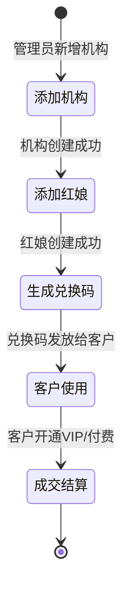
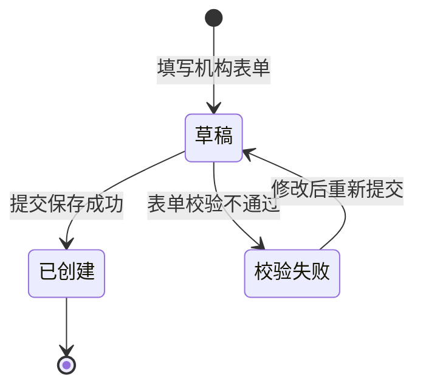
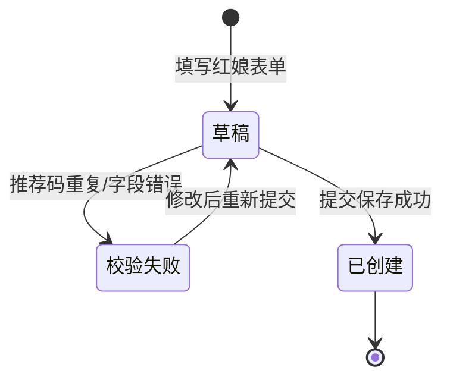
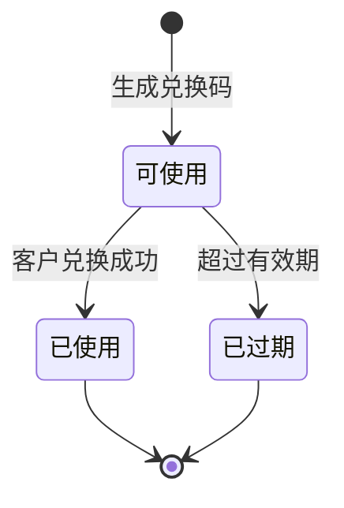
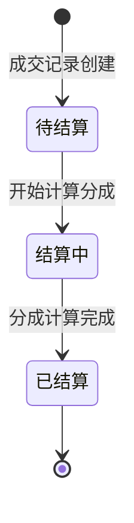

2026-06-25 | Claude Fable 5

# 管理后台界面交互说明

本文档详细列出管理后台（admin.html / 8098）的每个按钮、表单、Tab、链接等交互元素，以及点击后的行为逻辑。

---

## 登录页面

| 元素 | 类型 | 操作后行为 |
|------|------|------------|
| 后台登录密码 | input[password] | 输入管理员密码（默认 admin） |
| 安全登录后台 | 提交按钮 | 调用 `adminAuthLogin()`，POST /api/auth/admin/login |

**登录流程**：

```
1. 获取密码输入框的值
2. 调用 POST /api/auth/admin/login { password }
3. 成功→保存 session（token + role: "admin"），跳转管理后台
4. 失败→显示"密码错误！默认演示密码为 admin"
```

**登录逻辑**：

```
1. 密码与 .env 中的 ADMIN_PASSWORD 严格比较
2. 验证通过→签发 Token，payload: { role: "admin", sub: "admin", exp: now+7天 }
3. 保存 session 到 localStorage
4. 跳转 /console（独立端口）或 /admin/console（综合预览端）
```

---

## 管理后台主页面

### 工具栏

| 元素 | 类型 | 点击后行为 |
|------|------|------------|
| 模拟一笔成交 | 按钮 | 调用 `seedDeal()`，POST /api/admin/deals/simulate |
| 退出管理员 | 按钮 | 调用 `adminAuthLogout()`，清除 session，跳转登录页 |

**模拟成交流程**：

```
1. 查找最新的牵线请求（或随机选一个客户）
2. 获取相关红娘信息
3. API 可用→调用 POST /api/admin/deals/simulate
4. 成功→生成一笔 ¥399 成交记录，更新数据指标和图表
5. 计算分成：
   - 推广费 = 399 * splits.promo / 100
   - 牵线费 = 399 * splits.matchmaker / 100
   - 平台费 = 399 * splits.platform / 100
6. 记录审计日志
7. 显示微信推送模拟卡片：
   - 标题：【喜报·交友业务模拟成交】
   - 成交客户、推广红娘、牵线红娘、结算分成总额
```

**退出管理员流程**：

```
1. 调用 setAdminLoggedIn(false)
2. 清除 session
3. 跳转 /login
4. 记录审计日志
5. 显示 Toast："管理员已退出登录"
```

---

## 左侧菜单导航

| 菜单项 | 点击后行为 |
|--------|------------|
| 概览 | 切换到概览面板，显示数据指标和图表 |
| 分成比例 | 切换到分成比例面板，显示分成表单 |
| 机构管理 | 切换到机构管理面板，显示添加机构和机构列表 |
| 红娘管理 | 切换到红娘管理面板，显示添加红娘和红娘列表 |
| 客户信息 | 切换到客户信息面板，显示客户表格 |
| 兑换码 | 切换到兑换码面板，显示兑换码表格和生成按钮 |

**菜单切换逻辑**：

```
1. 点击菜单按钮
2. 切换 active 类到对应按钮
3. 切换 active 类到对应面板（data-admin-panel 属性匹配）
4. 所有其他面板隐藏
```

---

## 概览面板

### 数据指标卡片

| 指标 | 数据来源 | 显示格式 |
|------|----------|----------|
| 客户数量 | `state.users.length` | 数字 |
| VIP 数量 | `state.users.filter(u => u.vip).length` | 数字 |
| 成交数量 | `state.deals.length` | 数字 |
| 总金额 | `state.deals.reduce((sum, d) => sum + d.amount, 0)` | ¥ + 数字 |

**渲染时机**：每次 `renderAdmin()` 调用时重新计算。

### 图表概览

柱状图显示四项数据：

| 指标 | 数值 | 显示格式 |
|------|------|----------|
| 客户 | `state.users.length` | 数字 |
| 牵线 | `state.requests.length` | 数字 |
| 成交 | `state.deals.length` | 数字 |
| 金额 | `总金额 / 100` | ¥ + 数字 |

**条形宽度计算**：

```
max = max(客户数, 牵线数, 成交数, 金额/100, 1)
每条条形宽度 = max(数值 / max * 100, 4)%
```

---

## 分成比例面板

### 分成表单

| 字段 | 类型 | 说明 |
|------|------|------|
| 介绍推广费 | input[type=number] | 0-100，默认 20 |
| 红娘牵线费 | input[type=number] | 0-100，默认 35 |
| 平台服务费 | input[type=number] | 0-100，默认 45 |
| 保存分成 | 提交按钮 | 校验总和为 100，调用 PATCH /api/admin/splits |

**保存分成流程**：

```
1. 获取三个输入框的值
2. 计算总和
3. 总和不为 100→Toast 显示"当前合计为 X%，请调整为 100%"
4. 总和为 100→调用 PATCH /api/admin/splits { promo, matchmaker, platform }
5. 成功→Toast 显示"分成比例已保存"，更新预览条形图
6. 失败→Toast 显示"操作失败：xxx"
```

### 预览条形图

三条彩色条形图，分别显示：

| 项目 | 颜色 | 说明 |
|------|------|------|
| 介绍推广费 | 珊瑚色 (#dc6b5c) | 推广红娘获得 |
| 红娘牵线费 | 深青色 (#0f766e) | 牵线红娘获得 |
| 平台服务费 | 蓝色 (#3867d6) | 平台获得 |

每条显示：标签 + 进度条 + 百分比数值。

---

## 机构管理面板

### 添加机构表单

| 字段 | 类型 | 必填 |
|------|------|------|
| 机构名称 | input | 是 |
| 所在城市 | input | 是 |
| 添加机构 | 提交按钮 | - |

**添加流程**：

```
1. 获取机构名称和城市
2. API 可用→调用 POST /api/admin/agencies { name, city }
3. 成功→表单重置，更新机构列表和计数
4. 失败→Toast 显示"操作失败：xxx"
```

### 机构列表

- 列出所有机构，每项显示：机构名称、城市
- 无交互元素

---

## 红娘管理面板

### 添加红娘表单

| 字段 | 类型 | 必填 |
|------|------|------|
| 红娘姓名 | input | 是 |
| 所属机构 | select | 是（从已有机构中选择） |
| 推荐码 | input | 是（自动转大写） |
| 添加红娘 | 提交按钮 | - |

**添加流程**：

```
1. 获取红娘姓名、机构 ID、推荐码
2. 推荐码自动转大写
3. API 可用→调用 POST /api/admin/matchmakers { name, agencyId, code }
4. 成功→表单重置，更新红娘列表和计数
5. 失败→Toast 显示"操作失败：xxx"
```

**推荐码唯一性校验**：

```
1. 提交前检查推荐码是否已存在于本地 state
2. API 可用时由后端检查
3. 重复→后端返回 409 { error: "code_exists" }
```

### 红娘列表

- 列出所有红娘，每项显示：红娘姓名、机构名 · 推荐码
- 无交互元素

---

## 客户信息面板

### 客户表格

| 列 | 显示内容 | 说明 |
|----|----------|------|
| 客户 | 姓名 · 性别 · 年龄 | 组合显示 |
| 城市 | 用户 city |  |
| 会员 | "VIP" 或"普通" |  |
| 推荐红娘 | 红娘姓名或"-" |  |
| 微信 | 用户 wechat |  |
| 联系方式 | 手机号 / 邮箱 | 格式："13800000001 / linan@example.com" |
| 实名认证 | "已实名 (姓名)" 或"未实名" | 绿色徽章或橙色徽章 |

**表格排序**：按用户 ID 升序排列（即注册顺序）。

---

## 兑换码面板

### 生成兑换码按钮

| 元素 | 类型 | 点击后行为 |
|------|------|------------|
| + 随机生成兑换码 | 按钮 | 调用 `generateRandomPromoCode()`，POST /api/admin/promo-codes |

**生成流程**：

```
1. 生成 8 位随机码（大写字母 A-Z + 数字 0-9）
2. 检查是否已存在于本地 state，如已存在则重新生成
3. 70% 概率随机关联一个红娘，30% 不关联
4. API 可用→调用 POST /api/admin/promo-codes { code, matchmakerId }
5. 成功→更新兑换码列表，Toast 显示"已成功生成兑换码：XXXX"
6. 失败→Toast 显示"操作失败：xxx"
```

### 兑换码表格

| 列 | 显示内容 | 说明 |
|----|----------|------|
| 兑换码 | 兑换码文本 | 加粗显示 |
| 关联分成红娘 | 红娘姓名+推荐码 或"无关联红娘" |  |
| 使用状态 | "已使用"（灰色徽章）或"可使用"（绿色徽章） |  |
| 使用者客户 | 使用者姓名或"-" |  |

**表格排序**：按兑换码字母顺序排列。

---

## 管理后台 UI 布局

```
┌────────────────────────────────────────────────────────┐
│  工具栏                                                 │
│  ├─ 标题："客户、红娘、机构与分成"                     │
│  ├─ 模拟一笔成交按钮                                    │
│  └─ 退出管理员按钮                                      │
├──────────┬─────────────────────────────────────────────┤
│ 左侧菜单 │ 右侧内容区                                   │
│          │                                             │
│ 概览     │  概览面板                                    │
│ 分成比例 │  ├─ 数据指标卡片（4 个）                     │
│ 机构管理 │  └─ 图表概览（柱状图）                       │
│ 红娘管理 │                                             │
│ 客户信息 │  分成比例面板                                │
│ 兑换码   │  ├─ 分成表单（3 个输入 + 保存）              │
│          │  └─ 预览条形图（3 条）                       │
│          │                                             │
│          │  机构管理面板                                │
│          │  ├─ 添加机构表单                             │
│          │  └─ 机构列表                                 │
│          │                                             │
│          │  红娘管理面板                                │
│          │  ├─ 添加红娘表单                             │
│          │  └─ 红娘列表                                 │
│          │                                             │
│          │  客户信息面板                                │
│          │  └─ 客户表格（7 列）                         │
│          │                                             │
│          │  兑换码面板                                  │
│          │  ├─ 生成兑换码按钮                           │
│          │  └─ 兑换码表格（4 列）                       │
└──────────┴─────────────────────────────────────────────┘
```

---

## 复杂场景

### 数据联动

```
1. 添加机构后→红娘管理的机构下拉框自动更新
2. 添加红娘后→兑换码生成的随机关联概率增加
3. 修改分成比例后→模拟成交的分成计算使用新比例
```

### 数据刷新

```
1. 管理后台每 4 秒轮询检测状态变化
2. 客户端/红娘端操作后，管理后台自动更新
3. 手动刷新页面会重新从 API 加载最新数据
```

### 模拟成交与真实成交

```
模拟成交：
1. 管理员点击"模拟成交"
2. 生成一笔 ¥399 成交记录
3. 关联最新牵线请求或随机客户
4. 记录分成日志

真实成交（VIP 开通）：
1. 客户输入兑换码/推荐码开通 VIP
2. 后端自动创建成交记录
3. 记录分成日志
4. 显示微信推送模拟卡片
```

---

## 管理后台状态机

### 完整业务流程状态图



### 各模块状态流转详情

#### 机构管理状态机



| 状态 | 说明 | 操作 |
|------|------|------|
| 草稿 | 正在填写机构表单 | 编辑、提交 |
| 校验失败 | 表单校验未通过 | 修改字段、重新提交 |
| 已创建 | 机构已保存到系统 | 查看、编辑（待实现）、删除（待实现） |

#### 红娘管理状态机



| 状态 | 说明 | 操作 |
|------|------|------|
| 草稿 | 正在填写红娘表单 | 编辑、提交 |
| 校验失败 | 推荐码重复或字段无效 | 修改、重新提交 |
| 已创建 | 红娘账号已创建 | 查看、禁用（待实现） |

#### 兑换码生命周期



| 状态 | 标识 | 显示样式 |
|------|------|----------|
| 可使用 | `active` | 绿色徽章 |
| 已使用 | `used` | 灰色徽章 |
| 已过期 | `expired` | 橙色徽章 |

#### 成交结算流程



| 状态 | 说明 | 数据更新 |
|------|------|----------|
| 待结算 | 刚创建的成交记录 | 成交数量 +1，总金额 +金额 |
| 结算中 | 正在计算各方分成 | 实时更新分成明细 |
| 已结算 | 分成已分配完毕 | 各账户余额更新 |

---

## 错误与异常流程

### 登录失败

**错误类型与处理**：

| 错误类型 | 触发条件 | 提示方式 | 处理逻辑 |
|----------|----------|----------|----------|
| 密码错误 | 输入的密码与 ADMIN_PASSWORD 不匹配 | Toast: "密码错误！默认演示密码为 admin" | 输入框抖动，清空密码框 |
| 网络连接失败 | 无网络或服务器不可达 | Toast: "网络连接失败，请检查网络" | 登录按钮恢复可点击 |
| 服务器错误 | 后端返回 5xx | Toast: "登录失败，请稍后重试" | 记录错误日志 |
| 登录已过期 | Token 过期或无效 | 自动跳转登录页，Toast: "登录已过期，请重新登录" | 清除 session |

**登录安全限制**：
- 连续失败 5 次后，账号锁定 15 分钟
- 锁定期间提示："登录失败次数过多，请 15 分钟后再试"
- 锁定倒计时显示在按钮上

### 保存失败

**通用保存失败处理**：

```
1. 用户点击保存按钮
2. 按钮变为"保存中..."，禁用点击
3. API 返回失败：
   - 按钮恢复为"保存"，可点击
   - 显示错误 Toast："保存失败：{具体原因}"
   - 表单数据保留，不重置
4. 特殊错误（如重复、权限）显示针对性提示
```

**各模块保存失败场景**：

| 模块 | 失败原因 | 提示文案 |
|------|----------|----------|
| 分成比例 | 总和不等于100 | "当前合计为 X%，请调整为 100%" |
| 分成比例 | 数值超出0-100范围 | "分成比例必须在 0-100 之间" |
| 机构管理 | 机构名称为空 | "请输入机构名称" |
| 机构管理 | 城市为空 | "请输入所在城市" |
| 红娘管理 | 推荐码已存在 | "推荐码已存在，请更换！" |
| 红娘管理 | 所属机构未选 | "请选择所属机构" |
| 兑换码 | 生成失败 | "兑换码生成失败，请重试" |

### 重复推荐码

**检测时机**：
1. 输入时实时检测（防抖 300ms）
2. 提交前本地 state 检查
3. 后端最终校验（409 Conflict）

**前端实时校验**：
```
1. 用户输入推荐码
2. 自动转大写
3. 防抖 300ms 后检查本地 state
4. 已存在：输入框红色边框，右侧显示"已存在"红色文字
5. 不存在：输入框绿色边框，右侧显示"可用"绿色文字
```

**后端冲突处理**：
- 后端返回 409 { error: "code_exists" }
- 提示："推荐码已存在，请更换！"
- 推荐码输入框获得焦点，选中全部文字

### 分成比例不等于100

**实时校验**：

```
1. 用户修改任意一个分成输入框
2. 实时计算总和
3. 显示合计百分比
4. 总和 = 100：合计文字绿色，保存按钮启用
5. 总和 ≠ 100：合计文字红色，保存按钮禁用或点击提示
```

**视觉提示**：

| 状态 | 合计文字颜色 | 保存按钮状态 |
|------|-------------|-------------|
| 总和 = 100 | 绿色（#10b981） | 正常可点击 |
| 总和 < 100 | 橙色（#f59e0b） | 可点击，点击后提示 |
| 总和 > 100 | 红色（#ef4444） | 可点击，点击后提示 |

**错误提示**：
- Toast: "当前合计为 X%，请调整为 100%"
- 三个输入框下方显示提示文字
- 超出 100% 时高亮超出的那个输入框

---

## 数据校验规则

### 机构管理表单校验

| 字段 | 类型 | 必填 | 校验规则 | 错误提示 |
|------|------|------|----------|----------|
| 机构名称 | input | 是 | 非空，长度 2-50 字符 | "请输入机构名称（2-50字）" |
| 所在城市 | input | 是 | 非空，长度 2-20 字符 | "请输入所在城市（2-20字）" |

**校验时机**：
- 输入时实时校验（失焦后）
- 提交前全量校验
- 有错误时滚动到第一个错误字段

### 红娘管理表单校验

| 字段 | 类型 | 必填 | 校验规则 | 错误提示 |
|------|------|------|----------|----------|
| 红娘姓名 | input | 是 | 非空，长度 2-20 字符 | "请输入红娘姓名（2-20字）" |
| 所属机构 | select | 是 | 必须选择一个机构 | "请选择所属机构" |
| 推荐码 | input | 是 | 非空，4-12位大写字母数字，唯一 | "推荐码为4-12位大写字母和数字" |

**推荐码格式校验**：
- 正则：`/^[A-Z0-9]{4,12}$/`
- 自动转大写
- 禁止输入特殊字符和小写字母

### 分成比例表单校验

| 字段 | 类型 | 必填 | 校验规则 | 错误提示 |
|------|------|------|----------|----------|
| 介绍推广费 | number | 是 | 0-100 整数 | "推广费必须在 0-100 之间" |
| 红娘牵线费 | number | 是 | 0-100 整数 | "牵线费必须在 0-100 之间" |
| 平台服务费 | number | 是 | 0-100 整数 | "平台费必须在 0-100 之间" |
| 三项总和 | 计算 | 是 | 必须等于 100 | "合计必须为 100%" |

**数值输入限制**：
- 只允许输入数字
- 不允许负数
- 超过 100 自动截断为 100
- 小数自动取整

### 兑换码生成校验

| 项目 | 规则 |
|------|------|
| 长度 | 8 位 |
| 字符集 | 大写字母 A-Z + 数字 0-9 |
| 唯一性 | 全局唯一，生成时检查 |
| 批量生成数量 | 单次最多 100 个 |

**自动生成算法**：
```
1. 随机生成 8 位字符
2. 检查本地 state 是否已存在
3. 已存在则重新生成（最多重试 10 次）
4. 10 次都失败则提示生成失败
```

---

## 批量操作

### 批量生成兑换码

**批量生成入口**：
- 兑换码面板中"批量生成"按钮
- 点击后弹出批量生成对话框

**批量生成对话框**：

| 元素 | 类型 | 说明 |
|------|------|------|
| 生成数量 | input[number] | 输入 1-100，默认 10 |
| 关联红娘 | select | 可选，选择一个红娘或"不关联" |
| 数量滑块 | range | 1-100 快速调整 |
| 预计生成 | 文本显示 | "将生成 X 个兑换码" |
| 取消 | 按钮 | 关闭对话框 |
| 确认生成 | 按钮 | 开始批量生成 |

**批量生成流程**：

```
1. 管理员输入数量，选择关联红娘（可选）
2. 点击"确认生成"
3. 显示进度条："正在生成... X/N"
4. 逐个生成，逐个检查唯一性
5. 生成成功的加入列表，失败的记录
6. 完成后显示结果：
   - 成功：X 个
   - 失败：Y 个
   - 下载兑换码列表按钮
7. 失败的可点击"重试失败项"
```

**批量生成进度条**：
- 顶部显示进度条（0%-100%）
- 显示当前生成的兑换码
- 已成功数量实时更新
- 可随时点击"取消"停止

### 批量数据导出

**导出功能入口**：
- 各列表/表格右上角的"导出"按钮
- 支持导出：客户信息、红娘列表、兑换码列表、成交记录

**导出格式**：
- CSV 格式（默认）
- Excel 格式（.xlsx，需第三方库）
- JSON 格式（开发者用）

**各模块导出字段**：

| 模块 | 导出字段 |
|------|----------|
| 客户信息 | ID、姓名、性别、年龄、城市、会员类型、推荐红娘、微信、手机号、邮箱、实名认证状态、注册时间 |
| 红娘列表 | ID、姓名、机构名称、推荐码、手机号、邮箱、注册时间、状态 |
| 兑换码列表 | 兑换码、关联红娘、状态、使用者、使用时间、生成时间 |
| 成交记录 | 成交ID、客户、推广红娘、牵线红娘、金额、推广费、牵线费、平台费、成交时间 |

**导出流程**：

```
1. 点击"导出"按钮
2. 选择导出格式（CSV/Excel/JSON）
3. 选择时间范围（全部/近7天/近30天/自定义）
4. 点击"确认导出"
5. 生成下载文件
6. 浏览器自动下载
7. 显示 Toast："导出成功，共 X 条记录"
```

**导出进度**：
- 数据量 < 1000 条：直接导出，无进度
- 数据量 >= 1000 条：显示进度弹窗
- 导出过程中可最小化到后台

### 批量操作通用规则

**批量选择**：
- 表格第一列为复选框列
- 表头复选框：全选/取消全选
- 已选择数量显示在工具栏："已选择 X 项"

**批量操作按钮**：
- 未选择时：按钮禁用，灰色
- 已选择时：按钮启用，显示数量
- 操作类型：批量删除、批量导出、批量修改状态

**操作确认**：
- 破坏性操作（删除）需二次确认
- 确认弹窗显示："确定要删除选中的 X 项吗？"
- 确认后执行，显示进度

---

## 数据刷新机制

### 自动刷新

**轮询机制**：

| 模块 | 刷新间隔 | 说明 |
|------|----------|------|
| 概览数据 | 4 秒 | 客户数、VIP数、成交数、总金额 |
| 客户列表 | 4 秒 | 客户信息表格 |
| 红娘列表 | 4 秒 | 红娘列表 |
| 机构列表 | 4 秒 | 机构列表 |
| 兑换码列表 | 4 秒 | 兑换码状态更新 |
| 成交记录 | 4 秒 | 最新成交记录 |
| 图表数据 | 4 秒 | 柱状图数据 |

**轮询实现**：
```
1. 页面加载后启动轮询定时器
2. 每 4 秒调用一次数据获取 API
3. 数据有变化时更新 state，重新渲染
4. 数据无变化时不更新，减少渲染
5. 页面隐藏时（切换标签）暂停轮询
6. 页面重新显示时立即刷新一次
```

**智能刷新策略**：
- 用户有输入操作时，延迟刷新（避免打断输入）
- 弹窗打开时，暂停部分列表刷新
- 网络差时，自动延长刷新间隔到 8 秒

### 手动刷新

**手动刷新入口**：
- 各面板右上角的刷新按钮（圆形箭头图标）
- 顶部工具栏的"刷新"按钮（全局刷新）

**手动刷新流程**：
```
1. 用户点击刷新按钮
2. 按钮图标旋转动画
3. 调用对应数据 API
4. 成功：更新数据，图标停止旋转
5. 失败：图标停止旋转，显示错误提示
6. 动画时长至少 500ms（避免闪烁）
```

**下拉刷新（移动端）**：
- 在列表顶部下拉时触发
- 显示下拉刷新指示器
- 释放后执行刷新
- 刷新完成后回弹

### 数据实时性说明

**数据一致性保证**：

| 操作 | 生效时间 | 说明 |
|------|----------|------|
| 添加机构 | 即时 | 本地立即更新，后端写入后返回确认 |
| 添加红娘 | 即时 | 本地立即更新，后端写入后返回确认 |
| 生成兑换码 | 即时 | 本地立即显示，后端异步写入 |
| 修改分成比例 | 即时 | 本地立即更新，下次成交使用新比例 |
| 客户注册 | 4秒内 | 依赖轮询检测 |
| 客户开通VIP | 4秒内 | 依赖轮询检测，同时触发推送 |
| 红娘端操作 | 4秒内 | 依赖轮询检测 |

**乐观更新策略**：
- 添加/保存操作：先更新本地 state，再同步到后端
- 后端返回成功：不做额外处理
- 后端返回失败：回滚本地 state，提示错误
- 保证用户操作的流畅感

**数据最终一致性**：
- 轮询机制保证最终一致
- 最大延迟：4 秒（正常网络）
- 重要操作（成交）触发推送，延迟 < 1 秒
- 刷新按钮可主动获取最新数据
