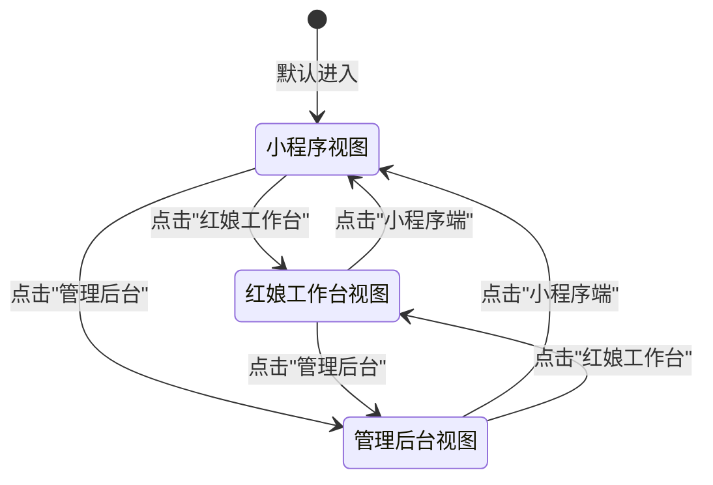

2026-06-27 | Codex 修订

# 综合预览端界面交互说明

## 2026-06-27 当前修订摘要

本文件已按当前综合预览端修订：综合端用于演示三端视角，但最终验收仍以 9446/9447/9448 实际独立线上入口为准。

如本文下方旧段落与本摘要或 `说明/10-操作手册.md` 冲突，以 `说明/10-操作手册.md` 和当前线上实测流程为准。


本文档详细列出综合预览端（index.html / 8095）的每个按钮、表单、Tab、链接等交互元素，以及点击后的行为逻辑。

---

## 侧边栏

### 品牌标识

| 元素 | 显示内容 |
|------|----------|
| 品牌图标 | 黄色方块，白色"缘"字 |
| 品牌名称 | "MatchMaker" |
| 副标题 | "单身交友业务中台" |

### 主导航

| 按钮 | data-view | 点击后行为 |
|------|-----------|------------|
| 小程序端 | mini | 跳转 `/mini/discover`，切换到客户端视图 |
| 红娘工作台 | matchmaker | 已登录→跳转 `/matchmaker/workbench`；未登录→跳转 `/matchmaker/login` |
| 管理后台 | admin | 已登录→跳转 `/admin/console`；未登录→跳转 `/admin/login` |

**切换逻辑**：

```
1. 点击导航按钮
2. 移除所有导航按钮的 active 类
3. 给当前按钮添加 active 类
4. 隐藏所有视图面板
5. 显示对应视图面板
6. 更新"当前演示"显示
```

### 当前演示面板

| 元素 | 显示内容 |
|------|----------|
| 标签 | "当前演示"（黄色） |
| 当前角色 | "客户：林安" 或"红娘：李莉" 或"管理员：平台运营" |
| 描述 | "数据保存在本机浏览器，可随时重置体验。" |

| 元素 | 类型 | 点击后行为 |
|------|------|------------|
| 重置演示数据 | 按钮 | 调用 `resetState()` |

**重置流程**：

```
1. 点击"重置演示数据"
2. API 可用→调用 POST /api/reset
3. 成功→更新 state，缓存到 localStorage，重新渲染，显示"演示数据已重置"
4. 失败→API 不可用，本地重置为种子数据，显示"演示数据已重置"
```

---

## 主内容区

### 小程序视图

**布局**：

```
┌─────────────────────────────────────────────────┐
│  电话模拟器（左侧，430px）  │  辅助面板（右侧）  │
│  └─ 客户端完整 UI          │  ├─ 操作指南       │
│                            │  ├─ 推送模拟       │
│                            │  └─ 审计日志       │
└─────────────────────────────────────────────────┘
```

**电话模拟器**：

- 不再包含客户模拟 UI；客户业务统一使用真实 uniapp H5
- 所有交互与客户端界面交互说明一致

### 红娘工作台视图

- 包含完整的红娘工作台 UI（与 matchmaker.html 相同）
- 所有交互与红娘端界面交互说明一致

### 管理后台视图

- 包含完整的管理后台 UI（与 admin.html 相同）
- 所有交互与管理后台界面交互说明一致

---

## 右侧辅助面板（仅小程序视图显示）

### 中台演示操作指南

**面板头部**：

| 元素 | 显示内容 |
|------|----------|
| 图标 | 💡 |
| 标题 | "中台演示操作指南" |

**指南步骤**：

1. 点击客户入口打开真实 uniapp H5，在真实客户端完成登录或注册。
2. 在"筛选"页签中浏览异性单身会员，并点击"申请牵线"（普通用户需先到"会员"页签模拟支付开通 VIP）。
3. 点击左侧导航的"红娘工作台"，查看并处理收到的牵线请求，点击"联系男方"和"联系女方"以互相公开微信。
4. 点击左侧导航的"管理后台"，查看业绩分成图表、新增红娘或机构，或者点击"模拟一笔成交"。

**快捷操作按钮**：

| 元素 | 类型 | 点击后行为 |
|------|------|------------|
| 👨 快捷生成男会员 | 按钮 | 调用 `quickAddMember("男")` |
| 👩 快捷生成女会员 | 按钮 | 调用 `quickAddMember("女")` |

**快捷生成男会员流程**：

```
1. 点击"👨 快捷生成男会员"
2. 随机生成：
   - 姓名：从 ["江寒", "陆云洲", "祁宴", "沈修远", "裴渡", "陈亦帆", "林子默", "顾景川", "陆言熙", "沈慕白", "宋怀言", "周子安"] 中随机选择
   - 职业：从 ["软件工程师", "产品经理", "医生", "设计师", "大学讲师", "律师", "建筑师", "金融分析师"] 中随机选择
   - 城市：从 ["上海", "北京", "广州", "深圳", "杭州", "南京", "成都", "武汉"] 中随机选择
   - 年龄：24-42 随机
   - 头像：从 5 个男性头像 URL 中随机选择
   - 自我介绍：从 5 个模板中随机选择
   - 择偶要求：从 4 个模板中随机选择
   - 微信号：mr_姓名_随机数字
3. 添加到 state.users
4. 保存 state
5. 重新渲染
6. 记录审计日志：`快捷生成单身男嘉宾成功：江寒 (30岁·上海·软件工程师)`
7. 显示 Toast：`已快捷生成单身男嘉宾：江寒`
8. 显示微信推送模拟卡片
```

**快捷生成女会员流程**：

```
1. 点击"👩 快捷生成女会员"
2. 随机生成：
   - 姓名：从 ["温以凡", "桑稚", "许星若", "季秋", "姜泥", "沈星若", "温以乔", "姜暮烟", "许红豆", "林妙妙", "简言", "唐微微"] 中随机选择
   - 职业：从 ["品牌公关总监", "时尚专栏作者", "纪录片策划", "新媒体主编", "娱乐记者", "配音演员", "创意法务", "广告制片"] 中随机选择
   - 其他同男会员
3. 同上流程
```

---

### 实时微信消息推送模拟

**面板头部**：

| 元素 | 显示内容 |
|------|----------|
| 图标 | 🔔 |
| 标题 | "实时微信消息推送模拟 (WeChat Push Stream)" |

**空状态**：

| 元素 | 显示内容 |
|------|----------|
| 图标 | 💬 |
| 标题 | "暂无微信消息推送通知" |
| 描述 | "在小程序端注册、开通VIP、申请牵线，或红娘在工作台处理业务时，此面板将实时滑入渲染真实的微信服务号模板消息推送效果。" |

**推送卡片**（自动生成）：

| 元素 | 显示内容 |
|------|----------|
| 品牌区 | 绿色"微"图标 + "MatchMaker微信公众号" + 时间 |
| 标题 | 推送标题（绿色） |
| 内容行 | 标签: 值 格式的多行内容 |
| 底部 | "进入小程序查看详情" + ">" |

**触发场景**：

| 场景 | 推送标题 | 内容 |
|------|----------|------|
| 客户注册 | 【客户注册成功通知】 | 注册客户、性别年龄、微信账号、职业城市 |
| VIP 开通（推荐码） | 【VIP会员开通通知】 | 开通客户、微信账号、专属红娘、红娘代码 |
| VIP 开通（推荐码） | 【红娘推广佣金喜报】 | 收益红娘、开通客户、获得分成、账单状态 |
| VIP 开通（兑换码） | 【VIP兑换码使用成功】 | 开通客户、使用兑换码、专属红娘、红娘代码 |
| VIP 开通（兑换码） | 【红娘推广佣金喜报】 | 收益红娘、开通客户、兑换开通奖励、账单状态 |
| 申请牵线 | 【新牵线意向提醒】 | 专属红娘、发起申请、牵线嘉宾、微信状态 |
| 标记联系双方 | 【牵线成功进度通知】 | 牵线红娘、心仪嘉宾、微信号码、温馨提示 |
| 模拟成交 | 【喜报·交友业务模拟成交】 | 成交客户、推广红娘、牵线红娘、结算分成总额 |
| 模拟成交 | 【红娘推广佣金喜报】 | 收益红娘、开通客户、获得分成、账单状态 |

**显示规则**：

- 最多显示 5 条推送卡片
- 超过 5 条时，移除最旧的卡片
- 新卡片从顶部滑入动画

---

### 中台业务审计日志

**面板头部**：

| 元素 | 显示内容 |
|------|----------|
| 图标 | 📟 |
| 标题 | "中台业务审计日志 (Audit Logs)" |

| 元素 | 类型 | 点击后行为 |
|------|------|------------|
| 清空日志 | 按钮 | 清空所有日志行，记录"业务审计日志已清空" |

**日志行格式**：

```
[时间] [标签] 消息内容
```

**标签类型**：

| 标签 | 颜色 | 说明 |
|------|------|------|
| 系统 | 蓝色 | 系统事件 |
| 客户 | 红色 | 客户操作 |
| 红娘 | 青色 | 红娘操作 |
| 分成 | 黄色 | 分成结算 |

**日志事件**：

| 事件 | 标签 | 消息示例 |
|------|------|----------|
| 系统启动 | 系统 | "系统启动成功：已成功连接 to 远程数据库，同步全局状态" |
| 数据库连接失败 | 系统 | "数据库连接失败，已自动启用浏览器 LocalStorage 本机演示数据" |
| 自动同步 | 系统 | "自动同步：已拉取来自其他端的最新业务状态" |
| 客户注册 | 客户 | "新客户在小程序端注册成功：张三 (男·30岁·上海)" |
| 客户登录 | 客户 | "已在小程序端切换登录为客户：林安 (普通用户)" |
| 客户退出 | 客户 | "客户 '林安' 已退出登录" |
| VIP 开通 | 分成 | "客户 '林安' 开通 VIP 成功 (金额: ¥399)，绑定推荐红娘: '李莉'" |
| 分成结算 | 分成 | "[佣金结算] 介绍推广分成: ¥79.80 (20%)，红娘牵线分成: ¥139.65 (35%)，平台收益: ¥179.55 (45%)" |
| 申请牵线 | 客户 | "客户 '林安' 申请认识嘉宾 '周晴'，已指派红娘 '李莉'" |
| 红娘登录 | 红娘 | "红娘 '李莉' 成功登录红娘工作台" |
| 红娘退出 | 红娘 | "红娘 '李莉' 已退出工作台登录" |
| 标记联系 | 红娘 | "红娘 '李莉' 联系男方：林安，当前进度 联系男方" |
| 模拟成交 | 系统 | "管理员触发了一笔成交模拟（金额: ¥399，绑定测试客户: 林安）" |
| 分成结算 | 分成 | "[模拟分账] 推广红娘 '李莉' 获推广分成: ¥79.80，牵线红娘 '李莉' 获牵线分成: ¥139.65，平台分配收益: ¥179.55" |
| 生成兑换码 | 系统 | "管理员随机生成了新会员兑换码：ABCDEFGH (关联红娘: 李莉)" |
| 日志清空 | 系统 | "业务审计日志已清空" |

**显示规则**：

- 最多显示 80 条日志
- 超过 80 条时，移除最旧的日志
- 日志区域自动滚动到底部

---

## 复杂场景

### 开发演示流程

```
1. 打开综合预览端（8095）
2. 默认显示小程序视图
3. 在"我的"Tab 登录客户账号
4. 在"筛选"Tab 浏览异性资料
5. 点击"申请牵线"
6. 切换到红娘工作台视图
7. 查看牵线通知
8. 标记联系男方/女方
9. 切换到管理后台视图
10. 查看数据概览
11. 模拟一笔成交
```

### 快速生成测试数据

```
1. 点击"👨 快捷生成男会员"多次
2. 点击"👩 快捷生成女会员"多次
3. 切换到客户端视图
4. 浏览新生成的资料
5. 申请牵线测试
```

### 查看实时日志

```
1. 执行各种操作（注册、登录、VIP、牵线等）
2. 观察右侧审计日志面板
3. 查看操作记录
4. 观察微信推送模拟卡片
```

---

## 三端切换状态流

### 状态流转图



### 各视图侧边栏状态对比

| 视图 | 主导航高亮 | 当前演示角色 | 辅助面板显示 | 快捷生成按钮 |
|------|-----------|-------------|-------------|-------------|
| 小程序视图 | 小程序端（active） | 客户：林安 | 显示（操作指南/推送模拟/审计日志） | 显示 |
| 红娘工作台视图 | 红娘工作台（active） | 红娘：李莉 | 隐藏 | 隐藏 |
| 管理后台视图 | 管理后台（active） | 管理员：平台运营 | 隐藏 | 隐藏 |

### 切换状态详细流程

```
1. 点击导航按钮（data-view 属性标识目标视图）
2. 移除所有 .nav-item 的 active 类
3. 为当前点击按钮添加 active 类
4. 隐藏所有视图容器（.view-container）
5. 显示目标视图容器（根据 data-view 值）
6. 更新"当前演示"面板的角色显示
7. 根据视图类型显示/隐藏右侧辅助面板
8. 根据视图类型显示/隐藏快捷生成按钮
9. 触发当前视图的初始渲染（如切换 Tab、刷新列表等）
```

### 视图切换时的数据保持

- **全局状态**：三端共享同一份 `state` 对象，切换视图不重置数据
- **滚动位置**：各视图独立维护滚动位置，切换后恢复
- **Tab 状态**：各视图的 Tab 选择独立保存
- **表单输入**：未提交的表单输入在切换时保留（除非页面刷新）

---

## 辅助面板交互详解

### 操作指南面板

**面板结构**：

```
┌───────────────────────────┐
│ 💡 中台演示操作指南 [展开/收起]│
├───────────────────────────┤
│ 指南步骤列表（1-4步）       │
│                           │
│ 快捷操作区：               │
│ [👨 快捷生成男会员]         │
│ [👩 快捷生成女会员]         │
└───────────────────────────┘
```

**展开/收起交互**：

| 操作 | 触发元素 | 行为 |
|------|---------|------|
| 点击标题栏 | 面板头部 | 切换展开/收起状态 |
| 点击箭头图标 | .panel-toggle | 切换展开/收起状态 |
| 默认状态 | - | 展开 |

**收起状态**：
- 仅显示面板头部（图标 + 标题 + 展开箭头）
- 高度收缩为 48px
- 内容区域使用 `max-height: 0` + `overflow: hidden` 隐藏
- 过渡动画时长：0.3s

**快捷生成按钮交互**：

| 按钮 | 悬停效果 | 点击反馈 |
|------|---------|---------|
| 👨 快捷生成男会员 | 背景加深，轻微上浮 | 按下缩放 0.97，生成后 Toast 提示 |
| 👩 快捷生成女会员 | 背景加深，轻微上浮 | 按下缩放 0.97，生成后 Toast 提示 |

---

### 微信推送模拟面板

**面板结构**：

```
┌───────────────────────────┐
│ 🔔 实时微信消息推送模拟 [展开/收起] │
├───────────────────────────┤
│ [清空推送] 按钮             │
│                           │
│ 推送卡片列表（最多5条）      │
│ ┌─────────────────────┐   │
│ │ [微] MatchMaker...   │   │
│ │ 【推送标题】         │   │
│ │ 标签: 值             │   │
│ │ 进入小程序查看详情 > │   │
│ └─────────────────────┘   │
│                           │
│ 空状态：💬 暂无消息         │
└───────────────────────────┘
```

**展开/收起交互**：

| 操作 | 触发元素 | 行为 |
|------|---------|------|
| 点击标题栏 | 面板头部 | 切换展开/收起状态 |
| 新推送到达 | 自动触发 | 如面板收起，自动展开一次（首次） |

**清空推送**：

| 操作 | 触发元素 | 行为 |
|------|---------|------|
| 点击"清空推送" | .clear-push-btn | 清空所有推送卡片，显示空状态 |
| 清空后日志 | - | 记录审计日志："微信推送模拟已清空" |

**推送卡片动画**：

```
新卡片进入：
1. 初始状态：translateY(-20px), opacity: 0
2. 动画时长：0.4s ease-out
3. 最终状态：translateY(0), opacity: 1

卡片移除（超过5条时）：
1. 最旧卡片从底部移除
2. 动画时长：0.3s ease-in
3. 效果：opacity: 0, translateY(20px)
```

**推送卡片点击**：

| 点击区域 | 行为 |
|---------|------|
| 卡片主体 | 无操作（演示用） |
| "进入小程序查看详情" | 无操作（模拟链接） |

**复制功能**：

| 操作 | 触发方式 | 行为 |
|------|---------|------|
| 右键卡片 | contextmenu | 显示"复制内容"选项 |
| 点击"复制内容" | 菜单项 | 复制推送标题和内容到剪贴板，显示 Toast"已复制推送内容" |

---

### 审计日志面板

**面板结构**：

```
┌───────────────────────────┐
│ 📟 中台业务审计日志 [展开/收起]  │
├───────────────────────────┤
│ 筛选栏：                    │
│ [全部▼] [系统] [客户] [红娘] [分成] │
│ [清空日志] 按钮             │
│                           │
│ 日志列表（最多80条）         │
│ [时间] [标签] 消息内容       │
│                           │
│ 自动滚动到底部              │
└───────────────────────────┘
```

**展开/收起交互**：

| 操作 | 触发元素 | 行为 |
|------|---------|------|
| 点击标题栏 | 面板头部 | 切换展开/收起状态 |
| 新日志到达 | 自动触发 | 面板保持当前状态，不自动展开 |

**筛选功能**：

| 筛选类型 | 触发元素 | 行为 |
|---------|---------|------|
| 全部 | .filter-all | 显示所有日志 |
| 系统 | .filter-system | 只显示 [系统] 标签的日志 |
| 客户 | .filter-client | 只显示 [客户] 标签的日志 |
| 红娘 | .filter-matchmaker | 只显示 [红娘] 标签的日志 |
| 分成 | .filter-split | 只显示 [分成] 标签的日志 |

**筛选状态**：
- 当前选中的筛选标签高亮显示（蓝色边框/背景）
- 筛选状态在视图切换时保持
- 新日志到达时，根据当前筛选决定是否显示

**清空日志**：

| 操作 | 触发元素 | 行为 |
|------|---------|------|
| 点击"清空日志" | #clearConsoleLogsBtn | 清空所有日志 |
| 清空后 | - | 自动添加一条"业务审计日志已清空"系统日志 |
| 确认提示 | - | 无确认弹窗，直接清空（演示环境） |

**日志行交互**：

| 操作 | 触发方式 | 行为 |
|------|---------|------|
| 悬停日志行 | mouseover | 背景色轻微加深 |
| 双击日志行 | dblclick | 复制该行日志内容到剪贴板 |
| 右键日志行 | contextmenu | 显示"复制"选项 |

**自动滚动**：
- 新日志到达时自动滚动到底部
- 如果用户手动向上滚动，则暂停自动滚动
- 滚动到底部时恢复自动滚动
- 滚动位置阈值：距离底部 50px 内视为底部

---

## 快捷生成会员流程详解

### 男会员随机生成算法

**姓名池（12个）**：

```javascript
const maleNames = [
  "江寒", "陆云洲", "祁宴", "沈修远", "裴渡", "陈亦帆",
  "林子默", "顾景川", "陆言熙", "沈慕白", "宋怀言", "周子安"
];
```

**职业池（8个）**：

```javascript
const maleJobs = [
  "软件工程师", "产品经理", "医生", "设计师",
  "大学讲师", "律师", "建筑师", "金融分析师"
];
```

**城市池（8个）**：

```javascript
const cities = [
  "上海", "北京", "广州", "深圳",
  "杭州", "南京", "成都", "武汉"
];
```

**头像池（5个男性头像）**：

```
https://images.unsplash.com/photo-1507003211169-0a1dd7228f2d?w=400&h=400&fit=crop
https://images.unsplash.com/photo-1500648767791-00dcc994a43e?w=400&h=400&fit=crop
https://images.unsplash.com/photo-1472099645785-5658abf4ff4e?w=400&h=400&fit=crop
https://images.unsplash.com/photo-1519085360753-af0119f7cbe7?w=400&h=400&fit=crop
https://images.unsplash.com/photo-1506794778202-cad84cf45f1d?w=400&h=400&fit=crop
```

**自我介绍模板（5个）**：

```javascript
const maleBios = [
  "从事交友行业多年，热爱电影和音乐。工作中认真严谨，生活中幽默风趣。喜欢旅行，每年都会去几个新城市感受不同的文化氛围。希望遇到一个有趣的灵魂，一起探索生活的美好。",
  "律师，专注于纪录片创作。性格沉稳，有责任心，喜欢用镜头记录生活中的点滴。闲暇时喜欢读书、健身、下厨。期待遇到一位知性、善良的女生，共同成长。",
  "设计师，思维活跃，创意十足。平时喜欢看展、听livehouse，也会宅家打游戏。性格开朗，好相处，有点慢热但熟了之后很话痨。希望找一个能一起玩一起闹的另一半。",
  "大学讲师，同时也是一名业余摄影爱好者。喜欢用相机捕捉生活中的美好瞬间。性格温和，待人真诚，热爱生活，热爱自然。希望遇到一位温柔善良、有共同话题的女生。",
  "金融分析师，做过很多热门播客和有声书。声音控，对音乐有自己的品味。平时喜欢泡咖啡馆、看话剧、爬山。外表可能有点高冷，内心其实很温暖。期待遇到懂我的人。"
];
```

**择偶要求模板（4个）**：

```javascript
const maleRequirements = [
  "希望你年龄在22-32岁之间，身高158cm以上，本科及以上学历。性格温柔善良，有自己的事业和爱好。喜欢阅读、旅行或艺术更佳。希望我们能互相理解、互相支持，一起经营好生活。",
  "期待遇到一个性格开朗、热爱生活的女生。希望你有稳定的工作，独立自主。不需要你有多漂亮，看着舒服就好。希望我们能有共同语言，聊得来，玩得到一起。",
  "希望你是一个温柔体贴、善解人意的女生。有自己的兴趣爱好，热爱生活。身高外貌都不是最重要的，重要的是三观契合，能够互相包容。期待能和你一起创造美好的未来。",
  "寻找一位知性优雅、有思想的女生。希望你有良好的教育背景，对世界有自己的看法。喜欢艺术、音乐或文学更佳。希望我们能成为彼此的灵魂伴侣，在精神上共同成长。"
];
```

---

### 女会员随机生成算法

**姓名池（12个）**：

```javascript
const femaleNames = [
  "温以凡", "桑稚", "许星若", "季秋", "姜泥", "沈星若",
  "温以乔", "姜暮烟", "许红豆", "林妙妙", "简言", "唐微微"
];
```

**职业池（8个）**：

```javascript
const femaleJobs = [
  "品牌公关总监", "时尚专栏作者", "纪录片策划", "新媒体主编",
  "娱乐记者", "配音演员", "创意法务", "广告制片"
];
```

**头像池（5个女性头像）**：

```
https://images.unsplash.com/photo-1494790108377-be9c29b29330?w=400&h=400&fit=crop
https://images.unsplash.com/photo-1438761681033-6461ffad8d80?w=400&h=400&fit=crop
https://images.unsplash.com/photo-1544005313-94ddf0286df2?w=400&h=400&fit=crop
https://images.unsplash.com/photo-1534528741775-53994a69daeb?w=400&h=400&fit=crop
https://images.unsplash.com/photo-1517841905240-472988babdf9?w=400&h=400&fit=crop
```

**自我介绍模板（5个）**：

```javascript
const femaleBios = [
  "品牌公关总监，工作中雷厉风行，生活中小鸟依人。喜欢时尚、美食、旅行，每年都会给自己安排几次旅行充充电。性格开朗爱笑，有点小文艺。希望遇到一个能让我崇拜也能宠我的人。",
  "时尚专栏作者，对美有自己的坚持和品味。平时喜欢看秀、逛美术馆、拍穿搭。外表看起来高冷，熟了之后其实很话痨。喜欢有才华、有幽默感的男生，期待遇到有趣的灵魂。",
  "纪录片策划，热爱这份有温度的工作。性格温和，喜欢观察生活中的小确幸。闲暇时喜欢看书、瑜伽、烘焙。希望遇到一个成熟稳重、有责任心的男生，一起过烟火气的小日子。",
  "新媒体主编，典型的职场独立女性。但私下里喜欢宅家追剧、撸猫、做手工。性格慢热，但认定了就会很认真。希望找一个温柔体贴、有耐心的另一半，能够理解和包容我。",
  "配音演员，声音是我的武器，也是我的热爱。性格古灵精怪，喜欢cosplay、动漫、游戏。也有安静的时候，喜欢听广播剧、看小说。希望找一个能和我一起玩、一起疯的人。"
];
```

**择偶要求模板（4个）**：

```javascript
const femaleRequirements = [
  "希望你年龄在26-38岁之间，身高172cm以上，本科及以上学历。有稳定的事业，成熟稳重，有责任心。性格阳光开朗，热爱生活。希望你有自己的爱好和追求，我们可以一起成长。",
  "期待遇到一个成熟稳重、有担当的男生。希望你有事业心，同时也顾家。不需要你有多帅，看着顺眼就好。性格好，脾气好，能包容我的小任性。希望我们能互相理解、互相扶持。",
  "希望你是一个温柔体贴、有幽默感的男生。有稳定的工作，对未来有规划。喜欢旅行、美食、音乐更佳。希望我们能有共同的话题，聊得来，玩得到一起。期待和你一起探索生活的美好。",
  "寻找一位有才华、有思想的男生。希望你对世界有自己的看法，有深度也有温度。喜欢阅读、电影、艺术更佳。希望我们能在精神上同频共振，成为彼此的灵魂伴侣。"
];
```

---

### 生成算法详细逻辑

```
生成流程（男女通用，差异仅在姓名池/职业池/头像池/自我介绍/择偶要求）：

1. 随机选择姓名
   - 从对应姓名池中随机取一个
   - 使用 Math.floor(Math.random() * pool.length)

2. 随机选择职业
   - 从对应职业池中随机取一个

3. 随机选择城市
   - 从城市池中随机取一个

4. 随机生成年龄
   - 范围：24-42 岁
   - 公式：Math.floor(Math.random() * 19) + 24

5. 随机选择头像
   - 从对应头像池中随机取一个 URL

6. 随机选择自我介绍
   - 从对应模板池中随机取一段

7. 随机选择择偶要求
   - 从对应模板池中随机取一段

8. 生成微信号
   - 格式：mr_/ms_ + 姓名拼音 + 3位随机数字
   - 示例：mr_jianghan_123、ms_wenyifan_456

9. 随机设置 VIP 状态
   - 30% 概率为 VIP（Math.random() < 0.3）

10. 随机关联红娘
    - 70% 概率关联一个随机红娘
    - 从 state.matchmakers 中随机选择

11. 设置注册时间
    - 注册时间为当前时间前的随机 0-30 天
    - 让数据看起来更真实

12. 生成唯一 ID
    - 格式：user_ + 时间戳 + 随机数
```

---

## 演示模式与真实模式对比

### 综合预览端演示模式 vs 独立端口真实模式

| 对比维度 | 综合预览端（演示模式） | 独立端口（真实模式） |
|---------|---------------------|-------------------|
| 访问地址 | `index.html` / 端口 8095 | `uniapp H5` / `matchmaker.html` / `admin.html` |
| 视图数量 | 三端合一，可切换 | 单端独立运行 |
| 侧边栏 | 有三端导航 + 当前演示 + 辅助面板 | 无侧边栏 |
| 辅助面板 | 有（操作指南/推送模拟/审计日志） | 无 |
| 快捷生成会员 | 有 | 无 |
| 重置演示数据 | 有侧边栏按钮 | 无（需通过 API 或控制台） |
| 数据存储 | localStorage 为主，API 可用时同步 | 真实数据库为主 |
| 登录方式 | 一键登录（演示账号） | 真实注册/登录流程 |
| 支付功能 | 模拟支付（直接开通 VIP） | 真实支付流程 |
| 微信推送 | 右侧面板模拟显示 | 真实微信服务号推送 |
| 审计日志 | 右侧面板实时显示 | 后端日志系统 |

---

### 演示模式特殊功能说明

**一键登录**：
- 演示模式下，点击"一键登录"直接使用预设的演示账号
- 客户演示账号：林安（普通用户）
- 红娘演示账号：李莉（在职红娘）
- 管理员演示账号：admin（超级管理员）

**模拟支付**：
- 演示模式下，点击"立即开通 VIP"直接模拟支付成功
- 无真实支付流程
- 会生成一条 VIP 开通记录和分成记录
- 会触发微信推送模拟

**快捷生成会员**：
- 仅演示模式可用
- 一键生成完整的虚拟会员数据
- 用于快速填充数据、演示筛选和牵线功能

**重置演示数据**：
- 一键恢复到初始种子数据状态
- 方便反复演示同一流程

---

### 数据行为差异

| 行为 | 演示模式 | 真实模式 |
|------|---------|---------|
| API 不可用时 | 降级到 localStorage，正常使用 | 显示错误，功能受限 |
| 数据同步 | 4 秒轮询 + localStorage | WebSocket 实时推送 |
| 数据持久化 | 仅当前浏览器 | 服务器永久存储 |
| 多设备同步 | 不支持 | 支持 |
| 数据上限 | 日志 80 条、推送 5 条 | 无上限（分页） |

---

## 数据同步说明

### 三端共享数据机制

**核心原则**：三端共享同一份全局状态 `state`

```
state 对象结构：
├── users          // 所有用户（客户）
├── matchmakers    // 所有红娘
├── admins         // 所有管理员
├── matchRequests  // 牵线请求
├── chatThreads    // 聊天线程
├── chatMessages   // 聊天消息
├── vipOrders      // VIP 订单
├── promoCodes     // 兑换码
├── auditLogs      // 审计日志
├── agencies       // 机构
├── currentClient  // 当前登录客户
├── currentMatchmaker // 当前登录红娘
├── currentAdmin   // 当前登录管理员
├── settings       // 系统设置
└── syncVersion    // 同步版本号
```

**数据流向**：

```
操作发生（任意端）
    ↓
更新本地 state
    ↓
更新 localStorage（本地持久化）
    ↓
API 可用 → 发送到服务器
    ↓
服务器广播到其他端
    ↓
其他端接收并更新本地 state
```

---

### 视图切换时的数据一致性

**保证机制**：

1. **单一数据源**：三端共用同一个 `window.state` 对象
2. **同步渲染**：数据变更后调用 `renderAll()` 重新渲染所有视图
3. **即时更新**：切换视图时直接读取最新 state，无需重新加载

**切换视图时的数据操作**：

```
1. 隐藏当前视图（不销毁，仅 display:none）
2. 显示目标视图
3. 执行目标视图的渲染函数
   - 如：renderMiniDiscover()、renderMatchmakerWorkbench()
4. 渲染函数从 state 中读取最新数据
5. 确保显示的是最新状态
```

---

### API 可用时的远程同步

**同步触发时机**：

| 触发时机 | 同步方向 | 说明 |
|---------|---------|------|
| 数据变更后 | 本地 → 远程 | 操作后立即同步 |
| 页面加载时 | 远程 → 本地 | 拉取最新数据 |
| 每 4 秒轮询 | 远程 → 本地 | 定期拉取更新 |
| 页面卸载时 | 本地 → 远程 | pagehide 事件同步 |

**同步冲突处理**：

```
冲突场景：本地和远程数据不一致

解决策略：以版本号高的为准
1. 比较 syncVersion
2. 远程版本高 → 远程覆盖本地
3. 本地版本高 → 本地推送到远程
4. 版本相同 → 不做处理
```

---

### API 不可用时的降级策略

**降级触发**：

```
1. 发起 API 请求
2. 超时或错误
3. 标记 API 不可用状态
4. 降级到纯本地模式
```

**降级后行为**：

- 所有数据操作仅在 localStorage 中进行
- 审计日志记录"数据库连接失败，已自动启用浏览器 LocalStorage 本机演示数据"
- Toast 提示"数据库同步失败，已临时保存到本机浏览器"
- 继续尝试重新连接（轮询时检测）

**恢复流程**：

```
1. 轮询时发现 API 恢复可用
2. 拉取远程数据
3. 合并本地和远程数据（以版本高的为准）
4. 记录"自动同步：已拉取来自其他端的最新业务状态"
5. 恢复正常同步模式
```

---

### localStorage 存储结构

```
localStorage 键值：
├── matchmaker_state         // 完整 state JSON
├── matchmaker_sync_version  // 同步版本号
├── matchmaker_last_sync     // 最后同步时间
└── matchmaker_api_available // API 可用性标记
```

**存储时机**：
- 每次 state 变更后立即存储
- 防止页面刷新丢失数据
- JSON.stringify 序列化存储

**读取时机**：
- 页面加载时读取
- JSON.parse 反序列化
- 如读取失败，使用种子数据初始化
